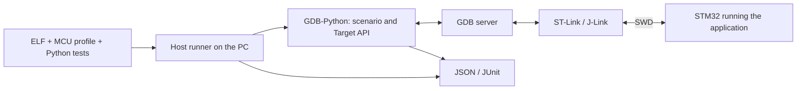

# stm32-gdbtest

[Русский](README.md)

**stm32-gdbtest automates checks of running firmware on a real STM32 through
GDB-Python and an SWD debugger.** It is not an MCU simulator and not a regular
unit-test framework that runs test functions inside the firmware or on a PC: Python
scenarios run in GDB on the computer and control the application on the board
through a GDB server. They need a built ELF with debug information, an MCU profile
and a hardware stand.

## Why this approach

With STM32 it matters to check not only computations but also peripheral setup,
interrupt handling and the application's reaction to HAL errors. Developers already
check much of this manually in a debugger. The module lets you describe such actions
in Python, repeat them after changes and get a report.

The project grew out of practical GDB-Python experiments on F1/F4 boards. The
infrastructure was extracted from the [stand project](https://github.com/ViacheslavMezentsev/stm32-hwtest-blackpill)
so that other applications can use it with their own profiles and tests.

## How it works

The runner checks the input artifacts, starts the server and GDB, limits the run time
and saves the results. A scenario reaches the required point of the program, reads
variables, structures and registers and compares them with expectations. If needed it
can change a value or force a function to return to test the caller's reaction. No
test logic is added to the firmware.

The debugger affects execution: halt, reset and injections change state and timing.
The module does not replace measuring instruments, does not compute code coverage
automatically and does not check "all of HAL" by itself. The scenario author defines
requirements and expectations; only symbols and features that survived in the built
ELF are available.

## Features and maturity

Implemented: runs through OpenOCD, ST-LINK GDB Server and J-Link GDB Server, image
verification and programming, hardware breakpoints, reading values and controlled
injections, selective ELF/HAL contracts, timeouts with a recovery attempt, JSON/JUnit
and CMake/CTest integration. `run --prepare-only` performs every check before the GDB
server without hardware; CI is built on it ([checks and CI](docs/en/testing.md)).

This is a development version before the first 0.1.0 release. Verified on hardware:
F030R8 and F103C8 through J-Link and F411CE through ST-Link with OpenOCD and ST-LINK
GDB Server, including programming, the full image and recovery after a timeout; the
stand project also covers F429ZI and earlier F401 checks. Support depends on the
specific combination of MCU, HAL, GDB and backend. [Exact matrix and limits](docs/en/STATUS.md).

Planned: supervision of child processes and evolution of the profile schema and
compatibility metadata. Coordinated control of power, relays and other instruments
through a host controller is planned separately; there is no such API yet. Python
packaging is considered an additional delivery method. [Roadmap](TODO.md) (Russian).

## Contents and dependencies

- `stm32_gdbtest/` — runner, GDB agent, Target API, backends, contracts and CMake integration.
- `Tests/host`, `Tests/fixtures` — infrastructure checks without a board.
- `Tests/firmware`, `ci/` — F030R8/F103C8/F411CE CI firmware, Docker image and the check script.
- `examples/minimal-consumer/` — a standalone firmware and test example for F411.
- `docs/ru`, `docs/en` — integration, writing scenarios and mechanism descriptions;
  `docs/TECHNICAL_SPECIFICATION.md` — the specification (Russian).

The verified environment for hardware runs is Windows, host Python 3.11+, ARM GCC/GDB
with Python, CMake 3.25+ and Ninja for the build integration; build and preparation
without hardware also work on Linux. You need an SWD debugger, its GDB server and the
firmware libraries; HAL/CMSIS, Cube packages and vendor tools are not part of the
module. GDB-Python is a separate interpreter, not automatically your PC's Python.

The module is integrated as a **Git submodule**. MCU settings, application tests and
the local stand stay with the consumer. Start with [integration and the example](docs/en/GETTING_STARTED.md),
then move on to [writing tests](docs/en/TEST_AUTHORING.md) — by hand or with an agent.

## Documentation and related projects

- [Documentation map](docs/en/index.md), [specification](docs/TECHNICAL_SPECIFICATION.md) (Russian).
- [API and CMake/CLI](docs/en/API.md), [ELF/HAL contracts](docs/en/CONTRACTS.md), [HAL macros](docs/en/HAL_MACRO_GUIDE.md).
- [GDB servers](docs/en/BACKENDS.md), [identity and Flash](docs/en/TARGET_IDENTITY.md), [debugger ownership](docs/en/DEBUGGER_OWNERSHIP.md), [manifest](docs/en/MANIFESTS.md), [ELF/BIN images and CRC](docs/en/IMAGES.md).
- [Status](docs/en/STATUS.md), [checks and CI](docs/en/testing.md), [versions](docs/en/VERSIONING.md), [plans](TODO.md), [changes](CHANGELOG.en.md).
- [stm32-hwtest-blackpill](https://github.com/ViacheslavMezentsev/stm32-hwtest-blackpill) — firmware, hardware checks, overall architecture and practice.
- [stm32-cmake-yml](https://github.com/ViacheslavMezentsev/stm32-cmake-yml) — a related STM32 build project; not required by the module.

License — [MIT](LICENSE). [Origin](SOURCE.md), [rules for developers and agents](AGENTS.md), [maintenance](docs/en/maintenance.md).
