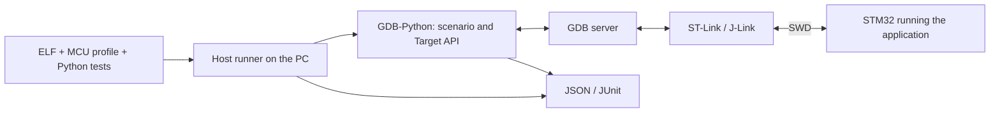
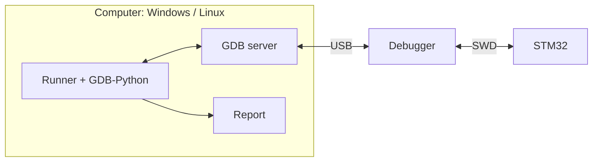
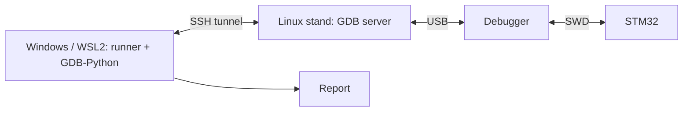
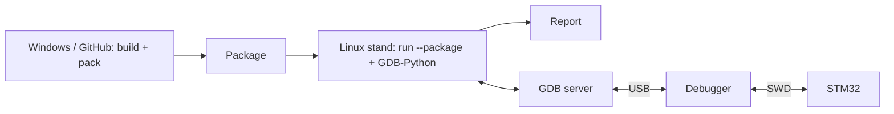
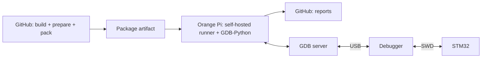
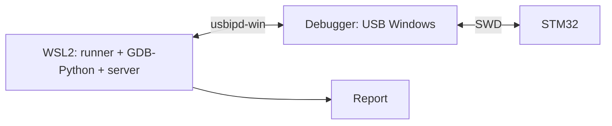

# stm32-gdbtest

[](https://github.com/ViacheslavMezentsev/stm32-gdbtest/actions/workflows/docs.yml)
[](https://github.com/ViacheslavMezentsev/stm32-gdbtest/actions/workflows/offline.yml)

[](docs/en/HARDWARE_METRICS.md)
[](docs/en/HARDWARE_METRICS.md)
[](docs/en/HARDWARE_METRICS.md)
[](docs/en/HARDWARE_METRICS.md)

[Русский](README.md)

**stm32-gdbtest implements [DDTT](docs/en/DDTT.md) for STM32: checks of running firmware
on a real board through GDB and an SWD debugger, written as scenarios in the project
repository.** A developer or an AI agent writes a scenario; it runs in GDB on the
computer, controls the firmware through a debug server and produces a JSON/JUnit
report. There is no test code in the firmware. The same scenario runs manually, from
CTest, in a CI runner or in a loop on a stand — with any connection layout: the
debugger at the workstation, on a Linux stand such as an Orange Pi, or on a remote
stand over SSH.

DDTT (debugger-driven testing on target) is a method described by its own
[specification](docs/en/DDTT.md); this repository is its reference implementation. It is
not an MCU simulator and not a unit-test framework that runs test functions inside the
firmware. It needs a
built ELF with debug information, an MCU profile and a stand.

## Why this approach

An agent can design a change and use GDB directly, but a check recorded only in a chat
is hard to reproduce. Here actions and expectations are saved in the repository
as repeatable tests: requirement → scenario in
`tests/board` → checks without hardware (ELF contracts, image) → run on a stand → a
report that both the agent and a person read. Scenarios stay test cases of the project
and run again after every change — on any of the described stands, manually or
automatically.

With STM32 it matters to check not only computations but also peripheral setup,
interrupt handling and the application's response to status codes returned by HAL
(such as `HAL_ERROR`, `HAL_BUSY` and `HAL_TIMEOUT`). Developers already
check much of this manually in a debugger; a scenario records such actions and
expectations.

The project grew out of practical GDB-Python experiments on F1/F4 boards. The
infrastructure was extracted from the [stand project](https://github.com/ViacheslavMezentsev/stm32-hwtest-blackpill)
so that other applications can use it with their own profiles and tests.

Historical videos by the author, **in Russian**:

- [Early GDB-Python testing experiments](https://www.youtube.com/watch?v=idlKlSHc0wU).
- [Unit testing for small embedded systems (debugging Python tests)](https://www.youtube.com/watch?v=_BuMmQGHol4) — demonstrates the earlier Python-test workflow.

These videos explain the origins of the approach; the module documentation describes the current API and commands.

## How it works



The runner checks the input artifacts, starts the server and GDB, limits the run time
and saves the results. A scenario reaches the required point of the program, reads
variables, structures and registers and compares them with expectations. If needed it
can change a value, force a function to return or call a firmware function to test the
caller's reaction. No test logic is added to the firmware.

```python
from stm32_gdbtest import case, within


# Verify the system clock and the SysTick period after start-up.
@case("HW_CLOCK", contracts=("clock_macros",))
def clock(t):
    t.reach("board_led_toggle")

    # A string cell is a GDB expression; numbers and matchers are Python values.
    t.check([
        ("HSI enabled and ready", "RCC->CR & (RCC_CR_HSION | RCC_CR_HSIRDY)", "RCC_CR_HSION | RCC_CR_HSIRDY"),
        ("1 ms SysTick at 8 MHz", "SysTick->LOAD", 8_000_000 // 1000 - 1),
        ("VDDA is plausible", "board_adc_reading.vdda_mv", within(2800, 3600))
    ])
```

## Features

- Runs scenarios through OpenOCD, ST-LINK GDB Server and J-Link GDB Server; runner and
  GDB on Windows or Linux, the GDB server next to them or on the stand's Linux host over SSH.
- Image verification and programming: by loadable ELF sections, or a full image with
  fill and CRC-32 computed on the PC ([images and CRC](docs/en/IMAGES.md)); DEV_ID and
  Flash size checks in `warn` and `strict` modes ([identity](docs/en/TARGET_IDENTITY.md)).
- Target API 0.3.0 ([reference](docs/en/api/index.md), [API](docs/en/API.md)): navigation with `reach`, `step`,
  `until`, `finish`, `Point` and `watch` points; `read`/`write` (including a table of writes), `evaluate`,
  `memory`, `symbol`, `registers`, `frames`, `locals`; injections with `ret` and `call`; one `check` with
  matchers and a table, an expected refusal with `refused`; the run `profile` with project data and build
  facts; the `record`/`records` journal. Techniques are in the [techniques catalogue](docs/en/TESTING_TECHNIQUES.md).
- Checks without hardware: build manifest, selective ELF/HAL contracts,
  `run --prepare-only`, requirement traceability; CI is built on them
  ([checks and CI](docs/en/testing.md)).
- Timeouts with a recovery attempt, debugger locking between processes, JSON/JUnit
  reports, CMake/CTest integration.
- Prepared run packages (`pack`, `run --package`): build in one place, run on the
  stand; hardware CI on a self-hosted runner ([hardware CI](docs/en/HARDWARE_CI.md)).

## Limitations

- **Manual GDB experience is necessary.** The author needs to understand where
  to stop, which stack frame is selected, and what `step`, `finish`, reset and
  forced return (`ret`) do. A scenario automates those actions; the module does not
  choose suitable observation points or expectations for the developer.
- **Scenarios are Python; GDB evaluates expressions.** Reading C/C++ expressions
  through `gdb.parse_and_eval` or Target API does not allow arbitrary C code in
  a scenario. A `do { ... } while (0)` statement macro, for example, is not an
  evaluable expression. Calling a function from an expression executes code on
  the MCU and can change state or hang; MMIO reads can also have side effects.
- **Available data depends on the ELF and current context.** `-g3` preserves macro
  definitions but cannot restore variables, types or functions removed by
  optimisation. A HAL/CMSIS macro needs a source location in a compilation unit
  where it is defined; entering another function or changing the frame may make
  it unavailable. A contract checks macro presence and expansion, not the safety
  of evaluating it on hardware. See [macros](docs/en/HAL_MACRO_GUIDE.md) and
  [testing techniques](docs/en/TESTING_TECHNIQUES.md).
- **Debugging changes system behaviour.** Stops, resets and injections affect
  timing and IRQs; peripherals may keep running while the core is halted.
  Sleep/WFI checks do not measure power consumption. Hardware breakpoint counts
  are MCU-limited; optimisation and backends affect reachability and
  `finish`/`ret` behaviour. A Cortex-M0 watch point halts the core one or two instructions
  after the store.
- **A working, agreed stand is required.** USB/SWD loss or a stuck server can
  require manual reconnection; timeout/recovery cannot guarantee physical link
  recovery. Such a case is recorded in [rc.2 acceptance](docs/en/RC2_READINESS.md).
  Support is verified for a specific MCU, build, GDB and backend combination.
- **Results apply to the scenario's conditions.** Injecting a HAL return code
  checks an application branch, not the physical cause of a peripheral failure.
  The module does not replace measuring instruments or calculate coverage
  automatically; PASS does not mean all of HAL or every device mode was tested.

## Run layouts

The scenario and the report are the same in every layout; only the local stand file
(`*.local.toml`, `remote.toml`) changes, and it stays with the user.

| Layout | Runner and GDB | GDB server and debugger | Status |
| --- | --- | --- | --- |
| Local on Windows | Windows, GDB 14.2/15.2/16.3 | same computer | verified: 5 boards, full suite |
| Local on a Linux stand | Orange Pi 5, Ubuntu 20.04 aarch64 | same computer | verified: 5 boards, full suite |
| Remote server from Windows | Windows | Orange Pi 5 over SSH (`[remote]`) | verified: 5 boards, full suite; consumer project |
| Remote server from WSL2 | WSL2, Ubuntu 20.04 x86_64 | Orange Pi 5 over SSH | verified: 5 boards, full suite |
| Prepared run package | build on Windows, in WSL2 or in GitHub Actions | Orange Pi 5, `run --package` | verified: 5 boards, lifecycle |
| Hardware CI | prepare on GitHub, hardware on a self-hosted runner | Orange Pi 5 (runner service) | verified: 5 boards, lifecycle |
| Local on Linux x86_64 | Linux PC | same computer | implemented, not verified on hardware |
| WSL2 with the debugger via usbipd-win | WSL2 | same computer | implemented as Linux, not verified |

The full suite is every scenario of the CI firmware (42 for F030R8, 44 for each of the others); the lifecycle
is the 10 steps of `run_hw.py`: build, prepare, boot, strict identity, images, timeout and recovery. The
0.3.0 package campaigns of 2026-10-05/06 are in the [accepted results](docs/en/API_ACCEPTANCE.md).

### Local run: Windows or Linux

Runner, GDB-Python and server share one computer. This covers Windows
and Orange Pi; local Linux x86_64 has not yet been verified on hardware.



### Remote server: Windows or WSL2 → Linux stand

Runner and scenario stay on the workstation. SSH starts the server on the stand
and tunnels the GDB connection. The debugger is physically attached to the stand.



### Package: build separately from execution

A package containing ELF, profile and scenarios is transferred to the stand.
`run --package` runs both GDB-Python and the server there; reports stay there too.



### Hardware CI: GitHub and a self-hosted runner

A GitHub-hosted job builds and prepares the package without a board. A self-hosted
job on Orange Pi downloads it, runs hardware checks and uploads reports.



### WSL2 USB forwarding: not hardware-verified

All test processes run in WSL2; Windows forwards the USB device into Linux
through usbipd-win. This distinct layout has not yet been verified on boards.



Remote mode uses SSH keys only; the debugger lock is held on the stand host and the
link is watched by a heartbeat. ST-LINK GDB Server is not available on Linux aarch64
(ST does not ship it for arm64), so OpenOCD and J-Link are used on Orange Pi.
Details: [Linux stand](docs/en/LINUX_STAND.md), [GDB servers](docs/en/BACKENDS.md).

**Reading the counters.** `Hardware: full campaign 0.3.0`, `Boards tested` and `HW cases (recorded)` describe the full hardware campaign of the 0.3.0 package on one code base: five board models and 218 distinct profile/scenario combinations (42 for F030R8, 44 for each of the others), each passing with three GDB versions on Windows and in the Orange Pi 5 layouts. Repeats and builds do not increase this count; `HW verified (latest)` is the campaign date. The badges are static: a CI run does not update them, and they are not a coverage percentage. Scope, limits and earlier snapshots are in the [metric definitions](docs/en/HARDWARE_METRICS.md).

## MCU profiles

A profile is a `target.toml` file describing a specific MCU: Flash, DEV_ID, number of
hardware breakpoints, fault handlers, diagnostic registers, the OpenOCD target. The
module has no ready-made profile library "for any STM32": the consumer writes a profile
for their board, using one of the existing ones as a template. Several MCU variants of
one firmware can share scenarios, each with its own profile (`PROFILE`).

Templates in the repository: the CI firmware `tests/firmware/profiles/` (F030R8,
F103C8, F401CC, F411CE, F429ZI — Cortex-M0, M3, M4; AT32F403A — a compatible Cortex-M4) and the example
`examples/minimal-consumer/profile/` (F411CE).

| MCU | Debugger / GDB server | Verified in |
| --- | --- | --- |
| STM32F030R8 | ST-Link (NUCLEO) / OpenOCD; J-Link GDB Server | CI firmware (42 cases), HAL fixture, stand project |
| STM32F103C8 | J-Link / J-Link GDB Server | CI firmware (44 cases), stand project |
| STM32F103CB | J-Link CE / J-Link GDB Server | demo project [stm32-hwtest-bluepill](https://github.com/ViacheslavMezentsev/stm32-hwtest-bluepill) |
| STM32F401CC | ST-Link / OpenOCD; ST-LINK GDB Server | CI firmware (44 cases), stand project |
| STM32F411CE | ST-Link / OpenOCD; ST-LINK GDB Server | CI firmware (44 cases), example, stand project |
| STM32F429ZI | ST-Link / OpenOCD; ST-LINK GDB Server | CI firmware (44 cases), stand project |
| STM32G474CE | ST-Link / OpenOCD on Orange Pi 5 | consumer project (Arduino Core STM32) |
| AT32F403ACGU7 (Artery) | J-Link / J-Link GDB Server | CI firmware (44 cases), after 0.3.0 |

OpenOCD and ST-LINK GDB Server need only the profile. J-Link GDB Server requires a
device name: the profile sets it (`jlink_device`), and the module knows it for STM32F103C8T6,
STM32F030R8T6 and STM32F103CBT6. H503 is not supported. Support is defined by the specific combination
of MCU, HAL, GDB and backend, not by the family: [current status](docs/en/STATUS.md).

**Compatible MCUs from other vendors.** The module is not tied to ST: it needs a Cortex-M core and a
GDB server that connects to the chip. Such an MCU (Artery AT32, GigaDevice GD32, Geehy APM32, etc.) is
attached with its own profile and the vendor CMSIS, without module changes. One is verified so far —
AT32F403ACGU7 on the WeAct AT32F4 Core Board via J-Link; it is not part of the 0.3.0 hardware campaign
or the counters above. The profile, the SDK, scenario specifics and the procedure for your own MCU are in
[compatible MCUs](docs/en/COMPATIBLE_MCU.md). Every new chip needs its own acceptance on a board.

## Status

The published **0.3.0** package has module version `0.3.0`, `API_VERSION = 1`, [API specification](docs/TECHNICAL_SPECIFICATION_API.md)
0.3.7, [general specification](docs/TECHNICAL_SPECIFICATION.md) 0.69 (both Russian). The package is accepted on five
boards in six run layouts ([accepted results](docs/en/API_ACCEPTANCE.md)); the owner sets the `v0.3.0` tag following
the [release notes](docs/releases/v0.3.0.md). Published tags are `v0.1.0-rc.1` and `v0.1.0-rc.2`
([rc.2 acceptance](docs/en/RC2_READINESS.md)). The 0.4.0 candidate has removed the former
`value`, `fields`, `set_value`, `force_return` methods and uses `API_VERSION=2`; release and full hardware acceptance remain.
Changes are in the [CHANGELOG](CHANGELOG.en.md), the verified scope by
mechanism in [STATUS](docs/en/STATUS.md).

RISC-V, full migration of other examples, external instrument control, child process
supervision and Python packaging remain in the [roadmap](TODO.md).

## Contents and dependencies

- `stm32_gdbtest/` — runner, GDB agent, Target API, backends, contracts and CMake integration.
- `tests/host`, `tests/fixtures` — infrastructure checks without a board.
- `tests/firmware`, `ci/` — F030R8/F103C8/F401CC/F411CE/F429ZI/AT32F403A CI firmware, Docker image, the check
  script and `run_hw.py` for hardware validation on a stand; `tests/firmware/common/tests` — scenarios
  shared by all profiles, including nine API showcase scenarios.
- `tests/hal-f030/` — standalone HAL F030 regression, CI and hardware acceptance.
- `tools/linux_stand.py` — installs the Linux stand environment without root.
- `examples/minimal-consumer/` — a standalone firmware and test example for F411.
- `docs/ru`, `docs/en` — integration, writing scenarios and mechanism descriptions;
  `docs/TECHNICAL_SPECIFICATION.md` — the specification (Russian).

You need host Python 3.11+, ARM GCC and GDB with embedded Python 3.11+, CMake 3.25+ and
Ninja, an SWD debugger and its GDB server, and the firmware libraries. HAL/CMSIS, Cube
packages and vendor tools are not part of the module. GDB-Python is a separate
interpreter, not your PC's Python environment. Linux stand: glibc ≥ 2.31 (Ubuntu 20.04
or newer), x86_64 or aarch64.

The module is integrated as a **Git submodule** (or a separate clone whose path is set
by `STM32_GDBTEST_SOURCE_DIR`). MCU settings, application tests and the local stand
stay with the consumer. Start with [integration and the example](docs/en/GETTING_STARTED.md),
then move on to [writing tests](docs/en/TEST_AUTHORING.md) — by hand or with an agent. For an agent —
the [skills](skills/README.en.md) `stm32-gdbtest-integrate`, `stm32-gdbtest-scenarios` and `stm32-gdbtest-run`.

## Documentation and related projects

- [Documentation map](docs/en/index.md), [specification](docs/TECHNICAL_SPECIFICATION.md) and [API specification](docs/TECHNICAL_SPECIFICATION_API.md) (Russian), [accepted results](docs/en/API_ACCEPTANCE.md).
- [API and CMake/CLI](docs/en/API.md), [method reference](docs/en/api/index.md), [techniques catalogue and scenario style](docs/en/TESTING_TECHNIQUES.md), [ELF/HAL contracts](docs/en/CONTRACTS.md), [HAL macros](docs/en/HAL_MACRO_GUIDE.md).
- [GDB servers](docs/en/BACKENDS.md), [identity and Flash](docs/en/TARGET_IDENTITY.md), [debugger ownership](docs/en/DEBUGGER_OWNERSHIP.md), [manifest](docs/en/MANIFESTS.md), [ELF/BIN images and CRC](docs/en/IMAGES.md).
- [Status](docs/en/STATUS.md), [checks and CI](docs/en/testing.md), [versions](docs/en/VERSIONING.md), [plans](TODO.md), [changes](CHANGELOG.en.md).
- [stm32-hwtest-blackpill](https://github.com/ViacheslavMezentsev/stm32-hwtest-blackpill) — firmware, hardware checks, overall architecture and practice.
- [stm32-cmake-yml](https://github.com/ViacheslavMezentsev/stm32-cmake-yml) — a related STM32 build project; not required by the module.

License — [MIT](LICENSE). [Origin](SOURCE.md), [rules for developers and agents](AGENTS.md), [maintenance](docs/en/maintenance.md).

[v0.3.0 release](docs/releases/v0.3.0.md), [v0.2.0-rc.1 preparation and migration](docs/en/RC020_READINESS.md).
