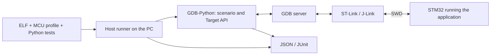

# stm32-gdbtest

[](https://github.com/ViacheslavMezentsev/stm32-gdbtest/actions/workflows/docs.yml)
[](https://github.com/ViacheslavMezentsev/stm32-gdbtest/actions/workflows/offline.yml)

[](docs/en/HARDWARE_METRICS.md)
[](docs/en/HARDWARE_METRICS.md)
[](docs/en/HARDWARE_METRICS.md)
[](docs/en/API040_SCENARIOS.md)
[](docs/en/HARDWARE_METRICS.md)
[](docs/en/HARDWARE_METRICS.md)

[Русский](README.md)

**stm32-gdbtest implements [DDTT](docs/en/DDTT.md) for STM32: checks of running firmware
on a real board through GDB and an SWD debugger, written as scenarios in the project
repository.** A developer or an AI agent writes a scenario; it runs in GDB on the
computer, controls the firmware through a debug server and produces a JSON/JUnit
report. There is no test code in the firmware. The same scenario runs manually, from
CTest, in a CI runner or in a loop on a stand — with any connection layout: the
debugger at the workstation, on a Linux stand such as an Orange Pi, or on a remote
stand over SSH.

DDTT (debugger-driven testing on target) is a method described by its own
[specification](docs/en/DDTT.md); this repository is its reference implementation. It is
not an MCU simulator and not a unit-test framework that runs test functions inside the
firmware. It needs a
built ELF with debug information, an MCU profile and a stand.

## Why this approach

An agent can design a change and use GDB directly, but a check recorded only in a chat
is hard to reproduce. Here actions and expectations are saved in the repository
as repeatable tests: requirement → scenario in
`tests/board` → checks without hardware (ELF contracts, image) → run on a stand → a
report that both the agent and a person read. Scenarios stay test cases of the project
and run again after every change — on any of the described stands, manually or
automatically.

With STM32 it matters to check not only computations but also peripheral setup,
interrupt handling and the application's response to status codes returned by HAL
(such as `HAL_ERROR`, `HAL_BUSY` and `HAL_TIMEOUT`). Developers already
check much of this manually in a debugger; a scenario records such actions and
expectations.

The project grew out of practical GDB-Python experiments on F1/F4 boards. The
infrastructure was extracted from the [stand project](https://github.com/ViacheslavMezentsev/stm32-hwtest-blackpill)
so that other applications can use it with their own profiles and tests.

Historical videos by the author, **in Russian**:

- [Early GDB-Python testing experiments](https://www.youtube.com/watch?v=idlKlSHc0wU).
- [Unit testing for small embedded systems (debugging Python tests)](https://www.youtube.com/watch?v=_BuMmQGHol4) — demonstrates the earlier Python-test workflow.

These videos explain the origins of the approach; the module documentation describes the current API and commands.

## How it works



The runner checks the input artifacts, starts the server and GDB, limits the run time
and saves the results. A scenario reaches the required point of the program, reads
variables, structures and registers and compares them with expectations. If needed it
can change a value, force a function to return or call a firmware function to test the
caller's reaction. No test logic is added to the firmware.

```python
from stm32_gdbtest import case, one_of


# Observe one application step and retain evidence for the report.
@case("HW_APP_STEP", contracts=("ci_app_api",))
def app_step(t):
    enabled = t.profile.user.get("sample_step", True)
    t.check("sample_step is boolean", type(enabled) is bool)
    if not enabled:
        t.skip("sample_step disabled in api.toml")

    # Read named fields, then stop after the producer and its wrapper return.
    t.reach("app_loop")
    before = t.read("app_state", fields={"ticks": None, "led": None})
    t.reach("app_step")
    t.finish()
    t.finish()
    after = t.read("app_state", fields={"ticks": None, "led": None})
    t.record("app.step", {"before": before, "after": after})

    # Check the increment with unsigned wraparound and the allowed LED states.
    t.check([
        ("one step published", (after["ticks"] - before["ticks"]) & 0xFFFFFFFF, 1),
        ("LED state", after["led"], one_of(0, 1))
    ])
```

The example uses common CI firmware symbols and the `ci_app_api` contract; supply your application's
symbols and expectations. `skip()` ends an inapplicable scenario; it must not hide a hardware failure.
Enable `[results] capture = true` in `session.toml` to retain records after the run:
`record()` stores arbitrary data, here two application states. Export and HTML:
[result processing](docs/en/RESULTS.md); [verified 0.4.0 scenarios](docs/en/API040_SCENARIOS.md).


## Features

- Runs scenarios through OpenOCD, ST-LINK GDB Server, st-util and J-Link GDB Server; runner and
  GDB on Windows or Linux, the GDB server next to them or on the stand's Linux host over SSH.
- Image verification and programming: by loadable ELF sections, or a full image with
  fill and CRC-32 computed on the PC ([images and CRC](docs/en/IMAGES.md)); DEV_ID and
  Flash size checks in `warn` and `strict` modes ([identity](docs/en/TARGET_IDENTITY.md)).
- Target API 0.4.x ([reference](docs/en/api/index.md), [API](docs/en/API.md)): navigation with `reach`, `step`,
  `until`, `finish`, `Point` and `watch` points; `read`/`write` (including a table of writes), `evaluate`,
  `memory`, `symbol`, `registers`, `frames`, `locals`; injections with `ret` and `call`; one `check` with
  matchers and a table, an expected refusal with `refused`; the run `profile` with project data and build
  facts; the `record`/`records` journal and `skip(reason)` for an inapplicable scenario.
  Former `value`/`fields`/`set_value`/`force_return` methods are removed; see the
  [migration](docs/en/RELEASE040_SCOPE.md#2-scenario-and-documentation-cleanup).
  Techniques are in the [techniques catalogue](docs/en/TESTING_TECHNIQUES.md).
- Checks without hardware: build manifest, selective ELF/HAL contracts,
  `run --prepare-only`, requirement traceability; CI is built on them
  ([checks and CI](docs/en/testing.md)).
- Timeouts with a recovery attempt, debugger locking between processes, JSON/JUnit
  reports, CMake/CTest integration.
- Prepared run packages (`pack`, `run --package`): build in one place, run on the
  stand; hardware CI on a self-hosted runner ([hardware CI](docs/en/HARDWARE_CI.md)).

## Limitations

- **GDB knowledge is required.** The author chooses stop points, frames, expectations and permitted injections.
  Scenarios are Python; GDB evaluates C/C++ expressions. Statement macros such as `do { ... } while (0)`
  are not expressions; function calls and MMIO reads can change device state.
- **Data depends on the ELF and frame.** `-g3` preserves macros, not objects removed by optimization.
  A macro must be available in the current compilation unit; a contract does not prove that evaluating
  it is safe. See [macros](docs/en/HAL_MACRO_GUIDE.md).
- **Debug stops affect the device.** Halt, reset and injections change timing and IRQ behaviour; peripherals
  may keep running. Points are limited by MCU resources, `finish`/`ret` depend on the build and backend;
  a Cortex-M0 watchpoint may stop one or two instructions after the write.
- **Connection recovery may require intervention.** Recovery is an attempt, not a guarantee after USB/SWD loss.
  Acceptance applies to a specific MCU/build/GDB/backend combination; see [known limits](docs/en/STATUS.md).
- **PASS applies to the scenario.** Injection checks an application response, not the physical cause of failure.
  The module does not replace instruments, measure Sleep/WFI current or compute coverage automatically.

[Current status, versions and acceptance limits](docs/en/STATUS.md) ·
[run layouts](docs/en/RUN_LAYOUTS.md) · [MCU profiles](docs/en/MCU_PROFILES.md).

## Contents and dependencies

- `stm32_gdbtest/` — runner, GDB agent, Target API, backends, contracts and CMake integration.
- `tests/host`, `tests/fixtures` — infrastructure checks without a board.
- `tests/firmware`, `ci/` — F030R8/F103C8/F401CC/F411CE/F429ZI/AT32F403A CI firmware, Docker image, the check
  script and `run_hw.py` for hardware validation on a stand; `tests/firmware/common/tests` — scenarios
  shared by all profiles, including nine API showcase scenarios.
- `tests/hal-f030/` — standalone HAL F030 regression, CI and hardware acceptance.
- `tools/stand_loop.py` — [finite autonomous cycles](docs/en/STAND_LOOP.md) from packages and evidence for agents.
- `tools/linux_stand.py` — installs the Linux stand environment without root.
- `examples/minimal-consumer/` — a standalone firmware and test example for F411.
- `docs/ru`, `docs/en` — integration, writing scenarios and mechanism descriptions;
  `docs/TECHNICAL_SPECIFICATION.md` — the specification (Russian).

You need host Python 3.11+, ARM GCC and GDB with embedded Python 3.11+, CMake 3.25+ and
Ninja, an SWD debugger and its GDB server, and the firmware libraries. HAL/CMSIS, Cube
packages and vendor tools are not part of the module. GDB-Python is a separate
interpreter, not your PC's Python environment. Linux stand: glibc ≥ 2.31 (Ubuntu 20.04
or newer), x86_64 or aarch64.

The module is integrated as a **Git submodule** (or a separate clone whose path is set
by `STM32_GDBTEST_SOURCE_DIR`). MCU settings, application tests and the local stand
stay with the consumer. Start with [integration and the example](docs/en/GETTING_STARTED.md),
then move on to [writing tests](docs/en/TEST_AUTHORING.md) — by hand or with an agent. For an agent —
the [skill recommendations](skills/README.en.md): integration, scenarios, execution, results, stand loops and development.

## Documentation and related projects

- [Documentation map](docs/en/index.md), [specification](docs/TECHNICAL_SPECIFICATION.md) and [API specification](docs/TECHNICAL_SPECIFICATION_API.md) (Russian), [accepted results](docs/en/API_ACCEPTANCE.md).
- [API and CMake/CLI](docs/en/API.md), [method reference](docs/en/api/index.md), [techniques catalogue and scenario style](docs/en/TESTING_TECHNIQUES.md), [ELF/HAL contracts](docs/en/CONTRACTS.md), [HAL macros](docs/en/HAL_MACRO_GUIDE.md).
- [Export, integrity and HTML](docs/en/RESULTS.md), [result interpretation skill](skills/stm32-gdbtest-results/SKILL.md).
- [GDB servers](docs/en/BACKENDS.md), [identity and Flash](docs/en/TARGET_IDENTITY.md), [debugger ownership](docs/en/DEBUGGER_OWNERSHIP.md), [manifest](docs/en/MANIFESTS.md), [ELF/BIN images and CRC](docs/en/IMAGES.md).
- [Status](docs/en/STATUS.md), [checks and CI](docs/en/testing.md), [versions](docs/en/VERSIONING.md), [plans](TODO.md), [changes](CHANGELOG.en.md).
- [stm32-hwtest-blackpill](https://github.com/ViacheslavMezentsev/stm32-hwtest-blackpill) — firmware, hardware checks, overall architecture and practice.
- [stm32-cmake-yml](https://github.com/ViacheslavMezentsev/stm32-cmake-yml) — a related STM32 build project; not required by the module.

License — [MIT](LICENSE). [Origin](SOURCE.md), [rules for developers and agents](AGENTS.md), [maintenance](docs/en/maintenance.md).

[v0.4.1 preparation](docs/releases/v0.4.1.md), [v0.4.0 release](docs/releases/v0.4.0.md), [v0.2.0-rc.1 preparation and migration](docs/en/RC020_READINESS.md).
