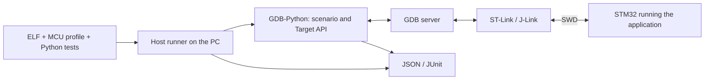

# stm32-gdbtest

[Русский](README.md)

**stm32-gdbtest implements [DDTT](docs/en/DDTT.md) for STM32: checks of running firmware
on a real board through GDB and an SWD debugger, written as scenarios in the project
repository.** A developer or an AI agent writes a scenario; it runs in GDB on the
computer, controls the firmware through a debug server and produces a JSON/JUnit
report. There is no test code in the firmware. The same scenario runs manually, from
CTest, in a CI runner or in a loop on a stand — with any connection layout: the
debugger at the workstation, on a Linux stand such as an Orange Pi, or on a remote
stand over SSH.

DDTT (debugger-driven testing on target) is a method described by its own
[specification](docs/en/DDTT.md); this repository is its reference implementation. It is
not an MCU simulator and not a unit-test framework that runs test functions inside the
firmware. It needs a
built ELF with debug information, an MCU profile and a stand.

## Why this approach

An agent can design a change and use GDB directly, but a check done in a chat is not
repeatable. Here the loop closes in the repository: requirement → scenario in
`tests/board` → checks without hardware (ELF contracts, image) → run on a stand → a
report that both the agent and a person read. Scenarios stay test cases of the project
and run again after every change — on any of the described stands, manually or
automatically.

With STM32 it matters to check not only computations but also peripheral setup,
interrupt handling and the application's reaction to HAL errors. Developers already
check much of this manually in a debugger; a scenario records such actions and
expectations.

The project grew out of practical GDB-Python experiments on F1/F4 boards. The
infrastructure was extracted from the [stand project](https://github.com/ViacheslavMezentsev/stm32-hwtest-blackpill)
so that other applications can use it with their own profiles and tests.

## How it works

The runner checks the input artifacts, starts the server and GDB, limits the run time
and saves the results. A scenario reaches the required point of the program, reads
variables, structures and registers and compares them with expectations. If needed it
can change a value or force a function to return to test the caller's reaction. No
test logic is added to the firmware.

The debugger affects execution: halt, reset and injections change state and timing.
The module does not replace measuring instruments, does not compute code coverage
automatically and does not check "all of HAL" by itself. The scenario author defines
requirements and expectations; only symbols and features that survived in the built
ELF are available.

## Features

- Runs scenarios through OpenOCD, ST-LINK GDB Server and J-Link GDB Server; runner and
  GDB on Windows or Linux, the GDB server next to them or on the stand's Linux host over SSH.
- Image verification and programming: by loadable ELF sections, or a full image with
  fill and CRC-32 computed on the PC ([images and CRC](docs/en/IMAGES.md)); DEV_ID and
  Flash size checks in `warn` and `strict` modes ([identity](docs/en/TARGET_IDENTITY.md)).
- Target API: hardware breakpoints, `reach` with a frame check, reading values and
  structures, `set_value` and `force_return` for injections ([API](docs/en/API.md)).
- Checks without hardware: build manifest, selective ELF/HAL contracts,
  `run --prepare-only`, requirement traceability; CI is built on them
  ([checks and CI](docs/en/testing.md)).
- Timeouts with a recovery attempt, debugger locking between processes, JSON/JUnit
  reports, CMake/CTest integration.
- Prepared run packages (`pack`, `run --package`): build in one place, run on the
  stand; hardware CI on a self-hosted runner ([hardware CI](docs/en/HARDWARE_CI.md)).

## Run layouts

The scenario and the report are the same in every layout; only the local stand file
(`*.local.toml`, `remote.toml`) changes, and it stays with the user.

| Layout | Runner and GDB | GDB server and debugger | Status |
| --- | --- | --- | --- |
| Local on Windows | Windows | same computer | verified: 4 stands |
| Local on a Linux stand | Orange Pi 5, Ubuntu 20.04 aarch64 | same computer | verified: 3 stands |
| Remote server from Windows | Windows | Orange Pi 5 over SSH (`[remote]`) | verified: 3 stands and the consumer project |
| Remote server from WSL2 | WSL2, Ubuntu 20.04 x86_64 | Orange Pi 5 over SSH | verified: 3 stands |
| Prepared run package | build on Windows or in GitHub Actions | Orange Pi 5, `run --package` | verified: 3 stands |
| Hardware CI | prepare on GitHub, hardware on a self-hosted runner | Orange Pi 5 (runner service) | verified: 3 stands |
| Local on Linux x86_64 | Linux PC | same computer | implemented, not verified on hardware |
| WSL2 with the debugger via usbipd-win | WSL2 | same computer | implemented as Linux, not verified |

Remote mode uses SSH keys only; the debugger lock is held on the stand host and the
link is watched by a heartbeat. ST-LINK GDB Server is not available on Linux aarch64
(ST does not ship it for arm64), so OpenOCD and J-Link are used on Orange Pi.
Details: [Linux stand](docs/en/LINUX_STAND.md), [GDB servers](docs/en/BACKENDS.md).

## MCU profiles

A profile is a `target.toml` file describing a specific MCU: Flash, DEV_ID, number of
hardware breakpoints, fault handlers, diagnostic registers, the OpenOCD target. The
module has no ready-made profile library "for any STM32": the consumer writes a profile
for their board, using one of the existing ones as a template. Several MCU variants of
one firmware can share scenarios, each with its own profile (`PROFILE`).

Templates in the repository: the CI firmware `tests/firmware/profiles/` (F030R8,
F103C8, F411CE — Cortex-M0, M3, M4) and the example `examples/minimal-consumer/profile/` (F411CE).

| MCU | Debugger / GDB server | Verified in |
| --- | --- | --- |
| STM32F030R8 | J-Link STLink / J-Link GDB Server | CI firmware, stand project |
| STM32F103C8 | J-Link CE / J-Link GDB Server | CI firmware, stand project |
| STM32F103CB | J-Link CE / J-Link GDB Server | demo project [stm32-hwtest-bluepill](https://github.com/ViacheslavMezentsev/stm32-hwtest-bluepill) |
| STM32F411CE | ST-Link / OpenOCD and ST-LINK GDB Server | CI firmware, example, stand project |
| STM32F429ZI | ST-Link / OpenOCD and ST-LINK GDB Server | stand project |
| STM32F401CC | ST-Link / ST-LINK GDB Server | stand project, earlier checks |
| STM32G474CE | ST-Link / OpenOCD on Orange Pi 5 | consumer project (Arduino Core STM32) |

OpenOCD and ST-LINK GDB Server need only the profile. J-Link GDB Server requires a
device name mapping, which currently exists for STM32F103C8T6, STM32F030R8T6 and
STM32F103CBT6. H503 is not supported. Support is defined by the specific combination
of MCU, HAL, GDB and backend, not by the family: [current status](docs/en/STATUS.md).

## Status

**0.1.0-rc.1** is published; [rc.2](docs/en/RC2_READINESS.md) is being prepared.
Since rc.1, manifest and HAL macro contracts were fixed, CMSIS F030 was expanded,
and a standalone HAL F030 regression fixture was added. F103/F411 still provide
basic boot/GPIO cases. Verified scope and limits: [STATUS](docs/en/STATUS.md).
The release branch uses Python version `0.1.0rc2`, `API_VERSION = 1`.
Candidate acceptance is pending; the rc.2 tag is not published.

RISC-V, full migration of other examples, external instrument control, child process
supervision and Python packaging remain in the [roadmap](TODO.md).

## Contents and dependencies

- `stm32_gdbtest/` — runner, GDB agent, Target API, backends, contracts and CMake integration.
- `tests/host`, `tests/fixtures` — infrastructure checks without a board.
- `tests/firmware`, `ci/` — F030R8/F103C8/F411CE CI firmware, Docker image, the check
  script and `run_hw.py` for hardware validation on a stand.
- `tests/hal-f030/` — standalone HAL F030 regression, CI and hardware acceptance.
- `tools/linux_stand.py` — installs the Linux stand environment without root.
- `examples/minimal-consumer/` — a standalone firmware and test example for F411.
- `docs/ru`, `docs/en` — integration, writing scenarios and mechanism descriptions;
  `docs/TECHNICAL_SPECIFICATION.md` — the specification (Russian).

You need host Python 3.11+, ARM GCC and GDB with embedded Python 3.11+, CMake 3.25+ and
Ninja, an SWD debugger and its GDB server, and the firmware libraries. HAL/CMSIS, Cube
packages and vendor tools are not part of the module. GDB-Python is a separate
interpreter, not your PC's Python environment. Linux stand: glibc ≥ 2.31 (Ubuntu 20.04
or newer), x86_64 or aarch64.

The module is integrated as a **Git submodule** (or a separate clone whose path is set
by `STM32_GDBTEST_SOURCE_DIR`). MCU settings, application tests and the local stand
stay with the consumer. Start with [integration and the example](docs/en/GETTING_STARTED.md),
then move on to [writing tests](docs/en/TEST_AUTHORING.md) — by hand or with an agent.

## Documentation and related projects

- [Documentation map](docs/en/index.md), [specification](docs/TECHNICAL_SPECIFICATION.md) (Russian).
- [API and CMake/CLI](docs/en/API.md), [ELF/HAL contracts](docs/en/CONTRACTS.md), [HAL macros](docs/en/HAL_MACRO_GUIDE.md).
- [GDB servers](docs/en/BACKENDS.md), [identity and Flash](docs/en/TARGET_IDENTITY.md), [debugger ownership](docs/en/DEBUGGER_OWNERSHIP.md), [manifest](docs/en/MANIFESTS.md), [ELF/BIN images and CRC](docs/en/IMAGES.md).
- [Status](docs/en/STATUS.md), [checks and CI](docs/en/testing.md), [versions](docs/en/VERSIONING.md), [plans](TODO.md), [changes](CHANGELOG.en.md).
- [stm32-hwtest-blackpill](https://github.com/ViacheslavMezentsev/stm32-hwtest-blackpill) — firmware, hardware checks, overall architecture and practice.
- [stm32-cmake-yml](https://github.com/ViacheslavMezentsev/stm32-cmake-yml) — a related STM32 build project; not required by the module.

License — [MIT](LICENSE). [Origin](SOURCE.md), [rules for developers and agents](AGENTS.md), [maintenance](docs/en/maintenance.md).
