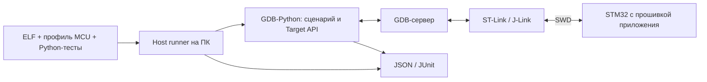

# stm32-gdbtest

**stm32-gdbtest автоматизирует проверки работающей прошивки на реальном STM32
через GDB-Python и SWD-отладчик.** Это не симулятор MCU и не обычный unit-test
фреймворк, запускающий тестовые функции внутри прошивки или на ПК: Python-сценарии
выполняются в GDB на компьютере и управляют приложением на плате через GDB-сервер.
Для них нужны собранный ELF с отладочной информацией, профиль MCU и аппаратный стенд.

## Зачем нужен этот подход

При работе со STM32 важно проверять не только вычисления, но и настройку
периферии, обработку прерываний и реакцию приложения на ошибки HAL. Многое из
этого разработчик уже проверяет вручную в отладчике. Модуль позволяет описать
такие действия на Python, повторять их после изменений и получать отчёт.

Проект вырос из практических опытов GDB-Python на платах F1/F4. Инфраструктура
выделена из [стендового проекта](https://github.com/ViacheslavMezentsev/stm32-hwtest-blackpill),
чтобы подключать её к другим приложениям, добавляя собственные профили и тесты.

## Как это работает

Runner проверяет входные артефакты, запускает сервер и GDB, ограничивает время
выполнения и сохраняет результаты. Сценарий достигает нужной точки программы,
читает переменные, структуры и регистры, сравнивает их с ожиданиями. При необходимости
он может изменить значение или принудительно завершить функцию для проверки
реакции вызывающего кода. Тестовая логика не добавляется в прошивку.

Отладчик влияет на выполнение: halt, reset и инъекции меняют состояние и время.
Модуль не заменяет измерительные приборы, не вычисляет автоматически покрытие кода
и не проверяет «всё HAL» сам по себе. Автор сценария задаёт требования и ожидания;
доступны только символы и возможности, сохранившиеся в собранном ELF.

## Возможности и зрелость

Реализованы запуск через OpenOCD, ST-LINK GDB Server и J-Link GDB Server,
проверка/запись образа, hardware breakpoints, чтение значений и контролируемые
инъекции, выборочные ELF/HAL-контракты, таймауты с попыткой восстановления,
JSON/JUnit и интеграция с CMake/CTest.

Это прототип до первого релиза. На стендах проверены сценарии F103/J-Link и
F411/ST-Link/OpenOCD, включая восстановление после таймаута; есть более ранние
проверки F401 и ST-сервера. Поддержка зависит от конкретной комбинации MCU,
HAL, GDB и backend. [Точная матрица и ограничения](docs/STATUS.md).

В плане развития — надзор за дочерними процессами, развитие схемы профиля и
метаданных совместимости. Отдельно запланировано согласованное управление
питанием, реле и другими приборами через host-контроллер; сейчас такого API нет.
Python-упаковка рассматривается как дополнительный способ поставки. [Дорожная карта](TODO.md).

## Состав и зависимости

- `stm32_gdbtest/` — runner, GDB-агент, Target API, backend, контракты и CMake-интеграция.
- `Tests/host`, `Tests/fixtures` — проверки инфраструктуры без платы.
- `examples/minimal-consumer/` — самостоятельный пример прошивки и теста для F411.
- `docs/` — подключение, написание сценариев и описание механизмов.

Проверенная среда — Windows, host Python 3.11+, ARM GCC/GDB с Python, CMake 3.25+
и Ninja для интеграции сборки. Нужны SWD-отладчик, его GDB-сервер и библиотеки
прошивки; HAL/CMSIS, Cube-пакеты и vendor tools в модуль не входят.
GDB-Python — отдельный интерпретатор, не автоматически окружение Python вашего ПК.

Модуль подключается как **Git-подмодуль**. Настройки MCU, тесты приложения и
локальный стенд остаются у потребителя. Начните с [подключения и примера](docs/GETTING_STARTED.md),
затем перейдите к [написанию тестов](docs/TEST_AUTHORING.md) — вручную или с помощью агента.

## Документация и связанные проекты

- [API и CMake/CLI](docs/API.md), [ELF/HAL-контракты](docs/CONTRACTS.md), [HAL-макросы](docs/HAL_MACRO_GUIDE.md).
- [GDB-серверы](docs/BACKENDS.md), [identity и Flash](docs/TARGET_IDENTITY.md), [владение отладчиком](docs/DEBUGGER_OWNERSHIP.md), [manifest](docs/MANIFESTS.md).
- [Текущее состояние](docs/STATUS.md), [версии](docs/VERSIONING.md), [планы](TODO.md), [изменения](CHANGELOG.md).
- [stm32-hwtest-blackpill](https://github.com/ViacheslavMezentsev/stm32-hwtest-blackpill) — прошивки, аппаратные проверки, общая архитектура и практика применения.
- [stm32-cmake-yml](https://github.com/ViacheslavMezentsev/stm32-cmake-yml) — связанный проект сборки STM32; для работы модуля он не обязателен.

Лицензия — [MIT](LICENSE). [Происхождение](SOURCE.md), [правила для разработчиков и агентов](AGENTS.md).
