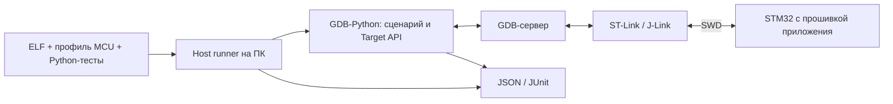

# stm32-gdbtest

[English](README.en.md)

**stm32-gdbtest — реализация [DDTT](docs/ru/DDTT.md) для STM32: проверки работающей
прошивки на реальной плате через GDB и SWD-отладчик, оформленные сценариями в
репозитории проекта.** Сценарий пишет разработчик или ИИ-агент; он выполняется в GDB
на компьютере, управляет прошивкой через отладочный сервер и даёт отчёт JSON/JUnit.
Тестового кода в прошивке нет. Один и тот же сценарий запускается вручную, из CTest,
в раннере CI или в цикле на стенде — при любой схеме подключения: отладчик у рабочего
компьютера, на Linux-стенде вроде Orange Pi или на удалённом стенде по SSH.

DDTT (debugger-driven testing on target, тестирование через отладчик на целевом
устройстве) — метод, описанный отдельной [спецификацией](docs/ru/DDTT.md); этот
репозиторий — его эталонная реализация. Это не симулятор MCU и не unit-test
фреймворк, запускающий тестовые функции внутри прошивки. Нужны собранный ELF с отладочной информацией, профиль MCU и стенд.

## Зачем нужен этот подход

Агент может проектировать изменение и сам работать с GDB, но проверка, выполненная
в чате, не повторяется. Здесь контур замыкается в репозитории: требование →
сценарий в `Tests/board` → проверка без оборудования (контракты ELF, образ) →
запуск на стенде → отчёт, который читает и агент, и человек. Сценарии остаются
тестовыми кейсами проекта и выполняются снова после каждого изменения — на любом
стенде из описанных, вручную или автоматически.

При работе со STM32 важно проверять не только вычисления, но и настройку
периферии, обработку прерываний и реакцию приложения на ошибки HAL. Многое из
этого разработчик уже проверяет вручную в отладчике; сценарий фиксирует такие
действия и ожидания.

Проект вырос из практических опытов GDB-Python на платах F1/F4. Инфраструктура
выделена из [стендового проекта](https://github.com/ViacheslavMezentsev/stm32-hwtest-blackpill),
чтобы подключать её к другим приложениям, добавляя собственные профили и тесты.

## Как это работает

```mermaid
flowchart LR
    I["ELF + профиль MCU + Python-тесты"] --> H["Host runner на ПК"]
    H --> A["GDB-Python: сценарий и Target API"]
    A <--> S["GDB-сервер"]
    S <--> D["ST-Link / J-Link"]
    D <-->|SWD| M["STM32 с прошивкой приложения"]
    A --> R["JSON / JUnit"]
    H --> R
```

Runner проверяет входные артефакты, запускает сервер и GDB, ограничивает время
выполнения и сохраняет результаты. Сценарий достигает нужной точки программы,
читает переменные, структуры и регистры, сравнивает их с ожиданиями. При необходимости
он может изменить значение или принудительно завершить функцию для проверки
реакции вызывающего кода. Тестовая логика не добавляется в прошивку.

Отладчик влияет на выполнение: halt, reset и инъекции меняют состояние и время.
Модуль не заменяет измерительные приборы, не вычисляет автоматически покрытие кода
и не проверяет «всё HAL» сам по себе. Автор сценария задаёт требования и ожидания;
доступны только символы и возможности, сохранившиеся в собранном ELF.

## Возможности и зрелость

Реализованы запуск через OpenOCD, ST-LINK GDB Server и J-Link GDB Server на
Windows и Linux, в том числе с GDB-сервером на удалённом стенде по SSH,
проверка/запись образа, hardware breakpoints, чтение значений и контролируемые
инъекции, выборочные ELF/HAL-контракты, таймауты с попыткой восстановления,
JSON/JUnit и интеграция с CMake/CTest. Команда `run --prepare-only` выполняет
все проверки до GDB-сервера без оборудования; на них основан CI
([проверки и CI](docs/ru/testing.md)).

Версия 0.1.0-rc.1 — первый кандидат выпуска. На оборудовании проверены
F030R8 и F103C8 через J-Link и F411CE через ST-Link с OpenOCD и ST-LINK GDB Server,
включая запись, полный образ и восстановление после таймаута, — на Windows, на
Orange Pi 5 (Ubuntu 20.04), с Windows и из WSL2 на Orange Pi 5 по SSH, пакетами
подготовленного запуска и аппаратным CI на self-hosted раннере; проект потребителя на
STM32G474 с Arduino Core STM32; в стендовом проекте также F429ZI и более ранние
проверки F401. Поддержка зависит от конкретной комбинации MCU, HAL, GDB и backend.
[Точная матрица и ограничения](docs/ru/STATUS.md).

Дальше — надзор за дочерними процессами, развитие схемы профиля и метаданных
совместимости. Отдельно запланировано согласованное управление
питанием, реле и другими приборами через host-контроллер — с ним контур станет
полноценным HIL; сейчас такого API нет.
Python-упаковка рассматривается как дополнительный способ поставки. [Дорожная карта](TODO.md).

## Состав и зависимости

- `stm32_gdbtest/` — runner, GDB-агент, Target API, backend, контракты и CMake-интеграция.
- `Tests/host`, `Tests/fixtures` — проверки инфраструктуры без платы.
- `Tests/firmware`, `ci/` — CI-прошивки F030R8/F103C8/F411CE, Docker-образ и сценарий проверок.
- `examples/minimal-consumer/` — самостоятельный пример прошивки и теста для F411.
- `docs/ru`, `docs/en` — подключение, написание сценариев и описание механизмов;
  `docs/TECHNICAL_SPECIFICATION.md` — ТЗ.

Аппаратный запуск работает на Windows (проверен на стендах) и Linux x86_64/aarch64,
включая Ubuntu 20.04 на Orange Pi 5 ([Linux-стенд](docs/ru/LINUX_STAND.md)); нужны host
Python 3.11+, ARM GCC/GDB с Python, CMake 3.25+ и Ninja для интеграции сборки. На
Linux окружение ставится без root одним сценарием. Нужны SWD-отладчик, его GDB-сервер и библиотеки
прошивки; HAL/CMSIS, Cube-пакеты и vendor tools в модуль не входят.
GDB-Python — отдельный интерпретатор, не автоматически окружение Python вашего ПК.

Модуль подключается как **Git-подмодуль**. Настройки MCU, тесты приложения и
локальный стенд остаются у потребителя. Начните с [подключения и примера](docs/ru/GETTING_STARTED.md),
затем перейдите к [написанию тестов](docs/ru/TEST_AUTHORING.md) — вручную или с помощью агента.

## Документация и связанные проекты

- [Карта документации](docs/ru/index.md), [ТЗ](docs/TECHNICAL_SPECIFICATION.md).
- [API и CMake/CLI](docs/ru/API.md), [ELF/HAL-контракты](docs/ru/CONTRACTS.md), [HAL-макросы](docs/ru/HAL_MACRO_GUIDE.md).
- [GDB-серверы](docs/ru/BACKENDS.md), [identity и Flash](docs/ru/TARGET_IDENTITY.md), [владение отладчиком](docs/ru/DEBUGGER_OWNERSHIP.md), [manifest](docs/ru/MANIFESTS.md), [образы ELF/BIN и CRC](docs/ru/IMAGES.md).
- [Текущее состояние](docs/ru/STATUS.md), [проверки и CI](docs/ru/testing.md), [версии](docs/ru/VERSIONING.md), [планы](TODO.md), [изменения](CHANGELOG.md).
- [stm32-hwtest-blackpill](https://github.com/ViacheslavMezentsev/stm32-hwtest-blackpill) — прошивки, аппаратные проверки, общая архитектура и практика применения.
- [stm32-cmake-yml](https://github.com/ViacheslavMezentsev/stm32-cmake-yml) — связанный проект сборки STM32; для работы модуля он не обязателен.

Лицензия — [MIT](LICENSE). [Происхождение](SOURCE.md), [правила для разработчиков и агентов](AGENTS.md), [сопровождение](docs/ru/maintenance.md).
