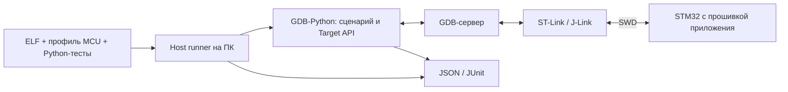

# stm32-gdbtest

[English](README.en.md)

**stm32-gdbtest — реализация [DDTT](docs/ru/DDTT.md) для STM32: проверки работающей
прошивки на реальной плате через GDB и SWD-отладчик, оформленные сценариями в
репозитории проекта.** Сценарий пишет разработчик или ИИ-агент; он выполняется в GDB
на компьютере, управляет прошивкой через отладочный сервер и даёт отчёт JSON/JUnit.
Тестового кода в прошивке нет. Один и тот же сценарий запускается вручную, из CTest,
в раннере CI или в цикле на стенде — при любой схеме подключения: отладчик у рабочего
компьютера, на Linux-стенде вроде Orange Pi или на удалённом стенде по SSH.

DDTT (debugger-driven testing on target, тестирование через отладчик на целевом
устройстве) — метод, описанный отдельной [спецификацией](docs/ru/DDTT.md); этот
репозиторий — его эталонная реализация. Это не симулятор MCU и не unit-test
фреймворк, запускающий тестовые функции внутри прошивки. Нужны собранный ELF с отладочной информацией, профиль MCU и стенд.

## Зачем нужен этот подход

Агент может проектировать изменение и сам работать с GDB, но проверка, выполненная
в чате, не повторяется. Здесь контур замыкается в репозитории: требование →
сценарий в `tests/board` → проверка без оборудования (контракты ELF, образ) →
запуск на стенде → отчёт, который читает и агент, и человек. Сценарии остаются
тестовыми кейсами проекта и выполняются снова после каждого изменения — на любом
стенде из описанных, вручную или автоматически.

При работе со STM32 важно проверять не только вычисления, но и настройку
периферии, обработку прерываний и реакцию приложения на ошибки HAL. Многое из
этого разработчик уже проверяет вручную в отладчике; сценарий фиксирует такие
действия и ожидания.

Проект вырос из практических опытов GDB-Python на платах F1/F4. Инфраструктура
выделена из [стендового проекта](https://github.com/ViacheslavMezentsev/stm32-hwtest-blackpill),
чтобы подключать её к другим приложениям, добавляя собственные профили и тесты.

## Как это работает

```mermaid
flowchart LR
    I["ELF + профиль MCU + Python-тесты"] --> H["Host runner на ПК"]
    H --> A["GDB-Python: сценарий и Target API"]
    A <--> S["GDB-сервер"]
    S <--> D["ST-Link / J-Link"]
    D <-->|SWD| M["STM32 с прошивкой приложения"]
    A --> R["JSON / JUnit"]
    H --> R
```

Runner проверяет входные артефакты, запускает сервер и GDB, ограничивает время
выполнения и сохраняет результаты. Сценарий достигает нужной точки программы,
читает переменные, структуры и регистры, сравнивает их с ожиданиями. При необходимости
он может изменить значение или принудительно завершить функцию для проверки
реакции вызывающего кода. Тестовая логика не добавляется в прошивку.

Отладчик влияет на выполнение: halt, reset и инъекции меняют состояние и время.
Модуль не заменяет измерительные приборы, не вычисляет автоматически покрытие кода
и не проверяет «всё HAL» сам по себе. Автор сценария задаёт требования и ожидания;
доступны только символы и возможности, сохранившиеся в собранном ELF.

## Возможности

- Запуск сценариев через OpenOCD, ST-LINK GDB Server и J-Link GDB Server; runner и GDB
  на Windows или Linux, GDB-сервер рядом с ними или на Linux-хосте стенда по SSH.
- Проверка и запись образа: по загружаемым секциям ELF или полный образ с заполнением
  и CRC-32 на ПК ([образы и CRC](docs/ru/IMAGES.md)); проверка DEV_ID и размера Flash
  в режимах `warn` и `strict` ([identity](docs/ru/TARGET_IDENTITY.md)).
- Target API: hardware breakpoints, `reach` с проверкой кадра, чтение значений и
  структур, `set_value` и `force_return` для инъекций ([API](docs/ru/API.md)).
- Проверки без оборудования: build manifest, выборочные ELF/HAL-контракты,
  `run --prepare-only`, трассировка требований; на них основан CI
  ([проверки и CI](docs/ru/testing.md)).
- Таймауты с попыткой восстановления, блокировка отладчика между процессами,
  отчёты JSON/JUnit, интеграция с CMake/CTest.
- Пакеты подготовленного запуска (`pack`, `run --package`): сборка в одном месте,
  запуск на стенде; аппаратный CI на self-hosted раннере ([аппаратный CI](docs/ru/HARDWARE_CI.md)).

## Схемы запуска

Сценарий и отчёт одинаковы во всех схемах; меняется только файл локального стенда
(`*.local.toml`, `remote.toml`), который остаётся у пользователя.

| Схема | Runner и GDB | GDB-сервер и отладчик | Состояние |
| --- | --- | --- | --- |
| Локально на Windows | Windows | тот же компьютер | проверено: 4 стенда |
| Локально на Linux-стенде | Orange Pi 5, Ubuntu 20.04 aarch64 | тот же компьютер | проверено: 3 стенда |
| Удалённый сервер с Windows | Windows | Orange Pi 5 по SSH (`[remote]`) | проверено: 3 стенда и проект потребителя |
| Удалённый сервер из WSL2 | WSL2, Ubuntu 20.04 x86_64 | Orange Pi 5 по SSH | проверено: 3 стенда |
| Пакет подготовленного запуска | сборка на Windows или в GitHub Actions | Orange Pi 5, `run --package` | проверено: 3 стенда |
| Аппаратный CI | prepare на GitHub, hardware на self-hosted раннере | Orange Pi 5 (служба раннера) | проверено: 3 стенда |
| Локально на Linux x86_64 | Linux-ПК | тот же компьютер | реализовано, на оборудовании не проверялось |
| WSL2 с отладчиком через usbipd-win | WSL2 | тот же компьютер | реализовано как Linux, не проверялось |

Удалённый режим работает только по ключам SSH; блокировка отладчика действует на
хосте стенда, связь контролируется сигналом присутствия. ST-LINK GDB Server на
Linux aarch64 недоступен (ST не выпускает его для arm64), поэтому на Orange Pi
используются OpenOCD и J-Link. Подробности: [Linux-стенд](docs/ru/LINUX_STAND.md),
[GDB-серверы](docs/ru/BACKENDS.md).

## Профили MCU

Профиль — файл `target.toml` с описанием конкретного MCU: Flash, DEV_ID, число
hardware breakpoints, обработчики отказов, диагностические регистры, цель OpenOCD.
Готовой библиотеки профилей «для любого STM32» в модуле нет: профиль пишет
потребитель под свою плату, взяв за образец один из имеющихся. Несколько вариантов
MCU одной прошивки могут делить сценарии, каждый со своим профилем (`PROFILE`).

Образцы в репозитории: CI-прошивки `tests/firmware/profiles/` (F030R8, F103C8,
F411CE — Cortex-M0, M3, M4) и пример `examples/minimal-consumer/profile/` (F411CE).

| MCU | Отладчик / GDB-сервер | Где проверено |
| --- | --- | --- |
| STM32F030R8 | J-Link STLink / J-Link GDB Server | CI-прошивка, стендовый проект |
| STM32F103C8 | J-Link CE / J-Link GDB Server | CI-прошивка, стендовый проект |
| STM32F103CB | J-Link CE / J-Link GDB Server | демонстрационный проект [stm32-hwtest-bluepill](https://github.com/ViacheslavMezentsev/stm32-hwtest-bluepill) |
| STM32F411CE | ST-Link / OpenOCD и ST-LINK GDB Server | CI-прошивка, пример, стендовый проект |
| STM32F429ZI | ST-Link / OpenOCD и ST-LINK GDB Server | стендовый проект |
| STM32F401CC | ST-Link / ST-LINK GDB Server | стендовый проект, ранние проверки |
| STM32G474CE | ST-Link / OpenOCD на Orange Pi 5 | проект потребителя (Arduino Core STM32) |

Для OpenOCD и ST-LINK GDB Server достаточно профиля. J-Link GDB Server требует
соответствия имени устройства; сейчас оно есть для STM32F103C8T6, STM32F030R8T6 и
STM32F103CBT6. H503 не поддержан. Поддержка определяется конкретной
комбинацией MCU, HAL, GDB и backend, а не семейством: [текущее состояние](docs/ru/STATUS.md).

## Состояние

Опубликован **0.1.0-rc.1**; готовится [rc.2](docs/ru/RC2_READINESS.md).
После rc.1 исправлены manifest и HAL macro contracts, расширен CMSIS F030,
добавлена самостоятельная HAL F030-регрессия. F103/F411 пока сохраняют базовые
boot/GPIO-сценарии. Точный проверенный объём и ограничения — [STATUS](docs/ru/STATUS.md).
Версия Python до выпускной ветки остаётся `0.1.0rc1`, `API_VERSION = 1`.

RISC-V, полный перенос остальных примеров, управление внешним оборудованием,
надзор за дочерними процессами и Python-упаковка остаются в [дорожной карте](TODO.md).

## Состав и зависимости

- `stm32_gdbtest/` — runner, GDB-агент, Target API, backend, контракты и CMake-интеграция.
- `tests/host`, `tests/fixtures` — проверки инфраструктуры без платы.
- `tests/firmware`, `ci/` — CI-прошивки F030R8/F103C8/F411CE, Docker-образ, сценарий
  проверок и `run_hw.py` для аппаратной проверки на стенде.
- `tests/hal-f030/` — самостоятельная HAL-регрессия F030, CI и аппаратная приёмка.
- `tools/linux_stand.py` — установка окружения Linux-стенда без root.
- `examples/minimal-consumer/` — самостоятельный пример прошивки и теста для F411.
- `docs/ru`, `docs/en` — подключение, написание сценариев и описание механизмов;
  `docs/TECHNICAL_SPECIFICATION.md` — ТЗ.

Нужны host Python 3.11+, ARM GCC и GDB со встроенным Python 3.11+, CMake 3.25+ и Ninja,
SWD-отладчик и его GDB-сервер, библиотеки прошивки. HAL/CMSIS, Cube-пакеты и vendor
tools в модуль не входят. GDB-Python — отдельный интерпретатор, не окружение Python
вашего ПК. Linux-стенд: glibc ≥ 2.31 (Ubuntu 20.04 и новее), x86_64 или aarch64.

Модуль подключается как **Git-подмодуль** (или отдельный клон, путь к которому задаёт
`STM32_GDBTEST_SOURCE_DIR`). Настройки MCU, тесты приложения и локальный стенд остаются
у потребителя. Начните с [подключения и примера](docs/ru/GETTING_STARTED.md), затем
перейдите к [написанию тестов](docs/ru/TEST_AUTHORING.md) — вручную или с помощью агента.

## Документация и связанные проекты

- [Карта документации](docs/ru/index.md), [ТЗ](docs/TECHNICAL_SPECIFICATION.md).
- [API и CMake/CLI](docs/ru/API.md), [ELF/HAL-контракты](docs/ru/CONTRACTS.md), [HAL-макросы](docs/ru/HAL_MACRO_GUIDE.md).
- [GDB-серверы](docs/ru/BACKENDS.md), [identity и Flash](docs/ru/TARGET_IDENTITY.md), [владение отладчиком](docs/ru/DEBUGGER_OWNERSHIP.md), [manifest](docs/ru/MANIFESTS.md), [образы ELF/BIN и CRC](docs/ru/IMAGES.md).
- [Текущее состояние](docs/ru/STATUS.md), [проверки и CI](docs/ru/testing.md), [версии](docs/ru/VERSIONING.md), [планы](TODO.md), [изменения](CHANGELOG.md).
- [stm32-hwtest-blackpill](https://github.com/ViacheslavMezentsev/stm32-hwtest-blackpill) — прошивки, аппаратные проверки, общая архитектура и практика применения.
- [stm32-cmake-yml](https://github.com/ViacheslavMezentsev/stm32-cmake-yml) — связанный проект сборки STM32; для работы модуля он не обязателен.

Лицензия — [MIT](LICENSE). [Происхождение](SOURCE.md), [правила для разработчиков и агентов](AGENTS.md), [сопровождение](docs/ru/maintenance.md).
