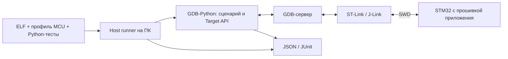

# stm32-gdbtest

[](https://github.com/ViacheslavMezentsev/stm32-gdbtest/actions/workflows/docs.yml)
[](https://github.com/ViacheslavMezentsev/stm32-gdbtest/actions/workflows/offline.yml)

[](docs/ru/HARDWARE_METRICS.md)
[](docs/ru/HARDWARE_METRICS.md)
[](docs/ru/HARDWARE_METRICS.md)
[](docs/ru/API040_SCENARIOS.md)
[](docs/ru/HARDWARE_METRICS.md)
[](docs/ru/HARDWARE_METRICS.md)

[English](README.en.md)

**stm32-gdbtest — реализация [DDTT](docs/ru/DDTT.md) для STM32: проверки работающей
прошивки на реальной плате через GDB и SWD-отладчик, оформленные сценариями в
репозитории проекта.** Сценарий пишет разработчик или ИИ-агент; он выполняется в GDB
на компьютере, управляет прошивкой через отладочный сервер и даёт отчёт JSON/JUnit.
Тестового кода в прошивке нет. Один и тот же сценарий запускается вручную, из CTest,
в раннере CI или в цикле на стенде — при любой схеме подключения: отладчик у рабочего
компьютера, на Linux-стенде вроде Orange Pi или на удалённом стенде по SSH.

DDTT (debugger-driven testing on target, тестирование через отладчик на целевом
устройстве) — метод, описанный отдельной [спецификацией](docs/ru/DDTT.md); этот
репозиторий — его эталонная реализация. Это не симулятор MCU и не unit-test
фреймворк, запускающий тестовые функции внутри прошивки. Нужны собранный ELF с отладочной информацией, профиль MCU и стенд.

## Зачем нужен этот подход

Агент может проектировать изменение и сам работать с GDB, но проверку, выполненную
только в чате, трудно воспроизвести. Здесь действия и ожидания сохраняются
в репозитории как повторяемые тесты: требование →
сценарий в `tests/board` → проверка без оборудования (контракты ELF, образ) →
запуск на стенде → отчёт, который читает и агент, и человек. Сценарии остаются
тестовыми кейсами проекта и выполняются снова после каждого изменения — на любом
стенде из описанных, вручную или автоматически.

При работе со STM32 важно проверять не только вычисления, но и настройку
периферии, обработку прерываний и реакцию приложения на возвращаемые HAL коды состояния
(например, `HAL_ERROR`, `HAL_BUSY`, `HAL_TIMEOUT`). Многое из
этого разработчик уже проверяет вручную в отладчике; сценарий фиксирует такие
действия и ожидания.

Проект вырос из практических опытов GDB-Python на платах F1/F4. Инфраструктура
выделена из [стендового проекта](https://github.com/ViacheslavMezentsev/stm32-hwtest-blackpill),
чтобы подключать её к другим приложениям, добавляя собственные профили и тесты.

Исторические видео автора **на русском языке**:

- [Ранние опыты тестирования через GDB-Python](https://www.youtube.com/watch?v=idlKlSHc0wU).
- [Модульное тестирование для малых встраиваемых систем (отладка py-тестов)](https://www.youtube.com/watch?v=_BuMmQGHol4) — показан прежний способ работы с Python-тестами.

Видео поясняют происхождение подхода; актуальный API и команды описаны в документации модуля.

## Как это работает


```mermaid
---
config:
  look: classic
---
flowchart LR
    I["ELF + профиль MCU + Python-тесты"] --> H["Host runner на ПК"]
    H --> A["GDB-Python: сценарий и Target API"]
    A <--> S["GDB-сервер"]
    S <--> D["ST-Link / J-Link"]
    D <-->|SWD| M["STM32 с прошивкой приложения"]
    A --> R["JSON / JUnit"]
    H --> R
```

Runner проверяет входные артефакты, запускает сервер и GDB, ограничивает время
выполнения и сохраняет результаты. Сценарий достигает нужной точки программы,
читает переменные, структуры и регистры, сравнивает их с ожиданиями. При необходимости
он может изменить значение, принудительно завершить функцию или вызвать функцию
прошивки, чтобы проверить реакцию вызывающего кода. Тестовая логика не добавляется в прошивку.

```python
from stm32_gdbtest import case, one_of


# Observe one application step and retain evidence for the report.
@case("HW_APP_STEP", contracts=("ci_app_api",))
def app_step(t):
    enabled = t.profile.user.get("sample_step", True)
    t.check("sample_step is boolean", type(enabled) is bool)
    if not enabled:
        t.skip("sample_step disabled in api.toml")

    # Read named fields, then stop after the producer and its wrapper return.
    t.reach("app_loop")
    before = t.read("app_state", fields={"ticks": None, "led": None})
    t.reach("app_step")
    t.finish()
    t.finish()
    after = t.read("app_state", fields={"ticks": None, "led": None})
    t.record("app.step", {"before": before, "after": after})

    # Check the increment with unsigned wraparound and the allowed LED states.
    t.check([
        ("one step published", (after["ticks"] - before["ticks"]) & 0xFFFFFFFF, 1),
        ("LED state", after["led"], one_of(0, 1))
    ])
```

Пример использует символы общей CI-прошивки и контракт `ci_app_api`; в приложении задайте свои
символы и ожидания. `skip()` завершает весь неприменимый сценарий, а не скрывает отказ оборудования.
Для сохранения записей после запуска включите `[results] capture = true` в `session.toml`:
`record()` хранит произвольные данные, здесь — два состояния приложения. Экспорт и HTML —
[обработка результатов](docs/ru/RESULTS.md); [проверенные сценарии 0.4.0](docs/ru/API040_SCENARIOS.md).


## Возможности

- Запуск сценариев через OpenOCD, ST-LINK GDB Server, st-util и J-Link GDB Server; runner и GDB
  на Windows или Linux, GDB-сервер рядом с ними или на Linux-хосте стенда по SSH.
- Проверка и запись образа: по загружаемым секциям ELF или полный образ с заполнением
  и CRC-32 на ПК ([образы и CRC](docs/ru/IMAGES.md)); проверка DEV_ID и размера Flash
  в режимах `warn` и `strict` ([identity](docs/ru/TARGET_IDENTITY.md)).
- Target API 0.4.x ([справочник](docs/ru/api/index.md), [API](docs/ru/API.md)): навигация `reach`, `step`,
  `until`, `finish`, точки `Point` и `watch`; чтение и запись `read`/`write` (в том числе таблицей записей),
  `evaluate`, `memory`, `symbol`, `registers`, `frames`, `locals`; инъекции `ret` и `call`; одна `check`
  с сопоставителями и таблицей, ожидаемый отказ `refused`; профиль прогона `profile` с данными проекта и
  сведениями о сборке; журнал `record`/`records`, завершение неприменимого сценария `skip(reason)`.
  Прежние `value`/`fields`/`set_value`/`force_return` удалены; [миграция](docs/ru/RELEASE040_SCOPE.md#2-очистка-сценариев-и-документации).
  Приёмы — в [каталоге техник](docs/ru/TESTING_TECHNIQUES.md).
- Проверки без оборудования: build manifest, выборочные ELF/HAL-контракты,
  `run --prepare-only`, трассировка требований; на них основан CI
  ([проверки и CI](docs/ru/testing.md)).
- Таймауты с попыткой восстановления, блокировка отладчика между процессами,
  отчёты JSON/JUnit, интеграция с CMake/CTest.
- Пакеты подготовленного запуска (`pack`, `run --package`): сборка в одном месте,
  запуск на стенде; аппаратный CI на self-hosted раннере ([аппаратный CI](docs/ru/HARDWARE_CI.md)).

## Ограничения

- **Нужно понимать GDB.** Автор выбирает точки остановки, кадры, ожидания и допустимые инъекции.
  Сценарий написан на Python; C/C++-выражения вычисляет GDB. Statement-макросы вроде
  `do { ... } while (0)` выражениями не становятся; вызовы функций и чтение MMIO могут менять состояние.
- **Данные зависят от ELF и кадра.** `-g3` сохраняет макросы, но не удалённые оптимизатором объекты.
  Макрос должен быть доступен в текущей единице компиляции; контракт не доказывает безопасность
  его вычисления. Подробнее: [макросы](docs/ru/HAL_MACRO_GUIDE.md).
- **Остановки влияют на устройство.** Halt, reset и инъекции меняют время и IRQ; периферия может
  продолжать работу. Точки ограничены ресурсами MCU, `finish`/`ret` зависят от сборки и backend;
  watchpoint Cortex-M0 может остановить ядро на одну-две инструкции позже записи.
- **Связь может потребовать ручного восстановления.** Recovery — попытка, не гарантия после потери USB/SWD.
  Приёмка относится к сочетанию MCU, сборки, GDB и backend; [известные ограничения](docs/ru/STATUS.md).
- **PASS относится к сценарию.** Инъекция проверяет реакцию приложения, а не физическую причину отказа.
  Модуль не заменяет измерительные приборы, не измеряет ток при Sleep/WFI и не вычисляет покрытие автоматически.

[Текущее состояние, версии и границы приёмки](docs/ru/STATUS.md) ·
[схемы запуска](docs/ru/RUN_LAYOUTS.md) · [профили MCU](docs/ru/MCU_PROFILES.md).

## Состав и зависимости

- `stm32_gdbtest/` — runner, GDB-агент, Target API, backend, контракты и CMake-интеграция.
- `tests/host`, `tests/fixtures` — проверки инфраструктуры без платы.
- `tests/firmware`, `ci/` — CI-прошивки F030R8/F103C8/F401CC/F411CE/F429ZI/AT32F403A, Docker-образ, сценарий
  проверок и `run_hw.py` для аппаратной проверки на стенде; `tests/firmware/common/tests` — общие
  сценарии всех профилей, включая девять сценариев-примеров API.
- `tests/hal-f030/` — самостоятельная HAL-регрессия F030, CI и аппаратная приёмка.
- `tools/stand_loop.py` — [конечные автономные циклы](docs/ru/STAND_LOOP.md) из пакетов и артефакты для агента.
- `tools/linux_stand.py` — установка окружения Linux-стенда без root.
- `examples/minimal-consumer/` — самостоятельный пример прошивки и теста для F411.
- `docs/ru`, `docs/en` — подключение, написание сценариев и описание механизмов;
  `docs/TECHNICAL_SPECIFICATION.md` — ТЗ.

Нужны host Python 3.11+, ARM GCC и GDB со встроенным Python 3.11+, CMake 3.25+ и Ninja,
SWD-отладчик и его GDB-сервер, библиотеки прошивки. HAL/CMSIS, Cube-пакеты и vendor
tools в модуль не входят. GDB-Python — отдельный интерпретатор, не окружение Python
вашего ПК. Linux-стенд: glibc ≥ 2.31 (Ubuntu 20.04 и новее), x86_64 или aarch64.

Модуль подключается как **Git-подмодуль** (или отдельный клон, путь к которому задаёт
`STM32_GDBTEST_SOURCE_DIR`). Настройки MCU, тесты приложения и локальный стенд остаются
у потребителя. Начните с [подключения и примера](docs/ru/GETTING_STARTED.md), затем
перейдите к [написанию тестов](docs/ru/TEST_AUTHORING.md) — вручную или с помощью агента. Агенту —
[рекомендации по выбору навыков](skills/README.md): подключение, сценарии, запуск, результаты, стендовый цикл и разработка.

## Документация и связанные проекты

- [Карта документации](docs/ru/index.md), [ТЗ](docs/TECHNICAL_SPECIFICATION.md), [ТЗ API](docs/TECHNICAL_SPECIFICATION_API.md), [принятые результаты](docs/ru/API_ACCEPTANCE.md).
- [API и CMake/CLI](docs/ru/API.md), [справочник методов](docs/ru/api/index.md), [каталог техник и стиль сценариев](docs/ru/TESTING_TECHNIQUES.md), [ELF/HAL-контракты](docs/ru/CONTRACTS.md), [HAL-макросы](docs/ru/HAL_MACRO_GUIDE.md).
- [Экспорт, целостность и HTML](docs/ru/RESULTS.md), [навык интерпретации результатов](skills/stm32-gdbtest-results/SKILL.md).
- [GDB-серверы](docs/ru/BACKENDS.md), [identity и Flash](docs/ru/TARGET_IDENTITY.md), [владение отладчиком](docs/ru/DEBUGGER_OWNERSHIP.md), [manifest](docs/ru/MANIFESTS.md), [образы ELF/BIN и CRC](docs/ru/IMAGES.md).
- [Текущее состояние](docs/ru/STATUS.md), [проверки и CI](docs/ru/testing.md), [версии](docs/ru/VERSIONING.md), [планы](TODO.md), [изменения](CHANGELOG.md).
- [stm32-hwtest-blackpill](https://github.com/ViacheslavMezentsev/stm32-hwtest-blackpill) — прошивки, аппаратные проверки, общая архитектура и практика применения.
- [stm32-cmake-yml](https://github.com/ViacheslavMezentsev/stm32-cmake-yml) — связанный проект сборки STM32; для работы модуля он не обязателен.

Лицензия — [MIT](LICENSE). [Происхождение](SOURCE.md), [правила для разработчиков и агентов](AGENTS.md), [сопровождение](docs/ru/maintenance.md).

[Подготовка v0.4.1](docs/releases/v0.4.1.md), [выпуск v0.4.0](docs/releases/v0.4.0.md), [подготовка и миграция v0.2.0-rc.1](docs/ru/RC020_READINESS.md).
