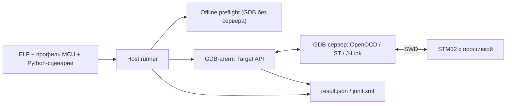

# ТЕХНИЧЕСКОЕ ЗАДАНИЕ

## stm32-gdbtest — реализация DDTT для STM32: проверки работающей прошивки на реальной плате через GDB-Python и SWD-отладчик сценариями в репозитории проекта (Windows, Linux)

| Реквизит | Значение |
| :--- | :--- |
| **Документ** | TECHNICAL_SPECIFICATION.md |
| **Ревизия** | 0.94 (к выпуску v0.4.0) |
| **Дата формирования** | 10.10.2026 |
| **Метод формирования** | Обратная разработка по исходному коду `main` @ `a371d80` (ядро совпадает с `b76d909` от 25.09.2026, закреплённым в стендовом проекте), host-тестам `tests/host`, примеру `examples/minimal-consumer` и документации `docs/`. Назначение и практика применения — по проекту stm32-hwtest-blackpill (`main` @ `060d8e4`) |
| **Целевая версия** | Кандидат v0.4.0; пакет stm32-gdbtest `0.4.0`, API_VERSION=2, ТЗ API 0.3.16 (р.0.90). Публикация после итоговой приёмки. |
| **Целевая платформа** | Хост Windows или Linux `(р.0.8)`; Python ≥ 3.11; ARM GCC с GDB-Python (проверены xPack 13.3.1-1.1, GDB 14.2.90, встроенный Python 3.11.4); CMake ≥ 3.25, Ninja; GDB-серверы OpenOCD 0.12.0, ST-LINK GDB Server 7.14.0 (CubeCLT 1.22.0), SEGGER J-Link GDB Server 8.32; MCU STM32 Cortex-M0/M3/M4 по профилю потребителя. Аппаратный запуск — Windows и Linux x86_64/aarch64 с glibc ≥ 2.31 (в том числе Ubuntu 20.04 на Orange Pi 5) `(р.0.7)`; сборка, manifest и подготовка — Windows и Linux. CI — GitHub Actions и Docker-образ `ci/docker` (Ubuntu 24.04, xPack GCC 13.3.1-1.1, 14.2.1-1.1, 15.2.1-1.1, CMake 3.28.3, Ninja 1.12.1) `(р.0.3)` |
| **Связанные документы** | README.md, README.en.md; AGENTS.md; `docs/ru/*.md` и `docs/en/*.md`: index, API, BACKENDS, CONTRACTS, DDTT, DEBUGGER_OWNERSHIP, GETTING_STARTED, HAL_MACRO_GUIDE, HOWTO, IMAGES, LINUX_STAND, MANIFESTS, STATUS, TARGET_IDENTITY, TEST_AUTHORING, VERSIONING, maintenance, testing `(р.0.10)`; TODO.md; CHANGELOG.md, CHANGELOG.en.md; SOURCE.md; stm32-hwtest-blackpill: docs/HWTEST_ARCHITECTURE_V2.md, STATUS.md, PERIPHERAL_PLAN.md, F429_SERVER_STABILITY.md; stm32-cmake-yml: README.md (профили сборки) |
| **Связанные файлы кода** | `stm32_gdbtest/*.py` (24 модуля `(р.0.12)`, `(р.0.9)`), `stm32_gdbtest/cmake/STM32GDBTest.cmake`, `tests/host/*.py`, `examples/minimal-consumer/*`; `tests/firmware/*`, `ci/*`, `.github/workflows/*` `(р.0.3)`; `tools/linux_stand.py`, `tools/linux-stand.lock.json` `(р.0.7)` |

### История ревизий

| Ревизия | Дата | Описание |
| :---: | :---: | :--- |
| 0.1 | 28.09.2026 | Первая редакция. Требования восстановлены по коду `main` @ `a371d80`, host-тестам (65) и документации модуля; назначение и границы уточнены по стендовому проекту stm32-hwtest-blackpill. Тест-кейсы привязаны к существующим host-тестам и аппаратным проверкам. Зафиксированы расхождения документации и кода, открытые вопросы по CI и сопроводительной документации. |
| 0.2 | 28.09.2026 | Учтены решения владельца о порядке сопровождения: ветки `<агент>/<задача>` для нескольких агентов, слияние обычным `git merge` без PR, подписанные коммиты Conventional Commits без ссылок на сессии, документация на русском и английском (`docs/ru`, `docs/en`), ТЗ только на русском. Порядок работы вынесен в docs/ru/maintenance.md и docs/en/maintenance.md. Закрыт вопрос 11.2.12; по 11.2.2 решена часть о языках и расположении документов. |
| 0.3 | 28.09.2026 | Подготовка к 0.1.0 по решениям владельца: CI на GitHub Actions с Docker-образом без stm32-cmake-yml; offline-часть модуля (сборка, build manifest, контракты, подготовка образа) переносима на Linux, аппаратный запуск остаётся на Windows; новая команда `run --prepare-only` и CTest-тесты `prepare.<ID>`; CI-прошивки F030R8, F103C8, F411CE на CMSIS, матрица GCC 13.3.1/14.2.1/15.2.1 × CMake 3.28.3. Файлы CI хранятся с LF. Закрыты вопросы 11.2.1, 11.2.3, 11.2.10, 11.2.11; добавлены 11.2.16, 11.2.17. |
| 0.4 | 28.09.2026 | Аппаратная проверка CI-прошивок перед 0.1.0 по решению владельца: сценарий `tests/firmware/run_hw.py`, 4 стенда (F030R8 / NUCLEO-F030R8 / J-Link STLink (J-Link GDB Server 8.32), F103C8 / WeAct BluePill-Plus / J-Link CE (8.32), F411CE / WeAct BlackPill / ST-Link V2J43M28 через OpenOCD 0.12.0 и ST-LINK GDB Server 7.14.0) — по 10/10 шагов на коммите `fbc103d`. Первый прогон F030R8 выявил невыровненный адрес загрузки `.data` (HardFault на Cortex-M0); исправлено, CI проверяет выравнивание. Добавлены стиль `.clang-format` и уровень CI format. |
| 0.5 | 28.09.2026 | Решён вопрос 11.2.17: BIN формируется только из выбранных секций загрузки (`objcopy -j`), пустая секция с LMA в RAM больше не раздувает его до сотен мегабайт. Добавлены host-тест и регрессия CI на реальном ELF с пустой секцией в RAM. |
| 0.6 | 28.09.2026 | Документация сверена с текущим функционалом и перенесена в `docs/ru/` с английскими версиями в `docs/en/`, добавлены README.en.md и карты документации. Закрыт вопрос 11.2.2: определены роли ТЗ, README, STATUS, CHANGELOG, TODO и страниц механизмов. Уточнён вопрос 11.2.6: F429ZI отражён в STATUS. |
| 0.7 | 28.09.2026 | По решению владельца все сценарии размещения стенда реализуются до v0.1.0; ревизия покрывает группы A и B. Аппаратный запуск на Linux (x86_64, aarch64, glibc ≥ 2.31): блокировка отладчика через `flock` в общем каталоге хоста с признаком брошенного владения, завершение группы процессов сервера и GDB, имена серверов без `.exe`. Окружение стенда без root для Ubuntu 20.04 (Orange Pi 5): `tools/linux_stand.py` с Python 3.11 (python-build-standalone) и версиями инструментов CI. Команда `doctor`. CI-задание в контейнере Ubuntu 20.04 для x86_64 и aarch64. Добавлены вопросы 11.2.18–11.2.21; удалённый GDB-сервер по SSH и перенос подготовленного запуска — следующая ревизия. |
| 0.8 | 28.09.2026 | Первая аппаратная проверка на Orange Pi 5 (Ubuntu 20.04 aarch64): F411CE/ST-Link/OpenOCD и F103C8/J-Link CE — 10/10 шагов; F030R8 с J-Link STLink (перепрошитый встроенный ST-Link Nucleo) без графического сеанса ждёт около 10 с неподтверждённое окно условий использования и не укладывается в предел готовности сервера; после подтверждения окна — 10/10 (J-Link 9.80). Добавлены параметр стенда `startup_timeout_s` и п. 6.10.7; имена серверов по умолчанию в п. 3.4.7, 3.4.8 приведены к п. 6.10.3. |
| 0.9 | 28.09.2026 | Группа C: удалённый GDB-сервер. Runner и GDB работают на Windows или в WSL, GDB-сервер и отладчик — на хосте стенда (Orange Pi 5); стенд получает таблицу `[remote]`, сервер запускается одной SSH-сессией с пробросом порта и вспомогательным скриптом на хосте стенда, который берёт ту же блокировку `flock`, что и локальные запуски, и останавливает сервер при закрытии сессии. Только ключевая аутентификация и известный ключ хоста. Порядок слияния перемоткой (п. 7.7.7) — временный до первого релиза. Вопрос 11.2.18 закрыт: с Windows через SSH на Orange Pi 5 все три стенда прошли 10/10 (TC-103); обрыв сессии проверен на петле SSH. |
| 0.10 | 28.09.2026 | Определение проекта по решению владельца: реализация метода DDTT (спецификация docs/ru/DDTT.md 0.1) для STM32 — проверки работающей прошивки на реальной плате сценариями в репозитории проекта для агентной и ручной разработки. Заголовок, назначение и контекст приведены к определению; добавлены термины «контур проверки», «хост стенда», «схема размещения стенда». Документация сверена с текущим функционалом (Linux, удалённый сервер). Вопрос 11.2.22 закрыт. |
| 0.11 | 28.09.2026 | Название метода уточнено по решению владельца: Debugger-Driven Testing on Target (DDTT, спецификация 0.2); «тестирование через отладчик» — общее понятие, DDTT — его вариант для отдельного целевого устройства. |
| 0.12 | 28.09.2026 | Группа D: пакеты подготовленного запуска (`pack`, `run --package`) — сборка и подготовка в одном месте, запуск на стенде в другом; workflow Hardware с запуском только вручную: сборка на GitHub, запуск пакетов на self-hosted раннере со стендом; прогоны в цикле `run_hw.py --repeat`. Вопрос 11.2.16 закрыт решением. Пакеты трёх стендов, собранные на Windows, прошли на Orange Pi 5 по 10/10 (TC-107); прогон в цикле с прерыванием проверен (TC-109); workflow Hardware ожидает установки раннера (TC-108). |
| 0.13 | 28.09.2026 | Удалённый сервер: сигнал присутствия runner в SSH-сессии. Обрыв связи без закрытия соединения (Wi-Fi, кабель, сон компьютера запуска) останавливает сервер на хосте стенда и снимает блокировку через 15 с, а не когда TCP сдастся через часы. TC-108 выполнен: workflow Hardware на раннере-службе Orange Pi 5 — три стенда × 10/10. |
| 0.14 | 28.09.2026 | Закрыт вопрос 11.2.21: контейнер `ubuntu:20.04` задания `linux-stand` закреплён по digest мультиархитектурного индекса. |
| 0.15 | 28.09.2026 | Закрыт вопрос 11.2.20 решением владельца: WSL2 (Ubuntu 20.04 x86_64) проверен как компьютер запуска с сервером на Orange Pi 5 — три стенда × 10/10 (TC-112); проброс отладчика через usbipd-win отнесён к техническому долгу — на компьютере владельца он конфликтует с фильтрами USB других программ. Отдельный Linux-ПК x86_64 не проверялся. |
| 0.16 | 29.09.2026 | Подключение потребителя с Arduino Core STM32 (HAL и CMSIS не из пакета `STM32Cube_FW_*`) показало, что пустой `cube_packages` отклонял manifest. Описательные списки `cube_packages` и `library_versions` могут быть пустыми; `compilers`, `units`, `inputs` — нет. |
| 0.17 | 29.09.2026 | Проверено подключение настоящего потребителя перед выпуском: проект на STM32G474 с Arduino Core STM32 и stm32-cmake-yml, runner на Windows, сервер на Orange Pi 5 — `prepare` и `hw` сценария загрузки PASS (TC-114). |
| 0.18 | 29.09.2026 | У потребителя с LTO GDB 15 назвал кадр по символу ELF — `HmiManager::init() [clone .constprop.0]`, и `reach` дал FAIL при верной остановке. Имя кадра сравнивается без суффиксов `[clone …]`, квалификаторов и списка параметров. |
| 0.19 | 29.09.2026 | Прошивка потребителя собирается для двух MCU (STM32G474 и STM32G431) с одной логикой. Параметр `PROFILE` функции `stm32_gdbtest_attach` задаёт описание MCU отдельным файлом, а сценарии, требования и контракты остаются общими в `PROFILE_DIR/Tests`; реестр контрактов ищется рядом со сценариями, пакет берёт `Tests` оттуда же. |
| 0.20 | 29.09.2026 | По замечаниям потребителя: локальные пути файла стенда раскрывают `~`, `%VAR%` и `$VAR`/`${VAR}` на любой ОС (например, `%USERPROFILE%/.ssh/key` вместо личного абсолютного пути); каталог сценариев может называться `Tests` или `tests`. |
| 0.21 | 29.09.2026 | Редакция к выпуску 0.1.0-rc.1: версия модуля `0.1.0rc1`; требования и тест-кейсы не менялись. |
| 0.22 | 29.09.2026 | После выпуска 0.1.0-rc.1: открыт вопрос 11.2.23 о независимости от системы сборки — стабильная схема `session.json` с командой её создания и необязательный build manifest; допущение 11.1.4 ссылается на вопрос. Требования и тест-кейсы не менялись. |
| 0.23 | 29.09.2026 | J-Link: соответствие `STM32F103CBT6` → `STM32F103CB` для демонстрационного проекта на WeAct BluePill-Plus (F103CB); TC-33 дополнен. |
| 0.24 | 29.09.2026 | Build manifest с CMake 3.25: в `compile_commands.json` нет ключа `output` (он появился в CMake 3.26), объектный файл берётся из аргумента `-o` команды компилятора — заявленный минимум CMake 3.25 выполняется. Найдено при сборке демонстрационного проекта на CMake 3.25.0; TC-118. |
| 0.25 | 29.09.2026 | Контракт `macros` проверяет тип раскрытия (`whatis`, без чтения памяти): тип, отсутствующий в отладочной информации, даёт ERROR в preflight, а не в сценарии (найдено демонстрационным проектом: `DBGMCU_TypeDef`). Соответствие J-Link `STM32F103CBT6` → `STM32F103CB` проверено на WeAct BluePill-Plus: пять HIL-сценариев PASS. TC-119. |
| 0.26 | 30.09.2026 | Контракт `macros` в C++: тип определяется по тексту раскрытия, а не по имени макроса — без кадра GDB разбирает выражение в области макросов младшего адреса единицы компиляции, а там может быть код из заголовка, подключённого до заголовка устройства (`etl/optional.h` до `main.h`); макрос командной строки компилятора (`-DNAME=value` в `info macro`) считается определённым. Найдено при подключении закрытого потребителя (C++, FreeRTOS). TC-119 дополнен. |

| 0.27 | 30.09.2026 | План CMSIS-миграции примеров и инвентаризация F030 (G.4); корневой каталог Tests переименован в tests. API, схемы и состав сценариев не меняются; регистр Tests/tests каталогов потребителя по-прежнему поддерживается. |

| 0.28 | 30.09.2026 | Первый этап CMSIS F030: загрузка, HSI/SysTick, GPIO и blink; четыре сценария через CLI и prepare в CI. API ядра не меняется. TC-120. |

| 0.29 | 30.09.2026 | CMSIS F030 TIM3/IRQ: конфигурация, вектор, эффект обработчика и возврат в thread mode; TC-121. |

| 0.30 | 30.09.2026 | CMSIS F030 ADC/DMA: raw-публикация, ограниченные ожидания, missing-IRQ timeout; TC-122. |

| 0.31 | 30.09.2026 | CMSIS F030: VDDA/температура, численные и невалидные векторы; libgcc для F030, TC-123. |

| 0.32 | 30.09.2026 | F030 Sleep/WFI: SysTick/TIM3, interrupted PC через GDB unwind; TC-124, без изменения firmware/API. |

| 0.33 | 30.09.2026 | F030 CMSIS RTC Alarm A/LSI, EXTI17/IRQ и ограниченные ожидания; TC-125. |

| 0.34 | 30.09.2026 | Занятый ADC F030: CONT/ADSTART injection и проверка error6; TC-126. |

| 0.35 | 30.09.2026 | F030 RTC deadline: GDB-инъекция mask, TC-127; ограничение macro context. |

| 0.36 | 30.09.2026 | Итоговая сверка HAL→CMSIS F030 и пакет веток; G.13. Нормативные требования и тест-кейсы не изменены. |

| 0.37 | 30.09.2026 | Lowercase tests в собственных профилях/пакетах; remote.toml и ignore; TC-128 сохраняет старые пакеты. |

| 0.38 | 01.10.2026 | Автономный HAL fixture F030: 17 сценариев, provenance и импорты, TC-129. Границы форматирования импортированного кода. |

| 0.39 | 01.10.2026 | HAL F030 включён в offline CI отдельным уровнем hal на GCC13: точный inventory/JUnit/JSON, положительный и пять отрицательных контрактов, TC-130. |

| 0.40 | 01.10.2026 | Ручная HW-приёмка HAL F030 через CLI с обязательным восстановлением: 17 сценариев, повторы, timeout/recovery; TC-131. |

| 0.41 | 01.10.2026 | Согласован состав rc.2 и порядок проверки описания тега; актуализирован порядок веток для одного владельца с агентами. Runtime и версия не меняются. |

| 0.42 | 01.10.2026 | Выпускная ветка rc.2: версия Python 0.1.0rc2, API_VERSION=1; черновик описания выпуска и явные незавершённые критерии приёмки. |

| 0.43 | 01.10.2026 | F030: SCB ICSR вместо имени регистра GDB для номера исключения; ошибка приёмки rc.2. |

| 0.44 | 01.10.2026 | Повторное открытие пакета сохраняет отчёты; отдельные исходники каждого запуска, TC-133. |

| 0.45 | 01.10.2026 | Итоговая аппаратная и интеграционная проверка rc.2; ограничение USB ST server и оставшиеся условия публикации. |

| 0.46 | 01.10.2026 | F103 CMSIS: clocks/GPIO/SysTick/TIM2 одной группой, TC-134; rc.2 опубликован, следующие изменения вне тега. |

| 0.47 | 01.10.2026 | F103 ADC/DMA/физические единицы/отказы одной группой, TC-135; API без изменений. |

| 0.48 | 01.10.2026 | F103 RTC/Sleep/deadlines/recovery одной группой; TC-136, API без изменений. |

| 0.49 | 01.10.2026 | F411 CMSIS clocks/GPIO/SysTick/TIM2, TC-137; API без изменений. |

| 0.50 | 01.10.2026 | F411 ADC/DMA/units/failures, TC-138; API без изменений. |

| 0.51 | 01.10.2026 | F411 RTC/Sleep/deadlines/recovery, TC-139; API без изменений. |

| 0.52 | 01.10.2026 | F401 CMSIS baseline: clocks/GPIO/SysTick/TIM2, профиль 256/64 КиБ, TC-140. API без изменений. |

| 0.53 | 01.10.2026 | F401 ADC1 CH16/17, DMA2 stream0, factory units и отказы; TC-141. Общая арифметика F401/F411, API без изменений. |

| 0.54 | 01.10.2026 | F401 RTC/Sleep/deadline/recovery, общий RTC F401/F411; TC-142. API без изменений. |

| 0.55 | 01.10.2026 | F429 CMSIS baseline: startup/clocks/GPIO/TIM2/SysTick, пятый профиль CI, TC-143. API без изменений. |

| 0.56 | 01.10.2026 | F429 ADC/DMA/units/failures и явная проверка SRAM вместо CCM; TC-144. API без изменений. |

| 0.57 | 01.10.2026 | F429 RTC/Sleep/deadline/recovery, общий RTC F4; TC-145. API без изменений. |

| 0.58 | 01.10.2026 | HAL F030: пять GPIO/RCC techniques, source review и расширение до 22 cases; TC-146. |

| 0.59 | 03.10.2026 | Выделен текущий контракт API в отдельное ТЗ 0.1.0; прежние номера делегируют требования, поведение ядра не меняется. |
| 0.60 | 03.10.2026 | Приняты требования первого пакета и ТЗ API 0.2.0; session.toml, выбор/захват/перенос конфигурации и совместимость. Ядро прежнее; численные пределы и разрешение интеграции открыты. |
| 0.61 | 03.10.2026 | Ссылка первого пакета обновлена до ТЗ API 0.2.1: ограничения и импорт согласованы, интеграция не разрешена. |

| 0.62 | 03.10.2026 | Разрешён перенос первого пакета; Target, SESSION_CONFIG и снимок конфигурации интегрированы, host/offline и три аппаратные пары проверены. ТЗ API 0.2.2, рабочая версия 0.2.0.dev0; без выпуска. |

| 0.63 | 03.10.2026 | Миграция штатных сценариев: таблицы и record/config; 103 CMSIS, 22 HAL, один пример на пяти платах. TC-152; ТЗ API 0.2.2 без изменений. |

| 0.64 | 03.10.2026 | Согласован кандидат v0.2.0-rc.1, Python 0.2.0rc1; независимые версии API сохранены. Приёмка и миграция выделены в RC020_READINESS. |

| 0.65 | 04.10.2026 | Исследования оставлены локально; публичные принятые результаты и контроль ссылок по .gitignore. Уровни L0–L6, TC-153/154; ТЗ API 0.2.3 без изменения поведения. |

| 0.66 | 04.10.2026 | Практический порядок L0/L6: воспроизводимое окружение, снимок, offline-запуск, отрицательные исходы и восстановление; руководство RU/EN, TC-155/156. API без изменений. |

| 0.67 | 04.10.2026 | Справочник методов RU/EN с версиями поддержки; ТЗ API 0.2.4 исправляет текст force_return без изменения кода. TC-157. |

| 0.68 | 05.10.2026 | Решение владельца 05.10.2026: порт сервера на хосте стенда берётся из 61000–64999, выше эфемерного диапазона Linux; при отказе «порт занят» runner повторяет запуск с другим портом до трёх раз. Найдено прогоном схемы 3 сразу после схемы 2 на Orange Pi 5. TC-158. |

| 0.69 | 06.10.2026 | К выпуску 0.3.0: целевая версия v0.3.0, ТЗ API 0.3.7; приложения B и F приведены к приёмке пакета на пяти платах по шести схемам запуска. Требования не меняются. |
| 0.70 | 07.10.2026 | Переносимость без изменения поведения: binutils с префиксом выбранного GDB, формат ELF-носителя полного образа из ELF прошивки, необязательные ключи стенда `interface`/`transport` (OpenOCD) и `interface` (J-Link), ключ профиля `jlink_device`, `monitor reset init`, семейство зонда в блокировке, адаптер архитектуры для ловушек отказов и диагностики, поле `arch` отчёта. |
| 0.71 | 07.10.2026 | Профиль `at32f403a` проверочной прошивки (Cortex-M-совместимый МК Artery, CMSIS производителя из закреплённого архива). Удалённые стенды называются `<профиль>-<backend>.remote.toml`; Git исключает `*.local.toml` и `*.remote.toml`. |
| 0.72 | 09.10.2026 | Opt-in захват журнала, command_code, отдельный инфраструктурный testcase JUnit. §5.21. |
| 0.73 | 09.10.2026 | Внешние команды results export/verify; разделение произвольных записей, проекций и свидетельств; пределы и публикация. §5.22, TC-160. |
| 0.74 | 09.10.2026 | Сводка results report: JSON/HTML, темы, отдельные исходы и целостность. §5.23, TC-161. |

| 0.75 | 09.10.2026 | Переключатели темы и обычного/экспертного представления отчёта. §5.23.4, TC-161. |
| 0.76 | 09.10.2026 | SKIP: код77, JUnit/CTest, сохранение records, политика групп. |
| 0.77 | 09.10.2026 | Подготовка выпуска v0.4.0: версия Python 0.4.0, API_VERSION=2 после удаления прежних имён, связанные ревизии ТЗ и границы итоговой приёмки. Контракт SKIP и форматы артефактов не меняются. |
| 0.78 | 09.10.2026 | После аппаратного отказа AT32 при конфигурации: run_hw.py прекращает шаги и повторы при неуспешной сборке, чтобы не использовать старый session.json для прошивки. TC-163 и памятка. |
| 0.79 | 09.10.2026 | Профиль цели schema 2: диалект GDB-сервера перенесён из верхнего уровня профиля в секции `[openocd]`, `[jlink]`, `[stlink]`, команда сброса разрешается один раз при подготовке прогона, из `api.toml` удалён ключ `reset.command`. Встроенный диалект ST-LINK — `monitor reset` по руководству ST DM00613038, команда `monitor reset halt` этому серверу не принадлежит. Схема 1 читается для уже поставленных профилей. |
| 0.80 | 10.10.2026 | Открыт вопрос 11.2.26: локальный CI и аппаратные прогоны делят дерево сборки, поэтому одновременный запуск переписывает результаты; наблюдение при приёмке схемы 2. Требования не менялись. |
| 0.81 | 10.10.2026 | Исправлена совместимость reset и provenance; изолированы CI/HW артефакты каждой попытки и добавлена сводка Hardware по профилям. TC-164/165. |
| 0.82 | 10.10.2026 | Исправлены относительный путь модуля в CTest примера и сохранение частичного вывода CI при тайм-ауте; уточнена диагностика verify-only. TC-166/167. Зафиксированы результаты повторной аппаратной проверки и открытый USB-сбой F411. |
| 0.83 | 10.10.2026 | Сравнены GDB 14.2.90/15.2.90/16.3.90 на одном F411/ELF и ST-LINK GDB Server 7.14.0: USB ERROR повторился. Вопрос 11.2.27 открыт; последнее восстановление OpenOCD 2/2 PASS. Нормативное API не менялось. |
| 0.84 | 10.10.2026 | USB-сбой ST-LINK GDB Server 7.14.0 воспроизведён на Nucleo-F030R8 с другим отладчиком: жизненный цикл 10/10, полный набор прерван. После переподключения OpenOCD BOOT/GPIO 2/2. Вопрос 11.2.27 расширен, причина не установлена. |
| 0.85 | 10.10.2026 | Backend st-util: отдельная секция schema 2, команды reset/resume, общая блокировка ST-Link, doctor и SSH. Учтена неполная карта памяти сервера; identity и проверки образа сохранены. TC-168. |

| 0.86 | 10.10.2026 | Фактический код завершения удалённого сервера после cleanup; сохранение исходного статуса при ERROR завершения. TC-169. |

| 0.87 | 10.10.2026 | Ожидание st-util Listening перед recovery и cleanup; локальное наблюдение helper при потере SSH. TC-170. |

| 0.88 | 10.10.2026 | Учтено многоточие реального st-util после Listening; отказ на F030 сохранён, регрессия TC-170 дополнена. |

| 0.89 | 10.10.2026 | Редакционная сверка кандидата: приложения B/F отражают schema 2, потребителя и полные SSH/st-util наборы; ограничения отделены от принятого. Контракты, TC и матрица требований не изменены. |

| 0.90 | 10.10.2026 | Уточнён термин версии пакета stm32-gdbtest, отличный от версии интерпретатора Python. Историческое сокращение пояснено; контракты и проверки не меняются. |
| 0.91 | 10.10.2026 | Hardware CI: выбранный набор API 0.4.0 с проверкой PASS/SKIP и сохранением записей и отчётов; Target API не меняется. |
| 0.92 | 10.10.2026 | Внешний stand_loop: конечный план пакетов, независимые исходы, остановка и артефакты для анализа агентом; TC-171. Target API не меняется. |

| 0.93 | 10.10.2026 | К выпуску v0.4.0: владелец принял ограничение полных F411/F030/ST-LINK GDB Server; USB ERROR остаётся долгом, выпуск опирается на проверенные конфигурации OpenOCD/st-util. API, TC и матрица требований не меняются. |

| 0.94 | 10.10.2026 | Hardware CI: шестой профиль AT32, presets и закреплённый SDK на prepare; регрессия doctor/FAIL для обоих наборов. API не меняется. |

### Изменения ревизии 0.94

Изменённые пункты помечены `(р.0.94)`.

| Пункты | Тип | Суть |
| :--- | :--- | :--- |
| 8.21 | изм. | AT32 в обоих заданиях, SDK по SHA256, локальный профиль J-Link |


### Изменения ревизии 0.93

Изменённые пункты помечены `(р.0.93)`.

| Пункты | Тип | Суть |
| :--- | :--- | :--- |
| 11.2.27 | изм. | Согласована граница выпуска; неисправность не объявляется устранённой |
| Приложения B, F | изм. | Отделены принятый выпуск с ограничением и открытый технический долг |

### Изменения ревизии 0.92

Изменённые пункты помечены `(р.0.92)`.

| Пункты | Тип | Суть |
| :--- | :--- | :--- |
| 5.25.1–5.25.5 | нов. | План циклов, неизменные входы, запреты продолжения, STOP и review |
| 9.2, 10.2 | нов. | TC-171: последовательность, ошибки свидетельств и частичные циклы |
| Приложения B, F | изм. | Проверенный объём внешнего инструмента и оставшиеся ограничения автономности |

### Изменения ревизии 0.91

Изменённые пункты помечены `(р.0.91)`.

| Пункты | Тип | Суть |
| :--- | :--- | :--- |
| 8.21 | изм. | Выбор lifecycle/api040, неизменяемые пакеты вариантов SKIP, сохранение артефактов и проверка исходов |

### Изменения ревизии 0.90

Изменённые пункты помечены `(р.0.90)`.

| Пункты | Тип | Суть |
| :--- | :--- | :--- |
| Реквизиты, приложения | изм. | Версия пакета, версия совместимости API и ревизии документов различаются явно |

В прежних записях «Python 0.x» и «версия Python 0.x» означают версию пакета
stm32-gdbtest (`__version__`), а не интерпретатора. История ревизий сохранена.

### Изменения ревизии 0.89

Изменённые пункты помечены `(р.0.89)`.

| Пункты | Тип | Суть |
| :--- | :--- | :--- |
| Приложения B, F | изм. | Свидетельства кандидата и непроверенные границы; прежние результаты не объявляются CI итогового SHA |

### Изменения ревизии 0.88

Изменённые пункты помечены `(р.0.88)`.

| Пункт | Вид | Изменение |
| --- | --- | --- |
| 5.18.10 | изм. | Полная строка Listening допускает завершающее многоточие st-util |
| 9.2, 10.2 | изм. | TC-170: фактический формат строки сервера |

### Изменения ревизии 0.87

Изменённые и новые пункты помечены `(р.0.87)`.

| Пункт | Вид | Изменение |
| --- | --- | --- |
| 5.18.10 | нов. | Readiness и idle st-util, ограниченные ожидания, отказ SSH |
| 9.2, 10.2 | изм. | TC-170: события и реальные Linux процессы без USB |

### Изменения ревизии 0.86

Изменённые и новые пункты помечены `(р.0.86)`.

| Пункт | Вид | Изменение |
| --- | --- | --- |
| 5.18.9 | нов. | Фактический exit после cleanup и исходный статус |
| 9.2, 10.2 | изм. | TC-169: реальные процессы и интеграция runner |

### Изменения ревизии 0.85

Изменённые и новые пункты помечены `(р.0.85)`.

| Пункт | Вид | Изменение |
| --- | --- | --- |
| 3.3.1, 3.3.7, 3.4.1, 6.10.3 | изм. | Новый backend и секция st-util без изменения номера schema 2 |
| 6.11.1–6.11.4 | нов. | Диалект, настройка GDB, общая блокировка и диагностика st-util |
| 9.2, 10.3 | изм. | TC-168: валидация, команды, SSH, блокировка и runtime metadata |

### Изменения ревизии 0.84

Изменённые пункты помечены `(р.0.84)`.

| Пункт | Вид | Изменение |
| --- | --- | --- |
| 11.2.27 | изм. | Тот же USB ERROR на F030 с V2J45M31: симптом не ограничен отладчиком F411; подробности в docs/ru/API_ACCEPTANCE.md |

### Изменения ревизии 0.83

Изменённые пункты помечены `(р.0.83)`.

| Пункт | Вид | Изменение |
| --- | --- | --- |
| 11.2.27 | изм. | Проверены три GDB; смена клиента не устранила USB-сбой. Подробности — docs/ru/API_ACCEPTANCE.md |

### Изменения ревизии 0.82

Изменённые пункты помечены `(р.0.82)`.

| Пункт | Вид | Изменение |
| --- | --- | --- |
| 6.8.6 | нов. | Минимальный пример передаёт абсолютный путь подмодуля в CTest |
| 8.16 | изм. | При тайм-ауте команды сохраняется её частичный вывод |
| 9.2, 10.3 | изм. | TC-166 проверяет Configure/Generate с относительным путём; TC-167 — журнал тайм-аута |
| 11.2.27 | нов. | Полная серия F411/ST-LINK GDB Server остаётся непринятой из-за USB-сбоев |

### Изменения ревизии 0.81

Изменённые пункты помечены `(р.0.81)`.

| Пункт | Вид | Изменение |
| --- | --- | --- |
| 3.3.8 | изм. | Совместимость schema 1 ограничена OpenOCD; override проверяется до сервера и не меняет recovery |
| 8.16, 11.2.26 | изм. | CI и аппаратные попытки сохраняют собственные каталоги; сводка Hardware называет отказавший профиль |
| 9.2, 10.3 | изм. | TC-164 уточнён, TC-165 проверяет сохранность артефактов и накопление статуса CI |

Проверка журнала GitHub Hardware 38008347735: F429ZI прошёл 10/10; общий отказ вызван
DEV_ID mismatch в strict-проверке F103C8. Не является отказом F429ZI или основанием ослабить identity.
Полная повторная приёмка исправленного кода выполняется отдельно. (р.0.81)

### Изменения ревизии 0.80

| Пункт | Вид | Изменение |
| --- | --- | --- |
| 11.2.26 | нов. | Открытый вопрос о каталогах сборки, результатах и артефактах: уровни `firmware` и `hal` локального CI удаляют каталоги аппаратных прогонов вместе со сводками |

Наблюдение сделано при приёмке схемы 2 профиля (р.0.79): аппаратная матрица шести стендов сохранилась
только в логах, потому что параллельно шёл локальный CI. Требования 8.11–8.17 не менялись; вопрос
касается организации запуска и артефактов. (р.0.80)

### Изменения ревизии 0.79

| Пункт | Вид | Изменение |
| --- | --- | --- |
| 3.3.1 | изм. | Профиль schema 1 хранит `reset_halt`/`reset_run` на верхнем уровне; профиль schema 2 переносит их в секции GDB-серверов, а старые ключи отклоняет |
| 3.3.7, 3.3.8 | изм., нов. | Диалект каждого сервера в секции, встроенные значения OpenOCD `monitor reset halt`/`monitor reset run`, ST-LINK и J-Link `monitor reset`; разрешение команды: сессия, секция профиля, встроенный диалект |
| 6.3.2, 6.4.2, 6.5.3 | изм. | Команды сброса и завершения берутся из диалекта backend'а; `api.toml [reset] command` больше не используется, действующее значение публикуется сценарию как `stand.reset_command` |
| 9.2, 10.3 | изм. | TC-164: выбор секции по backend, запрет `reset_run` вне OpenOCD, отказ неизвестных ключей и секций |

Основание ST-LINK: руководство ST DM00613038 (раздел «Monitor commands») перечисляет `monitor reset`, `monitor reset core`,
`monitor reset hardware`; команда `monitor reset halt` не поддерживается и отвергается сервером с
`Protocol error with Rcmd`. Проверено на F411CE/ST-LINK GDB Server (р.0.79).

### Изменения ревизии 0.78

| Пункт | Вид | Изменение |
| --- | --- | --- |
| 8.22 | изм. | Отказ шага build завершает текущую и повторную итерации до подготовки или доступа к MCU |
| 9.2, 10.3 | изм. | TC-163 проверяет отсутствие запуска сценариев при сохранившемся старом session.json |

Исходный отказ AT32 сохранён; после исправления пути SDK весь цикл и suite повторены на свежем ELF. (р.0.78)

### Изменения ревизии 0.77

| Пункт | Вид | Изменение |
| --- | --- | --- |
| Реквизиты, приложение A | изм. | Целевая версия Python 0.4.0, API_VERSION=2, ТЗ API 0.3.12 |
| Приложения B/F | изм. | Историческая приёмка 0.3.0 отделена от ещё не завершённой матрицы v0.4.0 |

Новые результаты на железе не заявляются до проверки итогового SHA. (р.0.77)

### Изменения ревизии 0.76

Runner/agent/CLI поддерживают код77 для SKIP; CTest использует SKIP_RETURN_CODE=77.
JSON сохраняет skip_reason, JUnit — skipped/message. Индекс/экспорт должны принимать77;
старые отчёты остаются читаемыми. Код отчётной команды не является итогом приёмки сценариев.
Capture ERROR оставляет статус сценария, код команды2; teardown ERROR сохраняет причину SKIP.
run_hw по умолчанию не принимает пропуски, --allow-skip задаёт разрешённые ID; skipped отделён
от passed, группа только SKIP отмечается nothing_tested. Пустая группа не принимается.
Подготовка/прошивка до сценария не отменяются SKIP. (р.0.76)


### Изменения ревизии 0.75

| Пункт | Вид | Изменение |
| --- | --- | --- |
| 5.23.4 | изм. | Управление видом без изменения данных; полный вид без JavaScript |

### Изменения ревизии 0.74

| Пункт | Тип | Суть |
| --- | --- | --- |
| 5.23.1–5.23.4 | доб. | Автономная сводка, независимые исходы, согласованность экспорта и темы |
| 9.2, 10.3 | доб. | TC-161 и прослеживаемость |

### Изменения ревизии 0.73

| Пункт | Тип | Суть |
| --- | --- | --- |
| 5.22.1–5.22.6 | доб. | Общий журнал, явные проекции, индекс/verify, пределы и публикация |
| 9.2, 10.3 | доб. | TC-160 и прослеживаемость host-проверок |

### Изменения ревизии 0.72

| Пункт | Изменение | Содержание |
| --- | --- | --- |
| 5.21.1–5.21.4 | доб. | Захват журнала, итог команды и инфраструктурная диагностика |

### Изменения ревизии 0.71

Изменённые пункты помечены `(р.0.71)`.

| Пункты | Тип | Суть |
| :--- | :---: | :--- |
| 3.4.9, 8.31 | изм. | Локальные стенды `*.local.toml`, удалённые `<профиль>-<backend>.remote.toml`; оба шаблона исключены из Git |

### Изменения ревизии 0.70

Изменённые пункты помечены `(р.0.70)`. Значения по умолчанию воспроизводят прежнее поведение для стендов и профилей STM32.

| Пункты | Тип | Суть |
| :--- | :---: | :--- |
| 3.3.7 | изм. | Для OpenOCD допускается `reset_halt = monitor reset init`; ключ `jlink_device` |
| 3.4.2 | изм. | Ключи стенда `interface`, `transport` (OpenOCD) и `interface` (J-Link) |
| 4.1.1, 6.2.1, 5.17.1 | изм. | binutils и проверка `doctor` — с префиксом выбранного GDB и интерфейсом стенда |
| 5.10.1 | изм. | Ловушки отказов и диагностика — через адаптер архитектуры по формату ELF; поле `arch` отчёта |
| 6.3.1, 6.5.2 | изм. | Интерфейс и транспорт в командах OpenOCD и J-Link |

### Изменения ревизии 0.69

Изменённые пункты помечены `(р.0.69)`. Ревизия к выпуску 0.3.0, требования не меняются.

| Пункты | Тип | Суть |
| :--- | :---: | :--- |
| Реквизиты | изм. | Целевая версия v0.3.0, Python 0.3.0, ТЗ API 0.3.7 |
| Приложение A | изм. | `__version__` 0.3.0, цель расширения 0.3.0 |
| Приложение B | изм. | Проверенные конфигурации выпуска 0.3.0 |
| Приложение F | изм. | Итог приёмки и непроверенные остатки |

### Изменения ревизии 0.68

Изменённые и новые пункты помечены `(р.0.68)`.

| Пункты | Тип | Суть |
| :--- | :---: | :--- |
| 5.18.2 | изм. | Порт хоста стенда из 61000–64999 вместо 40000–59999 |
| 5.18.8 | нов. | Повтор запуска сервера с другим портом при отказе «порт занят», до трёх попыток |
| 9.2, 10.3, приложение A | изм. | TC-158, прослеживаемость, сводка чисел |

- Причина: прежний диапазон лежал внутри эфемерного диапазона Linux (32768–60999). Клиентские сокеты
  предыдущих запусков в состоянии TIME_WAIT занимали случайно выбранный порт, и помощник отказывал
  до подключения GDB. Сразу после локального прогона на стенде (схема 2) такой отказ получен на
  первом же сценарии удалённого прогона (схема 3).

### Изменения ревизии 0.67

Изменённые и новые пункты помечены `(р.0.67)`.

| Пункты | Тип | Суть |
| :--- | :---: | :--- |
| 7.7.18 | нов. | Карточки принятых методов и свойства справочника |
| 5.10.14, 9.2, 10.3, приложение F | изм. | ТЗ API 0.2.4, TC-157, исправление описания без изменения runtime |

### Изменения ревизии 0.66

Изменённые и новые пункты помечены `(р.0.66)`.

| Пункты | Тип | Суть |
| :--- | :---: | :--- |
| 9.4.1–9.4.5, 9.5.1–9.5.5 | нов. | Процедура L0 и аппаратной приёмки L6 |
| 9.2, 10.3, приложение F | изм. | TC-155/156, прослеживаемость и пределы автоматизации |

### Изменения ревизии 0.65

Изменённые пункты помечены `(р.0.65)`.

| Пункты | Тип | Суть |
| :--- | :---: | :--- |
| 7.7.15–7.7.17, 9.3.1–9.3.2 | нов. | Границы публичной поставки и смысл уровней проверки |
| 5.10.14, 9.2, 10.3, приложения A/F | изм. | ТЗ API 0.2.3, публичные свидетельства и прослеживаемость |

### Изменения ревизии 0.64

Изменённые пункты помечены `(р.0.64)`.

| Пункты | Тип | Суть |
| :--- | :---: | :--- |
| 8.48, 9.2, 10.3, приложения A/F | изм. | Версия кандидата, критерии и статус выпускной приёмки |

### Изменения ревизии 0.63

Изменённые пункты помечены `(р.0.63)`.

| Пункты | Тип | Суть |
| :--- | :---: | :--- |
| 8.49, 9.2, 10.3, приложение F | нов./изм. | Регрессия миграции сценариев и протокол пяти плат |

### Изменения ревизии 0.62

Изменённые пункты помечены `(р.0.62)`.

| Пункты | Тип | Суть |
| :--- | :---: | :--- |
| 5.10.14, 8.48 | изм. | ТЗ API 0.2.2, версия разработки и разрешение переноса |
| 9.2, 10.2–10.3, 11.2.25, приложения A/F | изм. | Трассировка на ядро и границы приёмки |

### Изменения ревизии 0.61

Изменённые пункты помечены `(р.0.61)`.

| Пункты | Тип | Суть |
| :--- | :---: | :--- |
| 5.10.14, приложение F | изм. | Согласованные ограничения делегированы ТЗ API 0.2.1; актуальный статус прототипов |

### Изменения ревизии 0.60

Изменённые и новые пункты помечены `(р.0.60)`.

| Пункты | Тип | Суть |
| :--- | :---: | :--- |
| 5.10.3–5.10.10, 5.10.12, 5.10.14 | нов./изм. | Делегирование ТЗ API 0.2.0, первый пакет |
| 5.20.1–5.20.12, 8.48 | нов. | Источники/снимок/перенос/совместимость, цель 0.2.0 |
| 9.2, 10.2–10.3, 11.2.25, приложения A/F | нов./изм. | Критерии, трассировка и статус реализации |

### Изменения ревизии 0.59

Изменённые пункты помечены `(р.0.59)`.

| Пункты | Вид | Изменение |
| :--- | :--- | :--- |
| 5.10.3–5.10.10, 5.10.12 | изм. | Контракты восьми методов принадлежат ТЗ API 0.1.0; lifecycle остаётся здесь. |
| TC-147, матрица | нов. | Проверка двух спецификаций и соответствия ссылок. |
| 11.2.24, приложение F | нов. | Отдельная ревизия документа принята; расширение ядра не утверждено. |

### Изменения ревизии 0.58

Изменённые и новые пункты ревизии 0.58 помечены `(р.0.58)`.

| Пункты | Тип | Суть |
| --- | --- | --- |
| 8.47, TC-146, матрица | нов. | GPIO arguments/filtered call, RCC forced error и NULL guards на F030. |
| 8.32–8.34, TC-130 | изм. | Исходные 17 сохраняются; расширенный набор 22 prepare, provenance исходного переноса и расширения. |

### Изменения ревизии 0.57

Изменённые и новые пункты ревизии 0.57 помечены `(р.0.57)`.

| Пункты | Тип | Суть |
| --- | --- | --- |
| 8.46, TC-145, матрица, G.33 | нов. | F429 RTC/Sleep/recovery, границы опыта и следующие этапы переноса. |
| Приложение B, F429 | изм. | CMSIS20/20 и recovery отделены от исторической HAL. |

### Изменения ревизии 0.56

Изменённые и новые пункты ревизии 0.56 помечены `(р.0.56)`.

| Пункты | Тип | Суть |
| --- | --- | --- |
| 8.45, TC-144, матрица, G.32 | нов. | F429 ADC/DMA, заводская арифметика, инъекции и границы доказательства. |
| Приложение B, F429 | изм. | Новая группа CMSIS15/15 отделена от исторической HAL. |

### Изменения ревизии 0.55

Изменённые и новые пункты ревизии 0.55 помечены `(р.0.55)`.

| Пункты | Тип | Суть |
| --- | --- | --- |
| 8.44, TC-143, матрица, G.31 | нов. | F429 baseline, границы памяти, пять профилей CI и аппаратное доказательство. |
| Приложение B, F429 | изм. | Разделены исторические HAL и новые CMSIS результаты. |

### Изменения ревизии 0.54

Изменённые и новые пункты ревизии 0.54 помечены `(р.0.54)`.

| Пункты | Тип | Суть |
| --- | --- | --- |
| 8.43, TC-142, матрица, G.30 | нов. | F401 RTC/Sleep/deadline/recovery и границы доказательства. |
| Матрица 8.40 | изм. | RTC F411 перенесён в общий rtc_f4.c без изменения поведения. |

### Изменения ревизии 0.53

Изменённые и новые пункты ревизии 0.53 помечены `(р.0.53)`.

| Пункты | Тип | Суть |
| --- | --- | --- |
| 8.42, TC-141, матрица, G.29 | нов. | F401 ADC/DMA/units/failures, общий pure converter F4; границы приёмки. |

### Изменения ревизии 0.52

Изменённые и новые пункты ревизии 0.52 помечены `(р.0.52)`.

| Пункты | Тип | Суть |
| --- | --- | --- |
| 8.41, TC-140, матрица, G.28 | нов. | F401 baseline и границы аппаратного доказательства; четыре профиля в offline matrix. |

### Изменения ревизии 0.51

Изменённые и новые пункты ревизии 0.51 помечены `(р.0.51)`.

| Пункты | Тип | Суть |
| :--- | :--- | :--- |
| 8.40, TC-139, матрица, G.27 | нов. | F411 calendar RTC, interrupted WFI и recovery с пределами доказательства. |

### Изменения ревизии 0.50

Изменённые и новые пункты ревизии 0.50 помечены `(р.0.50)`.

| Пункты | Тип | Суть |
| :--- | :--- | :--- |
| 8.39, TC-138, матрица, G.26 | нов. | F411 stream DMA, заводская арифметика и границы инъекций. |

### Изменения ревизии 0.49

Изменённые и новые пункты ревизии 0.49 помечены `(р.0.49)`.

| Пункты | Тип | Суть |
| :--- | :--- | :--- |
| 8.38, TC-137, матрица, G.25 | нов. | Семь baseline-сценариев F411 и границы аппаратного доказательства. |

### Изменения ревизии 0.48

Изменённые и новые пункты ревизии 0.48 помечены `(р.0.48)`.

| Пункты | Тип | Суть |
| :--- | :--- | :--- |
| 8.37, TC-136, матрица, G.24 | нов. | F1 counter/alarm RTC, WFI, ограниченные ожидания и recovery; границы аппаратного доказательства. |

### Изменения ревизии 0.47

| Пункт | Изменение |
| :--- | :--- |
| 8.36, TC-135, матрица, G.23 | Scan/DMA и типовые измерения F103; раздельные guard/IRQ/ADC инъекции и границы. |

### Изменения ревизии 0.46

| Пункт | Изменение |
| :--- | :--- |
| 8.35, TC-134, матрица, F, G.22 | Группа F103 и границы доказательства; API/схемы без изменений. |

### Изменения ревизии 0.45

| Пункт | Изменение |
| :--- | :--- |
| Приложение F, G.21 | Фактические SHA CI/HW, интеграция потребителя, отделение приёмки кода от публикации тега; нормативные требования/API/схемы и TC не изменены. |

### Изменения ревизии 0.44

| Пункты | Тип | Изменение |
| --- | --- | --- |
| 5.19.3, 5.19.5, 9.2, 10, приложение A, G.20 | изм./нов. | Изоляция распаковки без потери доказательств, TC-133 |

### Изменения ревизии 0.43

| Пункты | Тип | Изменение |
| --- | --- | --- |
| G.19 | нов. | Исправление сценариев и сохранение ошибки приёмки; API не меняется |

### Изменения ревизии 0.42

Изменённые и новые пункты помечены `(р.0.42)`.

| Пункты | Тип | Изменение |
| --- | --- | --- |
| Реквизиты, 5.15.3, 9.2, приложение A | изм. | Версия 0.1.0rc2, TC-65 |
| Приложения B, F | изм. | Историческая матрица отделена от приёмки кандидата |

### Изменения ревизии 0.41

Изменённые и новые пункты помечены `(р.0.41)`.

| Пункты | Тип | Изменение |
| --- | --- | --- |
| 7.7.7 | изм. | Порядок без PR до расширения команды, повторная проверка SHA после rebase |
| 8.9, 9.2, 10, G.18 | изм./нов. | Доказательства кандидата, единый текст тега/релиза и TC-132 |

### Изменения ревизии 0.40

Изменённые и новые пункты помечены `(р.0.40)`.

| Пункты | Тип | Изменение |
| --- | --- | --- |
| 8.34, 9.2, 10, G.17 | нов. | Явная HAL HW-приёмка и протокол, TC-131 |

### Изменения ревизии 0.39

Изменённые и новые пункты помечены `(р.0.39)`.

| Пункт | Тип | Изменение |
| :--- | :--- | :--- |
| 8.33, 9.2, 10, G.16 | нов. | HAL CI и отказные контракты, TC-130 |
| 8.11 | изм. | Дополнительный уровень hal |

### Изменения ревизии 0.38

Изменённые и новые пункты помечены `(р.0.38)`.

| Пункт | Тип | Изменение |
| :--- | :--- | :--- |
| 8.32, 9.2, 10, G.15 | нов. | HAL fixture и offline-приёмка TC-129; HW ещё не выполнен |
| 8.11 | изм. | Форматирование только собственных исходников, исключения сохранённого кода |

### Изменения ревизии 0.37

| Пункт | Тип | Изменение |
| :--- | :--- | :--- |
| 8.31, 9.2, 10, G.14 | нов. | Имена каталогов, совместимость пакетов, TC-128 |
| 5.13.2, 5.19.1, пути примеров | изм. | Предпочтительный tests и новые пакеты profile/tests |

### Изменения ревизии 0.36

| Пункт | Тип | Изменение |
| :--- | :--- | :--- |
| G.13 | нов. | Граница приёмки F030 и сохранение HAL regression |

### Изменения ревизии 0.35

| Пункт | Тип | Изменение |
| :--- | :--- | :--- |
| 8.30, 9.2, 10, G.12 | нов. | RTC deadline, TC-127, границы инъекции |

### Изменения ревизии 0.34

| Пункт | Тип | Изменение |
| :--- | :--- | :--- |
| 8.29, 9.2, 10, G.11 | нов. | ADC busy, TC-126, границы инъекции |

### Изменения ревизии 0.33

| Пункт | Тип | Изменение |
| :--- | :--- | :--- |
| 8.28, 9.2, 10, G.10 | нов. | RTC fixture, TC-125 и границы доказательства |

### Изменения ревизии 0.32

| Пункт | Тип | Изменение |
| :--- | :--- | :--- |
| 8.27, 9.2, 10, G.9 | нов. | Sleep-сценарии, TC-124 и границы доказательства |

### Изменения ревизии 0.31

| Пункт | Тип | Изменение |
| :--- | :--- | :--- |
| 8.26, 9.2, 10, G.8 | нов. | ADC units fixture и TC-123 |

### Изменения ревизии 0.30

| Пункт | Тип | Изменение |
| :--- | :--- | :--- |
| 8.25, 9.2, 10, G.7 | нов. | ADC/DMA fixture, TC-122 и границы опыта |

### Изменения ревизии 0.29

| Пункт | Тип | Изменение |
| :--- | :--- | :--- |
| 8.24, 9.2, 10, G.6 | нов. | TIM3/IRQ fixture, TC-121 и доказательство |

### Изменения ревизии 0.28

| Пункт | Тип | Изменение |
| :--- | :--- | :--- |
| 8.23, 9.2, 10, G.5 | нов. | CMSIS F030 baseline, TC-120, матрица и аппаратное доказательство |

### Изменения ревизии 0.27

| Пункты | Тип | Суть |
| :--- | :---: | :--- |
| G.4, пути файлов | изм. | План миграции; tests/ вместо корневого Tests/ |

### Изменения ревизии 0.26

Изменённые пункты ревизии 0.26 помечены `(р.0.26)`.

| Пункты | Тип | Суть |
| :--- | :---: | :--- |
| 5.6.8 | изм. | Определение макроса: `#define` или `-D` командной строки |
| 5.6.11 | изм. | `whatis` применяется к тексту раскрытия |
| 9.2 | изм. | TC-119 дополнен |

### Изменения ревизии 0.25

Изменённые и новые пункты ревизии 0.25 помечены `(р.0.25)`.

| Пункты | Тип | Суть |
| :--- | :---: | :--- |
| 5.6.5 | изм. | В preflight допустим `whatis` |
| 5.6.11 | нов. | Тип раскрытия макроса; отсутствующий тип — ERROR, statement-макрос — отметка |
| 6.5.1 | изм. | `STM32F103CBT6` проверен на оборудовании |
| 9.2, 10 | нов., изм. | TC-119; матрица |

### Изменения ревизии 0.24

Изменённые и новые пункты ревизии 0.24 помечены `(р.0.24)`.

| Пункты | Тип | Суть |
| :--- | :---: | :--- |
| 5.14.7 | нов. | Объектный файл из `-o`, если в `compile_commands.json` нет `output` (CMake 3.25) |
| 9.2, 10 | нов., изм. | TC-118; матрица |

### Изменения ревизии 0.23

Изменённые пункты ревизии 0.23 помечены `(р.0.23)`.

| Пункты | Тип | Суть |
| :--- | :---: | :--- |
| 6.5.1, 9.2 (TC-33) | изм. | J-Link: `STM32F103CBT6` → `STM32F103CB` |

### Изменения ревизии 0.22

Изменённые и новые пункты ревизии 0.22 помечены `(р.0.22)`.

| Пункты | Тип | Суть |
| :--- | :---: | :--- |
| 11.2.23 | нов. | Вопрос: независимость от системы сборки (`session.json`, build manifest) |
| 11.1.4, реквизиты | изм. | Допущение ссылается на вопрос 11.2.23; целевая версия 0.1.0 |

### Изменения ревизии 0.21

Изменённые пункты ревизии 0.21 помечены `(р.0.21)`.

| Пункты | Тип | Суть |
| :--- | :---: | :--- |
| Реквизиты, 5.15.3, 9.2, приложение A | изм. | Версия `0.1.0rc1` к выпуску 0.1.0-rc.1 |

### Изменения ревизии 0.20

Изменённые и новые пункты ревизии 0.20 помечены `(р.0.20)`.

| Пункты | Тип | Суть |
| :--- | :---: | :--- |
| 3.4.12 | нов. | Переменные окружения и `~` в локальных путях стенда |
| 5.13.2, 6.8.2 | изм. | Каталог сценариев `Tests` или `tests` |
| 9.2, 10 | нов., изм. | TC-117; матрица |

### Изменения ревизии 0.19

Изменённые и новые пункты ревизии 0.19 помечены `(р.0.19)`.

| Пункты | Тип | Суть |
| :--- | :---: | :--- |
| 3.5, 5.13.1, 5.13.2, 5.19.1, 6.8.2 | изм. | `PROFILE`: описание MCU вне каталога сценариев |
| 9.2, 10 | нов., изм. | TC-116; TC-114 дополнен сценариями `setup()` и `force_return`; матрица |

### Изменения ревизии 0.18

Изменённые и новые пункты ревизии 0.18 помечены `(р.0.18)`.

| Пункты | Тип | Суть |
| :--- | :---: | :--- |
| 5.10.7 | изм. | Имя кадра без суффиксов клонов и параметров |
| 9.2, 10 | нов., изм. | TC-115; матрица |

### Изменения ревизии 0.17

Изменённые и новые пункты ревизии 0.17 помечены `(р.0.17)`.

| Пункты | Тип | Суть |
| :--- | :---: | :--- |
| 9.2, 10 | нов., изм. | TC-114; матрица |

### Изменения ревизии 0.16

Изменённые и новые пункты ревизии 0.16 помечены `(р.0.16)`.

| Пункты | Тип | Суть |
| :--- | :---: | :--- |
| 3.7.5, 3.7.7 | изм. | Пустые `cube_packages` и `library_versions` допустимы |
| 9.2, 10 | изм., нов. | TC-113; матрица |

### Изменения ревизии 0.15

Изменённые и новые пункты ревизии 0.15 помечены `(р.0.15)`.

| Пункты | Тип | Суть |
| :--- | :---: | :--- |
| 9.2, 10, 11.2.20 | изм., нов. | TC-112; матрица; вопрос закрыт |

### Изменения ревизии 0.14

Изменённые и новые пункты ревизии 0.14 помечены `(р.0.14)`.

| Пункты | Тип | Суть |
| :--- | :---: | :--- |
| 8.20, 11.2.21 | изм. | Контейнер Ubuntu 20.04 по digest; вопрос закрыт |

### Изменения ревизии 0.13

Изменённые и новые пункты ревизии 0.13 помечены `(р.0.13)`.

| Пункты | Тип | Суть |
| :--- | :---: | :--- |
| 5.18.7 | нов. | Сигнал присутствия в сессии удалённого сервера |
| 1.3.4, 9.2, 10, приложение A | изм., нов. | Host-тесты; TC-110, TC-111; матрица; константы |

### Изменения ревизии 0.12

Изменённые и новые пункты ревизии 0.12 помечены `(р.0.12)`.

| Пункты | Тип | Суть |
| :--- | :---: | :--- |
| Реквизиты, 5.3.1 | изм. | Модули; параметры `run` для пакета |
| 5.19, 8.4 | нов., изм. | Пакеты подготовленного запуска; схема пакета |
| 8.21, 8.22 | нов. | Аппаратный CI на self-hosted раннере; прогоны в цикле |
| 9.2, 10, 11.2.16, приложение A | изм., нов. | TC-104…TC-109; матрица; вопрос закрыт; константы |

### Изменения ревизии 0.11

Изменённые пункты ревизии 0.11 помечены `(р.0.11)`.

| Пункты | Тип | Суть |
| :--- | :---: | :--- |
| 1.4, 1.5.8 | изм. | Название DDTT, версия спецификации 0.2 |

### Изменения ревизии 0.10

Изменённые и новые пункты ревизии 0.10 помечены `(р.0.10)`.

| Пункты | Тип | Суть |
| :--- | :---: | :--- |
| Заголовок, 1.1.1, 1.4, 2.1.1 | изм. | Определение проекта; термины, DDTT |
| 1.5.8 | нов. | Спецификация DDTT |
| 2.1.5 | нов. | Контур агентной разработки и схемы размещения стенда |
| 11.2.22 | нов. | Определение проекта (закрыт) |
| 1.3.2, 1.3.4, 3.9.2, 5.3.1, 6.9.1, 9.2 (TC-97), приложения A, B, C, F | изм. | Сверка с кодом: число тестов, поля отчёта, `--prepare-only`, переменные окружения, журналы удалённого стенда, константы |

### Изменения ревизии 0.9

Изменённые и новые пункты ревизии 0.9 помечены `(р.0.9)`.

| Пункты | Тип | Суть |
| :--- | :---: | :--- |
| Реквизиты, 2.5.1, 3.4.2 | изм. | Удалённый GDB-сервер; таблица `[remote]` |
| 3.4.11 | нов. | Таблица `[remote]` стенда |
| 5.18 | нов. | Удалённый GDB-сервер по SSH |
| 5.17.1 | изм. | Поиск GDB как у `run_hw.py` |
| 7.7.7 | изм. | Слияние перемоткой — до первого релиза |
| 9.2, 10, 11.2.18, приложение A | изм., нов. | TC-99…TC-103; матрица; вопрос; константы |

### Изменения ревизии 0.8

Изменённые и новые пункты ревизии 0.8 помечены `(р.0.8)`.

| Пункты | Тип | Суть |
| :--- | :---: | :--- |
| Реквизиты | изм. | Платформа |
| 3.4.2, 3.4.7, 3.4.8, 5.8.3 | изм. | `startup_timeout_s`; имена серверов по ОС |
| 3.4.10, 6.10.7 | нов. | Предел готовности сервера в стенде; окно условий J-Link STLink |
| 7.7.7 | изм. | Слияние перемоткой и удаление ветки |
| 7.7.14 | нов. | Памятка HOWTO |
| 9.2, 10, приложения A, B | изм., нов. | TC-98; результат TC-97 (частично); константа; конфигурации |

### Изменения ревизии 0.7

Изменённые и новые пункты ревизии 0.7 помечены `(р.0.7)`.

| Пункты | Тип | Суть |
| :--- | :---: | :--- |
| Заголовок, реквизиты, 1.2.1, 2.2.8, 2.5.1 | изм. | Linux — платформа аппаратного запуска; инструменты стенда |
| 5.3.4, 7.4.1, 7.5.2, 7.7.5 | изм. | Аппаратный запуск на Windows и Linux; область координации |
| 5.4.2, 5.4.4–5.4.6 | изм. | Уточнение по ОС |
| 5.4.8–5.4.11 | нов. | Блокировка отладчика на Linux |
| 5.17 | нов. | Команда `doctor` |
| 6.8.5, 6.9.1 | изм. | Каталог блокировок вне проекта; `STM32_GDBTEST_LOCK_DIR` |
| 6.10 | нов. | Операционная система Linux, окружение стенда |
| 8.14, 8.19 | изм. | Linux в CI и в аппаратной проверке перед выпуском |
| 8.20 | нов. | CI-задание Ubuntu 20.04 x86_64/aarch64 |
| 9.2 | изм., нов. | TC-77 изменён; TC-90…TC-97 |
| 10, 11.2.3, 11.2.5, 11.2.16, 11.2.18–11.2.21, приложения A, B | изм., нов. | Матрица, вопросы, константы, конфигурации |

### Изменения ревизии 0.6

Изменённые и новые пункты ревизии 0.6 помечены `(р.0.6)`.

| Пункты | Тип | Суть |
| :--- | :---: | :--- |
| Реквизиты, 1.5.1, 1.5.3, 1.5.5 | изм. | Новое расположение документации |
| 7.7.1 | изм. | API описывается в обеих локализациях |
| 7.7.12, 7.7.13 | нов. | Роли документов; карта документации и навигация; сверка с кодом |
| 9.2 | нов. | TC-89 |
| 10, 11.2.2, 11.2.6, приложения E, F | изм. | Матрица; вопрос 11.2.2 закрыт; F429ZI в STATUS; пути источников; F.8 исправлено |

### Изменения ревизии 0.5

Изменённые и новые пункты ревизии 0.5 помечены `(р.0.5)`.

| Пункты | Тип | Суть |
| :--- | :---: | :--- |
| 4.1.5 | изм. | BIN только из выбранных секций загрузки |
| 8.13 | изм. | Регрессия пустой секции в RAM |
| 9.2 | нов. | TC-87, TC-88 |
| 10, 11.2.17 | изм. | Матрица; вопрос закрыт |

### Изменения ревизии 0.4

Изменённые и новые пункты ревизии 0.4 помечены `(р.0.4)`.

| Пункты | Тип | Суть |
| :--- | :---: | :--- |
| Реквизиты, 1.3.4 | изм. | Аппаратная проверка 28.09.2026 |
| 8.11, 8.13 | изм. | Уровень format; проверка выравнивания секций загрузки |
| 8.18, 8.19 | нов. | Стиль `.clang-format`; аппаратная проверка CI-прошивок перед выпуском |
| 9.2 | нов. | TC-84…TC-86 |
| 10, приложение B | изм. | Матрица; результаты стендов |

### Изменения ревизии 0.3

Изменённые и новые пункты ревизии 0.3 помечены `(р.0.3)`.

| Пункты | Тип | Суть |
| :--- | :---: | :--- |
| Реквизиты, 1.2.1, 1.2.3, 1.3.4, 2.5.1 | изм. | CI, Linux для offline-части, новые файлы |
| 3.9.2 | изм. | Поля `mode`, `hardware_accessed`, `artifacts` |
| 5.3.4 | изм. | Отказ аппаратного запуска вне Windows — после выбора стенда и профиля, до блокировки |
| 5.13.14 | нов. | CTest-тесты `prepare.<ID>` |
| 5.14.6 | нов. | Разбор команд компилятора на Windows и POSIX |
| 5.16.1–5.16.5 | нов. | Подготовка без оборудования `run --prepare-only` |
| 6.2.1, 7.4.1 | изм. | Имена binutils по суффиксу GDB; переносимость |
| 8.10 | изм. | CI введён |
| 8.11–8.17 | нов. | Уровни, окружение, матрица, запуск CI, окончания строк файлов CI |
| 9.2 | изм./нов. | TC-04, TC-06, TC-24 изменены; TC-74…TC-83 |
| 10, 11.2, приложения A, B, C, F | изм. | Матрица; вопросы 11.2.1, 11.2.3, 11.2.10, 11.2.11 закрыты, 11.2.16, 11.2.17 добавлены; константы, CI, артефакты подготовки, расхождения |

### Изменения ревизии 0.2

Обозначения: **нов.** — новое требование, **изм.** — изменённый текст при сохранении номера, **искл.** — исключённое требование. Изменённые и новые пункты в тексте помечены `(р.0.2)`.

| Пункты | Тип | Суть |
| :--- | :---: | :--- |
| Реквизиты | изм. | Ревизия 0.2; связанные документы: maintenance RU/EN |
| 7.7.1 | изм. | CHANGELOG ведётся в двух локализациях |
| 7.7.6–7.7.11 | нов. | Ветки, слияние без PR, коммиты, подпись, двуязычная документация, ТЗ на русском, maintenance.md |
| 10.3 | изм. | Строки 7.7.1, 7.7.6–7.7.11 |
| 11.2.2, 11.2.12 | изм. | 11.2.12 закрыт; 11.2.2 — решена часть о языках и расположении |

---

## Содержание

1. Введение
2. Общее описание
3. Модель данных и форматы файлов
4. Проверка образа Flash
5. Функциональные требования: жизненный цикл и API
6. Требования к интерфейсам
7. Нефункциональные требования
8. Совместимость и эволюция
9. Верификация
10. Матрица прослеживаемости
11. Допущения и открытые вопросы
- Приложение A. Сводка констант
- Приложение B. Проверенные конфигурации (информативно)
- Приложение C. Каталог запуска и артефакты (информативно)
- Приложение D. Соглашение о ссылках на ТЗ из кода
- Приложение E. Источники восстановления требований (информативно)
- Приложение F. Расхождения документации и кода
- Приложение G. Доработка модуля по новому профилю сборки (информативно)

---

## 1. Введение

### 1.1. Назначение документа

1.1.1. Документ определяет требования к stm32-gdbtest — реализации метода DDTT (debugger-driven testing on target, тестирование через отладчик на целевом устройстве; спецификация — docs/ru/DDTT.md) для STM32: Python-сценарии в репозитории проекта выполняются в GDB и через GDB-сервер и SWD-отладчик проверяют работающую прошивку на реальном MCU STM32. Сценарии пишут разработчики и ИИ-агенты; запуск одинаков вручную, в CI и на стенде в цикле. (р.0.10)

1.1.2. Документ является основой для доработки, верификации и выпуска модуля: каждое требование имеет постоянный номер, на который ссылаются комментарии в коде, тесты и матрица прослеживаемости (раздел 10).

### 1.2. Область применения

1.2.1. Требования применимы к пакету `stm32_gdbtest/` (host runner, CLI, GDB-агент, Target API, backend GDB-серверов, контракты, проверка образа, build manifest, отчёты), CMake-интеграции `stm32_gdbtest/cmake/STM32GDBTest.cmake`, host-тестам `tests/host`, примеру `examples/minimal-consumer`, CI-прошивкам `tests/firmware`, окружению и сценариям CI `ci/`, `.github/workflows/`, окружению Linux-стенда `tools/`. (р.0.7)

1.2.2. Документ не описывает прошивки, MCU-профили, сценарии и требования конкретных приложений: они принадлежат проектам-потребителям (прежде всего stm32-hwtest-blackpill). Требования к взаимодействию с потребителем приведены в п. 6.8.1–6.8.5.

1.2.3. Структура сопроводительной документации описывается только в части п. 7.7.10, 7.7.11; остальная её реструктуризация — предмет следующих ревизий (вопрос 11.2.2). (р.0.3)

### 1.3. Метод формирования

1.3.1. Требования восстановлены по исходному коду `main` @ `a371d80`. Между `b76d909` (закреплён gitlink в stm32-hwtest-blackpill) и `a371d80` изменён только `.github/FUNDING.yml`; поведение модуля одинаково.

1.3.2. Дополнительные источники: host-тесты `tests/host` (65 тестов на ревизии 0.1; 86 на ревизии 0.10), пример потребителя, документация `docs/`, README.md, TODO.md, CHANGELOG.md, AGENTS.md; протоколы и описание архитектуры стендового проекта. Перечень — приложение E.

1.3.3. Целевой реализацией считается код `main` @ `a371d80`. В случае расхождения между этим документом и кодом расхождение считается дефектом одного из них и разрешается пересмотром ревизии документа. Известные расхождения документации и кода перечислены в приложении F.

1.3.4. Аппаратные результаты взяты из документации модуля и стендового проекта; при формировании ревизии 0.1 оборудование не использовалось. Host-тесты запущены в среде формирования (Linux, Python 3.11.15): 57 PASS, 3 FAIL из-за Windows-зависимого кода, 5 пропущено (Windows mutex); на Windows по документации — 65/65. В ревизии 0.3 host-тестов 70: в Docker-образе CI (Linux, Python 3.12) 65 PASS и 5 пропущено; уровни host и firmware CI (10 проверок) прошли в образе, собранном в среде формирования на локальной копии Ubuntu 24.04 вместо образа Docker Hub; workflows GitHub при формировании ревизии не запускались. Аппаратная проверка CI-прошивок 28.09.2026 выполнена владельцем сценарием `run_hw.py` на его стендах, отчёты `summary.json` и `result.json` прочитаны и разобраны при формировании ревизии 0.4. В ревизии 0.7 host-тестов 79: на Linux (Python 3.11) 75 PASS и 4 пропущено (Windows mutex); окружение стенда проверено в контейнере Ubuntu 20.04 x86_64 (glibc 2.31, Python 3.8, git 2.25), собранном debootstrap; aarch64, Windows-исполнитель и Orange Pi 5 при формировании ревизии не использовались. (р.0.7) В ревизии 0.10 host-тестов 86: на Linux 82 PASS и 4 пропущено (Windows mutex), на Windows пропускаются 7 тестов Linux (блокировка `flock`, группы процессов, помощник удалённого сервера); аппаратные результаты — Windows 4 × 10/10, Orange Pi 5 3 × 10/10, Windows → Orange Pi 5 по SSH 3 × 10/10 (прогоны владельца, отчёты разобраны). (р.0.10) В ревизии 0.12 host-тестов 89 (добавлены 3 теста пакетов). (р.0.12) В ревизии 0.13 host-тестов 90; обрыв связи проверен в среде формирования остановкой SSH-клиента (сервер остановлен через 15,2 с, блокировка свободна) и владельцем на Orange Pi 5 выдёргиванием кабеля (TC-111). (р.0.13)

### 1.4. Термины и сокращения

| Термин | Определение |
| :--- | :--- |
| Модуль | stm32-gdbtest: пакет `stm32_gdbtest/` с CMake-интеграцией. |
| Потребитель | Проект прошивки, подключающий модуль Git-подмодулем и содержащий профиль, сценарии и требования. |
| Профиль | Каталог `PROFILE_DIR` потребителя: `Tests/` и `target.toml` (или описание MCU отдельным файлом `PROFILE`) `(р.0.19)`. |
| Профиль сборки | Вариант конфигурации прошивки в системе сборки потребителя (например, `profiles:` в `stm32_config.yml` stm32-cmake-yml): MCU, IOC, исходники, скрипт компоновщика. Обычно соответствует одному профилю модуля. |
| Стенд | Локальный TOML с таблицей `[probe]` (backend, serial, путь к GDB-серверу) и при удалённом сервере `[remote]`. Не публикуется. (р.0.10) |
| DDTT | Debugger-Driven Testing on Target — тестирование через отладчик на отдельном целевом устройстве; вариант общего понятия «тестирование через отладчик» (debugger-driven testing, применимо и к программам на ПК). Метод описан спецификацией docs/ru/DDTT.md, модуль — её эталонная реализация. Не путать с data-driven testing (DDT), библиотекой `ddt` и отладчиком Linaro DDT. (р.0.11) |
| Контур проверки | Цикл «требование → сценарий в репозитории → проверка без оборудования → запуск на стенде → отчёт», выполняемый агентом или человеком; сценарий остаётся тестовым кейсом проекта. (р.0.10) |
| Хост стенда | Компьютер Linux, к которому подключены отладчики и на котором работает GDB-сервер удалённого стенда (например, Orange Pi 5). (р.0.10) |
| Схема размещения стенда | Распределение runner, GDB, GDB-сервера и отладчика по компьютерам: всё на одном компьютере или сервер на хосте стенда по SSH. (р.0.10) |
| Сценарий | Функция верхнего уровня с декоратором `@case`, выполняемая GDB-агентом. |
| Runner | Host-оркестратор `runner.py`: снимок, блокировка, preflight, сервер, GDB, отчёты. |
| Агент | Скрипт `agent.py`, выполняемый во встроенном Python GDB. |
| Target API | Публичные операции объекта `Target`, переданного сценарию (п. 5.10.12). |
| Backend | Диалект GDB-сервера: команда запуска, маркер готовности, setup/reset/finish. |
| Контракт | Декларативное ожидание к ELF (функции, типы, enum, макросы, хэши исходников), проверяемое без подключения к MCU. |
| Preflight | Проверка запрошенных контрактов отдельным GDB до запуска сервера. |
| Build manifest | Снимок происхождения сборки после линковки (п. 3.7.1). |
| Load section | Секция ELF с флагами CONTENTS, ALLOC, LOAD и ненулевым размером; адрес — LMA. |
| Полный образ | BIN заданного диапазона Flash с явным заполнением промежутков и хвоста (п. 4.2.1). |
| Identity | Значение регистра идентификатора MCU (DEV_ID) по маске профиля. |
| PASS / FAIL / ERROR | Исход сценария: успех / несовпадение проверки `check` / отказ инфраструктуры, отладчика или неожиданное исключение. |
| HW / host | Проверка с оборудованием / без оборудования. |

### 1.5. Связанные документы и нормативные ссылки

1.5.1. Документация модуля — страницы `docs/ru/*.md` (исходные) и `docs/en/*.md` (переводы) с картой `index.md`; это пользовательские описания механизмов, при расхождении с ТЗ действует п. 1.3.3. (р.0.6)

1.5.2. GDB Python API и команды целевой системы: [Debugging with GDB](https://sourceware.org/gdb/current/onlinedocs/gdb.html).

1.5.3. Windows `CreateMutexW` и пространства имён объектов ядра — документация Microsoft Learn (ссылки в docs/ru/DEBUGGER_OWNERSHIP.md). (р.0.6)

1.5.4. CRC-32/ISO-HDLC — каталог CRC RevEng; параметры заданы в п. 4.3.1.

1.5.5. Semantic Versioning 2.0.0; формат журнала — Keep a Changelog (docs/ru/VERSIONING.md, CHANGELOG.md, CHANGELOG.en.md). (р.0.6)

1.5.6. Стендовый проект [stm32-hwtest-blackpill](https://github.com/ViacheslavMezentsev/stm32-hwtest-blackpill) — архитектура взаимодействия, аппаратные протоколы, план периферии.

1.5.7. [stm32-cmake-yml](https://github.com/ViacheslavMezentsev/stm32-cmake-yml) — система сборки с профилями; не является зависимостью API модуля (п. 2.4.3).

1.5.8. Спецификация метода DDTT — docs/ru/DDTT.md и docs/en/DDTT.md (версия 0.2): общие термины, принципы и требования к сценариям, стендам и инструментам; требования этого ТЗ конкретизируют её для модуля. (р.0.11)

### 1.6. Соглашения документа

1.6.1. Модальность: **ДОЛЖЕН / ДОЛЖНА / ДОЛЖНО / ДОЛЖНЫ** — обязательное требование; **НЕ ДОЛЖЕН** — запрет; **СЛЕДУЕТ** — рекомендуемое; **МОЖЕТ** — допустимое.

1.6.2. Нумерация: каждый пункт имеет номер вида `X.Y.Z` (в разделе 8 — `X.Y`). Номер требования не переиспользуется и не сдвигается; исключённое требование остаётся в тексте с пометкой «(исключено)». Тест-кейсы нумеруются `TC-NN`, вопросы — в пространстве подраздела 11.2, приложения — латинскими буквами.

1.6.3. Маркеры происхождения в конце требований:

| Маркер | Значение |
| :---: | :--- |
| **[R]** | Восстановлено из существующего кода или документации модуля; поведение сохраняется. |
| **[N]** | Новое требование. |
| **[U]** | Уточнение или исправление относительно существующего кода или документации. |

1.6.4. Разделы 1–2 и приложения — информативные; разделы 3–9 — нормативные.

1.6.5. Ссылки на пункты ТЗ из кода оформляются по приложению D.

1.6.6. Правила ведения документа:

- ревизия имеет номер `M.m` и статус («черновик для согласования», «на согласовании», «утверждено»); ревизии `0.x` — черновики до первого релиза модуля; минорная часть растёт с каждым циклом согласования; `1.0` — первая утверждённая редакция;
- каждая ревизия добавляет строку в историю ревизий и, начиная с 0.2, блок «Изменения ревизии X.Y» (новейший сверху) с таблицей изменённых пунктов;
- новые и изменённые пункты ревизии, начиная с 0.2, помечаются в конце `(р.X.Y)`;
- ревизия обновляет всё, на что влияет: вопросы (раздел 11), тест-кейсы (раздел 9), матрицу (раздел 10), приложения;
- решённые вопросы не удаляются: меняются статус, решение и ссылки на пункты, где решение записано нормативно;
- проверенное и непроверенное различаются явно; результат, не полученный при формировании ревизии, указывается со ссылкой на источник.

---

## 2. Общее описание

### 2.1. Контекст

2.1.1. Разработчик прошивки STM32 вручную проверяет в отладчике настройку периферии, обработку прерываний и реакцию на ошибки HAL; ИИ-агент может делать то же через GDB в диалоге. Модуль позволяет описать такие действия Python-сценарием в репозитории, повторять их после изменений и получать отчёт JSON/JUnit. (р.0.10)

2.1.2. Сценарии выполняются в GDB на компьютере, а не внутри прошивки: тестовая логика в ELF не добавляется, используются символы, типы и макросы отладочной информации собранного ELF.

2.1.3. Модуль выделен из стендового проекта stm32-hwtest-blackpill (базовый коммит `285152020ee4cef516fb74d96d81193c01fccfab`, SOURCE.md) и подключается к потребителям Git-подмодулем. Стендовый проект остаётся основным потребителем и площадкой аппаратной проверки модуля.

2.1.4. Развитие модуля ведётся по профилям сборки потребителя: каждый новый профиль (новый MCU, плата, отладчик или сервер) выявляет пробелы модуля, которые закрываются доработкой и аппаратной проверкой на этом профиле (п. 8.7, приложение G). Так появились проверка ELF load sections (опыт К1921ВГ015), полный образ с CRC, J-Link mapping и профиль Cortex-M0 (F030R8).

2.1.5. Цель развития — замкнутый контур агентной разработки: агент проектирует изменение, пишет сценарий проверки конкретного проекта в его репозиторий, проверяет сценарий без оборудования и запускает на стенде, а сценарий затем выполняется снова вручную, из CTest, в раннере CI (GitHub, GitLab) или на стенде в цикле. Проверки не остаются в чате. Один сценарий работает при любой схеме размещения стенда; схема задаётся только локальным файлом стенда. Полноценный HIL с управлением питанием и приборами — вопрос 11.2.13. (р.0.10)



### 2.2. Функции модуля

2.2.1. Сбор метаданных сценариев без импорта их кода и проверка соответствия идентификаторам требований.

2.2.2. Генерация CTest-тестов, session.json и post-link build manifest через CMake.

2.2.3. Запуск сценария: выбор стенда, блокировка отладчика, снимок ELF, проверка manifest и контрактов, подготовка образа, запуск GDB-сервера и GDB-агента, ограничение времени, восстановление, отчёты.

2.2.4. Проверка identity MCU и заводского размера Flash перед обращением к образу.

2.2.5. Сравнение Flash с образом (секции ELF или полный образ с CRC) и запись при несовпадении по политике стенда.

2.2.6. Target API сценария: достижение функции, чтение значений и полей, проверки, контролируемые инъекции (`set_value`, `force_return`).

2.2.7. Сбор диагностики при отказе и возврат MCU в работу через диалект backend.

2.2.8. Межпроектная координация доступа к одному отладчику в пределах Windows-сессии или хоста Linux. (р.0.7)

2.2.9. Метаданные совместимости среды выполнения без копирования личных данных.

### 2.3. Роли и потребители

| Роль | Взаимодействие |
| :--- | :--- |
| Автор сценариев (человек или ИИ-агент) | Пишет `Tests/board/test_*.py`, `requirements.md`, `contracts.json`; пользуется Target API и CLI `collect`/`trace`/`run` |
| Проект-потребитель | Подключает модуль подмодулем, вызывает `stm32_gdbtest_attach`, хранит профиль и стенд |
| Владелец стенда | Выбирает плату, отладчик, соединения; подтверждает аппаратные запуски и смену стенда |
| CTest / `check-hw` | Запускает `hw.<ID>`, `host.traceability`, `host.hwtest` |
| Разработчик модуля | Развивает ядро, host-тесты и документацию механизма; выпускает версии |
| stm32-hwtest-blackpill | Основной потребитель: профили F030/F103/F401/F411/F429, аппаратная регрессия модуля |
| stm32-cmake-yml | Необязательная система сборки потребителя с профилями; модуль учитывает `stm32_config.yml` в manifest |

### 2.4. Границы

2.4.1. Вне области: симуляция MCU, модульные тесты внутри прошивки, измерение тока, точного времени и физических сигналов, автоматический расчёт покрытия, доказательство всей семантики HAL.

2.4.2. Вне области ревизии 0.1 (отложено): управление питанием, реле и приборами через host-контроллер; power-cycle с reconnect; SWV/RTT; multicore; внешние loaders; RISC-V; Python-упаковка и console entry point (TODO.md).

2.4.3. stm32-cmake-yml не является зависимостью публичного API; модуль работает с любым CMake-проектом при соблюдении п. 5.13.1–5.13.3.

2.4.4. HAL/CMSIS, пакеты STM32Cube, GDB-серверы и программаторы в модуль не входят.

### 2.5. Ограничения платформы

2.5.1. Хост аппаратного запуска — Windows (named mutex, `msvcrt`, `taskkill`) или Linux x86_64/aarch64 с glibc ≥ 2.31 (`flock`, группы процессов; п. 6.10). Сборка, build manifest, offline-контракты и подготовка (п. 5.16) работают на обеих ОС. GDB-сервер запускается на том же хосте, что и runner, либо на хосте стенда Linux по SSH (п. 5.18) (р.0.9).

2.5.2. Host Python ≥ 3.11 (`tomllib`); GDB-Python — отдельный интерпретатор ≥ 3.11, не окружение Python компьютера.

2.5.3. Toolchain GNU Arm (`arm-none-eabi-gdb`, `-objdump`, `-objcopy`), ELF `elf32-littlearm`.

2.5.4. Система сборки потребителя — CMake ≥ 3.25 с генератором Ninja; один firmware target на вызов `stm32_gdbtest_attach`.

2.5.5. Один MCU и один отладчик на запуск; SWD; сервер на localhost.

---

## 3. Модель данных и форматы файлов

### 3.1. Сценарий и метаданные `@case`

3.1.1. Сценарий ДОЛЖЕН быть функцией верхнего уровня в файле `test_*.py` каталога `Tests/board` профиля с декоратором-вызовом `case(...)`; декоратор с другим именем или псевдонимом не распознаётся. `[R]`

3.1.2. Декоратор ДОЛЖЕН иметь ровно один позиционный аргумент — строковый литерал идентификатора вида `HW_[A-Z0-9_]+`; иначе сбор завершается ошибкой. `[R]`

3.1.3. Допустимы только именованные аргументы `timeout_s`, `labels`, `contracts`; иной аргумент ДОЛЖЕН приводить к ошибке сбора. `[R]`

3.1.4. `timeout_s` ДОЛЖЕН быть целым числом (не `bool`) в диапазоне `1…300` с; значение по умолчанию — `DEFAULT_CASE_TIMEOUT_S = 20` с. `[R]`

3.1.5. `labels` ДОЛЖЕН быть кортежем или списком строк вида `[a-z0-9_-]+`; по умолчанию пуст. `[R]`

3.1.6. `contracts` ДОЛЖЕН быть кортежем или списком строк вида `[a-z][a-z0-9_]+` без повторов; по умолчанию пуст. `[R]`

3.1.7. Значения метаданных ДОЛЖНЫ быть литералами, вычислимыми `ast.literal_eval`; вызовы функций и имена переменных ДОЛЖНЫ приводить к ошибке сбора. `[R]`

3.1.8. Идентификатор сценария ДОЛЖЕН быть уникален среди всех файлов каталога; повтор ДОЛЖЕН приводить к ошибке. `[R]`

3.1.9. Каталог без сценариев ДОЛЖЕН приводить к ошибке «No hardware cases found». `[R]`

3.1.10. Функция сценария принимает один параметр — объект Target (п. 5.10.12). Число параметров при сборе не проверяется. `[R]`

3.1.11. `stm32_gdbtest.case` ДОЛЖЕН импортироваться обычным Python без модуля `gdb` и возвращать декорируемую функцию без изменений. `[R]`

### 3.2. Требования потребителя (`Tests/requirements.md`)

3.2.1. Идентификатор требования ДОЛЖЕН задаваться заголовком второго уровня в начале строки: `## HW_[A-Z0-9_]+`. `[R]`

3.2.2. Повтор идентификатора требования ДОЛЖЕН приводить к ошибке. `[R]`

3.2.3. Множества идентификаторов требований и сценариев ДОЛЖНЫ совпадать; при расхождении ошибка ДОЛЖНА перечислять недостающие тесты и недостающие требования. `[R]`

### 3.3. Профиль MCU `target.toml` (schema 1/2)

3.3.1. Профиль ДОЛЖЕН содержать ключи `schema`, `name`, `mcu`, `openocd_target`, `flash_start`, `flash_size`, `breakpoint_limit`, `fault_handlers`, `core_registers`, `identity`, `diagnostic_registers` и МОЖЕТ содержать `flash_size_address` и `jlink_device`. Профиль schema 1 ДОЛЖЕН дополнительно содержать `reset_halt` и `reset_run` на верхнем уровне; профиль schema 2 НЕ ДОЛЖЕН их содержать и вместо них МОЖЕТ содержать секции `[openocd]`, `[jlink]`, `[stlink]`, `[st-util]` (п. 3.3.7). `schema` ДОЛЖНА быть целым `1` или `2`; иные ключи верхнего уровня, иная схема и неизвестные секции ДОЛЖНЫ отклоняться. `[R]` (р.0.85)

3.3.2. `name` и `mcu` ДОЛЖНЫ соответствовать `[A-Za-z0-9]+`. `[R]`

3.3.3. `openocd_target` ДОЛЖЕН соответствовать `target/[A-Za-z0-9_-]+\.cfg`. `[R]`

3.3.4. `flash_start`, `flash_size`, `breakpoint_limit` ДОЛЖНЫ быть целыми `1…0xFFFFFFFF`; `flash_start + flash_size` НЕ ДОЛЖНО превышать `0x100000000`. `[R]`

3.3.5. `fault_handlers` и `core_registers` ДОЛЖНЫ быть списками уникальных C-идентификаторов. `[R]`

3.3.6. `breakpoint_limit` ДОЛЖЕН быть больше числа `fault_handlers`, чтобы для сценария оставалась хотя бы одна аппаратная точка останова. `[R]`

3.3.7. Диалект GDB-сервера. В профиле schema 1 `reset_halt` ДОЛЖЕН равняться `monitor reset halt` или `monitor reset init` (р.0.70), `reset_run` — `monitor reset run`; поля используются только backend OpenOCD. В профиле schema 2 те же ключи ДОЛЖНЫ находиться в секции `[openocd]`, а секции `[jlink]`, `[stlink]` и `[st-util]` МОГУТ содержать только `reset_halt`. Секция МОЖЕТ отсутствовать: тогда действует встроенный диалект сервера — OpenOCD `monitor reset halt` и `monitor reset run`, ST-LINK GDB Server, J-Link GDB Server и st-util `monitor reset` (п. 6.4.2, 6.5.3). `reset_run` в секциях ST-LINK, J-Link и st-util, неизвестные ключи секции и неизвестные секции ДОЛЖНЫ отклоняться. `[R]` (р.0.85)

3.3.8. Команда сброса для `reset()` разрешается в порядке: переопределение сессии
(`STM32_GDBTEST_RESET_COMMAND`), секция профиля выбранного backend'а или ключи schema 1, встроенный диалект
backend'а. Разрешённое значение ДОЛЖНО попадать в сессию и использоваться одинаково загрузкой и методом
`reset()`; сценарию оно доступно как `stand.reset_command`. Ключ `api.toml` `reset.command` для разрешения
НЕ используется, в том числе при создании Target без прогона. Ключи schema 1 ДОЛЖНЫ применяться
только к OpenOCD. Override ДОЛЖЕН быть непустой строкой без CR, LF и NUL; отказ происходит до
GDB-сервера. Override НЕ ДОЛЖЕН подменять команды завершения и host recovery выбранного backend.
`[R]` (р.0.81)

3.3.9. `identity` ДОЛЖЕН содержать ровно `address`, `mask`, `value` — целые `0…0xFFFFFFFF`; `mask` не равна нулю; `value & ~mask` равно нулю. `[R]`

3.3.10. `diagnostic_registers` ДОЛЖЕН сопоставлять C-идентификатору адрес, кратный 4, в диапазоне `0…0xFFFFFFFC`. `[R]`

3.3.11. `flash_size_address`, если задан, ДОЛЖЕН быть чётным целым `1…0xFFFFFFFE`. Профиль без него читается, но аппаратный запуск отклоняется до записи (п. 5.9.7). `[R]`

3.3.12. Модуль НЕ ДОЛЖЕН подменять выбранный профиль, HAL, скрипт компоновщика или ожидания по результатам наблюдений (identity, имя MCU в сервере). `[R]`

3.3.13. Рабочие профили хранятся у потребителя; `tests/fixtures` модуля — синтетические данные host-тестов, НЕ ДОЛЖНЫ использоваться для аппаратных запусков. `[R]`

### 3.4. Стенд (`[probe]` в локальном TOML)

3.4.1. Стенд ДОЛЖЕН содержать таблицу `[probe]` с `backend` из набора `openocd`, `stlink`, `jlink`, `st-util`; иное значение ДОЛЖНО отклоняться. `[R]` (р.0.85)

3.4.2. Допустимые ключи: `backend`, `serial`, `executable`, `speed_khz`, `flash`, `startup_timeout_s` (р.0.8); для `stlink` дополнительно `programmer_dir`; для `openocd` — `interface` (скрипт `interface/*.cfg`, по умолчанию `interface/stlink.cfg`) и `transport` (`swd`, `jtag`, `hla_swd`, `hla_jtag`, `dapdirect_swd`, `dapdirect_jtag`, `sdi`); для `jlink` — `interface` (`SWD` по умолчанию или `JTAG`) (р.0.70). Кроме `[probe]`, стенд МОЖЕТ содержать таблицу `[remote]` (п. 3.4.11) (р.0.9). Неизвестный ключ ДОЛЖЕН отклоняться («Unknown probe setting»). `[R]` (р.0.8)

3.4.3. `serial` ДОЛЖЕН быть задан явно и соответствовать `[A-Za-z0-9]+`. `[R]`

3.4.4. Для `jlink` `serial` ДОЛЖЕН быть десятичным USB-номером `[1-9][0-9]{3,}`; индекс или псевдоним отклоняются. `[R]`

3.4.5. `speed_khz` ДОЛЖЕН быть целым `1…4000`; по умолчанию `DEFAULT_SPEED_KHZ = 1000`. Значение — верхний предел; фактическая частота интерфейса может быть ниже. `[R]`

3.4.6. `flash` ДОЛЖЕН принимать значение `if-different` (по умолчанию) или `verify-only` (п. 4.4.1–4.4.2). `[R]`

3.4.7. Исполняемый файл сервера ДОЛЖЕН находиться через `PATH` (`shutil.which`) по `executable` или по умолчанию: `openocd`, `ST-LINK_gdbserver.exe`, `JLinkGDBServerCL.exe` на Windows и имена п. 6.10.3 на Linux; отсутствие ДОЛЖНО приводить к ошибке. `[R]` (р.0.8)

3.4.8. Для `stlink` `programmer_dir` ДОЛЖЕН быть абсолютным путём к каталогу с `STM32_Programmer_CLI.exe` (на Linux — `STM32_Programmer_CLI`). `[R]` (р.0.8)

3.4.9. Файл стенда локален (`<профиль>-<backend>.local.toml`, удалённый — `<профиль>-<backend>.remote.toml`, р.0.71) и НЕ ДОЛЖЕН публиковаться в Git; шаблон — `examples/stands/stlink.example.toml`. `[R]`

3.4.10. `startup_timeout_s` — предел ожидания маркера готовности сервера (п. 5.8.3), целое `1…120`, по умолчанию `SERVER_READY_TIMEOUT_S = 10`. Иное значение ДОЛЖНО отклоняться при чтении стенда. Причина: J-Link GDB Server с J-Link STLink без подтверждённого окна условий (п. 6.10.7) подключается к цели около 10 с. `[N]` (р.0.8)

3.4.11. Таблица `[remote]` переносит GDB-сервер на хост стенда Linux (п. 5.18). Допустимые ключи: `host` (имя, адрес или псевдоним из конфигурации SSH), `user`, `port` (1…65535, по умолчанию 22), `identity_file` (существующий абсолютный путь к закрытому ключу), `env_script` (путь POSIX на хосте стенда, по умолчанию при наличии `~/.local/stm32-gdbtest/env.sh`), `ssh` (клиент SSH, по умолчанию `ssh` из `PATH`). Ключи с паролем (`password`, `passphrase` и т. п.) ДОЛЖНЫ отклоняться с указанием на ключевую аутентификацию; неизвестный ключ, `host` или `user` с символами вне `[A-Za-z0-9._-]` или начинающиеся с `-` ДОЛЖНЫ отклоняться. Для удалённого стенда `executable` и `programmer_dir` относятся к хосту стенда и локально не проверяются; имена серверов по умолчанию — п. 6.10.3. `[N]` (р.0.9)

3.4.12. Локальные пути файла стенда — `executable` и `programmer_dir` локального стенда, `identity_file` удалённого — ДОЛЖНЫ раскрывать `~`, `%VAR%`, `$VAR` и `${VAR}` на любой ОС до проверки пути; незаданная переменная — ошибка стенда, а не пустая строка. Пути на хосте стенда (`executable` удалённого стенда, `env_script`) локально не раскрываются. Причина: файл стенда не должен содержать личных абсолютных путей. `[R]` (р.0.20)

### 3.5. Реестр контрактов `Tests/contracts.json` (schema 1)

Реестр лежит в каталоге `Tests` рядом с каталогом сценариев `Tests/board`, а не рядом с `target.toml` `(р.0.19)`.

3.5.1. Корень реестра ДОЛЖЕН содержать `schema` — целое `1` — и объект `contracts` «имя → описание». `[R]`

3.5.2. Ключи описания ДОЛЖНЫ входить в набор `functions`, `fields`, `enums`, `source_reviews`, `type_context`, `macros`; описание ДОЛЖНО содержать непустой `functions` или `macros`. `[R]`

3.5.3. При наличии `functions` `type_context` ДОЛЖЕН быть именем одной из функций. `[R]`

3.5.4. Без `functions` ключи `fields`, `enums`, `type_context` ДОЛЖНЫ отклоняться. `[R]`

3.5.5. Элемент `functions` ДОЛЖЕН иметь ровно `returns` и упорядоченный список `arguments` элементов `{name, type}` с уникальными именами. `[R]`

3.5.6. `fields` задаёт «тип → {поле: тип}», `enums` — «тип → {константа: значение}»; лишние поля и константы в ELF допустимы. `[R]`

3.5.7. Поддерживаются имена типов вида `Type`, `const Type`, `Type *`; массивы, шаблоны и указатели на функции не поддерживаются. `[R]`

3.5.8. `macros` ДОЛЖЕН содержать ровно `context` (C-идентификатор функции) и непустой список `expressions`; каждое выражение — идентификатор с необязательными скобками, содержащими только `[A-Za-z0-9_&, *]`. Переводы строк, `;` и произвольные команды GDB ДОЛЖНЫ отклоняться. `[R]`

3.5.9. Элемент `source_reviews` ДОЛЖЕН иметь ровно `file`, `sha256` (64 строчные шестнадцатеричные цифры) и `reason`. `[R]`

3.5.10. Запрос неизвестного имени контракта ДОЛЖЕН приводить к ошибке. `[R]`

3.5.11. Реестр ДОЛЖЕН читаться, только если сценарий запрашивает хотя бы один контракт. `[R]`

### 3.6. Политика полного образа (`[image]`, schema 1)

3.6.1. Файл политики ДОЛЖЕН содержать только таблицу `[image]` с ключами ровно `schema`, `mode`, `start`, `end`, `fill`, `crc`. `[R]`

3.6.2. `schema` ДОЛЖЕН быть целым `1`, `mode` — `full`. `[R]`

3.6.3. `start`, `end`, `fill` ДОЛЖНЫ быть целыми (не `bool`); `start` ДОЛЖЕН равняться `flash_start` профиля; `start < end ≤ flash_start + flash_size`; `end` — исключительная граница. `[R]`

3.6.4. `fill` ДОЛЖЕН быть в диапазоне `0…255`, `crc` — равен `crc32-iso-hdlc`. `[R]`

3.6.5. Политика выбирается: CLI `--image-policy` → переменная `STM32_GDBTEST_IMAGE_POLICY` → отсутствует (режим секций ELF, п. 4.1.1). Установленная переменная без CLI-флага оставляет полный режим включённым. `[R]`

3.6.6. Политика хранится у потребителя независимо от стенда; для MCU с другой базой Flash нужна своя политика. `[R]`

### 3.7. Build manifest (schema 1)

3.7.1. Manifest ДОЛЖЕН содержать `schema = 1`, `evidence`, `elf_sha256`, `profile_sha256`, `compilers`, `units`, `inputs`, `cube_packages`, `library_versions`, `limitations`. `[R]`

3.7.2. Элемент `units` ДОЛЖЕН содержать метку исходника, `object_sha256`, имя компилятора, выбранные флаги (`-D`, `-U`, `-O`, `-g`, `-m`, `-f`, `-std=`, `--specs=` без путей) и `command_sha256` полной команды. `[R]`

3.7.3. `inputs` ДОЛЖЕН содержать метку и SHA-256 каждого файла зависимостей объектов, `target.toml`, `MANIFEST_INPUTS`, `stm32_config.yml` в корне проекта (если есть), `*.ioc` и `*_FLASH.ld` каталога профиля. `[R]`

3.7.4. Метка пути ДОЛЖНА быть относительной к корню проекта; для внешних файлов — начиная с компонента `STM32Cube_FW_*` или `xpack-arm-none-eabi-*`; иначе `external/<имя файла>`. Абсолютные личные пути НЕ ДОЛЖНЫ записываться. `[R]`

3.7.5. `library_versions` ДОЛЖЕН содержать литералы `__STM32*_VERSION_*` и `__CM*_VERSION_*` из входных файлов, прочитанные без препроцессора; `cube_packages` — имена каталогов `STM32Cube_FW_*`. Оба списка пусты, если во входах нет таких литералов и каталогов (например, HAL и CMSIS из Arduino Core STM32). `[R]` (р.0.16)

3.7.6. `compilers` ДОЛЖЕН содержать имя, SHA-256 и версию (`-dumpfullversion`) каждого компилятора. `[R]`

3.7.7. При загрузке manifest ДОЛЖЕН отклоняться, если `schema` не равна `1`, `elf_sha256` не совпадает со снимком ELF, `profile_sha256` не совпадает с текущим `target.toml`, любой из списков `compilers`, `units`, `inputs` пуст либо `library_versions` или `cube_packages` не является списком. Причина: хэши объектов и входов доказывают происхождение сборки, а версии и имена пакетов лишь описывают его. `[R]` (р.0.16)

### 3.8. Внутренние артефакты

3.8.1. `session.json` генерирует CMake (п. 5.13.7) с ключами `elf`, `gdb`, `tests`, `root`, `out`, `stand`, `profile`, `build_manifest`; файл не редактируется вручную и не имеет обещанной стабильной схемы. `[R]`

3.8.2. `run.json` и `contract-request.json` — внутренние артефакты передачи данных от runner агенту и preflight; стабильная схема не обещается. `[R]`

### 3.9. Результат запуска

3.9.1. Исход запуска ДОЛЖЕН быть одним из `PASS`, `FAIL`, `ERROR` с кодами возврата `0`, `1`, `2` соответственно. `[R]`

3.9.2. `result.json` ДОЛЖЕН содержать как минимум `id`, `status`, `checks`, `started_utc`, `duration_s`, `compatibility`, а также накопленные к моменту завершения блоки: `identity_policy`, `backend`, `profile`, `elf_sha256`, `bin_sha256`, `build_manifest`, `contracts`, `image_verification`, `identity`, `flash_capacity`, `warnings`, `flashed`, `image_verified`, `mutations`, `stops`, `diagnostics`, `backtrace`, `teardown`, режим `mode` (`hardware` или `prepare`), для подготовки — `hardware_accessed` и `artifacts`, `backend_commands`, `connection_attempted`, при полном образе — `image_policy` и `program_elf_sha256`, для удалённого стенда — `server_host` (р.0.10), и поля ошибок `error`, `teardown_error`, `cleanup_error`. `[U]` (р.0.10)

3.9.3. `junit.xml` ДОЛЖЕН содержать `testsuite` (`name="hwtest"`, `tests="1"`, `failures`, `errors`, `time`) с одним `testcase` (`name` = ID); для FAIL — элемент `failure`, для ERROR — `error` с текстом ошибки; `system-out` — полный JSON отчёта. Атрибут `classname` — см. приложение F, вопрос 11.2.9. `[R]`

3.9.4. Блок `compatibility` ДОЛЖЕН иметь `schema = 1`, `scope = runtime-only` и разделы `host` (`python`, `system`), `gdb` (`version`, `python`, `required_api_presence`, `evidence`), `backend` (`name`, `version`, `evidence`), `debugger` (`firmware`, `api`, `evidence`), `build` (`elf_sha256`, `image_sha256`, `provenance`). `[R]`

3.9.5. Недоступное значение метаданных ДОЛЖНО записываться как `null` с `evidence`, начинающимся с `unavailable:`; предполагаемые версии НЕ ДОЛЖНЫ подставляться. `[R]`

3.9.6. Из `server.log` ДОЛЖНЫ извлекаться только токены версии сервера, прошивки и API отладчика по шаблонам диалекта; строки журнала, пути и серийные номера в `compatibility` НЕ ДОЛЖНЫ копироваться. `[R]`

3.9.7. Блок `contracts` ДОЛЖЕН содержать `schema`, `requested`, `status` (`NOT_REQUESTED`, `ERROR`, `PASS`) и при запросе — `selected`, `registry_sha256`, `checks`, `errors`, `macros`, `elf_sha256`, `gdb_version`, `connection_attempted = false`. `NOT_REQUESTED` не является доказательством совместимости и не равен SKIP. `[R]`

3.9.8. Блок `compatibility` ДОЛЖЕН формироваться для всех исходов, включая отказ до запуска сервера. `[R]`

---

## 4. Проверка образа Flash

### 4.1. Режим загружаемых секций ELF (по умолчанию)

4.1.1. Список секций ДОЛЖЕН формироваться до запуска сервера командой `<префикс>objdump -h` из каталога GDB (префикс — из имени выбранного GDB, п. 6.2.1) (р.0.70) над снимком ELF; вывод сохраняется в `elf-sections.txt`. `[R]`

4.1.2. В образ ДОЛЖНЫ входить только секции с флагами `CONTENTS`, `ALLOC`, `LOAD` и ненулевым размером; адрес секции — LMA, а не VMA. `[R]`

4.1.3. Нераспознанная строка заголовка или флагов секции ДОЛЖНА приводить к ошибке. `[R]`

4.1.4. Набор секций ДОЛЖЕН удовлетворять условиям, иначе ERROR до `objcopy`, GDB и сервера: (а) непуст; (б) каждая секция лежит в `[flash_start, flash_start + flash_size)` профиля; (в) секции упорядочены по адресу и не перекрываются; (г) смещение в BIN равно `address − flash_start`; (д) первая секция начинается с `flash_start`. `[R]`

4.1.5. BIN ДОЛЖЕН создаваться `objcopy -O binary --gap-fill=0xFF` (`BIN_GAP_FILL = 0xFF`) только из секций, выбранных по п. 4.1.2 (`-j <секция>` для каждой); длина BIN ДОЛЖНА совпадать с протяжённостью секций, иначе ERROR. Причина: пустая секция с LMA вне Flash (например, пустая `.data` в RAM) иначе растягивала BIN до сотен мегабайт. `[U]` (р.0.5)

4.1.6. Сравнение ДОЛЖНО читать только байты секций, блоками не более `READ_CHUNK_BYTES = 4096`; промежутки между секциями НЕ ДОЛЖНЫ читаться и сравниваться. Короткое чтение или ошибка чтения ДОЛЖНЫ приводить к ERROR. `[R]`

4.1.7. Отчёт ДОЛЖЕН содержать `image_verification` с `scope = elf-load-sections`, `bin_gap_fill = 255`, `gaps_verified = false`, `full_region_crc_verified = false` и списком `regions` (`name`, `address`, `size`, `offset`, `matches`). `[R]`

4.1.8. `image_verified = true` означает совпадение всех загружаемых секций, а не всей Flash и не CRC полного образа. `[R]`

4.1.9. Смещённое приложение (первая секция не с `flash_start`) и несколько банков Flash не поддерживаются. `[R]`

### 4.2. Режим полного образа (явная политика)

4.2.1. При заданной политике `image.bin` ДОЛЖЕН иметь размер `end − start`, быть заполнен `fill`, с байтами секций ELF на своих смещениях; протяжённость секций больше диапазона политики ДОЛЖНА приводить к ошибке. Поле CRC в образ НЕ ДОЛЖНО вставляться. `[R]`

4.2.2. Из полного BIN ДОЛЖЕН создаваться транспортный `program.elf` (`objcopy -I binary -O elf32-littlearm -B arm`) с единственной секцией `.firmware` (`alloc,load,readonly,data,contents`) по адресу `start`. `[R]`

4.2.3. Контейнер ДОЛЖЕН содержать ровно одну загружаемую секцию размером BIN, а его обратное преобразование в BIN ДОЛЖНО побайтно совпадать с `image.bin`; иначе ERROR до сервера. `[R]`

4.2.4. ДОЛЖНЫ фиксироваться SHA-256 полного BIN (`bin_sha256`), контейнера (`program_elf_sha256`) и исходного файла политики (`image_policy.source_sha256`); нормализованная политика сохраняется в `image-policy.json`. `[R]`

4.2.5. Агент ДОЛЖЕН до подключения проверить длину BIN, восстановить заполнение по секциям и политике и сравнить с BIN, проверить SHA-256 контейнера. `[R]`

4.2.6. После reset/halt агент ДОЛЖЕН прочитать весь диапазон блоками не более `READ_CHUNK_BYTES`, сравнить каждый байт и вычислить CRC ожидаемого и прочитанного образа; `first_mismatch` — адрес первого отличающегося байта или `null`. `[R]`

4.2.7. `full_region_crc_verified` ДОЛЖНО быть истинно, только если совпали все байты и CRC; совпадение CRC без побайтного совпадения НЕ ДОЛЖНО считаться успехом. `[R]`

4.2.8. Запись полного образа ДОЛЖНА выполняться командами `load <program.elf>` и затем `symbol-file <firmware.elf>`, чтобы сценарий работал с символами исходного ELF. `[R]`

4.2.9. `image_verification` полного режима ДОЛЖЕН содержать `scope = full-image`, `start`, `end`, `fill`, `bytes_compared`, `bytes_match`, `first_mismatch`, `gaps_verified`, `full_region_crc_verified` и блок `crc` с параметрами, `expected`, `observed`. `[R]`

4.2.10. Mass erase НЕ ДОЛЖЕН выполняться. Сохранность данных вне диапазона политики не гарантируется: сектора стирает backend при программировании. `[R]`

4.2.11. `image.bin` и `program.elf` одного каталога запуска имеют одинаковый payload и МОГУТ использоваться для внешнего программатора (по `start`) и загрузки под отладкой соответственно. `[R]`

### 4.3. CRC-32/ISO-HDLC

4.3.1. CRC ДОЛЖЕН вычисляться по CRC-32/ISO-HDLC: полином `0x04C11DB7`, init `0xFFFFFFFF`, refin/refout — да, xorout `0xFFFFFFFF`; контрольный вектор: ASCII `123456789` → `0xCBF43926`. `[R]`

4.3.2. Байты ДОЛЖНЫ подаваться по возрастанию адресов Flash, побайтно, без дополнения до слова; поле CRC отсутствует, в расчёт входят все байты диапазона. `[R]`

4.3.3. CRC вычисляется на ПК (`binascii.crc32`) по данным, прочитанным через отладчик; это не проверка CRC-периферии MCU и не криптографическая проверка. `[R]`

### 4.4. Политика записи Flash

4.4.1. При `flash = if-different` и несовпадении образа агент ДОЛЖЕН сохранить `image_before_programming`, выполнить запись (`load` исходного ELF или п. 4.2.8), установить `flashed = true` и повторить проверку тем же способом; при совпадении запись НЕ ДОЛЖНА выполняться. `[R]`

4.4.2. При `flash = verify-only` несовпадение ДОЛЖНО приводить к ERROR без записи. `[R]`

4.4.3. Ошибка чтения Flash ДОЛЖНА приводить к ERROR и НЕ ДОЛЖНА трактоваться как необходимость записи. `[R]`

4.4.4. Несовпадение после записи ДОЛЖНО приводить к ERROR «Flash does not match the selected ELF image». `[R]`

---

## 5. Функциональные требования: жизненный цикл и API

### 5.1. Сбор сценариев (`collect`)

5.1.1. `collect` ДОЛЖЕН читать метаданные через AST без импорта кода сценариев и без модуля `gdb`. `[R]`

5.1.2. Результат ДОЛЖЕН быть списком записей `id`, `path` (абсолютный), `function`, `timeout_s`, `labels`, `contracts` в порядке сортировки имён файлов. `[R]`

5.1.3. `collect --cmake <файл>` ДОЛЖЕН записывать по строке `stm32_gdbtest_register(<ID> <timeout> "<labels;…>")` на сценарий; каталог файла ДОЛЖЕН лежать внутри `--workspace`. `[R]`

5.1.4. Без `--cmake` результат ДОЛЖЕН выводиться в stdout в формате JSON. `[R]`

### 5.2. Трассировка требований (`trace`)

5.2.1. `trace --tests <каталог> --requirements <файл>` ДОЛЖЕН проверять п. 3.2.1–3.2.3 и при успехе печатать «Requirement IDs and tests match» с кодом `0`. `[R]`

### 5.3. Запуск сценария (`run`): параметры и каталог

5.3.1. `run` ДОЛЖЕН принимать обязательные `--session`, `--test` и необязательные `--stand`, `--timeout`, `--identity-policy {warn,strict}`, `--image-policy`, `--prepare-only` (п. 5.16); вместо `--session` — `--package` с `--gdb`, `--workdir` (п. 5.19) (р.0.12). `[R]` (р.0.12)

5.3.2. Непустые переменные `HWTEST_STAND` или `HWTEST_IDENTITY_POLICY` ДОЛЖНЫ приводить к ERROR до чтения стенда. `[R]`

5.3.3. Политика identity ДОЛЖНА выбираться: CLI → `STM32_GDBTEST_IDENTITY_POLICY` → `warn`; иное значение — ERROR. `[R]`

5.3.4. Аппаратный запуск ДОЛЖЕН поддерживаться на Windows и Linux одним кодом runner; блокировка отладчика и завершение процессов выбираются по ОС (п. 5.4, 6.7, 6.10). Другие POSIX-системы не проверены и поддержанными не объявляются. Режим подготовки (п. 5.16) от ОС не зависит. Причина: стенд владельца работает на Orange Pi 5 с Ubuntu 20.04. `[U]` (р.0.7)

5.3.5. Внешний предел времени GDB — `--timeout` либо `timeout_s` сценария; значение ДОЛЖНО быть конечным, `0 < t ≤ MAX_TIMEOUT_S` (`MAX_TIMEOUT_S = 300` с). `[R]`

5.3.6. Стенд ДОЛЖЕН выбираться: `--stand` → `STM32_GDBTEST_STAND` → `session.stand`; отсутствие — ERROR с указанием, как выбрать стенд. `[R]`

5.3.7. Каталог запуска `<out>/<UTC-метка>-<ID>-<PID>` ДОЛЖЕН создаваться внутри корня проекта `session.root`; путь вне корня ДОЛЖЕН отклоняться без создания каталога. `[R]`

5.3.8. После создания каталога запуска `result.json` и `junit.xml` ДОЛЖНЫ записываться при любом исходе. Отказ до создания каталога (ошибка аргументов, чтения session) отчёты не гарантирует. `[R]`

5.3.9. Код возврата `run` ДОЛЖЕН равняться коду статуса (п. 3.9.1); `ValueError`, `KeyError`, `OSError` на верхнем уровне CLI ДОЛЖНЫ выводиться как `ERROR: …` с кодом `2`. `[R]`

5.3.10. В stdout ДОЛЖНЫ выводиться предупреждения `WARNING: …`, итоговая строка `<STATUS> <ID>: <путь result.json>` и при не-PASS — текст ошибки. `[R]`

### 5.4. Владение отладчиком

5.4.1. Блокировка ДОЛЖНА захватываться после чтения стенда и профиля, до снимка ELF, preflight, `objcopy` и сервера, и удерживаться на всём выполнении, включая recovery и остановку процессов сервера. `[R]`

5.4.2. Имя объекта ДОЛЖНО иметь вид `Local\stm32-gdbtest.probe.v1.<SHA-256 от "<семейство>:<SERIAL>">`, где семейство — `jlink` для backend `jlink` и `stlink` для `openocd` и `stlink`, serial — в верхнем регистре. Корень проекта, MCU и порт в ключ не входят. На Linux тот же SHA-256 входит в имя файла блокировки (п. 5.4.8). `[R]` (р.0.7)

5.4.3. Захват ДОЛЖЕН выполняться без ожидания; занятый объект ДОЛЖЕН приводить к ERROR («another runner») с отчётами и без аппаратного подключения. `[R]`

5.4.4. Состояние `WAIT_ABANDONED` (Windows) ДОЛЖНО приводить к освобождению объекта и ERROR с предложением проверить оставшиеся процессы GDB/сервера; чужие процессы НЕ ДОЛЖНЫ завершаться, MCU НЕ ДОЛЖЕН сбрасываться. Аналог для Linux — п. 5.4.9. `[R]` (р.0.7)

5.4.5. Повторный захват того же имени в том же процессе ДОЛЖЕН отклоняться на обеих ОС (Windows mutex рекурсивен для потока-владельца; повторный `flock` другого дескриптора в том же процессе был бы отказом с ошибочным текстом). `[R]` (р.0.7)

5.4.6. На Windows дополнительно ДОЛЖНА удерживаться совместимая файловая блокировка `build/probe-locks/<SHA-256 serial>.lock` (`msvcrt.locking`) для прежнего runner того же checkout; занятость — ERROR. На Linux прежних runner нет, и она не создаётся. `[R]` (р.0.7)

5.4.7. Блокировки ДОЛЖНЫ освобождаться в `finally` при любом исходе; ошибка API или прав доступа НЕ ДОЛЖНА приводить к обходу блокировки. `[R]`

5.4.8. На Linux блокировкой ДОЛЖЕН служить файл `probe.v1.<SHA-256 по п. 5.4.2>.lock` в каталоге `<база>/stm32-gdbtest-locks`, где база — `STM32_GDBTEST_LOCK_DIR`, иначе системный каталог временных файлов (`/tmp`). Захват — `flock(LOCK_EX | LOCK_NB)` без ожидания; занятость ДОЛЖНА приводить к ERROR «already owned by another runner on this host» по п. 5.4.3. `[N]` (р.0.7)

5.4.9. Владелец ДОЛЖЕН записывать в файл блокировки после захвата запись `pid=<PID>` и очищать её при освобождении. Непустая запись при успешном захвате означает, что прежний владелец завершился без освобождения (ядро снимает `flock` при смерти процесса); runner ДОЛЖЕН очистить запись, освободить блокировку и завершиться ERROR «Abandoned debugger ownership» с текстом записи. Чужие процессы НЕ ДОЛЖНЫ завершаться, MCU НЕ ДОЛЖЕН сбрасываться; следующий запуск после проверки владельцем захватывает блокировку. `[N]` (р.0.7)

5.4.10. Каталог блокировок ДОЛЖЕН создаваться с правами `1777` (общий для пользователей, sticky bit), файлы — `0666`, если их создаёт текущий пользователь; недоступный каталог ДОЛЖЕН приводить к ERROR без обхода блокировки. `[N]` (р.0.7)

5.4.11. Область координации на Linux — одно ядро и один каталог блокировок: все пользователи и checkout хоста. Контейнеры, виртуальные машины и дистрибутивы WSL с собственным `/tmp` не охватываются, если им не задан общий `STM32_GDBTEST_LOCK_DIR`; vendor tools блокировку не соблюдают. `[N]` (р.0.7)

### 5.5. Снимок ELF и проверка build manifest

5.5.1. ELF ДОЛЖЕН копироваться в каталог запуска (`firmware.elf`); preflight, `objdump`, `objcopy` и агент ДОЛЖНЫ работать только со снимком. `[R]`

5.5.2. Если `session.build_manifest` задан, manifest ДОЛЖЕН проверяться по п. 3.7.7 до `objcopy`, GDB и сервера и копироваться в каталог запуска и отчёт. Session без этого ключа допускается с `provenance = unavailable` (п. 3.9.5). `[R]`

5.5.3. Исходники и установленный STM32Cube во время запуска НЕ ДОЛЖНЫ перечитываться: отчёт описывает сохранённую сборку. `[R]`

### 5.6. Offline preflight контрактов

5.6.1. Если сценарий не запрашивает контракты, `contracts.status` ДОЛЖЕН быть `NOT_REQUESTED`, реестр не читается, preflight не запускается. `[R]`

5.6.2. Для каждого `source_reviews` в `inputs` проверенного manifest ДОЛЖНА найтись ровно одна запись с тем же файлом и SHA-256; иначе ERROR до сервера. Хэш НЕ СЛЕДУЕТ обновлять без повторного анализа исходника. `[R]`

5.6.3. Выбранные декларации, `registry_sha256` и `contract-request.json` ДОЛЖНЫ сохраняться в каталоге запуска. `[R]`

5.6.4. Preflight ДОЛЖЕН выполняться отдельным GDB (`-nx -batch -q -iex "set auto-load off"`) со снимком ELF, без GDB-сервера и без подключения к цели, с пределом `PREFLIGHT_TIMEOUT_S = 15` с; вывод — в `contract-preflight.log`. `[R]`

5.6.5. Preflight ДОЛЖЕН использовать только поиск символов, типов и блоков, `list`, `info macro`, `macro expand`, `whatis`; `parse_and_eval`, вызовы функций цели и запись памяти НЕ ДОЛЖНЫ использоваться. `[U]` (р.0.25)

5.6.6. Для функции ДОЛЖНЫ проверяться: наличие глобальной функции; тип возврата; число аргументов; типы аргументов по порядку; имена и типы аргументов в блоке функции. Типы ДОЛЖНЫ сравниваться равенством `gdb.Type` после `strip_typedefs`, разрешённых в блоке самой функции, а не строками и не глобальным поиском. `[R]`

5.6.7. `fields` и `enums` ДОЛЖНЫ разрешаться в блоке функции `type_context`. `[R]`

5.6.8. Для `macros` preflight ДОЛЖЕН выбрать исходную позицию функции `context` (`list *<адрес>`), для каждого выражения убедиться, что `info macro` содержит `#define <идентификатор>` или, для макроса командной строки компилятора, `-D<идентификатор>` `(р.0.26)`, а `macro expand` возвращает раскрытие, отличное от исходного выражения; `context`, выражение и раскрытие ДОЛЖНЫ сохраняться в отчёте. Выражения не вычисляются. `[R]`

5.6.9. Результат preflight ДОЛЖЕН приниматься только при коде выхода `0`, `status = PASS` и совпадении `elf_sha256` со снимком; иначе ERROR до запуска сервера. `[R]`

5.6.10. Результаты preflight ДОЛЖНЫ включаться в `result.json` и JUnit. `[R]`

5.6.11. Для каждого выражения `macros` preflight ДОЛЖЕН определить тип раскрытия командой `whatis`, применённой к тексту раскрытия (`whatis <раскрытие>`, а не `whatis <имя>`) `(р.0.26)`, и сохранить его в отчёте. Ошибка GDB об отсутствующем символе, типе или поле (`No symbol`, `No struct type`, `There is no member` и подобные) ДОЛЖНА давать ERROR контракта; иная ошибка (statement-макрос `do { } while (0)` не является выражением) ДОЛЖНА записываться как `type_note` без ошибки. Причина: тип, не использованный прошивкой, GCC не пишет в отладочную информацию, и без этой проверки ошибка проявлялась бы только в аппаратном сценарии. Текст раскрытия уже не содержит макросов: без кадра GDB разбирает выражение в области макросов младшего адреса единицы компиляции, которая в C++ может предшествовать подключению заголовка с макросом. `[N]` (р.0.25, р.0.26)

### 5.7. Подготовка образа

5.7.1. Runner ДОЛЖЕН выполнить `objdump -h` (с `LC_ALL=C`) и `objcopy` с пределом `TOOL_TIMEOUT_S = 15` с каждый и проверить запуск GDB-Python (`python import gdb; print(gdb.VERSION)`) с пределом `GDB_PROBE_TIMEOUT_S = 10` с; вывод — в `prepare.log`. `[R]`

5.7.2. Проверки секций (п. 4.1.4, 4.1.5) и при полной политике п. 4.2.1–4.2.4 ДОЛЖНЫ завершаться до запуска сервера. `[R]`

### 5.8. Запуск GDB-сервера

5.8.1. Порт ДОЛЖЕН выбираться ОС как свободный TCP-порт на `127.0.0.1`. `[R]`

5.8.2. Сервер ДОЛЖЕН запускаться командой диалекта backend (п. 6.3.1, 6.4.1, 6.5.2) с рабочим каталогом — каталогом запуска и выводом в `server.log`. `[R]`

5.8.3. Готовность ДОЛЖНА определяться появлением маркера диалекта в `server.log` за `startup_timeout_s` стенда (по умолчанию `SERVER_READY_TIMEOUT_S = 10` с); завершение сервера раньше маркера или истечение предела — ERROR с указанием предела и параметра стенда. `[R]` (р.0.8)

5.8.4. Команды `reset_halt`, `finish`, `setup` выбранного диалекта ДОЛЖНЫ сохраняться в `backend_commands` отчёта. `[R]`

### 5.9. GDB-агент: подключение, identity, Flash

5.9.1. Агент ДОЛЖЕН запускаться явно (`-x agent.py`) при выключенном auto-load; скрипты из ELF НЕ ДОЛЖНЫ выполняться. `[R]`

5.9.2. Агент ДОЛЖЕН установить `pagination off`, `confirm off`, `breakpoint pending off`, `remotetimeout 5` (`GDB_REMOTE_TIMEOUT_S = 5` с), `python print-stack full`. `[R]`

5.9.3. До подключения агент ДОЛЖЕН проверить регионы или полную политику (п. 4.2.5), совпадение SHA-256 BIN с ожидаемым от runner и наличие обязательного GDB API (п. 6.1.2). `[R]`

5.9.4. `connection_attempted` ДОЛЖЕН становиться `true` непосредственно перед `target extended-remote`. `[R]`

5.9.5. После подключения агент ДОЛЖЕН выполнять шаги строго в порядке: (а) команды `setup` диалекта; (б) `reset_halt`; (в) identity и размер Flash (п. 5.9.6–5.9.8); (г) проверка образа (раздел 4); (д) запись и повторная проверка по п. 4.4.1; (е) `Target.boot` (п. 5.10.1); (ж) сценарий. `[R]`

5.9.6. Identity: агент ДОЛЖЕН прочитать 32-битное значение по `identity.address`, применить `mask` и записать `identity` (`policy`, `raw`, `expected`, `observed`, `mask`, `matches`, `selected_mcu`, `selected_profile`) и `device_id`. Несовпадение ДОЛЖНО давать предупреждение «DEV_ID mismatch»; при `strict` — ERROR до чтения размера Flash и до сравнения и записи образа. `[R]`

5.9.7. Размер Flash: агент ДОЛЖЕН прочитать 16-битное значение (KiB) по `flash_size_address` и записать `flash_capacity`. ERROR независимо от политики identity ДОЛЖЕН выдаваться при: отсутствии `flash_size_address`; значении `0` или `0xFFFF`; нарушении `0 < размер образа ≤ min(flash_size профиля, прочитанный размер)`. Отличие прочитанного размера от профиля при помещающемся образе ДОЛЖНО давать предупреждение. Больший кристалл НЕ ДОЛЖЕН расширять границы профиля. `[R]`

5.9.8. Ошибка чтения регистров identity или размера Flash ДОЛЖНА приводить к ERROR при любой политике. `[R]`

5.9.9. Предупреждения ДОЛЖНЫ печататься и сохраняться в `warnings`; PASS сценария не означает совпадения identity. `[R]`

### 5.10. Выполнение сценария и Target API

5.10.1. `Target.boot` ДОЛЖЕН удалить принадлежащие Target точки останова, выполнить `reset_halt`, установить аппаратные точки на все `fault_handlers` профиля и достичь `main` (п. 5.10.7). `[R]` Список ловушек и диагностических регистров ДОЛЖЕН выдавать адаптер архитектуры, выбранный при подготовке по формату ELF прошивки (`objdump -h`); единственный адаптер — Cortex-M, он возвращает `fault_handlers`, `core_registers` и `diagnostic_registers` профиля. Неизвестная архитектура отклоняется при подготовке; отчёт содержит `arch` (машина `objcopy`, например `arm`) (р.0.70).

5.10.2. Модуль сценария ДОЛЖЕН импортироваться по пути из результатов сбора с корнем проекта в `sys.path`; функция вызывается с объектом Target. `[R]`

5.10.3. Контракт check ДОЛЖЕН соответствовать [ТЗ API 0.2.0](TECHNICAL_SPECIFICATION_API.md), раздел 4.1. Владелец требований — ТЗ API; номер этого пункта сохраняется для системной прослеживаемости. `[U]` (р.0.60)

5.10.4. Контракт value ДОЛЖЕН соответствовать [ТЗ API 0.2.0](TECHNICAL_SPECIFICATION_API.md), раздел 4.2. Владелец требований — ТЗ API; номер этого пункта сохраняется для системной прослеживаемости. `[U]` (р.0.60)

5.10.5. Контракт fields ДОЛЖЕН соответствовать [ТЗ API 0.2.0](TECHNICAL_SPECIFICATION_API.md), раздел 4.3. Владелец требований — ТЗ API; номер этого пункта сохраняется для системной прослеживаемости. `[U]` (р.0.60)

5.10.6. Контракт breakpoint ДОЛЖЕН соответствовать [ТЗ API 0.2.0](TECHNICAL_SPECIFICATION_API.md), раздел 4.4. Владелец требований — ТЗ API; номер этого пункта сохраняется для системной прослеживаемости. `[U]` (р.0.60)

5.10.7. Контракт reach ДОЛЖЕН соответствовать [ТЗ API 0.2.0](TECHNICAL_SPECIFICATION_API.md), раздел 4.5. Владелец требований — ТЗ API; номер этого пункта сохраняется для системной прослеживаемости. `[U]` (р.0.60)

5.10.8. Контракт set_value ДОЛЖЕН соответствовать [ТЗ API 0.2.0](TECHNICAL_SPECIFICATION_API.md), раздел 4.6. Владелец требований — ТЗ API; номер этого пункта сохраняется для системной прослеживаемости. `[U]` (р.0.60)

5.10.9. Контракт force_return ДОЛЖЕН соответствовать [ТЗ API 0.2.0](TECHNICAL_SPECIFICATION_API.md), раздел 4.7. Владелец требований — ТЗ API; номер этого пункта сохраняется для системной прослеживаемости. `[U]` (р.0.60)

5.10.10. Контракт clear ДОЛЖЕН соответствовать [ТЗ API 0.2.0](TECHNICAL_SPECIFICATION_API.md), раздел 4.8. Владелец требований — ТЗ API; номер этого пункта сохраняется для системной прослеживаемости. `[U]` (р.0.60)

5.10.11. Каждая остановка ДОЛЖНА фиксироваться в момент события примитивными значениями (`type`, `breakpoints`, `signal`), поскольку объекты временных точек после остановки недействительны. `[R]`

5.10.12. Контракт публичной поверхности Target ДОЛЖЕН соответствовать [ТЗ API 0.2.0](TECHNICAL_SPECIFICATION_API.md), раздел 3.1. Владелец требований — ТЗ API; номер этого пункта сохраняется для системной прослеживаемости. `[U]` (р.0.60)

5.10.13. Любое исключение сценария, кроме `CheckFailed`, ДОЛЖНО давать ERROR с трассировкой. `[R]`

5.10.14. Расширения record/records, RecordError и config/config_props ДОЛЖНЫ
соответствовать [ТЗ API 0.2.4](TECHNICAL_SPECIFICATION_API.md), разделам 3.3, 4.9–4.12,
5–7, включая согласованные ограничения и публичный импорт. `[U]` (р.0.67)

### 5.11. Диагностика и завершение в агенте

5.11.1. При исходе не PASS и выполненном подключении агент ДОЛЖЕН прочитать `core_registers` текущего кадра, 32-битные `diagnostic_registers` (little-endian) и backtrace; ошибки чтения ДОЛЖНЫ сохраняться в `diagnostic_errors` без изменения исхода. `[R]`

5.11.2. Агент ДОЛЖЕН закрыть Target и выполнить команды `finish` диалекта; при успехе `teardown = reset_run`; ошибка завершения ДОЛЖНА давать ERROR с `teardown_error`. `[R]`

5.11.3. Агент ДОЛЖЕН записать `agent-result.json`, напечатать JSON и завершить GDB кодом статуса. `[R]`

### 5.12. Предел времени и восстановление на хосте

5.12.1. Runner ДОЛЖЕН ограничивать ожидание GDB пределом п. 5.3.5; при истечении или ошибке дерево процессов GDB ДОЛЖНО завершаться. `[R]`

5.12.2. Если сервер был готов, подключение предпринималось (или состояние неизвестно) и агент не выполнил штатное завершение, runner ДОЛЖЕН подключить отдельный GDB-клиент и выполнить команды `finish` с пределом `RECOVERY_TIMEOUT_S = 10` с; вывод — в `recovery.log`; `teardown = reset_run (host recovery)`. `[R]`

5.12.3. Ошибка recovery ДОЛЖНА давать ERROR с `teardown_error`; сервер ДОЛЖЕН останавливаться и в этом случае; ошибка остановки сервера — ERROR с `cleanup_error`. `[R]`

5.12.4. Дерево процессов ДОЛЖНО завершаться `taskkill /PID <pid> /T /F` (предел 10 с), при неудаче — `kill`, с ожиданием завершения до 5 с. Штатное завершение сервера без принудительного — см. вопрос 11.2.7. `[R]`

5.12.5. Отсутствие отчёта агента ДОЛЖНО давать ERROR; отчёт ДОЛЖЕН приниматься только при совпадении `id`, `elf_sha256`, `bin_sha256` со снимком, допустимом `status` и коде выхода GDB, равном коду статуса. `[R]`

5.12.6. Recovery — попытка восстановления, а не гарантия: при физическом отключении связи или питания восстановление не гарантируется. `[R]`

### 5.13. CMake-интеграция

5.13.1. Потребитель ДОЛЖЕН включить `STM32GDBTest.cmake` и вызвать `stm32_gdbtest_attach(<target> PROFILE_DIR <каталог> [PROFILE <target.toml>] [MANIFEST_INPUTS <файлы>…] [SELF_TESTS])` после создания firmware target и включения CTest; неизвестные аргументы — `FATAL_ERROR`. `[R]`

5.13.2. `PROFILE_DIR` ДОЛЖЕН быть задан и содержать каталог сценариев `tests/` (предпочтительный) или прежний `Tests/`; описание MCU — `PROFILE_DIR/target.toml` или файл `PROFILE`. `PROFILE` позволяет нескольким вариантам MCU одной прошивки использовать общие сценарии, требования и контракты. Пути `PROFILE_DIR`, `PROFILE` и `MANIFEST_INPUTS` задаются абсолютными; без каталога сценариев или описания MCU — `FATAL_ERROR`. `[R]` (р.0.37)

5.13.3. Функция ДОЛЖНА требовать Python ≥ 3.11 и генератор Ninja (`FATAL_ERROR` иначе). `[R]`

5.13.4. Для target ДОЛЖЕН включаться `EXPORT_COMPILE_COMMANDS`, а после линковки (`POST_BUILD`) — генерация `build/<preset>/hwtest/build-manifest.json` (объявлен `BYPRODUCTS`). `[R]`

5.13.5. `LINK_DEPENDS` target ДОЛЖЕН включать скрипт manifest, `target.toml`, `MANIFEST_INPUTS`, `stm32_config.yml` (если есть) и `*.ioc` профиля: их изменение вызывает перелинковку. `[R]`

5.13.6. ДОЛЖНЫ создаваться cache-переменные `STM32_GDBTEST_STAND` (FILEPATH, по умолчанию пусто) и `STM32_GDBTEST_GDB` (`arm-none-eabi-gdb-py3` или `arm-none-eabi-gdb` рядом с компилятором C, обязателен). `[R]`

5.13.7. `session.json` ДОЛЖЕН генерироваться в `build/<preset>/hwtest/` с ключами п. 3.8.1 и путями с прямыми слэшами. `[R]`

5.13.8. При configure ДОЛЖЕН выполняться `collect` с записью `tests.cmake`; ошибка — `FATAL_ERROR`; файлы `test_*.py` и `collect.py` — зависимости повторного configure. `[R]`

5.13.9. Каждый сценарий ДОЛЖЕН регистрироваться CTest-тестом `hw.<ID>` с `TIMEOUT = timeout_s + CTEST_TIMEOUT_MARGIN_S` (`90` с), `LABELS "hw;<labels>"` и `RESOURCE_LOCK stm32_swd`. `[R]`

5.13.10. ДОЛЖЕН создаваться тест `host.traceability` (`trace`, `LABELS host`, `TIMEOUT 30`). `[R]`

5.13.11. При `SELF_TESTS` ДОЛЖЕН создаваться тест `host.hwtest` (`unittest discover tests/host`); потребителю эта опция не требуется. `[R]`

5.13.12. ДОЛЖНА создаваться цель `check-hw`: `ctest --output-on-failure --output-junit hwtest/ctest-junit.xml`, зависящая от firmware target. `[R]`

5.13.13. `stm32_gdbtest_register` и прочие переменные `STM32_GDBTEST_*`, кроме п. 6.9.2, — внутренние. `[R]`

5.13.14. Для каждого сценария ДОЛЖЕН регистрироваться CTest-тест `prepare.<ID>` (`run --prepare-only`, `LABELS "host;prepare"`, `TIMEOUT 90`), чтобы подготовка входила в offline-набор потребителя. `[N]` (р.0.3)

### 5.14. Генерация build manifest

5.14.1. Каталог сборки ДОЛЖЕН лежать внутри корня проекта, файл manifest — внутри каталога сборки; иначе ошибка. `[R]`

5.14.2. В manifest ДОЛЖНЫ входить только объекты `CMakeFiles/<target>.dir` из `compile_commands.json`; отсутствие объектов — ошибка. `[R]`

5.14.3. Зависимости ДОЛЖНЫ браться из `ninja -t deps`; отсутствующие или `STALE` зависимости, а также зависимость, изменённая позже объекта, ДОЛЖНЫ приводить к ошибке с указанием пересобрать прошивку. `[R]`

5.14.4. Для `.s` без зависимостей учитывается сам файл; наличие `.include`, `.incbin` или `#include` ДОЛЖНО приводить к ошибке. `[R]`

5.14.5. Прежний manifest ДОЛЖЕН удаляться до снимка, новый — записываться через временный файл с атомарной заменой. `[R]`

5.14.6. Команда компилятора из `compile_commands.json` ДОЛЖНА разбираться по правилам `CommandLineToArgvW` на Windows и по правилам POSIX shell (`shlex`) на других ОС. `[U]` (р.0.3)

5.14.7. Объектный файл записи `compile_commands.json` ДОЛЖЕН браться из ключа `output`, а при его отсутствии (CMake 3.25) — из аргумента `-o` команды компилятора; если объектный файл не найден, снимок ДОЛЖЕН завершаться ошибкой. `[U]` (р.0.24)

### 5.15. Версия и способы вызова

5.15.1. `--version` ДОЛЖЕН выводить `stm32-gdbtest <__version__>`. `[R]`

5.15.2. CLI ДОЛЖЕН вызываться как `python -B -m stm32_gdbtest` из корня модуля и по абсолютному пути `stm32_gdbtest/cli.py` из любого каталога. `[R]`

5.15.3. Источник версии — `stm32_gdbtest/__init__.py`: `__version__ = "0.1.0rc2"`, `API_VERSION = 1`. `[R]` (р.0.42)

### 5.16. Подготовка без оборудования (`run --prepare-only`) (р.0.3)

5.16.1. `run --prepare-only` ДОЛЖЕН выполнять проверки п. 5.3 (кроме обязательности стенда), п. 5.5–5.7 и при заданной политике — п. 4.2.1–4.2.4; он НЕ ДОЛЖЕН захватывать блокировку отладчика, запускать GDB-сервер и агента и подключаться к цели. `[N]` (р.0.3)

5.16.2. Стенд в режиме подготовки необязателен. Если стенд выбран по п. 5.3.6, он ДОЛЖЕН проверяться по п. 3.4, а команды диалекта backend, включая mapping J-Link (п. 6.5.1), — вычисляться и сохраняться в `backend_commands`. `[N]` (р.0.3)

5.16.3. Успешная подготовка ДОЛЖНА давать PASS с `mode = prepare`, `connection_attempted = false`, `hardware_accessed = false` и списком `artifacts` каталога запуска; любой отказ — ERROR с отчётами по п. 5.3.8. `[N]` (р.0.3)

5.16.4. Отчёт аппаратного запуска ДОЛЖЕН содержать `mode = hardware`. `[N]` (р.0.3)

5.16.5. Режим подготовки ДОЛЖЕН работать на Windows и Linux. Причина: CI и агенты проверяют модуль до GDB-сервера в Linux-контейнере без оборудования. `[N]` (р.0.3)

### 5.17. Диагностика окружения стенда (`doctor`) (р.0.7)

5.17.1. Команда `doctor [--gdb PATH] [--stand TOML] [--json]` ДОЛЖНА проверять: версию host Python (≥ 3.11); GDB (`--gdb` → `STM32_GDBTEST_GDB` → `arm-none-eabi-gdb-py3` → `arm-none-eabi-gdb` в `PATH` → `bin` каталога `ARM_TOOLCHAIN_ROOT` → на Windows каталог xPack по умолчанию в профиле пользователя (р.0.9)) со встроенным Python ≥ 3.11 и `tomllib`; binutils по п. 6.2.1; CMake ≥ 3.25 и Ninja (отсутствие — WARN, они нужны только CMake-интеграции); каталог блокировок (Linux); при заданном стенде — стенд по п. 3.4 и для OpenOCD — доступность скрипта интерфейса стенда (р.0.70); на Linux — отладчики USB (п. 5.17.3). `[N]` (р.0.7)

5.17.2. Каждая проверка ДОЛЖНА давать OK, WARN или FAIL с пояснением; код возврата — 1 при хотя бы одном FAIL, иначе 0. `doctor` НЕ ДОЛЖЕН захватывать блокировку, запускать GDB-сервер или подключаться к цели; OpenOCD запускается только с `-c shutdown` до инициализации адаптера. `[N]` (р.0.7)

5.17.3. На Linux `doctor` ДОЛЖЕН перечислять устройства ST-Link (VID 0483 с PID отладчиков ST-Link; прочие устройства ST, например CDC-порт прошивки, пропускаются) и J-Link (VID 1366, кроме USB-хабов) по sysfs с серийным номером и правом чтения и записи узла `/dev/bus/usb`; отсутствие права — FAIL с указанием на правила udev; отсутствие отладчика с serial стенда — WARN (ST-Link/V2 сообщает двоичный serial, решение принимает сервер). `[N]` (р.0.7)

### 5.18. Удалённый GDB-сервер по SSH (р.0.9)

5.18.1. Для стенда с `[remote]` runner и GDB ДОЛЖНЫ работать на компьютере запуска (Windows или Linux, в том числе WSL), а GDB-сервер и отладчик — на хосте стенда Linux. SSH ДОЛЖЕН вызываться без интерактивного ввода: `BatchMode=yes`, `StrictHostKeyChecking=yes` (ключ хоста заранее в `known_hosts`), при заданном `identity_file` — `IdentitiesOnly=yes`. Пароли не поддерживаются. Причина: запуск не должен зависать на запросе и не должен хранить секреты в файлах стенда. `[N]` (р.0.9)

5.18.2. Сервер ДОЛЖЕН запускаться одной SSH-сессией, которая пробрасывает свободный локальный порт `127.0.0.1` компьютера запуска на порт сервера на `127.0.0.1` хоста стенда (`-L`, `ExitOnForwardFailure=yes`) и выполняет вспомогательный скрипт `remote_helper.py`. Порт хоста стенда выбирается случайно из диапазона 61000–64999, выше эфемерного диапазона Linux по умолчанию (32768–60999), чтобы клиентские сокеты прежних запусков в состоянии TIME_WAIT его не занимали `(р.0.68)`; команда сервера строится диалектом backend (п. 6.3–6.5) с подстановкой порта и каталога запуска на хосте стенда. Исходный код скрипта и параметры передаются в base64, так что кавычки локальной ОС на них не влияют, а на хосте стенда не нужна копия модуля. `[N]` (р.0.9)

5.18.3. Вспомогательный скрипт ДОЛЖЕН работать на Python ≥ 3.8 без сторонних пакетов, перед запуском сервера брать блокировку хоста стенда по п. 5.4.8–5.4.10 с тем же идентификатором, проверять, что порт свободен и сервер найден в `PATH` после `env_script`, запускать сервер в собственной группе процессов в временном каталоге и передавать вывод сервера в сессию. Отказ (занятый отладчик, брошенное владение, занятый порт, сервер не найден) ДОЛЖЕН сообщаться строкой `STM32_GDBTEST_REMOTE error=<код> <текст>` и приводить к ERROR запуска до подключения GDB. `[N]` (р.0.9)

5.18.4. Готовность ДОЛЖНА определяться маркером диалекта в выводе сервера и сообщением SSH о прослушивании проброшенного порта; предел — `startup_timeout_s` стенда плюс 10 с на подключение SSH. Recovery после истечения предела GDB выполняется новым клиентом через тот же проброс. `[N]` (р.0.9)

5.18.5. Завершение ДОЛЖНО закрывать ввод сессии и ждать до 12 с: скрипт останавливает группу процессов сервера (п. 6.10.2), передаёт журналы сервера из каталога запуска хоста стенда (`jlink.log`, `stlink.log`) в `server.log`, удаляет каталог и снимает блокировку; затем процессы SSH останавливаются по п. 5.12.4. Потеря сессии ДОЛЖНА приводить к той же остановке сервера и снятию блокировки. Журнал SSH сохраняется в `tunnel.log`. `[N]` (р.0.9)

5.18.6. Локальная блокировка компьютера запуска (п. 5.4) ДОЛЖНА удерживаться и для удалённого стенда. `doctor --stand` для удалённого стенда ДОЛЖЕН проверять через ту же SSH-сессию доступность хоста, Python скрипта, наличие сервера, запись в каталог блокировок и отладчики USB хоста стенда. `[N]` (р.0.9)

5.18.7. Пока сессия открыта, runner ДОЛЖЕН передавать в её ввод сигнал присутствия (перевод строки) каждые 2 с. Вспомогательный скрипт, не получивший данных 15 с при открытой сессии, ДОЛЖЕН остановить группу процессов сервера и снять блокировку без передачи журналов (канал может не принимать данные). Причина: обрыв связи без закрытия соединения (Wi-Fi, кабель, сон компьютера запуска) иначе удерживает сервер и отладчик хоста стенда, пока TCP не признает соединение потерянным — это часы. `[N]` (р.0.13)

5.18.8. Отказ помощника «порт занят» (`error=port`) ДОЛЖЕН приводить к повтору запуска сервера в новой SSH-сессии с другим случайным портом из того же диапазона, не более трёх попыток за запуск; повтор ДОЛЖЕН записываться предупреждением в отчёт. Остальные отказы п. 5.18.3 НЕ ДОЛЖНЫ повторяться. Причина: занятость порта не зависит от прогона и устраняется выбором другого порта, а занятый отладчик или отсутствующий сервер повтор не исправит. `[N]` (р.0.68)

5.18.9. После завершения группы процессов и reap дочернего сервера helper ДОЛЖЕН передавать `server-result` с фактическим POSIX `returncode`, причиной `stdin_eof`, `process_exit` или `heartbeat_timeout` и списком отправленных сигналов. Значение НЕ ДОЛЖНО вычисляться до cleanup. Для готовой удалённой сессии runner ДОЛЖЕН сохранять `remote_server` и проверять согласованность с итоговым маркером helper и кодом SSH (POSIX-код по модулю 256). Отсутствующие, неполные, повторные или некорректные маркеры, несогласованные коды, heartbeat timeout, SIGKILL и авария сервера ДОЛЖНЫ давать итоговый ERROR с `cleanup_error`; неизвестный код сохраняется как null. Для st-util штатным считается только exit 0 после stdin EOF; для OpenOCD/J-Link/ST-LINK допускается также -15 при отправленном helper SIGTERM после EOF. Перед recovery/cleanup runner ДОЛЖЕН сохранять `status_before_cleanup`; проверки, исходная причина ошибки и причина SKIP НЕ ДОЛЖНЫ теряться. Это наблюдаемость результата, а не гарантия безопасности USB при принудительной остановке. `[N]` (р.0.86)

5.18.10. Для st-util runner ДОЛЖЕН ждать готовности к recovery не более 5 с по monotonic clock: полная строка `Listening at *:<порт>...` (также допускается вариант без многоточия) текущей попытки после последнего `GDB connected.`. Старый стартовый маркер, чужой порт, частичная строка, усечение/перезапись наблюдаемого журнала и маркер после deadline НЕ ДОЛЖНЫ подтверждать готовность. Смерть процесса и отказ helper имеют приоритет; TCP-проба НЕ ДОЛЖНА занимать клиентский слот. После готовности выполняется одна попытка recovery с пределом 10 с. Перед окончательной остановкой runner ДОЛЖЕН ждать idle до 5 с, сохраняя heartbeat. Helper st-util ДОЛЖЕН самостоятельно наблюдать вывод сервера и ждать idle до 5 с, в том числе при EOF/потере heartbeat; остановка далее ограничена SIGTERM 3 с, SIGKILL 5 с и reap 5 с. Ожидание SSH runner — до 25 с. Зависший/закрытый канал вывода НЕ ДОЛЖЕН блокировать локальную остановку; переполнение буфера передачи 1 МиБ или потеря маркеров ДОЛЖНЫ оставлять неподтверждённый результат ERROR у runner. `recovery_wait`, `shutdown_wait`, `remote_server.idle` содержат `ready`, `reason`, `elapsed_s`, `limit_s`; неподтверждённый idle ДОЛЖЕН давать ERROR даже при exit 0. Это ограниченная попытка завершения, не гарантия восстановления USB. Парсер Listening НЕ ДОЛЖЕН применяться к другим backend. `[N]` (р.0.88)

### 5.19. Пакеты подготовленного запуска (р.0.12)

5.19.1. Команда `pack --session <S> --output <P.zip> [--test <ID>]… [--include <путь>]…` ДОЛЖНА записывать zip-пакет: `firmware.elf`, `build-manifest.json` (если есть), `profile/target.toml`, каталог `profile/tests` целиком, файлы `--include` под их путями относительно корня проекта и `ddtt-package.json` (schema 1: `format = ddtt-package`, версия модуля, время создания, SHA-256 ELF, каталог сценариев, метаданные выбранных сценариев, итоги подготовки, SHA-256 каждого файла). Файлы копируются побайтно. `profile/tests` — каталог, содержащий каталог сценариев (`tests/board` или прежний `Tests/board`), независимо от того, где лежит `target.toml`. `--include` вне корня проекта ДОЛЖЕН отклоняться. `[N]` (р.0.37)

5.19.2. До записи пакета `pack` ДОЛЖЕН выполнить подготовку (п. 5.16) каждого выбранного сценария; при хотя бы одном ERROR пакет НЕ ДОЛЖЕН записываться. Неизвестный `--test` — ошибка. `[N]` (р.0.12)

5.19.3. `run --package` ДОЛЖЕН проверить схему, совпадение списка файлов с манифестом, безопасность путей (без абсолютных путей и `..`) и SHA-256 каждого файла при распаковке в новый `--workdir/<SHA-256 пакета, 16 знаков>/sessions/session-<уникальный идентификатор>` (по умолчанию `build/ddtt-packages`); любое расхождение — ошибка без запуска. Отчёт ДОЛЖЕН содержать поле `package` (SHA-256, имя, время создания, версия модуля, итоги подготовки). Причина: на стенде запускается именно тот образ и те сценарии, которые подготовлены. `[U]` (р.0.44)

5.19.4. На стенде ничего не пересобирается; GDB выбирается `--gdb` → `STM32_GDBTEST_GDB` → `PATH` → `ARM_TOOLCHAIN_ROOT` (п. 5.17.1), подготовка перед сервером (п. 5.5–5.7) повторяется с ним; стенд и политики задаются на стенде по п. 5.3. `[N]` (р.0.12)

5.19.5. Повторное открытие того же пакета ДОЛЖНО сохранять прежние отчёты в `--workdir/<16 знаков SHA-256>/sessions/session-*/runs` и распакованные исходники прежних запусков. Новая сессия ДОЛЖНА использовать отдельный чистый каталог исходников; ошибка открытия НЕ ДОЛЖНА удалять прежние доказательства. Автоматическая очистка не выполняется. `[U]` (р.0.44)

---

### 5.20. Конфигурация первого пакета расширения (р.0.60)

5.20.1. Новый режим ДОЛЖЕН выбираться явно через CMake SESSION_CONFIG с путём
к session.toml; PROFILE_DIR остаётся источником сценариев. SESSION_CONFIG вместе
с PROFILE ДОЛЖЕН приводить к ошибке конфигурации. Автопоиск соседнего session.toml
НЕ ДОЛЖЕН включать режим. `[N]` (р.0.60)

5.20.2. session.toml ДОЛЖЕН задавать ссылки в [config]: target обязателен, api/image
необязательны. Относительные пути ДОЛЖНЫ разрешаться от каталога session.toml;
имена файлов могут отличаться от api.toml/target.toml/full_image.toml. `[N]` (р.0.60)

5.20.3. Отсутствие api ДОЛЖНО выбирать defaults API; отсутствие image — режим
загружаемых секций ELF. Явно выбранный отсутствующий или невалидный файл ДОЛЖЕН
давать ERROR до подключения к MCU без fallback. `[N]` (р.0.60)

5.20.4. В новом режиме --image-policy и переменная окружения выбора image
ДОЛЖНЫ отвергаться как конфликт даже при равных путях. --stand/timeout/identity-policy
ДОЛЖНЫ сохранять существующие роли; новых TOML-ключей для них пакет не вводит. `[N]` (р.0.60)

5.20.5. session.json ДОЛЖЕН оставаться генерируемым дескриптором ELF/GDB/tests/out_root
и прочих параметров запуска, с добавленной ссылкой session_config. profile ДОЛЖЕН
выводиться из TOML, а не быть вторым источником выбора; рассогласование ДОЛЖНО
отклоняться. CLI --session ДОЛЖЕН по-прежнему принимать JSON. `[N]` (р.0.60)

5.20.6. Подготовка ДОЛЖНА захватывать каждый выбранный исходный файл однократно
и строить валидацию, SHA256 и передаваемые данные из тех же байтов. Последующие
стадии НЕ ДОЛЖНЫ повторно читать оригинал; согласованность файлов между собой
ДОЛЖНА проверяться, включая существующий manifest/profile/ELF. `[N]` (р.0.60)

5.20.7. Известные параметры api.toml ДОЛЖНЫ валидироваться по ТЗ API до MCU;
неизвестные поля/секции, включая поля известных таблиц, ДОЛЖНЫ сохраняться.
Существующие строгие схемы target/image НЕ ДОЛЖНЫ ослабляться. `[N]` (р.0.60)

5.20.8. Перенос на принимающую сторону ДОЛЖЕН включать исходные байты выбранных
TOML в base64 внутри служебного JSON и SHA256; получатель ДОЛЖЕН проверить хеши
и разобрать эти данные без исходных путей. Типы TOML и неизвестные поля ДОЛЖНЫ
сохраняться для config/config_props по ТЗ API. `[N]` (р.0.60)

5.20.9. Наборы defaults при подготовке и запуске ДОЛЖНЫ совпадать; несовпадение
ДОЛЖНО давать ERROR до подключения без подстановки defaults получателя. Исправление —
совместимый инструмент или повторная подготовка пакета. `[N]` (р.0.60)

5.20.10. Без SESSION_CONFIG существующие правила выбора ДОЛЖНЫ сохраняться.
config/config_props ДОЛЖНЫ описывать фактически выбранные профиль и image,
api — defaults с config_props['api']=None; невыбранный image — None в обоих views.
Наличие session.toml НЕ ДОЛЖНО имитироваться. `[N]` (р.0.60)

5.20.11. Для старого пакета config_props ДОЛЖЕН описывать фактический файл
внутри пакета, без выдуманных путей первоначального компьютера. Исходные пути
НЕ ДОЛЖНЫ требоваться для выполнения подготовленного нового пакета. `[N]` (р.0.60)

5.20.12. Проверки подготовки/пакета ДОЛЖНЫ подтверждать согласованность
config/config_props с используемым profile/image и defaults; повреждение переноса,
устаревший manifest и конфликты ДОЛЖНЫ отклоняться до запуска MCU. `[N]` (р.0.60)

### 5.21. Захват журнала результатов (р.0.72)

5.21.1. session.toml ДОЛЖЕН принимать [results] capture=true/false (по умолчанию false).
Тип ДОЛЖЕН быть bool; неизвестные поля секции отвергаются до подключения. Capsule/pack
ДОЛЖЕН переносить настройку; prepare-only НЕ ДОЛЖЕН требовать журнала. `[N]`

5.21.2. При включении весь records() ДОЛЖЕН сохраняться до close при возврате или исключении
сценария. records.json схемы 1 ДОЛЖЕН содержать schema/run_id/case_id/records. Максимум 16 MiB;
публикация после полной записи временного файла в собственном каталоге запуска; существующий
файл НЕ ДОЛЖЕН перезаписываться. Metadata: saved/unavailable/error; completion normal/interrupted/unknown;
при saved — path/sha256/count; при error — причина type/message. `[N]`

5.21.3. Host ДОЛЖЕН проверять хеш, принадлежность, схему и допустимость записей. Ошибка артефакта
НЕ ДОЛЖНА заменять status и диагностику сценария; command_code ДОЛЖЕН быть 2, artifact_error —
отдельной причиной. Иначе коды PASS/FAIL/ERROR остаются 0/1/2. Код GDB соответствует status.
Отсутствующий при timeout журнал НЕ ДОЛЖЕН заменяться пустым. `[N]`

5.21.4. При отказе обязательного захвата JUnit ДОЛЖЕН добавлять отдельный инфраструктурный
 testcase с error и корректными счётчиками; исходный testcase сохраняется. Консоль ДОЛЖНА
показывать сценарий, захват и код команды отдельно. Сохранность при принудительном завершении
GDB и отключении питания не гарантируется. Проверка: tests/host/test_result_capture.py;
аппаратная приёмка учитывается отдельно. `[N]`


### 5.22. Внешняя обработка результатов (р.0.73)

5.22.1. results export ДОЛЖЕН читать явно выбранные сохранённые запуски без GDB/MCU и изменения
Target. Журнал ДОЛЖЕН оставаться универсальным: name — метка автора, data — произвольные поддерживаемые
данные. Общий экспорт НЕ ДОЛЖЕН удалять записи, не выбранные для измерений. `[N]`

5.22.2. Необязательный export.toml ДОЛЖЕН задавать schema=1, series с name/record/path/unit и
необязательными scale/offset. Выбор — точное имя и массив ключей; без угадывания единиц/времени.
JSON и CSV с JSON-ячейками ДОЛЖНЫ различать missing/null/0/false. Явная арифметика допускает
int/float, не bool; ошибочный ряд ДОЛЖЕН диагностироваться отдельно от вердикта сценария. `[N]`

5.22.3. Индекс ДОЛЖЕН сохранять все выбранные попытки, внешние метки стендов, исходные вердикты,
command_code и capture. campaign_id внешний или UUID; run_id из отчёта либо явно assigned для старого.
Повтор run_id ДОЛЖЕН отклоняться, повтор case_id сохраняться. Связь с пакетом ДОЛЖНА следовать
result.package, не совпадению ELF. Отсутствующие сведения НЕ ДОЛЖНЫ угадываться. `[N]`

5.22.4. Индекс/verify ДОЛЖНЫ различать ok/missing/changed/unverified по хешам. Пути ДОЛЖНЫ быть
относительными к явному корню, без .. и symlink. Невалидный источник ДОЛЖЕН оставлять диагностику,
не скрывая другие запуски. Код утилиты 0/2 НЕ ДОЛЖЕН интерпретироваться как вердикт кампании;
prepare не требует журнала. verify проверяет файлы, не отменяя прежних ошибок. `[N]`

5.22.5. Утилиты ДОЛЖНЫ проверять схемы входов, положительные лимиты числа запусков/файлов/рядов,
потоковые пределы входа и записанного выхода. Defaults: 128/2048/32, 256 MiB входа, 64 MiB выхода;
JSON максимум 16 MiB, TOML 64 KiB. Консервативная оценка проекций допускается и ДОЛЖНА быть описана.
Исходные файлы НЕ ДОЛЖНЫ изменяться; обнаруженное изменение при повторном хешировании снимка
ДОЛЖНО отменять публикацию. Пределы не являются лимитом RSS и не блокируют внешних писателей. `[N]`

5.22.6. Выход ДОЛЖЕН публиковаться после полной записи через временный каталог/файл на том же
разделе. Существующий выход НЕ ДОЛЖЕН заменяться; команды ДОЛЖНЫ использовать общую блокировку
места вывода. Ошибка записи/лимита НЕ ДОЛЖНА оставлять частичный конечный результат. Гарантии
при стороннем конкурентном писателе или отключении питания не заявляются. Одиночный verify
публикуется hard link без fallback на прямую запись при неподдерживаемой файловой системе. `[N]`


### 5.23. Сводка кампании JSON/HTML (р.0.74)

5.23.1. results report ДОЛЖЕН читать индекс по явному корню, повторно проверять целостность и
создавать campaign.json/campaign.html/integrity.json без GDB/MCU. Все попытки ДОЛЖНЫ сохраняться,
hardware/prepare/unknown учитываться раздельно, общий verdict НЕ ДОЛЖЕН вычисляться. `[N]`

5.23.2. Исход сценария, command_code, capture, целостность и диагностика экспорта ДОЛЖНЫ показываться
отдельно. SKIP НЕ ДОЛЖЕН считаться PASS; неизвестный исход — UNKNOWN с исходным значением.
Последующий PASS НЕ ДОЛЖЕН скрывать прежний FAIL. Код команды — максимум index/integrity/export (0/2),
не verdict кампании. Prepare НЕ ДОЛЖЕН интерпретироваться как подтверждение работы MCU. `[N]`

5.23.3. Необязательный export.json ДОЛЖЕН проверяться на согласованность выборки, ID, хешей и записей
с индексом до публикации. Без экспорта число записей НЕ ДОЛЖНО выдаваться за ноль. Отчёт ДОЛЖЕН
содержать время генерации, а целостность НЕ ДОЛЖНА выдаваться за live-мониторинг. `[N]`

5.23.4. HTML ДОЛЖЕН быть автономным, без сетевых ресурсов и исполняемого пользовательского текста;
все строки экранируются. Темы auto/light/dark ДОЛЖНЫ поддерживаться и переключаться кнопками.
Обычный режим по умолчанию ДОЛЖЕН сохранять все попытки, исходы, ошибки capture и целостности;
экспертный режим дополнительно показывает ID, completion, коды обработчиков и полные детали.
Переключение НЕ ДОЛЖНО менять JSON или данные; без JavaScript ДОЛЖНЫ быть доступны все детали
в теме генерации. Статический встроенный скрипт допускается без подстановки входных данных. (р.0.75) Публикация нового каталога,
пределы и блокировка — по 5.22; ошибка схемы/связи/публикации НЕ ДОЛЖНА оставлять частичный выход.
Проверка визуального вида не заменяется проверкой строк CSS и учитывается отдельно. `[N]`


### 5.24. Пропущенные сценарии (р.0.76)

5.24.1. [N] Agent, runner и CLI ДОЛЖНЫ возвращать77 для SKIP, записывать skip_reason в JSON
и skipped/message в JUnit. CTest ДОЛЖЕН задавать SKIP_RETURN_CODE=77. (р.0.76)

5.24.2. [N] Ошибка capture ДОЛЖНА сохранять исход сценария с кодом команды2 и отдельной ошибкой
инфраструктуры; ошибка teardown ДОЛЖНА менять исход на ERROR, сохраняя причину пропуска. (р.0.76)

5.24.3. [N] Индекс/экспорт ДОЛЖНЫ принимать77 и сохранять старые отчёты читаемыми. Код формирования
сводки не является результатом приёмки сценариев. run_hw ДОЛЖЕН принимать пропуск только для
явно разрешённого ID, считать passed/skipped раздельно и отмечать группу только из SKIP как
nothing_tested; пустая группа не принимается. Host-проверка: tests/host/test_skip.py. (р.0.76)

### 5.25. Внешний диспетчер стендовых циклов (р.0.92)

5.25.1. tools/stand_loop.py ДОЛЖЕН исполнять явный TOML-план schema=1: локальный стенд,
1..10000 циклов, 1..64 упорядоченных сценария из пакетов, allow_skip, timeout_s,
interval_s, on_fail и min_free_mib. Неизвестные поля и неверные типы ДОЛЖНЫ отклоняться;
[remote] и бесконечный режим НЕ ДОЛЖНЫ приниматься первым вариантом. `[N]` (р.0.92)

5.25.2. До аппаратного запуска ДОЛЖНЫ сохраняться снимки входов и их хеши, проверяться
совпадение версий пакета/модуля и включение capture, выполняться doctor и prepare всех
сценариев. Отказ ДОЛЖЕН предотвращать аппаратную часть. Каждая попытка ДОЛЖНА иметь
новый каталог; изменение снимка входов/кода между операциями ДОЛЖНО прекращать кампанию. `[N]` (р.0.92)

5.25.3. Диспетчер ДОЛЖЕН сверять ID, mode, package SHA256, коды процесса/отчёта, status,
образ, teardown, capture/records/JUnit и readiness завершения st-util. ERROR, неожиданный SKIP,
неполные или противоречивые свидетельства ДОЛЖНЫ останавливать кампанию с кодом2.
Разрешённый SKIP НЕ ДОЛЖЕН считаться PASS; цикл только из SKIP ДОЛЖЕН отклоняться.
Продолжение после достоверного FAIL допускается только on_fail=continue, итоговый код1
ДОЛЖЕН сохраняться при последующих PASS. `[N]` (р.0.92)

5.25.4. По завершении/ошибке цикла ДОЛЖНЫ сохраняться доступные результаты, выборка,
отдельные коды export/verify/report и summary; review.json ДОЛЖЕН публиковаться последним
для чтения агентом. Успех обработки НЕ ДОЛЖЕН менять исход сценария. Инструмент НЕ ДОЛЖЕН
запускать LLM или исполнять её предложения. `[N]` (р.0.92)

5.25.5. Файл STOP и SIGINT/SIGTERM ДОЛЖНЫ запрашивать остановку после текущей команды
и обработки с кодом130; новые аппаратные операции после обнаружения запроса НЕ ДОЛЖНЫ
начинаться. Lock ДОЛЖЕН исключать второй диспетчер того же отладчика, не подменяя
поштучный lock runner. Нехватка места ДОЛЖНА останавливать запуск без удаления свидетельств.
Принудительное восстановление USB, дедлайн зависшего host CLI, рестарт службы и очистка
диска первым вариантом НЕ ДОЛЖНЫ обещаться. `[N]` (р.0.92)

## 6. Требования к интерфейсам

### 6.1. GDB и GDB-Python

6.1.1. GDB ДОЛЖЕН содержать встроенный Python ≥ 3.11: агент импортирует модули, использующие `tomllib`. `[R]`

6.1.2. До подключения агент ДОЛЖЕН проверить наличие API: `execute`, `parse_and_eval`, `selected_inferior`, `newest_frame`, `Breakpoint` (`pending`, `condition`, `is_valid`, `delete`), `BP_HARDWARE_BREAKPOINT`, `Value.is_optimized_out`, `Value.fetch_lazy`, `Frame.name`, `Frame.read_register`, `Inferior.read_memory`, `events.stop.connect`, `events.stop.disconnect`. Отсутствие любого — ERROR. Номер версии GDB НЕ ДОЛЖЕН использоваться как доказательство наличия API. `[R]`

6.1.3. Вызовы GDB API ДОЛЖНЫ выполняться только в основном потоке GDB; фоновые потоки НЕ ДОЛЖНЫ обращаться к GDB. `[R]`

6.1.4. Процессы GDB ДОЛЖНЫ запускаться с `-nx -batch -q -iex "set auto-load off"`, без `PYTHONHOME` и `PYTHONPATH`, с `TEMP`/`TMP` в `build/hwtest-tmp` проекта и `PYTHONDONTWRITEBYTECODE=1`. `[R]`

### 6.2. GNU Binutils

6.2.1. `objdump` и `objcopy` ДОЛЖНЫ находиться в каталоге выбранного GDB, иметь префикс цели из его имени (`arm-none-eabi-gdb-py3` → `arm-none-eabi-objdump`, `riscv-none-elf-gdb-py3` → `riscv-none-elf-objdump`, `gdb-multiarch` → `objdump`) (р.0.70) и суффикс его исполняемого файла (`.exe` на Windows). ELF-носитель полного образа ДОЛЖЕН получать формат и машину `objcopy` из формата ELF прошивки (`elf32-littlearm` → `arm`); неизвестный формат отклоняется до записи (р.0.70). `[U]` (р.0.3)

### 6.3. Backend OpenOCD

6.3.1. Команда: `<openocd> -f <interface> [-c "transport select <transport>"] -f <openocd_target> -c "adapter serial <serial>" -c "adapter speed <speed_khz>" -c "bindto 127.0.0.1" -c "gdb_port <port>" -c "tcl_port disabled" -c "telnet_port disabled"`. `[R]`

6.3.2. Маркер готовности — `Listening on port <port> for gdb connections`; `reset_halt` — из профиля; `finish` — `[reset_run профиля, disconnect]`. `[R]`

### 6.4. Backend ST-LINK GDB Server

6.4.1. Команда: `<server> -d -e -g -p <port> -i <serial> --frequency <speed_khz> -cp <programmer_dir> --temp-path <каталог запуска> -f <каталог запуска>/stlink.log -l 31 -s`. Shared mode (`-t`) и полное стирание НЕ ДОЛЖНЫ использоваться. `[R]`

6.4.2. Маркер готовности — `Waiting for debugger connection`; `reset_halt` — `monitor reset`; `finish` — `[monitor reset, detach]`. `[R]`

6.4.3. Сервер ST сам обращается к SWD до подключения GDB; проверка GDB API до подключения не означает отсутствия аппаратного доступа. Дополнительный порт SWV (наблюдался порт GDB + 1) в тестах не используется. `[R]`

### 6.5. Backend J-Link GDB Server

6.5.1. MCU профиля ДОЛЖЕН отображаться в имя устройства J-Link по таблице: `STM32F103C8T6` → `STM32F103C8`, `STM32F103CBT6` → `STM32F103CB`, `STM32F030R8T6` → `STM32F030R8`. Иной MCU ДОЛЖЕН отклоняться до запуска сервера («mapping not validated»). Соответствие `STM32F103CBT6` добавлено для демонстрационного проекта на WeAct BluePill-Plus и проверено на нём (J-Link CE, пять HIL-сценариев PASS). `[U]` (р.0.25)

6.5.2. Команда (р.0.70: устройство — `jlink_device` профиля или таблица проверенных STM32, интерфейс — `interface` стенда): `<server> -device <устройство> -if <SWD|JTAG> -speed <speed_khz> -USB <serial> -port <port> -swoport 0 -telnetport 0 -RTTTelnetPort 0 -localhostonly 1 -nogui -strict -timeout 5000 -noir -noreset -nohalt -nosinglerun -vd -log <каталог запуска>/jlink.log`. `[R]`

6.5.3. `setup` — `monitor flash breakpoints = 0`; маркер готовности — `Waiting for GDB connection`; `reset_halt` — `monitor reset`; `finish` — `[monitor reset, monitor go, disconnect]`. `[R]`

### 6.6. Общие требования к backend

6.6.1. Сценарии НЕ ДОЛЖНЫ содержать monitor-команд производителей: они сосредоточены в диалектах backend. `[R]`

6.6.2. GDB-серверы ДОЛЖНЫ слушать только localhost; порты Telnet, TCL, SWO, RTT отключаются, где сервер это позволяет. `[R]`

6.6.3. Mass erase, option bytes, обновление прошивки отладчика, shared mode и Flash breakpoints НЕ ДОЛЖНЫ включаться автоматически. `[R]`

6.6.4. Команды monitor/detach НЕ ДОЛЖНЫ переноситься между серверами по аналогии; новый backend или mapping ДОЛЖЕН проверяться на оборудовании: запись Flash, verify-only, timeout/recovery и конечное состояние MCU. `[R]`

6.6.5. Журналы и временные файлы сервера ДОЛЖНЫ направляться в каталог запуска потребителя (cwd, `--temp-path`, `-f`, `-log`, `TEMP`/`TMP`). `[R]`

### 6.7. Операционная система Windows

6.7.1. Модуль использует `kernel32` (`CreateMutexW`, `WaitForSingleObject`, `ReleaseMutex`, `CloseHandle`), `msvcrt.locking`, `shell32.CommandLineToArgvW`, `taskkill` и флаг `CREATE_NO_WINDOW` для дочерних процессов. `[R]`

6.7.2. Область координации блокировки — одна Windows-сессия (`Local\`); другие сессии, RDP и службы не охватываются. `[R]`

### 6.8. Проект-потребитель

6.8.1. Модуль ДОЛЖЕН подключаться Git-подмодулем с закреплённым коммитом или тегом; обновление зависимости НЕ ДОЛЖНО выполняться автоматически при configure. `[R]`

6.8.2. `PROFILE_DIR` потребителя содержит `Tests/board/test_*.py`, `Tests/requirements.md`, при использовании контрактов `Tests/contracts.json` (каталог может называться и `tests`) и `target.toml`, если описание MCU не задано параметром `PROFILE`. `[R]` (р.0.19, р.0.20)

6.8.3. Сценарии и вспомогательный код ДОЛЖНЫ находиться в проекте потребителя; модуль НЕ ДОЛЖЕН изменяться ради добавления проектного сценария. `[R]`

6.8.4. Прошивка ДОЛЖНА собираться с отладочной информацией (для макросов — `-g3`); тестовые hooks в прошивку НЕ ДОЛЖНЫ добавляться. `-g3` не сохраняет неиспользуемые функции. `[R]`

6.8.5. Выходные файлы (build, runs, temp, совместимая блокировка п. 5.4.6) ДОЛЖНЫ создаваться в проекте потребителя, а не в подмодуле; межпроектные блокировки (п. 5.4.2, 5.4.8) по назначению находятся вне проекта. `[R]` (р.0.7)

6.8.6. Минимальный пример ДОЛЖЕН разрешать относительный `STM32_GDBTEST_SOURCE_DIR` от каталога исходников потребителя и передавать абсолютный путь в команды CTest. Offline-проверка ДОЛЖНА использовать фактическое имя каталога `tests`, включая регистр. `[U]` (р.0.82)

### 6.9. Переменные окружения и cache

6.9.1. Публичные переменные окружения: `STM32_GDBTEST_STAND`, `STM32_GDBTEST_IDENTITY_POLICY`, `STM32_GDBTEST_IMAGE_POLICY` (абсолютный путь), `STM32_GDBTEST_LOCK_DIR` (база каталога блокировок Linux, п. 5.4.8) (р.0.7), `STM32_GDBTEST_GDB` (GDB для `doctor`, п. 5.17.1; задаёт `env.sh`) и `STM32_GDBTEST_PREFIX` (каталог окружения Linux-стенда, п. 6.10.4) (р.0.10). Внутренние `STM32_GDBTEST_RUN` и `STM32_GDBTEST_CONTRACT_REQUEST` формирует host; пользователь их не задаёт. `[R]`

6.9.2. Публичные cache-переменные CMake: `STM32_GDBTEST_SOURCE_DIR` (задаёт потребитель), `STM32_GDBTEST_GDB`, `STM32_GDBTEST_STAND`. `[R]`

### 6.10. Операционная система Linux (р.0.7)

6.10.1. Поддерживаемый хост Linux — x86_64 или aarch64 с glibc ≥ 2.31 (Ubuntu 20.04 и новее). Целевой стенд проверки — Orange Pi 5 (RK3588S) с Ubuntu 20.04 aarch64. Причина: требование владельца поддержать именно Ubuntu 20.04 на Orange Pi 5. `[N]` (р.0.7)

6.10.2. GDB-сервер и GDB ДОЛЖНЫ запускаться в собственной сессии и группе процессов (`start_new_session`); остановка — `SIGTERM` группе, ожидание 3 с, затем `SIGKILL` группе, ожидание 5 с. Группа ДОЛЖНА останавливаться и после выхода ведущего процесса, пока в ней остаются потомки. `[N]` (р.0.7)

6.10.3. Имена серверов по умолчанию на Linux — `JLinkGDBServerCLExe`, `ST-LINK_gdbserver` и `st-util`, программатор — `STM32_Programmer_CLI` (без `.exe`). ST-LINK GDB Server (STM32CubeCLT) для aarch64 не выпускается: на aarch64 предусмотрены backend `openocd`, `jlink` и `st-util`; аппаратная приёмка каждой комбинации проводится отдельно. `[N]` (р.0.85)

6.10.4. Окружение стенда без root ДОЛЖНО устанавливаться сценарием `tools/linux_stand.py install` в каталог пользователя (по умолчанию `~/.local/stm32-gdbtest`): Python 3.11 (python-build-standalone), CMake, Ninja, xPack GNU Arm GCC с GDB-Python, xPack OpenOCD 0.12.0-7 и CMSIS пакетов Cube. Архивы задаются `tools/linux-stand.lock.json` для x86_64 и aarch64 с SHA-256; версии GCC, CMake, Ninja и Cube ДОЛЖНЫ совпадать с `ci/dependencies.lock.json`. Сценарий ДОЛЖЕН выполняться системным Python ≥ 3.8, не менять системные пакеты, быть повторяемым (установленный компонент с тем же SHA-256 пропускается) и формировать `env.sh` с `PATH`, `ARM_TOOLCHAIN_ROOT`, `STM32CUBE_REPOSITORY`, `STM32_GDBTEST_GDB`. Причина: системные Python 3.8, CMake 3.16 и OpenOCD 0.10 Ubuntu 20.04 не удовлетворяют п. 2.5.2, 2.5.4 и 6.10.6. `[N]` (р.0.7)

6.10.5. Правила udev и членство в группах для доступа к USB, а также ПО J-Link устанавливает владелец стенда; модуль и `tools/linux_stand.py` НЕ ДОЛЖНЫ требовать root. `[N]` (р.0.7)

6.10.6. OpenOCD 0.10 из репозитория Ubuntu 20.04 не содержит `interface/stlink.cfg` и не поддерживается; `doctor` ДОЛЖЕН выявлять такой OpenOCD до запуска (п. 5.17.1). `[N]` (р.0.7)

6.10.7. J-Link STLink (встроенный ST-Link, перепрошитый в J-Link) при подключении показывает графическое окно условий использования; консольный сервер без графического сеанса ждёт около 10 с. Подтверждение окна в графическом сеансе ДОЛЖНО выполняться владельцем стенда и описываться в документации Linux-стенда; модуль окно не обходит. `[N]` (р.0.8)

### 6.11. Backend st-util

6.11.1. Backend `st-util` ДОЛЖЕН запускаться как `st-util(.exe) --multi --no-reset --serial <SERIAL> --freq <speed_khz>k --listen_port <port>`; serial — ровно 24 шестнадцатеричные цифры, передаваемые в верхнем регистре. Маркер готовности — `Listening at *:<port>`. `programmer_dir`, `interface`, shared mode и собственный `--remote` st-util не поддерживаются. `[N]` (р.0.85)

6.11.2. Встроенный reset/halt st-util ДОЛЖЕН быть `monitor reset`; завершение и host recovery — `monitor reset`, `monitor resume`, `disconnect`. Переопределение reset/halt НЕ ДОЛЖНО менять recovery. `--multi` оставляет сервер для повторного подключения клиента. `[N]` (р.0.85)

6.11.3. Setup st-util ДОЛЖЕН выполнять `set mem inaccessible-by-default off`, сохраняя проверки identity, размера Flash, границ и содержимого образа. Причина: карта памяти st-util 1.9.0 не описывает заводской регистр размера Flash F411 по адресу `0x1FFF7A22`; настройка разрешает GDB передать запрос серверу, но не гарантирует доступность адреса. `[N]` (р.0.85)

6.11.4. Блокировка st-util ДОЛЖНА совпадать с блокировкой ST-LINK GDB Server и стандартного ST-Link/OpenOCD для того же serial. Локальный doctor ДОЛЖЕН проверять `st-util --version` без подключения к MCU. Для SSH ДОЛЖЕН использоваться существующий helper и имя `st-util` на хосте стенда; runtime metadata ДОЛЖНЫ оставлять firmware/API отладчика неопределёнными при отсутствии свидетельства в журнале. `[N]` (р.0.85)

---

## 7. Нефункциональные требования

### 7.1. Безопасность воздействия на оборудование

7.1.1. Модуль ДОЛЖЕН отказывать при неопределённости (неизвестная схема или ключ, ошибка чтения, несовпадение хэша, нераспознанный вывод инструмента) с ERROR до следующего шага и без записи Flash. `[R]`

7.1.2. Все проверки, не требующие оборудования (стенд, профиль, блокировка, manifest, контракты, секции, политика образа, GDB-Python), ДОЛЖНЫ выполняться до запуска GDB-сервера. `[R]`

7.1.3. Ожидаемый отказ НЕ ДОЛЖЕН превращаться в PASS; причины ERROR и FAIL ДОЛЖНЫ сохраняться в отчёте; исключения НЕ ДОЛЖНЫ подавляться; автоматический повтор при сбое НЕ ДОЛЖЕН скрывать исходную ошибку. `[R]`

7.1.4. После запуска MCU ДОЛЖЕН оставаться в состоянии reset/run по диалекту backend — штатно агентом или через recovery (п. 5.12.2). `[R]`

### 7.2. Изоляция рабочей области и данные

7.2.1. Все выходные и временные файлы ДОЛЖНЫ создаваться внутри корня проекта потребителя. `[R]`

7.2.2. Manifest и `compatibility` НЕ ДОЛЖНЫ содержать абсолютных личных путей и серийных номеров. Прочие журналы (`server.log`, `gdb.log`) могут их содержать и не публикуются. `[R]`

7.2.3. Имя объекта блокировки не раскрывает серийный номер (хэш), но не является средством защиты секретов. `[R]`

7.2.4. Локальные TOML, серийные номера, абсолютные персональные пути, ELF, build и кэши НЕ ДОЛЖНЫ коммититься. `[R]`

### 7.3. Время

7.3.1. Пределы времени всех внешних процессов ДОЛЖНЫ соответствовать приложению A; ни один дочерний процесс не запускается без предела. `[R]`

7.3.2. Внешний предел времени GDB ДОЛЖЕН задаваться всегда и не отключается. `[R]`

### 7.4. Переносимость

7.4.1. Аппаратный запуск, сборка, build manifest, offline-контракты, подготовка и host-тесты ДОЛЖНЫ поддерживаться на Windows и Linux (п. 2.5.1, 5.3.4, 5.16.5, 6.10.1). `[U]` (р.0.7)

7.4.2. Поддерживаемая архитектура цели — ARM Cortex-M (`elf32-littlearm`); RISC-V не поддерживается, несмотря на успешный эксперимент К1921ВГ015. `[R]`

### 7.5. Параллелизм

7.5.1. Один запуск работает с одним MCU и одним отладчиком; параллельные HW-тесты CTest одного проекта ДОЛЖНЫ исключаться `RESOURCE_LOCK stm32_swd`. `[R]`

7.5.2. Межпроектная координация охватывает только участвующие runner в одной Windows-сессии или на одном хосте Linux (п. 5.4.11); vendor tools, VS Code и сторонние серверы не блокируются. `[R]` (р.0.7)

7.5.3. Поддерживается один импорт пакета в Python-процессе. `[R]`

### 7.6. Диагностируемость

7.6.1. Каталог запуска ДОЛЖЕН содержать журналы всех запущенных процессов: `prepare.log`, `contract-preflight.log`, `server.log`, `gdb.log`, `recovery.log`, журналы серверов ST и J-Link (приложение C). `[R]`

7.6.2. Отчёт ДОЛЖЕН явно указывать область доказательства (`scope`, `gaps_verified`, `full_region_crc_verified`, `evidence`, `provenance`), а не только итог. `[R]`

### 7.7. Сопровождаемость

7.7.1. Изменение интерфейса ДОЛЖНО сопровождаться обновлением docs/ru/API.md и docs/en/API.md, CHANGELOG.md и CHANGELOG.en.md, TODO.md и описанием миграции. `[U]` (р.0.6)

7.7.2. Документация механизма ведётся в этом репозитории; результаты стендовых проверок — в проекте потребителя со ссылками, без копирования журнала опытов. `[R]`

7.7.3. Отказные ветви СЛЕДУЕТ покрывать host-тестами до аппаратной проверки. `[R]`

7.7.4. Каждое нормативное требование ДОЛЖНО прослеживаться до реализации и проверки (раздел 10). `[N]`

7.7.5. Базовая проверка модуля `python -B -m unittest discover -s tests/host -v` ДОЛЖНА проходить полностью на Windows и Linux перед публикацией изменения; пропускаются только тесты другой ОС. `[R]` (р.0.7)

7.7.6. Изменения ДОЛЖНЫ выполняться в ветке `<агент>/<задача>` от актуального main, где `<агент>` — короткое имя инструмента или участника, создавшего ветку (`claude/`, `codex/`, `gemini/`; человек — своё имя или `dev/`), а `<задача>` — описание в kebab-case на английском. Новый агент выбирает собственный префикс. Причина: над репозиторием работают разные агенты, и префикс показывает автора ветки. `[N]` (р.0.2)

7.7.7. Пока разработчик один и работает с агентами, проверенная ветка ДОЛЖНА сливаться в main без обязательного PR перемоткой (fast-forward); при расширении команды порядок пересматривается. Владелец ДОЛЖЕН публиковать ветку до land, агент — сверять опубликованный SHA и полный ожидаемый CI. После rebase своей неслитой ветки новые коммиты подписываются, владелец публикует их через --force-with-lease, проверки нового SHA повторяются. Force push в main и переписывание чужих веток НЕ ДОЛЖНЫ применяться. Удалять ветки можно после включения в опубликованный main. Push, land, теги и релизы выполняет владелец. `[N]` (р.0.41)

7.7.8. Сообщения коммитов ДОЛЖНЫ соответствовать Conventional Commits на английском языке и НЕ ДОЛЖНЫ содержать ссылок на сессии чатов и агентов; то же относится к именам веток. `[N]` (р.0.2)

7.7.9. Коммиты публикуемых веток ДОЛЖНЫ быть подписаны (SSH или GPG) ключом, добавленным в GitHub как Signing Key, с подтверждённым email автора, чтобы GitHub показывал их как Verified. `[N]` (р.0.2)

7.7.10. Пользовательская документация ДОЛЖНА вестись на русском и английском языках парами файлов с одинаковыми именами (`README.md`/`README.en.md`, `CHANGELOG.md`/`CHANGELOG.en.md`, `docs/ru/<страница>.md`/`docs/en/<страница>.md`); русская версия исходная, английская обновляется в том же коммите. ТЗ (`docs/TECHNICAL_SPECIFICATION.md`) ведётся только на русском и не переводится. `[N]` (р.0.2)

7.7.11. Порядок сопровождения (ознакомление, рабочий цикл, выпуск, ведение ТЗ, ветки, коммиты, проверки) ДОЛЖЕН описываться в docs/ru/maintenance.md и docs/en/maintenance.md; AGENTS.md — краткая точка входа со ссылкой на них. `[N]` (р.0.2)

7.7.12. Роли документов ДОЛЖНЫ разделяться: ТЗ — нормативные требования и прослеживаемость; README — краткое введение (зачем, что, как, зависимости, ссылки); `docs/*/STATUS.md` — проверенный объём, стенды и ограничения; CHANGELOG — история изменений по версиям; TODO.md — дорожная карта и текущие ветки; остальные страницы `docs/ru|en` — описания механизмов и порядок работы. Одно и то же утверждение не дублируется: второе место ссылается на первое. `[N]` (р.0.6)

7.7.13. Каждая страница `docs/ru` и `docs/en` ДОЛЖНА начинаться строкой навигации со ссылкой на карту `index.md` своей локализации и на ту же страницу другой локализации; новая страница добавляется в обе карты. Перед выпуском версии документация ДОЛЖНА сверяться с текущим функционалом. `[N]` (р.0.6)

7.7.14. Решения частых проблем (команды git и псевдонимы, настройка стенда и отладчиков, Docker) и способы вернуть прежнее состояние ДОЛЖНЫ собираться в docs/ru/HOWTO.md и docs/en/HOWTO.md; AGENTS.md ссылается на них. Новое решение частой проблемы добавляется туда в том же коммите. Причина: повторный поиск уже найденного решения (например, окна условий J-Link STLink). `[N]` (р.0.8)

---

7.7.15. Планы, прототипы и исходные результаты исследований ДОЛЖНЫ храниться
локально в docs/research и исключённых экспериментальных каталогах. Текущее
публикуемое дерево НЕ ДОЛЖНО содержать файлы, соответствующие выделенным фильтрам
локальной разработки в .gitignore; новые экспериментальные каталоги tests ДОЛЖНЫ
иметь префикс dev-. `[N]` (р.0.65)

7.7.16. Публичные документы ДОЛЖНЫ ссылаться только на публичные принятые
контракты, техники и результаты приёмки; ссылки на материалы, исключённые
фильтрами локальной разработки .gitignore, НЕ ДОЛЖНЫ допускаться даже при наличии
цели в локальной рабочей папке. `[N]` (р.0.65)

7.7.17. Этап проверки документации кандидата ДОЛЖЕН отдельно проверять
п. 7.7.15–7.7.16 по тем же фильтрам .gitignore; нарушение ДОЛЖНО завершать
проверку ошибкой до публикации. `[N]` (р.0.65)

7.7.18. Справочник сценарного API ДОЛЖЕН содержать отдельные карточки принятых
методов, свойств, декоратора и исключений на RU/EN: сигнатура, параметры и результат,
условия и ошибки, пример, ссылки на контракт и проверку, первая версия реализации
и ревизия принятия контракта. Версия реализации НЕ ДОЛЖНА смешиваться с API_VERSION
или ревизией ТЗ; неопубликованный кандидат ДОЛЖЕН обозначаться явно. `[N]` (р.0.67)


## 8. Совместимость и эволюция

8.1. Версии модуля ДОЛЖНЫ следовать SemVer 2.0.0; теги имеют префикс `v`; первый кандидат — `v0.1.0-rc.1`, первый релиз — `v0.1.0`. `[R]`

8.2. До 1.0 совместимые исправления ДОЛЖНЫ увеличивать PATCH, новые функции и изменения API — MINOR с явной миграцией. `[R]`

8.3. `API_VERSION` и номера схем независимы от версии релиза и ДОЛЖНЫ меняться только при изменении соответствующего контракта. `[R]`

8.4. Стабильные схемы ревизии 0.1: target schema 1, контракты schema 1, build manifest schema 1, compatibility schema 1, политика образа schema 1; с ревизии 0.12 — пакет подготовленного запуска schema 1 (п. 5.19.1) (р.0.12). `session.json`, `run.json` и прочие артефакты каталога запуска стабильной схемы не имеют. `[R]`

8.5. Миграция с `hwtest`: псевдонимы старых импортов, CLI и CMake не предоставляются; устаревшие переменные окружения дают ERROR (п. 5.3.2). Сохранены имена presets, `check-hw`, `host.hwtest`, каталоги отчётов `hwtest`, ID `HW_*`, форматы TOML/JSON и пространство имён блокировки. `[R]`

8.6. Опубликованный тег НЕ ДОЛЖЕН перемещаться; исправление получает новую версию. Gitlink потребителя фиксирует SHA. `[R]`

8.7. Доработка функционала модуля ДОЛЖНА инициироваться и подтверждаться профилем сборки потребителя: новый MCU, плата, отладчик или сервер сначала описывается профилем в stm32-hwtest-blackpill, выявленные пробелы модуля оформляются требованиями новой ревизии ТЗ, реализуются в модуле с host-тестами и подтверждаются аппаратным прогоном этого профиля. Порядок — приложение G. `[N]`

8.8. Новый MCU, backend или mapping НЕ ДОЛЖЕН объявляться поддержанным без аппаратной проверки; STATUS ДОЛЖЕН указывать точную комбинацию MCU, HAL, GDB, backend и версии инструментов. `[R]`

8.9. Перед релизом ДОЛЖНЫ быть выполнены host/offline, подключение потребителя настоящим подмодулем, согласованные HW/recovery, обновление документации/миграции, проверка LICENSE и отсутствия локальных артефактов, обновление __version__ и датированного CHANGELOG (RU/EN). Итоговый опубликованный SHA ДОЛЖЕН иметь полный ожидаемый CI; протоколы ДОЛЖНЫ указывать фактически проверенный код и отличать исторические результаты. Последующие правки только документации требуют сверки неизменности runtime/firmware и CI нового SHA; изменения кода/профиля/toolchain/сценариев — повторной затронутой приёмки. Единый файл docs/releases/<тег>.md ДОЛЖЕН задавать текст подписанного аннотированного тега и GitHub release; непроверенный результат НЕ ДОЛЖЕН обозначаться PASS. Публикацию выполняет владелец после land и сверки main; опубликованный тег не перемещается. `[N]` (р.0.41)

8.10. Изменения ДОЛЖНЫ проверяться CI по п. 8.11–8.16 и локально по п. 7.7.5; аппаратные проверки выполняются отдельно в стендовом проекте. `[U]` (р.0.3)

8.11. CI ДОЛЖЕН без отладчика и платы выполнять уровни: docs — `check_spec.py --strict` для ТЗ, локальные ссылки Markdown и пары RU/EN; host — host-тесты `tests/host`; format — соответствие собственных исходников C/C++ файлу `.clang-format`; сохранённые tests/hal-f030/Core и src/platform.c исключаются, пользовательские src/app.h и src/*.cpp проверяются по локальному стилю; firmware — сборка и проверка CI-прошивок до GDB-сервера; hal — автономный F030 HAL fixture на GCC13 по п. 8.33. `[N]` (р.0.39)

8.12. Окружение CI ДОЛЖНО задаваться lock-файлом `ci/dependencies.lock.json`: базовый образ Ubuntu 24.04 по digest, архивы по SHA-256, репозитории по коммиту; сборка образа ДОЛЖНА проверять наличие GDB-Python ≥ 3.11 у каждого GCC. stm32-cmake-yml в окружение и CI-прошивки не входит. `[N]` (р.0.3)

8.13. Уровень firmware ДОЛЖЕН собирать CI-прошивки `tests/firmware` (CMSIS без HAL) для профилей F030R8, F103C8, F411CE каждым GCC lock-файла (13.3.1-1.1, 14.2.1-1.1, 15.2.1-1.1) с CMake 3.28.3 и для каждой пары проверять: build manifest (единицы, входы, версия компилятора, отсутствие абсолютных путей), CTest `host` (traceability, `prepare.<ID>` с запрошенными контрактами), подготовку полного образа, отказ политики, меньшей образа, отказ каждого из 10 отрицательных вариантов ELF-контрактов, наличие секции `.data`, выравнивание всех секций загрузки на 4 байта и подготовку ELF с добавленной пустой секцией в RAM без увеличения BIN сверх Flash профиля. `[N]` (р.0.5)

8.14. Host-тесты ДОЛЖНЫ выполняться на Windows (Python 3.11 и 3.13), в Linux-образе CI и на Python окружения стенда в Ubuntu 20.04 x86_64 и aarch64 (п. 8.20). `[N]` (р.0.7)

8.15. Workflows ДОЛЖНЫ запускаться при push в любую ветку без фильтра префиксов; проверки уровней host и firmware МОГУТ пропускаться для изменений только Markdown, `LICENSE` и `.github/FUNDING.yml`; контейнер CI ДОЛЖЕН работать без сети. `[N]` (р.0.3)

8.16. Те же проверки ДОЛЖНЫ запускаться локально одной командой `python3 ci/run_checks.py` в образе CI с итогом `build/ci/<run>/summary.json`. Каждый вызов ДОЛЖЕН создавать уникальный каталог; сборки firmware и HAL ДОЛЖНЫ находиться в `tests/<fixture>/build/ci/<run>/`, без удаления аппаратных каталогов. `run_hw.py` ДОЛЖЕН сохранять каждую попытку в `build/hw/<profile>-<stand>/<run>/`, а локальные отчёты сценариев — в `tests/firmware/build/hw-results/<profile>-<stand>/<run>/`; повтор НЕ ДОЛЖЕН удалять предыдущие результаты. Пакет разворачивается внутри каталога своей попытки. Workflow Hardware ДОЛЖЕН сохранять отдельные коды doctor и run_hw для каждого профиля и общий отказ при любом ненулевом коде. При тайм-ауте команды ci/run_checks.py ДОЛЖЕН сохранять её частичный stdout в журнале, не затирая прежние записи. `[N]` (р.0.81, р.0.82)

8.17. Файлы `ci/**`, `.github/**` и `*.sh` ДОЛЖНЫ храниться с окончаниями строк LF во всех рабочих копиях (`.gitattributes`). Причина: образ CI собирается и на Windows (Docker Desktop), а CRLF ломает shell-скрипты в контейнере. `[N]` (р.0.3)

8.18. Исходники C/C++ репозитория ДОЛЖНЫ соответствовать `.clang-format` в корне репозитория; CI ДОЛЖЕН проверять это `clang-format --dry-run --Werror` версии не ниже 16. Таблицы с ручным выравниванием МОГУТ исключаться `// clang-format off`. `[N]` (р.0.4)

8.19. Перед выпуском версии CI-прошивки ДОЛЖНЫ пройти аппаратную проверку `tests/firmware/run_hw.py` на итоговом коммите на стендах Windows F030R8/J-Link, F103C8/J-Link, F411CE/OpenOCD и F411CE/ST-LINK GDB Server и на стенде Linux aarch64 (Orange Pi 5, Ubuntu 20.04) с backend OpenOCD и J-Link: все 10 шагов с ожидаемым исходом. Причина: проверки без оборудования не обнаруживают ошибок выполнения (например, HardFault при невыровненном `.data` на Cortex-M0). `[N]` (р.0.7)

8.20. CI ДОЛЖЕН в контейнере `ubuntu:20.04` на исполнителях x86_64 и aarch64 устанавливать окружение стенда `tools/linux_stand.py` из чистой системы (системные `ca-certificates`, `curl`, `git`, `python3`), выполнять host-тесты на установленном Python, `doctor` со стендом OpenOCD и шаги `build` и `prepare` сценария `run_hw.py` для профилей F030R8, F103C8, F411CE. Контейнер ДОЛЖЕН задаваться по digest мультиархитектурного индекса (`ubuntu:20.04@sha256:8feb4d8ca5354def3d8fce243717141ce31e2c428701f6682bd2fafe15388214`), чтобы изменение тега на Docker Hub не меняло результат CI. Причина: минимальная поддерживаемая glibc и архитектура стенда проверяются до оборудования. `[N]` (р.0.7, р.0.14)

8.21. Workflow Hardware ДОЛЖЕН запускаться только вручную (`workflow_dispatch`) и НЕ ДОЛЖЕН запускаться на `pull_request` или `push`: задание `prepare` на исполнителе GitHub ставит toolchain `tools/linux_stand.py`, собирает CI-прошивки выбранных профилей, выполняет CTest `host` и `pack`; задание `hardware` на self-hosted раннере с метками `self-hosted, linux, ARM64, stm32-stand` выполняет `doctor` и `run_hw.py --package` со стендами из `$STM32_GDBTEST_STANDS_DIR/<профиль>.toml` вне репозитория. Имена профилей ДОЛЖНЫ проверяться по списку. Причина: публичный репозиторий не должен давать чужому коду доступ к стенду. `[N]` (р.0.12)

Hardware ДОЛЖЕН разрешать `at32f403a` наряду с пятью STM32-профилями в обоих заданиях
и включать его в набор по умолчанию. Prepare ДОЛЖЕН устанавливать SDK AT32 через
`tools/vendor_sdk.py` с проверкой SHA256 из lock-файла в каталог исполнителя;
на аппаратном стенде ДОЛЖЕН использоваться отдельный `at32f403a.toml` с J-Link.
Проверки — существующий TC-108, host-регрессия workflow, configure/build/CTest и pack. `[N]` (р.0.94)

Для `suite=lifecycle` ДОЛЖЕН сохраняться прежний запуск `run_hw.py`; для `suite=api040`
prepare ДОЛЖЕН создавать отдельные пакеты включённой и выключенной возможности с capture=true.
Hardware ДОЛЖЕН выполнять только четыре новых сценария и повтор условного сценария для SKIP,
проверять ожидаемые коды 0/77, JSON/JUnit, capture, образ и teardown. Неожиданный SKIP, потеря
записей или отказ обработки результатов ДОЛЖНЫ завершать кампанию ошибкой; успех export не
заменяет аппаратный исход. При отказе doctor аппаратный запуск профиля НЕ ДОЛЖЕН выполняться.
Артефакт ДОЛЖЕН сохранять JSON, XML, CSV, HTML и журналы, включая частичные результаты, в
отдельных каталогах попыток. `steps` применяется только к lifecycle. Проверки —
`tests/host/test_api040_campaign.py`, репетиция пакета на стенде и ручной Hardware CI. `[N]` (р.0.91)


8.22. `run_hw.py --repeat N` ДОЛЖЕН повторять выбранные шаги N раз (0 — до прерывания), выполнять `build` один раз, сохранять итог каждой итерации и `soak.json` со счётчиками итераций, успешных итераций, отказов по шагам, первым отказом и признаком прерывания; прерывание ДОЛЖНО сохранять `soak.json`. Если явно выбранный шаг `build` завершился отказом, run_hw.py ДОЛЖЕН сохранить этот FAIL и прекратить последующие шаги и повторы без обращения к прежнему `session.json` или MCU. `[N]` (р.0.78)

8.23. CMSIS-пример F030 ДОЛЖЕН предоставлять сценарии HW_CI_BOOT (начальные .data/.bss и продвижение цикла), HW_CI_CLOCK (HSI 8 МГц, делители /1, SysTick LOAD=7999), HW_CI_GPIO (PA5 push-pull без pull) и HW_CI_BLINK (чередование PA5 после не менее 500 отсчётов SysTick); CI ДОЛЖЕН выполнять prepare всех четырёх сценариев. Отсчёты SysTick не являются измерением точности частоты или реального времени при остановках GDB. `[N]` (р.0.28)

8.24. CMSIS-пример F030 ДОЛЖЕН предоставлять HW_CI_TIM3_INIT (PSC=7999, ARR=99, clock, NVIC и вектор IRQ16) и HW_CI_TIM3_IRQ (повторные аппаратные входы, публикация события, возврат в thread mode); CI ДОЛЖЕН выполнять prepare обоих сценариев. Остановки отладчика не позволяют считать эти проверки измерением точного периода или отсутствия потерь событий. `[N]` (р.0.29)

8.25. CMSIS-пример F030 ДОЛЖЕН предоставлять HW_CI_ADC_INIT (HSI14, CH16/17, калибровка, DMA1 channel1/NVIC), HW_CI_ADC_DMA (две публикации raw через DMA) и HW_CI_ADC_TIMEOUT (нет IRQ — error4 без публикации); CI ДОЛЖЕН выполнять prepare этих сценариев. Ожидания ADC ДОЛЖНЫ ограничиваться дедлайном 20 SysTick ticks, при исправном SysTick; аппаратная проверка deadline покрывает потерянный IRQ, а не все отказы. `[N]` (р.0.30)

8.26. CMSIS-пример F030 ДОЛЖЕН преобразовывать ADC по VREFINT_CAL/TS_CAL1 и типовому наклону 4.3 мВ/°C без TS_CAL2, возвращая quality3; невалидные raw/calibration или VDDA вне 2400..3600 мВ ДОЛЖНЫ давать нулевые поля/quality0. Сценарии HW_CI_ADC_UNITS/VECTORS/INVALID ДОЛЖНЫ проверять правдоподобие, фиксированные численные векторы и замену невалидных результатов; CI ДОЛЖЕН выполнять их prepare, без заявления выполнения арифметики в offline. `[N]` (р.0.31)

8.27. Сценарии F030 HW_CI_SLEEP_SYSTICK/TIM3 ДОЛЖНЫ проверять ordinary Sleep, изолированный IRQ и WFI перед PC прерванного board_delay_ms, с максимумом восьми попыток; невозможность unwind НЕ ДОЛЖНА превращаться в PASS. После восстановления настроек ДОЛЖНО подтверждаться продвижение приложения. CI ДОЛЖЕН выполнять prepare обоих сценариев; измерение тока/residency вне области. `[N]` (р.0.32)

8.28. F030 fixture ДОЛЖНА настраивать RTC Alarm A от LSI через EXTI17/IRQ2 без BDRST, отклонять несовместимый сохранённый источник и ограничивать ожидания готовности. Сценарии ДОЛЖНЫ проверять конфигурацию и естественные IRQ с публикацией счётчика; CI ДОЛЖЕН выполнять их prepare. Точность и backup retention вне области. `[N]` (р.0.33)

8.29. HW_CI_ADC_BUSY ДОЛЖЕН подтверждать ADSTART перед входом в приложение и отказ с error6 без публикации результата; prepare ДОЛЖЕН входить в CI. Проверка НЕ ДОЛЖНА трактоваться как тест возвратов HAL. `[N]` (р.0.34)

8.30. HW_CI_RTC_DEADLINE ДОЛЖЕН проверять истечение общего rtc_wait при mask=0 с error3 через не менее 1000 ticks без изменения BDCR; prepare ДОЛЖЕН входить в CI. Инъекция НЕ ДОЛЖНА заявляться физическим отказом LSI. `[N]` (р.0.35)

8.31. Собственные профили/примеры и новые пакеты ДОЛЖНЫ использовать каталог tests; чтение прежних проектов Tests и пакетов schema1 profile/Tests ДОЛЖНО сохраняться. Локальные стенды `*.local.toml` и удалённые `*.remote.toml` ДОЛЖНЫ исключаться из Git, шаблон remote.example.toml сохраняется (р.0.71). Сторонние имена каталогов не изменяются. `[N]` (р.0.37)

8.32. Автономный tests/hal-f030 ДОЛЖЕН сохранять 17 HAL-сценариев F030 потребителя 0c8c966, contracts/requirements, происхождение файлов и отдельные build/manifest; собираться с CubeF0 1.11.6 без stm32-cmake-yml и исходного потребителя, -Og -g3 без LTO. Offline-проверка ДОЛЖНА включать 22 prepare (17 исходных и пять по п. 8.47), traceability, точный набор ID, реальный импорт сценариев и хеши переноса CRLF→LF; исходные хеши и описание последующих расширений ДОЛЖНЫ сохраняться. Исходный HAL-профиль НЕ ДОЛЖЕН удаляться до отдельной CI/HW-приёмки; offline НЕ ДОЛЖЕН трактоваться как HW PASS. `[N]` (р.0.58)

8.33. Offline CI ДОЛЖЕН запускать уровень hal для tests/hal-f030 на GCC13.3.1: ровно 24 успешных CTest (22 prepare, traceability, fixture), 22 свежих JSON с тем же ELF hash и без connection_attempted/hardware_accessed, PASS запрошенных contracts; положительный HAL preflight и пять независимых отрицательных вариантов (макрос, контекст, return, enum, callback argument) с ERROR в ожидаемом контракте. Docker ДОЛЖЕН устанавливать HAL F0 из gitlink закреплённого CubeF0; workflow ДОЛЖЕН сохранять логи, JSON/JUnit, manifest и ELF. Уровень НЕ ДОЛЖЕН выбирать стенд или запускать сервер. `[N]` (р.0.58)

8.34. Ручной tests/hal-f030/run_hw.py ДОЛЖЕН требовать явные stand OpenOCD с flash=if-different и restore-session для STM32F030R8T6, проверить оба manifest до сервера, выполнить 22 сценария, ADC/TIM3/RTC после каждой ADC/RCC-инъекции, ожидаемый timeout с маркером входа и host recovery, ADC после recovery; при завершении или неожиданной ошибке пытаться восстановить исходную прошивку с boot/blink. Результат восстановления ДОЛЖЕН сохраняться в локальном summary; отказ восстановления ДОЛЖЕН давать ERROR. `[N]` (р.0.58)


8.35. CMSIS fixture F103 ДОЛЖНА использовать HSI8 МГц с AHB/APB1/APB2 /1, SysTick1 мс, PB2 push-pull и задержку500 мс, TIM2 PSC7999/ARR99 с IRQ28. Семь сценариев ДОЛЖНЫ проверять .data/BSS, GPIO, clocks, чередование LED, конфигурацию TIM2, естественные TIM2/SysTick IRQ с векторами и продвижением thread mode; CI ДОЛЖЕН выполнять их prepare для GCC13/14/15. Аппаратная проверка НЕ ДОЛЖНА заявлять точность времени, отсутствие потерь IRQ или покрытие HAL callbacks. `[N]` (р.0.46)

8.36. CMSIS fixture F103 ДОЛЖНА выполнять калибровку ADC1 с дедлайнами 20 мс, scan CH16/17 через normal DMA1 channel1 (IRQ11), публиковать два raw перед счётчиком завершения и рассчитывать типовые VDDA/температуру с quality1 без заводских адресов других MCU. Восемь новых сценариев ДОЛЖНЫ проверять init/DMA/units, четыре численных и восемь невалидных наборов, отсутствие IRQ-уведомления (error4 через ≥20 ticks), занятый DMA (error6) и отключённый ADC (error3) без публикации. CI ДОЛЖЕН выполнять prepare для GCC13/14/15. DMA EN НЕ ДОЛЖЕН трактоваться как доказательство активной конверсии; точность температуры и TE/calibration fault injection вне проверенного объёма этой группы. `[N]` (р.0.47)

8.37. CMSIS fixture F103 ДОЛЖНА проверяться пятью сценариями RTC_INIT/RTC_ALARM/RTC_DEADLINE/SLEEP_SYSTICK/SLEEP_TIM2: LSI counter RTC с PRL=39999 и начальным alarm=2, IRQ41/vector57 через EXTI17; два естественных alarm с перевооружением в основном потоке; инъекция нулевой маски LSIRDY с error3 через ≥1000 ticks без BDRST; interrupted WFI от exception15/44 с восстановлением обоих NVIC banks. Ожидания RTC ДОЛЖНЫ иметь дедлайн 1000 ticks и выполняться вне ISR, чтобы SysTick мог продвигаться. После инъекций и внешнего timeout ДОЛЖНЫ проверяться положительные RTC/ADC и восстановление HAL. Проверка НЕ ДОЛЖНА объявляться измерением тока, точности LSI, физического отказа генератора или переносом HAL callbacks. `[N]` (р.0.48)

8.38. CMSIS fixture F411 ДОЛЖНА проходить BOOT/GPIO/CLOCK/BLINK/TIM2_INIT/TIM2_IRQ/SYSTICK_IRQ: HSI16 МГц без делителей шин, SysTick LOAD15999, PC13 active-low с исходным High, интервал ≥500 firmware ticks, TIM2 PSC15999/ARR99, IRQ28/vector44 и естественные исключения15/44 с публикацией счётчиков и возвратом в поток. CI ДОЛЖЕН выполнять prepare на GCC13/14/15. После аппаратной серии ДОЛЖНА восстанавливаться исходная HAL с boot/blink; результаты НЕ ДОЛЖНЫ трактоваться как метрология или проверка HAL callbacks. `[N]` (р.0.49)

8.39. CMSIS fixture F411 ДОЛЖНА проходить восемь ADC-сценариев init/DMA/units/vectors/invalid/timeout/busy/disabled для scan CH18/17 (480 cycles,8 МГц), DMA2 Stream0/channel0, IRQ56/vector72. Factory-арифметика ДОЛЖНА использовать точки3.3 В/30/110 °C, проверяться пятью численными и19 невалидными наборами с возвратом к обычному измерению. Инъекции IRQ mask/stream EN/ADON0 ДОЛЖНЫ приводить соответственно к error4 через ≥20 ticks/error6/error3 без публикации; после них ДОЛЖЕН повторяться ADC_DMA и в конце восстанавливаться HAL. DMA EN НЕ ДОЛЖЕН считаться доказательством активной конверсии, quality2 — метрологической точностью. `[N]` (р.0.50)

8.40. CMSIS fixture F411 ДОЛЖНА проходить RTC_INIT/RTC_ALARM/RTC_DEADLINE/SLEEP_SYSTICK/SLEEP_TIM2: LSI calendar RTC PRER127/249 и masked Alarm A через IRQ41/vector57, два естественных события, инъекция mask0 в LSIRDY wait с error3 через ≥1000 ticks без BDRST, interrupted WFI от exception15/44 с восстановлением обоих NVIC banks. После инъекции и host timeout ДОЛЖНЫ повторяться RTC/ADC и восстановление HAL. Результат НЕ ДОЛЖЕН трактоваться как физический отказ LSI, точность времени, backup retention, Stop/Standby или измерение тока. `[N]` (р.0.51)

8.41. CMSIS fixture F401CC ДОЛЖНА сохранять профиль STM32F401CCU6 (Flash256 КиБ/RAM64 КиБ, ожидаемый DEV_ID0x423) и проверять семь baseline-сценариев boot/GPIO/clocks/blink/TIM2 init/TIM2 IRQ/SysTick IRQ: HSI16 МГц, AHB/APB /1, SysTick1 мс, PC13 active-low, TIM2 PSC15999/ARR99 и IRQ28/vector44. Offline CI ДОЛЖЕН проверять этот профиль на GCC13/14/15; DEV_ID mismatch обрабатывается существующей политикой warn/strict и НЕ ДОЛЖЕН расширять память профиля. ADC/RTC/Sleep и HAL API не входят в доказательства этого baseline. `[N]` (р.0.52)

8.42. CMSIS fixture F401 ДОЛЖНА выполнять scan ADC1 CH16/17 при8 МГц и480 cycles через DMA2 stream0/channel0 в SRAM с IRQ56/vector72. Восемь новых сценариев ДОЛЖНЫ проверять init/DMA/factory units, пять аналитических и19 невалидных наборов, timeout уведомления error4 через ≥20 ticks, DMA ownership error6 и disabled ADC error3 без публикации; после каждой state-инъекции повторяется нормальный ADC_DMA и в конце восстанавливается исходная HAL firmware. Калибровки ДОЛЖНЫ соответствовать DS9716 (3.3 В,30/110°C), общий converter F401/F411 НЕ ДОЛЖЕН объявлять измерительную точность. CI ДОЛЖЕН проверять prepare на GCC13/14/15. `[N]` (р.0.53)

8.43. CMSIS fixture F401 ДОЛЖНА предоставлять пять сценариев RTC_INIT/RTC_ALARM/RTC_DEADLINE/SLEEP_SYSTICK/SLEEP_TIM2: календарь LSI с PRER127/249, естественный Alarm A IRQ41/vector57, инъекция mask=0 с error3 через ≥1000 ticks без изменения backup configuration, interrupted WFI через SysTick/TIM2 с восстановлением IRQ controls. Приёмка ДОЛЖНА включать положительные RTC/ADC после инъекции и внешнего host timeout/recovery, полный набор20 и восстановление исходной HAL firmware. Эти проверки НЕ ДОЛЖНЫ трактоваться как измерение тока, точности LSI или backup retention. `[N]` (р.0.54)

8.44. CMSIS fixture F429 ДОЛЖНА предоставлять семь baseline-сценариев: boot/.data/BSS, PG13 active-high, HSI16 МГц без PLL, SysTick1 мс, TIM2 PSC15999/ARR99, естественные IRQ и возврат в поток. Профиль ДОЛЖЕН ограничивать Flash2 МиБ и обычную SRAM192 КиБ без CCM. CI ДОЛЖЕН собирать и выполнять prepare на GCC13/14/15; аппаратная приёмка ДОЛЖНА завершаться восстановлением HAL и boot/blink. ADC/RTC и прежняя HAL PLL-конфигурация НЕ ДОЛЖНЫ объявляться проверенными этой группой. `[N]` (р.0.55)

8.45. CMSIS fixture F429 ДОЛЖНА проверять ADC1 CH18/17 при8 МГц и480 cycles, DMA2 stream0/channel0 IRQ56/vector72 и размещение всего буфера в SRAM0x20000000..0x2002FFFF вне CCM. Восемь ADC-сценариев ДОЛЖНЫ включать init/runtime/factory units, пять аналитических и19 невалидных векторов, missing-IRQ deadline error4 через ≥20 ticks, DMA ownership error6 и disabled ADC error3; после инъекций ДОЛЖЕН проходить нормальный ADC_DMA, после серии — HAL restore/boot/blink. `[N]` (р.0.56)

8.46. CMSIS fixture F429 ДОЛЖНА проверять RTC LSI/PRER127/249, естественный Alarm A IRQ41/vector57, дедлайн LSIRDY через инъекцию mask=0 с error3 через ≥1000 ticks и WFI-пробуждение SysTick/TIM2 с восстановлением IRQ controls. Приёмка ДОЛЖНА включать весь набор20, положительные RTC/ADC после инъекции и внешнего host timeout/recovery, затем HAL restore/boot/blink. Эти проверки НЕ ДОЛЖНЫ трактоваться как точность LSI, backup retention, потребление или устранение USB-сбоев ST-Link/V2. `[N]` (р.0.57)

8.47. HAL fixture F030 ДОЛЖНА сохранять проверки аргументов HAL_GPIO_Init, условного вызова HAL_GPIO_TogglePin, forced HAL_ERROR из HAL_RCC_OscConfig и NULL-аргументов HAL_RCC_OscConfig/HAL_RCC_ClockConfig. NULL-инъекции ДОЛЖНЫ требовать source-review hash CubeF0 RCC с проверкой возврата HAL_ERROR до разыменования. Fixture ДОЛЖНА выбирать mutable/const контракт только по двум reviewed hash, отклоняя неизвестный source до сервера; ОС или имя каталога НЕ ДОЛЖНЫ определять вариант. Приёмка ДОЛЖНА включать 22 cases, положительные ADC/TIM3/RTC после RCC/ADC-инъекций, внешний timeout/recovery и restore исходной прошивки. Результат НЕ ДОЛЖЕН считаться проверкой HAL F1/F4 или физической неисправности clock. `[N]` (р.0.58)


---

8.48. Первый совместимый пакет расширения ДОЛЖЕН поставляться кандидатом
v0.2.0-rc.1 (Python 0.2.0rc1) с API_VERSION=1 и api.toml schema=1.
Приёмка кандидата ДОЛЖНА предшествовать слиянию, тегу и публикации; стабильная
версия 0.2.0 согласуется отдельно. `[U]` (р.0.64)

8.49. Миграция штатных сценариев на первый пакет API ДОЛЖНА сохранять порядок
чтений и проверок и прекращение после ошибки. Приёмка ДОЛЖНА отдельно учитывать
уникальные сценарии, ожидаемые отказы, повторы и восстановление. Серии измерений
ДОЛЖНЫ отклонять некорректное количество до операций с MCU и не формировать
итоговую запись после неполной или недостоверной серии. `[U]` (р.0.63)

## 9. Верификация

### 9.1. Методы

| Обозначение | Метод |
| :---: | :--- |
| A | Анализ: проверка на этапе configure/сборки, разбор кода |
| T | Тестирование без оборудования: host-тесты `tests/host` (unittest с подменой процессов и памяти), offline-проверка примера |
| I | Инспекция кода и документации |
| D | Демонстрация на оборудовании: сценарии потребителя на стенде |

### 9.2. Тест-кейсы

TC-01…TC-65, TC-74…TC-78, TC-87, TC-90…TC-95, TC-98…TC-102, TC-104…TC-106, TC-110, TC-113, TC-115…TC-119 соответствуют host-тестам `tests/host` (имя теста указано в сценарии), TC-66…TC-73 — offline- и аппаратным проверкам, TC-79…TC-83, TC-85, TC-86, TC-88, TC-89, TC-96 — проверкам CI, TC-84, TC-97, TC-103, TC-107…TC-109, TC-111, TC-112 — аппаратной проверке CI-прошивок (р.0.15), TC-114 — аппаратной проверке у потребителя (р.0.17). Результаты D взяты из документации модуля и стендового проекта (п. 1.3.4).

| TC | Сценарий | Ожидаемый результат |
| :---: | :--- | :--- |
| TC-01 | `test_mismatched_artifacts_and_incomplete_schema_are_rejected`: manifest с чужим ELF, неверной схемой, пустыми списками; отсутствующий файл | `ValueError` на каждый вариант; `FileNotFoundError` |
| TC-02 | `test_runtime_uses_snapshot_without_rereading_build_sources`: изменение исходника после сборки; изменение `target.toml` | Manifest принят без чтения исходников; изменённый профиль отклонён («target profile») |
| TC-03 | `test_invalid_manifest_stops_runner_before_any_process_start` | ERROR «does not match ELF»; `subprocess.run`/`Popen` не вызваны; нет `server.log` |
| TC-04 | `test_dependency_parser_preserves_spaces_and_stale_state`: вывод `ninja -t deps` с пробелами в путях и `STALE` | Пути с пробелами сохранены; `STALE` → `None`; пути строятся от временного каталога и не зависят от ОС (р.0.3) |
| TC-05 | `test_versions_are_literal_declarations_not_macro_evaluation`: CRLF-заголовок с макросами версий | Извлечены только литералы `__STM32F1xx_HAL_VERSION_MAIN = 1`, `__CM_CMSIS_VERSION_SUB = 1` |
| TC-06 | `test_display_metadata_does_not_copy_installation_paths` | Флаги `-Og -g3 -mcpu=cortex-m3` без путей; метки `STM32Cube_FW_F1_V1.8.7/header.h`, `external/header.h` для абсолютного пути вне checkout на любой ОС (р.0.3) |
| TC-07 | `test_literal_selection_does_not_import_tests`: файл с `raise` на верхнем уровне; повтор, вызов функции, строка вместо кортежа в `contracts` | Контракты собраны без импорта; три варианта отклонены |
| TC-08 | `test_missing_and_unreviewed_source_fail_closed`: manifest отсутствует, без записи, с другим хэшем; неизвестное имя | «Reviewed source mismatch» ×3; при совпадении выбран контракт; `KeyError` |
| TC-09 | `test_unrequested_contracts_do_not_require_registry` | Пустой выбор при отсутствующем файле реестра |
| TC-10 | `test_macro_contract_rejects_commands_and_invalid_schema`: перевод строки в context/выражении, пустой список, строка, `;quit` | «macro contract» на каждый вариант; корректный контракт принят |
| TC-11 | `test_bad_preflight_stops_before_debug_server`: preflight возвращает ERROR | Один вызов `subprocess.run`; `Popen` не вызван; `status` и `contracts.status` = ERROR; нет `server.log` |
| TC-12 | `test_canonical_padding_changes_gaps_and_tail_not_payload` | Промежутки и хвост = `fill`, байты секций сохранены |
| TC-13 | `test_unknown_keys_and_unsupported_schema_crc_are_rejected` | `schema = true`, `schema = 2`, иной `mode`, иной `crc`, лишний ключ, пустая политика — `ValueError` |
| TC-14 | `test_invalid_bounds_or_fill_rejected`: start ≠ flash_start, end ≤ start, end за профилем, `fill` > 255, `bool` | `ValueError` на каждый вариант |
| TC-15 | `test_payload_beyond_policy_rejected` | «exceeds full image range» |
| TC-16 | `test_crc_known_vector_and_odd_length` | `123456789` → `0xCBF43926`; нечётная длина без дополнения |
| TC-17 | `test_gap_tail_and_payload_corruption_detected` | Отличие в промежутке, хвосте и секции обнаружено; `first_mismatch` указывает адрес |
| TC-18 | `test_byte_comparison_remains_required_even_with_equal_crc`: подменённый CRC при разных данных | `full_region_crc_verified = false` |
| TC-19 | `test_length_and_padding_checked_before_target_read` | Ошибка длины/заполнения до первого чтения памяти |
| TC-20 | `test_chunking_and_streaming_crc` | Чтения по ≤ 4096 байт; потоковый CRC равен CRC образа |
| TC-21 | `test_short_or_failed_read_is_error` | Короткое чтение → `RuntimeError`; исключение чтения передаётся |
| TC-22 | `test_bad_policy_stops_before_any_subprocess` | ERROR до любого `subprocess` |
| TC-23 | `test_policy_loader_rejects_other_tables_and_records_hash` | Лишняя таблица отклонена; SHA-256 исходного файла возвращён |
| TC-24 | `test_consumer_session_scopes_reports_and_rejects_escape`: пустой стенд; выход каталога за корень | ERROR «Select a local stand» с одним `result.json`; `execute` не вызван; каталог вне корня не создан (Windows и Linux) (р.0.3) |
| TC-25 | `test_legacy_stand_environment_is_not_silently_ignored`: `HWTEST_STAND` задан | Код 2; стенд не читается; «Rename legacy environment» |
| TC-26 | `test_collection_does_not_execute_code` | Файл с `raise` на верхнем уровне собран, ID найден |
| TC-27 | `test_gdb_api_checks_do_not_infer_support_from_version`: `VERSION = 999.0`, удалён `Breakpoint.pending` | Полный набор принят; без `pending` — ошибка с его именем |
| TC-28 | `test_manifest_extracts_versions_without_copying_private_log_data`: журнал OpenOCD с serial и путём | Версия `0.12.0+dev`, firmware `V2J43M28`, API 2; `PRIVATE` отсутствует |
| TC-29 | `test_missing_runtime_evidence_is_explicit_not_success` | Значения `null`, `evidence` начинается с `unavailable:`; `schema = 1` |
| TC-30 | `test_stlink_manifest_does_not_invent_openocd_api_version` | Версия 7.14.0, firmware `V2J43M28`, `api = null`; без `PRIVATE` |
| TC-31 | `test_stlink_requires_programmer_and_rejects_unknown_settings` | Без `programmer_dir` — ошибка; лишний ключ — «Unknown probe setting»; корректный стенд с `flash = if-different` |
| TC-32 | `test_backend_dialects_keep_vendor_commands_separate` | ST: `finish = [monitor reset, detach]`, `-e`, `-g`, без `-t` и erase-all; OpenOCD: `[monitor reset run, disconnect]`, target cfg в команде |
| TC-33 | `test_jlink_requires_serial_and_known_device_mapping`: serial `0`, `1`, `nickname`, `001234`; MCU F103C8, F103CB, F030, H503 (р.0.23) | Serial отклонены; F103C8 → `STM32F103C8`, F103CB → `STM32F103CB`, F030 → `STM32F030R8`, `-nosinglerun`, `setup`, `finish`; H503 — «mapping not validated» |
| TC-34 | `test_jlink_runtime_version_and_firmware_are_separate` | Версия 8.32, firmware из строки `Firmware:`, `api = null`, без `PRIVATE` |
| TC-35 | `test_profiles_select_distinct_mcus_and_flash_limits` | F411: 512 KiB, F103: 64 KiB; разные identity; F103 — `stm32f1x.cfg` |
| TC-36 | `test_profile_rejects_typo_and_missing_settings`: опечатка ключа, schema 2, `breakpoint_limit` = числу handlers, отрицательный размер, нечётный адрес | `ValueError` на каждый вариант |
| TC-37 | `test_duplicate_and_dynamic_metadata_rejected` | Динамический ID и повтор ID отклонены |
| TC-38 | `test_trace_rejects_missing_and_duplicate_requirements` | Недостающее и повторное требование — `ValueError` |
| TC-39 | `test_stand_rejects_misspelled_flash_policy` | «Unknown probe setting» |
| TC-40 | `test_reports_distinguish_assertion_and_infrastructure` | PASS без элементов; FAIL — `failure`; ERROR — `error`; `system-out` содержит `compatibility` и `warnings`; спецсимволы экранированы |
| TC-41 | `test_missing_stand_is_error_with_reports` | Код 2, ERROR, `compatibility.schema = 1`, версия backend `null`, `junit.xml` создан |
| TC-42 | `test_probe_lock_rejects_concurrent_owner_and_releases` (Windows) | Вложенный захват отклонён; после выхода захват успешен |
| TC-43 | `test_warn_preserves_selected_target_and_records_mismatch` | `matches = false`, `observed = 0x431`, профиль не изменён, одно предупреждение |
| TC-44 | `test_strict_rejects_before_flash_capacity_read` | ERROR «strict»; `identity` записан; `flash_capacity` отсутствует; размер не читался |
| TC-45 | `test_match_has_no_warning` | `matches = true`, предупреждений нет |
| TC-46 | `test_actual_capacity_limits_image_even_when_identity_warns` | Образ 65537 байт при 64 KiB → «exceeds» |
| TC-47 | `test_larger_chip_does_not_expand_profile_limit` | Образ больше профиля при 512 KiB кристалле → «exceeds» |
| TC-48 | `test_capacity_difference_with_fitting_image_warns` | Два предупреждения (identity и размер) |
| TC-49 | `test_unreadable_or_invalid_capacity_never_allows_flash`: `0`, `0xFFFF`, ошибка чтения, нет `flash_size_address` | «Invalid Flash» ×2; исключение чтения передаётся; «lacks» |
| TC-50 | `test_invalid_policy_is_not_silent_warn` | `ValueError` для `ignore` |
| TC-51 | `test_lma_not_ram_vma_and_skip_bss_debug` | `.data` по LMA; `.bss` и debug пропущены |
| TC-52 | `test_unprogrammed_gap_never_read_even_when_different` | Адреса промежутка не читаются; секции совпадают |
| TC-53 | `test_payload_difference_is_detected` | `matches = false` у изменённой секции |
| TC-54 | `test_invalid_extents_rejected_without_memory_access` | Пустой список, выход за Flash, нулевой или `bool` размер, неверное смещение, первая секция не с начала, обратный порядок, повтор — ошибка без чтения памяти |
| TC-55 | `test_ram_lma_and_out_of_bounds_are_rejected` | LMA в RAM и за пределами Flash отклонены |
| TC-56 | `test_no_load_sections_or_malformed_output_rejected` | Пустой список и нераспознанный вывод — ошибка |
| TC-57 | `test_bin_extent_mismatch_rejected` | «BIN extent differs» |
| TC-58 | `test_chunked_reads_and_short_read_errors` | Чтения ≤ 4096 байт; короткое чтение — ошибка |
| TC-59 | `test_invalid_elf_layout_stops_before_objcopy_gdb_or_server` | ERROR после `objdump`, до `objcopy`, GDB и сервера |
| TC-60 | `test_cross_project_cross_backend_and_independent_devices` (Windows, реальные процессы) | Второй владелец из другого проекта и backend отклонён; `run` → ERROR без `execute`; другой serial и семейство `jlink` независимы; после смерти владельца захват успешен |
| TC-61 | `test_exception_and_nested_use_release` (Windows) | Вложенный захват — «this process»; после исключения блокировка освобождена |
| TC-62 | `test_abandoned_mutex_fails_closed` (Windows) | «Abandoned»; каталог проекта не создан; повторный захват успешен |
| TC-63 | `test_identity_mapping_and_validation` (Windows) | Регистр serial и backend OpenOCD/ST дают одно имя, J-Link — другое; неверный serial/backend отклонены |
| TC-64 | `test_host_import_does_not_require_gdb` | `gdb` не импортирован; `API_VERSION = 1`; `case` возвращает функцию |
| TC-65 | `test_module_cli_version_and_collection` (р.0.42) | `stm32-gdbtest 0.1.0rc2`; `collect` примера → `HW_CONSUMER_GPIO` |
| TC-66 | `host.consumer_offline` (`verify_offline.py`) после сборки примера | Manifest с `src/main.c`, `src/startup.c` и скриптом компоновщика; импорт сценария; отказ выхода за корень; положительный preflight PASS, отрицательный (`MISSING_CONSUMER_MACRO`) код 2; `connection_attempted = false` |
| TC-67 | `host.traceability` примера | «Requirement IDs and tests match» |
| TC-68 | D: `HW_CONSUMER_GPIO` на BlackPill F411CE / ST-Link / OpenOCD | PASS; `image_verified = true`; MCU в reset/run |
| TC-69 | D: `flash = verify-only` при отличающемся образе | ERROR без записи Flash |
| TC-70 | D: сценарий, превышающий `--timeout` | ERROR; `teardown = reset_run (host recovery)`; процессы остановлены; следующий запуск PASS |
| TC-71 | D: полный образ 16 KiB на F411/OpenOCD и F103/J-Link: хвост A5, повтор, verify-only с политикой FF, восстановление FF | Запись и совпадение; повтор без записи; ожидаемый ERROR; восстановление PASS; HAL-макросы после `load program.elf` |
| TC-72 | D: регрессия стендового проекта: F411CE/OpenOCD, F103C8/J-Link, F030R8/J-Link STLink, F429ZI/OpenOCD и ST | 22/22, 22/22, 17/17, 22/22 HW PASS; MCU оставлены running |
| TC-73 | T/D: offline preflight на реальных ELF F103C8/F401CC/F411CE: положительный и 11 отрицательных вариантов | Положительный PASS; каждый отрицательный — ERROR до сервера |
| TC-74 | `test_prepare_passes_without_stand_lock_server_or_connection` (р.0.3) | PASS, `mode = prepare`; блокировка и `Popen` не вызваны; `connection_attempted`, `hardware_accessed` = false; контракты `NOT_REQUESTED`; регионы и `image.bin` в отчёте |
| TC-75 | `test_prepare_with_stand_records_backend_and_rejects_unmapped_jlink`: стенд J-Link, MCU F103 и H503 (р.0.3) | F103 — PASS с `backend_commands`; H503 — ERROR «mapping not validated»; сервер не запускается |
| TC-76 | `test_prepare_failure_is_error_before_server`: ELF отсутствует (р.0.3) | Код 2, ERROR; `Popen` не вызван |
| TC-77 | `test_hardware_run_takes_debugger_lock_on_every_host`: аппаратный запуск с подменой блокировки и `execute` на любой ОС (р.0.7) | Блокировка вызвана с serial и backend стенда; `execute` вызван в аппаратном режиме |
| TC-78 | `test_binutils_follow_gdb_suffix_and_posix_command_lines` (р.0.3) | `.exe` у binutils при GDB `.exe`, без суффикса иначе; POSIX-команда разобрана с кавычками и экранированием |
| TC-79 | CI firmware: configure и сборка профиля × GCC; проверка session и build manifest (р.0.3) | GDB из выбранного GCC; единицы `src/startup.c`, `src/app.c`, `src/board.c`; скрипт компоновщика во входах; версия компилятора; нет абсолютных путей |
| TC-80 | CI firmware: `ctest -L host` и `run --prepare-only` для `HW_CI_BOOT`, `HW_CI_GPIO` (р.0.3) | traceability PASS; `prepare.<ID>` PASS; контракты `PASS`, макросы раскрыты в контексте `board_led_toggle`; оборудование не затронуто |
| TC-81 | CI firmware: подготовка с `full-image.toml` (16 KiB) и с политикой 256 байт (р.0.3) | Полный режим: `scope = full-image`, `program_elf_sha256`; малая политика — код 2, «exceeds full image range» |
| TC-82 | CI firmware: 10 отрицательных вариантов контрактов (нет макроса, неверный контекст, тип возврата, имя и тип аргумента, арность, тип и отсутствие поля, значение enum, отсутствующая функция) (р.0.3) | Каждый — код 2, `status = ERROR`, `connection_attempted = false` |
| TC-83 | CI docs: `check_spec.py --strict`, локальные ссылки, пары RU/EN (р.0.3) | Ошибок и предупреждений нет; битых ссылок и непарных страниц нет |
| TC-84 | D: `run_hw.py` на 4 стендах (F030R8/J-Link STLink, F103C8/J-Link, F411CE/OpenOCD, F411CE/ST-LINK GDB Server) (р.0.4) | Каждый из 10 шагов с ожидаемым исходом: PASS, повтор без записи, identity совпадает, полный образ A5 записан и проверен CRC, verify-only — ERROR без записи, FF восстановлен, timeout — ERROR и `reset_run (host recovery)`, затем PASS |
| TC-85 | CI format: `clang-format --dry-run --Werror` для всех исходников C/C++ (р.0.4) | Расхождений нет |
| TC-86 | CI firmware: прошивка с невыровненным адресом загрузки `.data` (прежний скрипт компоновщика F030R8) (р.0.4) | Проверка отклоняет сборку: «Load sections must include .data and be word-aligned» |
| TC-87 | `test_bin_uses_only_selected_load_sections`: пустая `.data` с LMA в RAM среди секций (р.0.5) | `objcopy` получает `-j` только для `.isr_vector` и `.text`; подготовка PASS |
| TC-88 | CI firmware: в ELF добавлена пустая загружаемая секция по адресу `0x20000000`, подготовка без build manifest (р.0.5) | PASS; размер `image.bin` не больше Flash профиля (без исправления — 384 MiB и ERROR) |
| TC-89 | CI docs: пары `docs/ru`/`docs/en`, README и CHANGELOG в обеих локализациях, ссылки после переноса страниц (р.0.6) | Непарных страниц и битых ссылок нет |
| TC-90 | `PosixProbeLockTests.test_cross_project_cross_backend_and_independent_devices`, `test_exception_and_nested_use_release` (Linux) (р.0.7) | Второй владелец из другого проекта с backend `openocd` и `stlink` — «another runner on this host»; `run` — ERROR без `execute`; другой serial и семейство `jlink` независимы; вложенный захват — «this process»; каталог с правами `1777` |
| TC-91 | `PosixProbeLockTests.test_abandoned_owner_fails_closed_once`: владелец убит `SIGKILL` (р.0.7) | Первый захват — «Abandoned debugger ownership» с `pid=`; следующий успешен; после освобождения запись пуста |
| TC-92 | `PosixStopTreeTests`: группа с внуком; внук, пережил выход ведущего процесса и игнорирует `SIGTERM` (р.0.7) | Внук завершён в обоих случаях; процесс собран |
| TC-93 | `DoctorTests.test_missing_gdb_fails_and_never_starts_a_server` (р.0.7), `test_gdb_found_in_arm_toolchain_root` (р.0.9) | FAIL gdb, код 1; CMake отсутствует — WARN; без стенда проверки стенда нет |
| TC-94 | `DoctorTests.test_usb_scan_reports_serial_and_access`: фиктивный sysfs с ST-Link, J-Link и мышью (р.0.7) | Найдены ST-Link и J-Link; доступ по узлу `/dev/bus/usb`; serial J-Link с ведущими нулями совпадает со стендом; мышь, CDC-порт ST (5740) и хаб SEGGER пропущены |
| TC-95 | `LinuxStandLockTests.test_stand_lock_matches_ci_lock` (р.0.7) | Архивы x86_64 и aarch64 с SHA-256 у каждого компонента; версии GCC, CMake, Ninja и Cube совпадают с lock-файлом CI; Python ≥ 3.11 |
| TC-96 | CI linux-stand: `ubuntu:20.04` на x86_64 и aarch64 по п. 8.20 (р.0.7) | Окружение установлено; host-тесты PASS; `doctor` без FAIL; `build` и `prepare` PASS для трёх профилей |
| TC-97 | D: `run_hw.py` на Orange Pi 5 (Ubuntu 20.04 aarch64) с OpenOCD и J-Link (р.0.7) | Каждый из 10 шагов с ожидаемым исходом, как в TC-84. Выполнено: 3 × 10/10 (р.0.8) |
| TC-98 | `test_stand_startup_timeout_is_bounded_and_defaults_to_10`: стенды `openocd` и `jlink` без параметра, с `30` и с `0`, `121`, `2.5`, `"30"` (р.0.8) | 10 по умолчанию; 30 принято; прочие — `ValueError` «startup_timeout_s» |
| TC-99 | `RemoteSettingsTests.test_remote_table_rejects_passwords_and_unsafe_values` (р.0.9) | Корректная таблица принята, порт 22 по умолчанию; `password`, `passphrase`, неизвестный ключ, `host` с `-` или пробелом, `user` с `;`, порт 0, относительный `identity_file`, `env_script` с `;` отклонены; нет клиента SSH — `FileNotFoundError` |
| TC-100 | `RemoteSettingsTests.test_ssh_command_is_key_only_and_script_is_quoting_free` (р.0.9) | В команде `BatchMode=yes`, `StrictHostKeyChecking=yes`, `IdentitiesOnly=yes`, порт и хост; скрипт содержит исходник помощника и параметры только в base64 |
| TC-101 | `RemoteHelperTests`: помощник запущен через `sh -c` как на хосте стенда, с фиктивным сервером (Linux) (р.0.9) | Маркер `ready-to-start`, запись владельца в блокировке; второй запуск — `error=busy`, код 3; EOF ввода — сервер остановлен, `jlink.log` передан, каталог удалён, запись очищена; брошенная запись — `error=abandoned`; нет сервера — `error=executable` |
| TC-102 | `RemoteSettingsTests.test_remote_stand_resolves_tools_on_the_stand_host` (р.0.9) | Для удалённого стенда `executable` не ищется локально, по умолчанию `JLinkGDBServerCLExe`; `programmer_dir` не POSIX — отказ; тот же стенд без `[remote]` без локального OpenOCD — `FileNotFoundError` |
| TC-103 | D: `run_hw.py` на Windows с удалёнными стендами Orange Pi 5 (OpenOCD, J-Link) (р.0.9) | Каждый из 10 шагов с ожидаемым исходом, как в TC-84; после аварийного обрыва сессии сервер на хосте стенда остановлен, блокировка снята. Выполнено: 3 × 10/10; обрыв проверен на петле SSH с фиктивным сервером |
| TC-104 | `PackageTests.test_pack_and_open_verify_every_file` (р.0.12) | Подготовка обоих сценариев перед записью; состав пакета, `--include`; файл профиля с CRLF сохранён побайтно; сессия распаковки указывает на пакет и GDB стенда; `--test` оставляет один сценарий |
| TC-105 | `PackageTests.test_changed_extra_or_unsafe_entries_are_refused` (р.0.12) | Изменённый файл — «changed»; лишний файл и путь `..` — «do not match»; без GDB — `FileNotFoundError` |
| TC-106 | `PackageTests.test_pack_refuses_failed_preparation_and_bad_input` (р.0.12) | ERROR подготовки — пакет не записан; неизвестный сценарий, `--include` вне корня, сценарии вне профиля — отказ |
| TC-107 | D: `pack` на Windows, `run_hw.py --package` на Orange Pi 5 для трёх стендов (р.0.12) | 10/10 шагов, в отчётах поле `package`. Выполнено: F411CE/OpenOCD, F103C8/J-Link CE, F030R8/J-Link STLink — по 10/10 |
| TC-108 | D: workflow Hardware на self-hosted раннере Orange Pi 5 (р.0.12) | `prepare` и `hardware` зелёные; артефакты `ddtt-packages`, `hardware-results`. Выполнено: раннер-служба на Orange Pi 5, пакеты собраны на GitHub (ubuntu-24.04); F411CE/OpenOCD, F103C8/J-Link CE, F030R8/J-Link STLink — по 10/10 |
| TC-109 | D: `run_hw.py --repeat 0` на стенде с последующим Ctrl+C (р.0.12) | Итерации сохраняются; после прерывания `soak.json` с `interrupted = true`. Выполнено: F411CE/OpenOCD, шаги boot и gpio, 10 итераций 10/10, прерывание на 11-й, OpenOCD остановлен |
| TC-110 | `RemoteHelperTests.test_lost_heartbeat_stops_the_server_and_unlocks` (р.0.13) | С сигналом присутствия сервер работает дольше предела; без сигнала при открытом вводе — остановлен, журналы не переданы, `exit=` в выводе, запись блокировки очищена |
| TC-111 | C: удалённый запуск с Windows на Orange Pi 5, во время прогона Ctrl+C, затем отключение сети компьютера запуска (р.0.13) | После Ctrl+C и через ≤ 20 с после отключения сети на хосте стенда нет процессов сервера и помощника; следующий запуск получает отладчик. Выполнено: F411CE/OpenOCD — после Ctrl+C процессов нет; сервер удержан 25 с, кабель Orange Pi выдернут — сервер и помощник остановлены через 13 с, следующий запуск boot и gpio — PASS |
| TC-112 | C: runner и GDB в WSL2 (Ubuntu 20.04 x86_64, окружение `tools/linux_stand.py` без OpenOCD), сервер и отладчики на Orange Pi 5 по SSH (р.0.15) | `doctor` без FAIL, `run_hw.py` 10/10. Выполнено: F411CE/OpenOCD, F103C8/J-Link CE, F030R8/J-Link STLink — по 10/10 |
| TC-113 | `BuildManifestTests.test_descriptive_lists_may_be_empty` (р.0.16) | Manifest с пустыми `cube_packages` и `library_versions` принят; `cube_packages = null` отклоняется (`test_mismatched_artifacts_and_incomplete_schema_are_rejected`) |
| TC-114 | Потребитель: STM32G474, Arduino Core STM32 и stm32-cmake-yml (CRC в ELF после линковки), `stm32_gdbtest_attach` после настройки проекта, стенд с `[remote]` на Orange Pi 5 (р.0.17) | `host.traceability`, `prepare.<ID>` и `hw.<ID>` сценария загрузки — PASS; manifest снят после встраивания CRC. Выполнено: DEV_ID `0x469`, IWDG заморожен при остановке. В р.0.19 — четыре сценария на сборке без LTO: загрузка, завершение `setup()`, 15 вызовов по порядку (`reach`), отказ питания через `force_return` (первая аппаратная проверка `force_return`) — PASS |
| TC-115 | `FrameNameTests.test_clone_suffixes_qualifiers_and_parameters_are_removed` (р.0.18) | `HmiManager::init() [clone .constprop.0]` → `HmiManager::init`; `print() const [clone …]`, несколько суффиксов, параметры и `operator()` обрабатываются; разные функции не совпадают |
| TC-116 | `PackageTests.test_target_description_outside_the_scenario_directory` (р.0.19) | `target.toml` из отдельного каталога попадает в пакет как `profile/target.toml`, `Tests` — целиком, `tests_dir = profile/tests/board`; после распаковки сценарии и реестр рядом с описанием MCU. Дополнительно в среде формирования: CI-прошивка F411CE с `PROFILE` вне `PROFILE_DIR` — `prepare` с контрактом и traceability PASS |
| TC-117 | `RemoteSettingsTests.test_stand_paths_expand_environment_variables` (р.0.20) | `%VAR%`, `$VAR`, `${VAR}` и `~` раскрываются, `identity_file` с переменной принят; незаданная переменная — ошибка «not set». Дополнительно в среде формирования: CI-прошивка F411CE с каталогом `tests/` на Linux — `prepare` с контрактом и traceability PASS |
| TC-118 | `BuildManifestTests.test_object_path_without_output_key_comes_from_the_command` (р.0.24) | Без `output` объект берётся из `-o` и `-o<файл>`; при наличии `output` используется он; без `-o` — ошибка |
| TC-119 | `ContractTests.test_macro_contract_requires_types_of_the_expansion` (р.0.25) | Тип раскрытия в отчёте; отсутствующий тип (`DBGMCU_TypeDef`) — ERROR «typed DBGMCU»; statement-макрос — `type_note` без ошибки; тип берётся из раскрытия, даже если имя макроса вне области разбора; `-DSHUNT_R008=1` считается определением (р.0.26) |
| TC-120 | F030: prepare четырёх HW_CI_* на GCC13/14/15; аппаратный run на NUCLEO-F030R8/ST-Link/OpenOCD | Четыре prepare PASS для каждой сборки; четыре HW PASS, reset_run; прежняя HAL-прошивка восстановлена. Протокол docs/ru/F030_CMSIS_BASELINE.md (р.0.28) |
| TC-121 | F030 HW_CI_TIM3_INIT/IRQ: prepare и HW на NUCLEO-F030R8/ST-Link/OpenOCD | Настройка/вектор и два увеличения счётчика PASS, thread mode восстановлен; baseline повторён; docs/ru/F030_CMSIS_TIMER.md (р.0.29) |
| TC-122 | F030 ADC_INIT/DMA/TIMEOUT prepare и HW Nucleo/ST-Link/OpenOCD | Две raw-пары и потерянный IRQ PASS; baseline/TIM3 повторены; docs/ru/F030_CMSIS_ADC_DMA.md (р.0.30) |
| TC-123 | F030 ADC_UNITS/VECTORS/INVALID prepare и HW | 7 численных и 14 невалидных наборов, последующее восстановление quality3; 12/12 HW PASS; docs/ru/F030_CMSIS_ADC_UNITS.md (р.0.31) |
| TC-124 | F030 SLEEP_SYSTICK/TIM3 prepare и HW | SysTick после WFI с первой попытки; TIM3 до WFI, затем после WFI; 2/2 PASS, HAL восстановлен; docs/ru/F030_CMSIS_SLEEP.md (р.0.32) |
| TC-125 | F030 RTC INIT/ALARM prepare и HW | Настройка и два естественных IRQ PASS; общая регрессия 16/16, HAL восстановлен; docs/ru/F030_CMSIS_RTC.md (р.0.33) |
| TC-126 | F030 ADC busy, prepare и HW | CONT/ADSTART → error6, sequence/quality=0, PASS; docs/ru/F030_ADC_BUSY.md (р.0.34) |
| TC-127 | F030 RTC deadline, prepare и HW | mask=0 → error3 после 1000 ticks, BDCR неизменен; исправленный PASS, HAL восстановлен; docs/ru/F030_RTC_DEADLINE.md (р.0.35) |
| TC-128 | tests naming/package compatibility, host/Linux | Новый пакет profile/tests, старый profile/Tests читается; configure/prepare на case-sensitive filesystem; ignore remote.toml (р.0.37) |
| TC-129 | HAL fixture F030, build/CTest host | GCC13 Windows/Linux: сборка, 17 prepare + trace + inventory/imports/provenance; HW и интеграция в общий CI — следующий этап (р.0.38) |
| TC-130 | ci/hal_f030.py, GCC13 Windows/Linux | 24 CTest, 22 новых prepare JSON, положительный и 5 отрицательных HAL contracts; без сервера (р.0.58) |
| TC-131 | tests/hal-f030/run_hw.py, Windows/ST-Link/OpenOCD | 17/17, шесть повторов, ожидаемый ERROR timeout и host recovery, ADC и restore boot/blink PASS; docs/ru/F030_HAL_VALIDATION.md (р.0.40) |
| TC-132 | Инспекция выпуска по docs/ru/RC2_READINESS.md | Согласованные версия/API/ТЗ/CHANGELOG, фактический SHA CI/HW, один текст тега и Releases; выполняется перед публикацией кандидата (р.0.41) |
| TC-133 | `PackageTests.test_reopen_preserves_reports_and_uses_clean_sources` | Два открытия: прежний ERROR-отчёт сохранён, изменённый ELF и лишний файл из первой распаковки не попадают во вторую; ошибка GDB сохраняет доказательства (р.0.44) |
| TC-134 | F103 HW_CI_BOOT/GPIO/CLOCK/BLINK/TIM2_INIT/TIM2_IRQ/SYSTICK_IRQ; ci/run_checks.py | Семь prepare, clocks/GPIO и естественные IRQ на BluePill/J-Link; восстановление HAL; F103_CMSIS_BASELINE.md (р.0.46) |
| TC-135 | F103 test_adc.py: восемь HW_CI_ADC_*; ci/run_checks.py | 15 prepare, естественный DMA/измерения, численные векторы и MMIO-инъекции; положительные повторы и HAL restore; F103_CMSIS_ADC_DMA.md (р.0.47) |
| TC-136 | F103 test_rtc.py/test_sleep.py; CLI run | Пять новых prepare/HW, повтор RTC/ADC после deadline, timeout/recovery и HAL restore; F103_CMSIS_RTC_SLEEP.md (р.0.48) |
| TC-137 | F411 test_ci.py; ci/run_checks.py | Семь prepare/HW, HAL restore; F411_CMSIS_BASELINE.md (р.0.49) |
| TC-138 | F411 test_adc.py; ci/run_checks.py | Восемь prepare/HW, численные векторы, state-инъекции, положительные повторы/HAL restore; F411_CMSIS_ADC_DMA.md (р.0.50) |
| TC-139 | F411 test_rtc.py/test_sleep.py; CLI run | Пять prepare/HW, положительные повторы, host timeout/recovery и HAL restore; F411_CMSIS_RTC_SLEEP.md (р.0.51) |
| TC-140 | F401 tests/board/test_ci.py; CLI run | Семь prepare/HW, Flash256/RAM64, восстановление HAL boot/blink; F401_CMSIS_BASELINE.md (р.0.52) |
| TC-141 | F401 test_adc.py; CLI run | Восемь prepare/HW, пять векторов/19 invalid, три повтора ADC_DMA и HAL restore; F401_CMSIS_ADC_DMA.md (р.0.53) |
| TC-142 | F401 test_rtc.py/test_sleep.py; CLI run | Пять prepare/HW, полный набор20, повторы, host timeout/recovery и HAL restore; F401_CMSIS_RTC_SLEEP.md (р.0.54) |
| TC-143 | F429 tests/board/test_ci.py; CLI run | Семь prepare/HW, Flash2 МиБ/SRAM192 КиБ, HAL restore; F429_CMSIS_BASELINE.md (р.0.55) |
| TC-144 | F429 test_adc.py; CLI run | Восемь ADC prepare/HW, SRAM bounds, векторы и отказы; три повтора и HAL restore, F429_CMSIS_ADC_DMA.md (р.0.56) |
| TC-145 | F429 test_rtc.py/test_sleep.py; CLI run | Пять новых prepare/HW, весь набор20, повторы и host recovery; F429_CMSIS_RTC_SLEEP.md (р.0.57) |
| TC-146 | HAL F030 test_hal_methods.py; ci/hal_f030.py; run_hw.py | 22 prepare, source-review guards, GPIO/RCC HW и повторы/recovery/restore; F030_HAL_GPIO_RCC.md (р.0.58) |
| TC-147 | I/A: strict-проверка обеих спецификаций; инспекция таблицы переноса API | Нулевая диагностика; номера делегирования сохранены, разделы API существуют, ревизия API содержит три компонента (р.0.59) |
| TC-148 | T/I: SESSION_CONFIG old/new/conflict; api/image отсутствуют, неверны; известные и unknown поля | Явный выбор, прежний legacy, defaults только для невыбранного файла; отказ до MCU, unknown сохранены (р.0.60) |
| TC-149 | T: изменение/удаление исходников после захвата, TOML-типы, повреждённый перенос и несовместимые defaults | Один снимок, совпадающие views; исходные пути не нужны, неверный пакет даёт ERROR (р.0.60) |
| TC-150 | T/I: старый JSON/пакет/CLI, новый prepare/pack/open, устаревшие manifest/profile | Источники и свойства фактические, новая поверхность по ТЗ API; legacy сохранён, ошибки до MCU (р.0.60) |
| TC-151 | I/T/D: интеграция и выпускная приёмка кандидата по RC020_READINESS (р.0.64) | Версии независимы, старые сценарии и новый пакет приняты отдельно после разрешения; пределы ТЗ API согласованы (р.0.60) |
| TC-152 | T/I/D: test_scenario_tables, test_measurement_scenarios, run_suite; пять плат (р.0.63) | Порядок и первый отказ совпадают с базой; неверная серия без summary; 103 CMSIS + 22 HAL + 1 пример, recovery и восстановление отдельно |
| TC-153 | T/I: public_docs и test_public_docs (р.0.65) | Исключённые файлы и относительные/кодированные/удалённые ссылки отклонены, публичные ссылки приняты |
| TC-154 | I/D: паспорт выпускной приёмки L0–L6 (р.0.65) | SHA, среда, ожидаемые ERROR и пропуски отделены; уровни не подменяют друг друга |
| TC-155 | I/T: L0 и рецепт volume по local-docker-testing (р.0.66) | Идентифицированный снимок/образ, запуск без сети, экспорт диагностики даже при отказе; smoke не равен полной матрице |
| TC-156 | I/D: инспекция и исполнение паспорта L6 по local-docker-testing (р.0.66) | Подготовлены test/restore, ожидаемый ERROR имеет нужную причину, после recovery есть положительная проверка, restore подтверждён отдельно |
| TC-157 | I/T: карточки API, теги Git и проверка вложенных пар RU/EN (р.0.67) | Публичная поверхность имеет карточки и примеры, ссылки достижимы; версии реализации отделены от контракта |
| TC-158 | `RemotePortTests` (T); D: схемы 2 и 3 подряд на Orange Pi 5 (р.0.68) | Порт в 61000–64999, отказанный порт не повторяется, повторяется только отказ «порт занят»; удалённый прогон сразу после локального проходит |
| TC-159 | `CaptureTests` (T) | Opt-in и capsule; таблица вердиктов/кодов; JUnit; целостность и принадлежность records.json |
| TC-160 | `PipelineTests` (T) | Произвольные записи/проекции, CLI, схемы, потеря/изменение, лимиты и границы, блокировка, публикация и отказные ветви |
| TC-161 | `ReportTests` (T) | Все попытки, независимые исходы, UNKNOWN/SKIP, свежая целостность, согласованность экспорта, HTML-инъекции, темы и пределы |
| TC-162 | `SkipTests` (T/I) | SKIP, capture/JUnit/index, группы run_hw и аппаратный CTest |
| TC-163 | `BuildGuardTests` (T) | Отказ configure при сохранившейся прежней сборке: только шаг build и общий FAIL; prepare/boot не вызываются, повтор N не начинается (р.0.78) |
| TC-164 | `test_probes`, `test_target_reset`, `test_target_profile` (T) | Диалекты schema 1/2, единое значение reset без api-fallback, неизменный recovery, отказ некорректного override и достоверный origin (р.0.81) |
| TC-165 | `test_ci_artifacts`, `test_run_hw_build`, `test_hardware_workflow` (T) | Повтор сохраняет прежний FAIL и артефакты; CI не удаляет HW build; shell workflow сохраняет отказ первого профиля при успехе последнего (р.0.81) |
| TC-166 | `test_minimal_consumer_resolves_relative_module_for_ctest` (T), TC-66 (I) | Configure с относительным путём модуля формирует абсолютный аргумент host.consumer_offline; проверка контрактов использует tests/contracts.json (р.0.82) |
| TC-167 | `test_timeout_keeps_partial_output_and_previous_log` (T) | Тайм-аут команды CI сохраняет частичный stdout и прежний лог, возвращает CheckError с тайм-аутом (р.0.82) |
| TC-168 | `StUtilTests`, `ProfileScenarioTests` (T), run_hw/run_suite (I) | Schema 1/2, serial и чужие ключи, единый reset, неизменный recovery, карта памяти, общий lock ST-Link, SSH, doctor и metadata; аппаратные исходы в docs/ru/API_ACCEPTANCE.md (р.0.85) |
| TC-169 | `RemoteShutdownTests`, `RemoteShutdownProcessTests` (T) | Linux exit 0/7/SIGABRT/SIGTERM/SIGKILL, EOF/heartbeat/естественный выход, повреждённые маркеры; PASS GDB + авария cleanup даёт ERROR с сохранёнными checks (р.0.86) |
| TC-170 | `StutilIdleTests`, `StutilIdleProcessTests` (T) | Полные события текущего порта/попытки, старые/частичные маркеры, усечение, deadline и смерть процесса; Linux idle перед SIGTERM, EOF, heartbeat, потеря и переполнение вывода (р.0.88) |
| TC-171 | `StandLoopTests` (T), ручной пакетный прогон (I) | Конечные циклы, неизменные снимки, doctor/prepare gate, PASS/FAIL/SKIP/ERROR, capture/JUnit, STOP, lock, место и отдельные коды обработки (р.0.92) |

---

### 9.3. Уровни проверки

9.3.1. Результаты проверки ДОЛЖНЫ классифицироваться по уровням таблицы;
успех уровня НЕ ДОЛЖЕН подменять утверждения остальных уровней. `[N]` (р.0.65)

| Уровень | Что подтверждает | Чего не подтверждает | Средство |
| :---: | :--- | :--- | :--- |
| L0 | Окружение, версии инструментов, контрольные суммы зависимостей | Логику модуля | ci/docker/verify.py, lock-файл, doctor |
| L1 | Структуру ТЗ, ссылки, языковые пары, границы публичной поставки | Смысловую корректность текста и работу кода | ci/run_checks.py docs, docs.public |
| L2 | Host-логику, конфигурацию, упаковку и обработку ошибок с подменами | Реальный GDB/backend/MCU | tests/host, unittest |
| L3 | CMake Configure/Generate, выбор параметров, регистрацию тестов и диагностику | Компиляцию и исполнение | test_cmake_consumer, test_session_cmake, CMake потребителя |
| L4 | Сборку ELF/образов, секции, manifest и хеши | Выполнение firmware | GCC-матрица, сборка CMSIS/HAL |
| L5 | Offline GDB-Python, ELF/DWARF, контракты, подготовку образа и пакета | Подключение к MCU и поведение периферии | run --prepare-only, contract_preflight, CTest prepare |
| L6 | Исполнение и восстановление на указанном стенде | Все MCU, backend, оптимизации или полноту покрытия | run_hw.py, run_suite.py, согласованные стенды |

9.3.2. Отчёт приёмки ДОЛЖЕН указывать уровень, проверенный SHA/артефакты,
среду и ожидаемые исходы; отсутствие результата и SKIP НЕ ДОЛЖНЫ считаться PASS.
Аппаратные ERROR, включая ожидаемые, ДОЛЖНЫ сохраняться отдельно от итоговой
оценки проверяющего сценария. `[N]` (р.0.65)

L0–L6 — классификация доказательств, не переименование CLI-групп docs/host/firmware/hal.
Одна группа может выполнять несколько уровней. format — отдельный контроль стиля.
QEMU/Renode пока не реализованы как уровень приёмки stm32-gdbtest; при добавлении
получат собственные критерии и не заменят L6. Уровень L6 входит в выпускную приёмку.


### 9.4. Окружение и локальный прогон L0

9.4.1. Для offline-приёмки ДОЛЖНЫ использоваться закрепления п. 8.11–8.20;
паспорт прогона ДОЛЖЕН сохранять image ID, версию lock-файла и происхождение сборки.
Имя тега НЕ ДОЛЖНО считаться идентификатором неизменного окружения. `[U]` (р.0.66)

9.4.2. Проверка L0 ДОЛЖНА различать проверку SHA-256 архивов при установке и smoke
установленных инструментов, GDB-Python и исходных зависимостей перед прогоном.
Повторное использование образа НЕ ДОЛЖНО подменять smoke; изменение входов образа
ДОЛЖНО сопровождаться его обновлением и новой проверкой L0. `[U]` (р.0.66)

9.4.3. Offline-прогон ДОЛЖЕН выполняться без сети над идентифицированным снимком:
SHA для чистого коммита либо SHA основы, dirty-статус, перечень файлов и хеши для
рабочих изменений. Результат чистого HEAD НЕ ДОЛЖЕН приписываться рабочим изменениям,
не включённым в снимок. `[N]` (р.0.66)

9.4.4. Независимые прогоны ДОЛЖНЫ иметь отдельные каталоги сборки и результатов;
на Windows для полной Docker-матрицы СЛЕДУЕТ размещать и исходники, и сборки
в Linux volume. Изменение размещения НЕ ДОЛЖНО сокращать выбранную матрицу или
маскировать ошибки увеличением таймаутов. `[N]` (р.0.66)

9.4.5. После сбоя ДОЛЖНЫ сохраняться исходный exit code и доступные частичные журналы
до очистки окружения. Успех выбранной матрицы ДОЛЖЕН подтверждаться завершением всех
ожидаемых проверок; неполный прогон НЕ ДОЛЖЕН объявляться полной приёмкой. `[N]` (р.0.66)

### 9.5. Аппаратная приёмка L6

9.5.1. До L6 паспорт прогона ДОЛЖЕН связывать согласованный стенд, MCU/backend,
версии инструментов, исходники и хеши ELF/manifest либо пакета с выбранными сценариями
и ожидаемыми исходами. Условия работы с оборудованием — по п. 7.7;
персональные сведения хранятся локально по п. 7.7.15–7.7.17. `[U]` (р.0.66)

9.5.2. До аппаратного исполнения ДОЛЖНА быть выполнена offline-подготовка проверяемой
и согласованной восстановительной сессий для того же MCU. Успешный doctor или prepare
НЕ ДОЛЖЕН считаться доказательством аппаратного исполнения. `[U]` (р.0.66)

9.5.3. Отрицательный аппаратный сценарий ДОЛЖЕН проверять ожидаемую причину и фазу
отказа вместе с кодом завершения; иной ERROR НЕ ДОЛЖЕН засчитываться как успешная
проверка отказа. Первоначальные отчёты сохраняются по п. 9.3.2. `[U]` (р.0.66)

9.5.4. Проверка timeout внутри сценария ДОЛЖНА подтверждать вход в сценарий, ожидаемый timeout,
выполненное восстановление управления и последующий положительный сценарий.
Timeout запуска инфраструктуры ДОЛЖЕН иметь отдельное ожидание фазы отказа.
Возврат оговорённой прошивки ДОЛЖЕН подтверждаться отдельно от reset_run. `[U]` (р.0.66)

9.5.5. При завершении аппаратной серии, включая ошибку, ДОЛЖНА предприниматься попытка
возврата согласованной прошивки с проверкой её запуска. Если процесс прерван или restore
не подтверждён, состояние платы ДОЛЖНО считаться неизвестным, а итог серии НЕ ДОЛЖЕН
быть PASS до отдельного подтверждения восстановления. `[U]` (р.0.66)

## 10. Матрица прослеживаемости

Условные обозначения файлов (каталог `stm32_gdbtest/`): **IN** — `__init__.py`; **MA** — `__main__.py`; **CL** — `cli.py`; **CO** — `collect.py`; **PR** — `profile.py`; **BE** — `backends.py`; **OC** — `openocd.py`; **PS** — `processes.py`; **RU** — `runner.py`; **AG** — `agent.py`; **TG** — `target.py`; **ID** — `identity.py`; **IM** — `image.py`; **FI** — `full_image.py`; **CT** — `contracts.py`; **CP** — `contract_preflight.py`; **CM** — `compatibility.py`; **RP** — `reports.py`; **BM** — `build_manifest.py`; **CK** — `cmake/STM32GDBTest.cmake`; **DR** — `doctor.py` (р.0.7); **RM** — `remote.py`, **RH** — `remote_helper.py` (р.0.9); **PK** — `package.py`, **TC** — `toolchain.py` (р.0.12); **LS** — `tools/linux_stand.py`, `tools/linux-stand.lock.json` (р.0.7); **EX** — `examples/`; **DOC** — `docs/`, README.md, AGENTS.md.

Пометка **⚠** — документация или реализация отличается, необходима доработка (приложение F).

### 10.1. Модель данных (раздел 3)

| Требования | Реализация | Проверка |
| :--- | :--- | :--- |
| 3.1.1–3.1.9 | CO: `collect` | TC-07, TC-26, TC-37, TC-65 |
| 3.1.10 | AG: вызов `getattr(module, function)(target)` | I, TC-68 |
| 3.1.11 | IN: `case` | TC-64 |
| 3.2.1–3.2.3 | CO: `trace` | TC-38, TC-67 |
| 3.3.1–3.3.6, 3.3.9–3.3.13 | PR: `load_profile` | TC-35, TC-36 |
| 3.3.7, 3.3.8 | PR: выбор секции по backend, разрешение команды сброса | TC-36, TC-164, TC-168 |
| 3.3.11 | ID: `check_target`; BE: `server_spec` | TC-43, TC-47 |
| 3.3.12 | `tests/fixtures/README.md` | I |
| 3.4.1–3.4.8 | BE: `load_stand`; OC: `load_stand` | TC-31, TC-33, TC-39, TC-168 |
| 3.4.9 | `.gitignore` (`*.local.toml`); EX: `stands/stlink.example.toml` | I |
| 3.4.10 | OC: `startup_timeout`; BE: `load_stand`; RU: `execute` | TC-98, TC-97 |
| 3.4.11 | RM: `load`; BE: `load_stand`; OC: `validate` | TC-99, TC-102 |
| 3.4.12 | TC: `expand_path`; RM: `load`; BE: `load_stand`; OC: `validate` | TC-117 |
| 3.5.1–3.5.11 | CT: `select_contracts` | TC-07–TC-10 |
| 3.6.1–3.6.4 | FI: `validate_policy`, `load_policy` | TC-13, TC-14, TC-23 |
| 3.6.5 | RU: `run` (`image_policy_path`) | I |
| 3.6.6 | DOC: IMAGES.md | I |
| 3.7.1–3.7.6 | BM: `snapshot`, `label`, `version_macros`, `selected_flags` | TC-04–TC-06, TC-66, TC-114 |
| 3.7.7 | BM: `load_verified` | TC-01–TC-03, TC-113 |
| 3.8.1 | CK: `file(GENERATE)` session | A, TC-66 |
| 3.8.2 | RU: `execute` (`run.json`, `contract-request.json`) | I |
| 3.9.1 | RP: `CODES`; AG: `quit` | TC-40, TC-41 |
| 3.9.2 | RU: `run`, `execute`; AG: `main` | TC-24, TC-41, TC-74, D |
| 3.9.3 ⚠ | RP: `write_reports` (`classname="blackpill"`) | TC-40 |
| 3.9.4–3.9.6 | CM: `runtime_manifest` | TC-28–TC-30, TC-34 |
| 3.9.7 | RU: `execute`; CT: `inspect_contracts` | TC-09, TC-11, TC-66 |
| 3.9.8 | RU: `run` | TC-41 |

### 10.2. Образ и жизненный цикл (разделы 4–5)

| Требования | Реализация | Проверка |
| :--- | :--- | :--- |
| 4.1.1–4.1.4 | RU: `execute`; IM: `parse_sections`, `validate_regions` | TC-51, TC-54–TC-56, TC-59 |
| 4.1.5 | RU: `objcopy --gap-fill=0xFF -j …`; IM: `validate_regions` | TC-57, TC-87, TC-88 |
| 4.1.6 | IM: `compare_regions` | TC-52, TC-53, TC-58 |
| 4.1.7, 4.1.8 | AG: `verify_image` | TC-68, TC-72 |
| 4.1.9 | IM: `validate_regions` (первая секция) | TC-54 |
| 4.2.1 | FI: `canonical_image` | TC-12, TC-15 |
| 4.2.2–4.2.4 | RU: `execute` (контейнер, round-trip, SHA) | TC-71, I |
| 4.2.5 | FI: `validate_image`; AG: `main` | TC-19 |
| 4.2.6, 4.2.7, 4.2.9 | FI: `compare_full` | TC-17, TC-18, TC-20, TC-21 |
| 4.2.8 | AG: `load` / `symbol-file` | TC-71 |
| 4.2.10, 4.2.11 | DOC: IMAGES.md; BE: без erase-all | TC-32, I |
| 4.3.1–4.3.3 | FI: `binascii.crc32` | TC-16, TC-20 |
| 4.4.1–4.4.4 | AG: `main` | TC-69, TC-71 |
| 5.1.1–5.1.4 | CO: `collect`; CL: `main` | TC-26, TC-65, A |
| 5.2.1 | CL: `trace`; CO: `trace` | TC-38, TC-67 |
| 5.3.1 | CL: `argparse` | I |
| 5.3.2 | RU: `run` (legacy) | TC-25 |
| 5.3.3 | RU: `run`; ID: `check_target` | TC-50 |
| 5.3.4 | RU: `run` (`probe_lock` на любой ОС); PS | TC-24, TC-77, TC-97 |
| 5.3.5 | RU: `run` (`limit`) | I |
| 5.3.6 | RU: `run` (`path`) | TC-24, TC-41 |
| 5.3.7 | RU: `local_directory` | TC-24, TC-66 |
| 5.3.8 | RU: `run`; RP: `write_reports` | TC-24, TC-41 |
| 5.3.9, 5.3.10 | CL; MA; RU: `run` | TC-25, I |
| 5.4.1 | RU: `run` (`with probe_lock`) | TC-60 |
| 5.4.2 | PS: `probe_identity`, `probe_mutex_name` | TC-63, TC-90 |
| 5.4.3 | PS: `probe_lock` | TC-42, TC-60 |
| 5.4.4 | PS: `probe_lock` (`0x80`) | TC-62 |
| 5.4.5 | PS: `_active`, `_claim` | TC-61, TC-90 |
| 5.4.6 | PS: `msvcrt.locking` | I |
| 5.4.7 | PS: `finally` | TC-61, TC-90 |
| 5.4.8–5.4.11 | PS: `_posix_probe_lock`, `lock_directory`, `probe_lock_path` | TC-90, TC-91 |
| 5.5.1–5.5.3 | RU: `execute`; BM: `load_verified` | TC-02, TC-03 |
| 5.6.1 | RU: `execute`; CT: `select_contracts` | TC-09 |
| 5.6.2 | CT: `select_contracts` | TC-08 |
| 5.6.3, 5.6.4 | RU: `execute` | TC-11, TC-66 |
| 5.6.5–5.6.8 | CT: `inspect_contracts`; CP | TC-66, TC-73 |
| 5.6.9, 5.6.10 | RU: `execute` | TC-11, TC-66 |
| 5.6.11 | CT: `macro_type`, `inspect_contracts` | TC-119, TC-73 |
| 5.7.1, 5.7.2 | RU: `execute` | TC-22, TC-59 |
| 5.8.1–5.8.4 | RU: `execute`; BE: `server_spec` | TC-32, TC-68, TC-98 |
| 5.9.1, 5.9.2 | RU: `gdb_base`; AG: `main` | I |
| 5.9.3 | AG: `main`; CM: `require_gdb_api` | TC-27 |
| 5.9.4, 5.9.5 | AG: `main` | I, TC-68 |
| 5.9.6 | ID: `check_target` | TC-43–TC-45 |
| 5.9.7 | ID: `check_target` | TC-46–TC-49 |
| 5.9.8 | ID: `check_target` | TC-49 |
| 5.9.9 | AG; RU: печать `warnings` | TC-40, TC-48 |
| 5.10.1–5.10.13 | TG: `Target`, `function_name`; AG: `main` | TC-68, TC-72, TC-114, TC-115, TC-147, I |
| 5.11.1–5.11.3 | AG: `finally` | TC-70, TC-72, I |
| 5.12.1–5.12.6 | RU: `execute` (`finally`); PS: `stop_tree` | TC-70 |
| 5.13.1–5.13.13 | CK: `stm32_gdbtest_attach`, `stm32_gdbtest_register` | A, TC-66, TC-67, TC-72, TC-116 |
| 5.13.14 | CK: `stm32_gdbtest_register` (`prepare.${id}`) | TC-80, TC-114 |
| 5.14.1–5.14.5 | BM: `main`, `snapshot`, `dependency_map` | TC-04, TC-66, TC-79, A |
| 5.14.6 | BM: `command_args` | TC-78, TC-79 |
| 5.14.7 | BM: `object_output` | TC-118 |
| 5.15.1–5.15.3 | IN; CL; MA | TC-64, TC-65 |
| 5.16.1, 5.16.3 | RU: `run`, `execute` (`prepare_only`); CL: `--prepare-only` | TC-74, TC-76, TC-80 |
| 5.16.2 | RU: `run`, `execute`; BE: `server_spec` | TC-75 |
| 5.16.4 | RU: `run` (`mode`) | TC-74 |
| 5.16.5 | RU; BM; ci/run_checks.py | TC-79–TC-82 |
| 5.17.1–5.17.3 | DR; CL: `doctor` | TC-93, TC-94, TC-96 |
| 5.18.1, 5.18.2 | RM: `load`, `ssh_command`, `remote_script`; RU: `execute` | TC-99, TC-100, TC-103 |
| 5.18.3, 5.18.5 | RH: `serve`, `acquire`, `stop_group`; RU: `execute` (EOF, ожидание) | TC-101, TC-103 |
| 5.18.4 | RU: `execute` (маркеры, `forwarding_ready`) | I, TC-103 |
| 5.18.6 | RU: `probe_lock`; DR: `_check_remote`; RH: `check` | I, TC-103 |
| 5.18.2, 5.18.8 (порт) | RU: `REMOTE_PORTS`, `remote_port`, `port_refusal`, `execute` (р.0.68) | TC-158 (р.0.68) |
| 5.21.1, 5.21.2, 5.21.3, 5.21.4 | `configuration`, `result_capture`, `agent`, `runner`, `reports` | TC-159 |
| 5.22.1, 5.22.2, 5.22.3, 5.22.4, 5.22.5, 5.22.6 | `results`, `result_index`, `result_export`, `result_files`, `cli` | TC-160 |
| 5.23.1, 5.23.2, 5.23.3, 5.23.4 | `result_report`, `report_style`, `results` | TC-161 |
| 5.24.1, 5.24.2, 5.24.3 | `agent`, `runner`, `reports`, `result_index`, `run_hw` | TC-162 |
| 5.25.1, 5.25.2, 5.25.3, 5.25.4, 5.25.5 | tools/stand_loop.py; tests/host/test_stand_loop.py | TC-171 (р.0.92) |
| 5.18.7 | RM: `Heartbeat`, `serve_config`; RH: `serve`; RU: `execute` | TC-110, TC-111 |
| 5.18.9 | RH: `serve`, `stop_group`; RM: `shutdown_result`, `record_shutdown`; RU: `execute` | TC-169 (р.0.86) |
| 5.18.10 | RH: `serve`, `ServerLog`; RU: `stutil_ready`, `execute`; `stutil_lifecycle.py` | TC-170 (р.0.88) |
| 5.19.1–5.19.4 | PK: `pack`, `open_package`; TC: `find_gdb`; CL: `pack`, `run --package`; RU: поле `package` | TC-104…TC-107, TC-116, TC-128 |
| 5.19.5 | PK: `open_package`, отдельные sessions/session-*/runs | TC-133 (р.0.44) |
| 5.10.14 | Требуется интеграция по ТЗ API; ядро прежнее | TC-150, TC-151 (I/T/D) |
| 5.20.1–5.20.5, 5.20.7 | configuration.py, STM32GDBTest.cmake; test_session_cmake/test_session_config (р.0.62) | TC-148 (T/I) |
| 5.20.6, 5.20.8, 5.20.9 | configuration/config_transport/runner/agent/package; test_session_package (р.0.62) | TC-149 (T) |
| 5.20.10–5.20.12 | configuration.load_legacy, package; test_legacy_config (р.0.62) | TC-150 (T/I) |

### 10.3. Интерфейсы, нефункциональные требования, эволюция (разделы 6–8)

| Требования | Реализация | Проверка |
| :--- | :--- | :--- |
| 6.1.1 | AG: импорт `full_image` (`tomllib`) | A, TC-68 |
| 6.1.2 | CM: `REQUIRED_GDB_API`, `inspect_gdb_api`, `require_gdb_api` | TC-27 |
| 6.1.3 | TG; AG (без потоков) | I |
| 6.1.4 | RU: `execute` (`env`, `gdb_base`) | I |
| 6.2.1 | RU: `tool` | TC-72, TC-78, TC-79 |
| 6.3.1, 6.3.2 | OC: `server_command`; BE: `server_spec` | TC-32, TC-35 |
| 6.4.1–6.4.3 | BE: `server_spec` (stlink) | TC-32, TC-72 |
| 6.5.1–6.5.3 | BE: `server_spec` (jlink) | TC-33, TC-72 |
| 6.6.1–6.6.5 | BE; OC | TC-32, TC-33, I |
| 6.7.1, 6.7.2 | PS; BM: `command_args` | TC-60, I |
| 6.8.1–6.8.5 | DOC: GETTING_STARTED.md; EX: minimal-consumer | TC-66, I |
| 6.8.6 | EX: CMakeLists.txt, verify_offline.py | TC-166 (р.0.82) |
| 6.9.1, 6.9.2 | RU; PS: `lock_directory`; CK | I, TC-90 |
| 6.10.1 | PS; RU; `.github/workflows/offline.yml` (linux-stand) | TC-96, TC-97, TC-112 |
| 6.10.2 | PS: `spawn_options`, `stop_tree` | TC-92 |
| 6.10.3 | BE: `DEFAULT_SERVER`, `PROGRAMMER` | I, TC-97 |
| 6.10.4 | LS; DOC: LINUX_STAND.md | TC-95, TC-96 |
| 6.10.5, 6.10.6 | DOC: LINUX_STAND.md; DR | I, TC-96 |
| 6.10.7 | DOC: LINUX_STAND.md | I, TC-97 |
| 6.11.1–6.11.4 | BE, PR, PS, RM, DR, compatibility.py | TC-168 (р.0.85) |
| 7.1.1–7.1.3 | RU; AG; все загрузчики схем | TC-03, TC-11, TC-22, TC-59 |
| 7.1.4 | AG: `finish`; RU: recovery | TC-68, TC-70 |
| 7.2.1 | RU: `local_directory`, `hwtest-tmp` | TC-24 |
| 7.2.2 | BM: `label`; CM: `runtime_manifest` | TC-06, TC-28 |
| 7.2.3 | PS: `probe_mutex_name` | TC-63 |
| 7.2.4 | `.gitignore`; AGENTS.md | I |
| 7.3.1, 7.3.2 | RU; CK; приложение A | I |
| 7.4.1 | RU; PS; BM; `.github/workflows/offline.yml` | TC-77, TC-79, TC-96, TC-97 |
| 7.4.2 | RU: `elf32-littlearm` | I |
| 7.5.1 | CK: `RESOURCE_LOCK stm32_swd` | A |
| 7.5.2, 7.5.3 | PS | TC-60, TC-61, TC-90 |
| 7.6.1, 7.6.2 | RU; AG; IM; FI | TC-68, I |
| 7.7.1–7.7.3 | AGENTS.md; DOC | I |
| 7.7.4 | Раздел 10 | I |
| 7.7.5 | `tests/host` | T |
| 7.7.6–7.7.9 | AGENTS.md; docs/ru/maintenance.md, docs/en/maintenance.md; история Git (`git log --show-signature`) | I |
| 7.7.10, 7.7.11 | AGENTS.md; docs/ru/maintenance.md, docs/en/maintenance.md | I, TC-83, TC-89 |
| 7.7.12, 7.7.13 | README.md, README.en.md; docs/ru, docs/en (`index.md`, строки навигации) | I, TC-89 |
| 7.7.14 | docs/ru/HOWTO.md, docs/en/HOWTO.md; AGENTS.md | I, TC-83 |
| 8.1–8.3, 8.6, 8.9 | DOC: VERSIONING.md; IN | I |
| 8.4 | PR; CT; BM; CM; FI | TC-13, TC-29, TC-36 |
| 8.5 | RU: legacy env; DOC: API.md | TC-25 |
| 8.7 | Приложение G | I |
| 8.8 | DOC: STATUS.md | I |
| 8.10, 8.11 | ci/run_checks.py; `.github/workflows/docs.yml`, `offline.yml` | TC-79–TC-83 |
| 8.12 | ci/dependencies.lock.json; ci/docker | A (сборка образа, `verify.py`) |
| 8.13 | ci/run_checks.py (`firmware_pair`); tests/firmware | TC-79–TC-82, TC-86, TC-88 |
| 8.14, 8.15 | `.github/workflows/offline.yml`, `docs.yml` | I, TC-96 |
| 8.16 | ci/run_checks.py, ci/hal_f030.py, tests/firmware/run_hw.py, .github/workflows/hardware.yml | TC-165, TC-167 (р.0.82) |
| 8.17 | `.gitattributes` | I |
| 8.18 | `.clang-format`; ci/run_checks.py (`level_format`) | TC-85 |
| 8.19 | tests/firmware/run_hw.py | TC-84, TC-97 |
| 8.20 | `.github/workflows/offline.yml` (linux-stand); LS | TC-96 |
| 8.21 | `.github/workflows/hardware.yml` | I, TC-108 |
| 8.22 | tests/firmware/run_hw.py (`--repeat`), tests/host/test_run_hw_build.py | TC-109, TC-163 (р.0.78) |
| 8.23 | tests/firmware/src; profiles/f030r8/tests/board/test_ci.py; ci/run_checks.py | TC-120 |
| 8.24 | tests/firmware/src/board.c, startup.c; f030r8/Tests/board/test_ci.py; ci/run_checks.py | TC-121 |
| 8.25 | tests/firmware/src/adc_f030.c; f030r8/Tests/board/test_ci.py; ci/run_checks.py | TC-122 |
| 8.26 | tests/firmware/src/adc_units.c, adc_f030.c; f030r8/Tests/board/test_ci.py; ci/run_checks.py | TC-123 |
| 8.27 | tests/firmware/profiles/f030r8/tests/board/test_sleep.py; ci/run_checks.py | TC-124 |
| 8.28 | tests/firmware/src/rtc_f030.c; profiles/f030r8/tests/board/test_rtc.py; ci/run_checks.py | TC-125 |
| 8.29 | tests/firmware/profiles/f030r8/tests/board/test_adc_faults.py; ci/run_checks.py | TC-126 |
| 8.30 | tests/firmware/profiles/f030r8/tests/board/test_rtc.py; ci/run_checks.py | TC-127 |
| 8.31 | stm32_gdbtest/package.py; tests/host/test_package.py; .gitignore; ci/run_checks.py | TC-128 |
| 8.32 | tests/hal-f030/CMakeLists.txt, verify_fixture.py, profile/tests, provenance/source.json | TC-129 (р.0.38) |
| 8.33 | ci/hal_f030.py, ci/run_checks.py, ci/dependencies.lock.json, .github/workflows/offline.yml | TC-130 (р.0.39) |
| 8.34 | tests/hal-f030/run_hw.py | TC-131 (р.0.40) |
| 8.35 | tests/firmware/src/board.c, startup.c, app.c; profiles/f103c8/tests; ci/run_checks.py | TC-134 (р.0.46) |
| 8.36 | tests/firmware/src/adc_f103.c, adc_units.c; profiles/f103c8/tests/board/test_adc.py; ci/run_checks.py | TC-135 (р.0.47) |
| 8.37 | tests/firmware/src/rtc_f103.c; profiles/f103c8/tests/board/test_rtc.py, test_sleep.py; ci/run_checks.py | TC-136 (р.0.48) |
| 8.38 | tests/firmware/src/board.c, app.c, startup.c; profiles/f411ce/tests/board/test_ci.py; ci/run_checks.py | TC-137 (р.0.49) |
| 8.39 | tests/firmware/src/adc_f411.c, adc_units.c; profiles/f411ce/tests/board/test_adc.py; ci/run_checks.py | TC-138 (р.0.50) |
| 8.40 | tests/firmware/src/rtc_f4.c; profiles/f411ce/tests/board/test_rtc.py, test_sleep.py; ci/run_checks.py | TC-139 (р.0.54) |
| 8.41 | tests/firmware/profiles/f401cc; src/board.c, startup.c; ci/run_checks.py | TC-140 (р.0.52) |
| 8.42 | tests/firmware/src/adc_f401.c, adc_units.c; profiles/f401cc/tests/board/test_adc.py; ci/run_checks.py | TC-141 (р.0.53) |
| 8.43 | tests/firmware/src/rtc_f4.c, startup.c; profiles/f401cc/tests/board/test_rtc.py, test_sleep.py; ci/run_checks.py | TC-142 (р.0.54) |
| 8.44 | tests/firmware/profiles/f429zi; src/board.c, startup.c, app.c; ci/run_checks.py | TC-143 (р.0.55) |
| 8.45 | tests/firmware/src/adc_f429.c, adc_units.c; profiles/f429zi/tests/board/test_adc.py; ci/run_checks.py | TC-144 (р.0.56) |
| 8.46 | tests/firmware/src/rtc_f4.c, startup.c; profiles/f429zi/tests/board/test_rtc.py, test_sleep.py; ci/run_checks.py | TC-145 (р.0.57) |
| 8.47 | tests/hal-f030/profile/tests/board/test_hal_methods.py; contracts.json; run_hw.py; ci/hal_f030.py | TC-146 (р.0.58) |
| 7.7.7, 8.9 | docs/ru/maintenance.md, VERSIONING.md, RC2_READINESS.md; release metadata | TC-132, инспекция перед публикацией (р.0.41) |
| 8.48 | Кандидат 0.2.0rc1; docs/ru/RC020_READINESS.md (р.0.64) | TC-151 (I/T/D) |
| 8.49 | Миграция сценариев, host-регрессия и аппаратный протокол (р.0.63) | TC-152 (T/I/D) |
| 7.7.18 | docs/ru/api, docs/en/api, check_pairs (р.0.67) | TC-157 (I/T) |
| 7.7.15–7.7.17 | .gitignore, ci/public_docs.py, ci/run_checks.py (р.0.65) | TC-153 (T/I) |
| 9.4.1–9.4.5 | ci/docker, ci/run_checks.py, local-docker-testing (р.0.66) | TC-155 (I/T) |
| 9.5.1–9.5.5 | run_suite.py, run_hw.py, local-docker-testing (р.0.66) | TC-156 (I/D) |
| 9.3.1–9.3.2 | docs/ru/testing.md, RC020_READINESS.md (р.0.65) | TC-154 (I/D) |

---

## 11. Допущения и открытые вопросы

### 11.1. Допущения

11.1.1. Поведение модуля в `main` @ `a371d80` совпадает с `b76d909`, на котором получены аппаратные результаты стендового проекта (п. 1.3.1); от этого зависят TC-68…TC-73.

11.1.2. Аппаратные результаты (TC-68…TC-73, приложение B) приняты по документации модуля и стендового проекта без повторного прогона (п. 1.3.4).

11.1.3. Host-тесты проходят 65/65 на Windows с Python 3.11+, как указано в CHANGELOG.md и docs/STATUS.md; в среде формирования проверено только 57/65 (п. 1.3.4).

11.1.4. Потребитель строит прошивку CMake + Ninja + GNU Arm; штатная интеграция рассчитана только на эту связку (п. 2.5.4). Независимость от системы сборки — вопрос 11.2.23. (р.0.22)

### 11.2. Вопросы и решения

| № | Вопрос | Статус | Решение / комментарий | Пункты |
| :---: | :--- | :---: | :--- | :--- |
| 11.2.1 | CI модуля: платформа (GitHub Actions?), состав уровней (host unittest на `windows-latest`, offline-сборка примера, проверка документации и ссылок, `check_spec.py` для ТЗ), нужен ли self-hosted runner со стендом для D-проверок | Закрыт | GitHub Actions: workflows Docs и Offline; Docker-образ без stm32-cmake-yml; host-тесты Windows и Linux; CI-прошивки F030R8/F103C8/F411CE × GCC 13/14/15 × CMake 3.28.3; стенд в CI — вопрос 11.2.16 (р.0.3) | 8.10–8.16 |
| 11.2.2 | Структура сопроводительной документации: роль ТЗ относительно README, docs/API.md, docs/STATUS.md, CHANGELOG.md, TODO.md; место ТЗ (`docs/` как в stm32-cmake-yml или корень); какие документы становятся производными от ТЗ | Закрыт | Документация на русском и английском в `docs/ru` и `docs/en`, ТЗ в `docs/` только на русском, порядок сопровождения — maintenance.md (р.0.2). Страницы перенесены, роли документов — п. 7.7.12, навигация и сверка — п. 7.7.13 (р.0.6) | 1.2.3, 7.7.1, 7.7.2, 7.7.10, 7.7.11 |
| 11.2.3 | Поддержка хоста Linux: сейчас `run` отказывает, 3 host-теста падают, 5 пропускаются. Нужна ли переносимость (хотя бы host-тестов для CI на Linux)? | Закрыт | Offline-часть (сборка, manifest, контракты, подготовка, host-тесты) — на Linux; аппаратный запуск — только Windows (р.0.3). Пересмотрено: аппаратный запуск также на Linux (р.0.7, вопрос 11.2.19) | 2.5.1, 5.3.4, 5.14.6, 5.16.5, 6.2.1, 7.4.1 |
| 11.2.4 | Target schema 2 без обязательных OpenOCD-полей (`openocd_target`, `reset_halt`, `reset_run`) для ST/J-Link-профилей (TODO.md) | Закрыт | Команды сброса перенесены в секции backend'ов (р.0.79). `openocd_target` оставлен обязательным намеренно: профиль описывает MCU для всех принятых backend'ов, а встроенное значение OpenOCD-скрипта из имени MCU не выводится; смягчение этого ключа требует отдельного решения | 3.3.1, 3.3.7 |
| 11.2.5 | Надзор за дочерними процессами при аварии host (Job Object): включать ли требование в 0.1.0-rc.1 | Открыт | TODO.md; сейчас освобождение mutex не доказывает завершения серверов. На Linux группа процессов останавливается штатно (п. 6.10.2), но аварийное завершение runner её не останавливает (р.0.7) | 5.4.4, 5.4.9, 5.12.4 |
| 11.2.6 | Профиль F429ZI проверен в стендовом проекте (OpenOCD и ST, 22/22), но не отражён в docs/STATUS.md модуля. Внести? Нужны ли J-Link mapping для F401/F411/F429 | Открыт | F429ZI отражён в STATUS со ссылкой на протокол (р.0.6); J-Link mapping для F401/F411/F429 — не решено | 6.5.1, 8.8, приложение B |
| 11.2.7 | Сбой USB (`LIBUSB_ERROR_NOT_FOUND`) после серии запусков на F429: нужна ли доработка штатного завершения сервера вместо `taskkill /F` с контролируемым A/B-опытом | Открыт | Причина не установлена (F429_SERVER_STABILITY.md) | 5.12.4 |
| 11.2.8 | Статусы SKIP / NOT_APPLICABLE и выбор сценариев по возможностям профиля и стенда (PERIPHERAL_PLAN.md) | Открыт | Сейчас только PASS/FAIL/ERROR | 3.9.1 |
| 11.2.9 | JUnit `classname="blackpill"` унаследован от стенда; заменить на имя профиля или `stm32-gdbtest`? | Открыт | — | 3.9.3 |
| 11.2.10 | Исправить устаревшие утверждения docs/STATUS.md (приложение F, строки F.1, F.2) при реструктуризации документации? | Закрыт | Исправлено вместе с добавлением CI (р.0.3) | 8.8 |
| 11.2.11 | Нормализация концов строк: нет `.gitattributes`, в рабочей копии Windows все 66 файлов показываются изменёнными из-за CRLF | Закрыт | LF для `ci/**`, `.github/**`, `*.sh`; прочие файлы — по `core.autocrlf` клиента (р.0.3) | 7.2.4, 8.17 |
| 11.2.12 | Правило веток AGENTS.md (`codex/...`) и подпись коммитов: новое правило для веток и Verified-коммитов | Закрыт | Ветки `<агент>/<задача>` для любых агентов, слияние без PR, Conventional Commits, подпись ключом Signing Key (р.0.2) | 7.7.6–7.7.9 |
| 11.2.13 | Управление питанием, реле и приборами через host-контроллер, power-cycle с reconnect | Отложен | Вне 0.1.0; вернуться после релиза 0.1.0 (TODO.md) | 2.4.2 |
| 11.2.14 | Python-упаковка и console entry point `stm32-gdbtest` | Отложен | Дополнительный способ поставки после 0.1.0; до PyPI проверить имя | 5.15.2 |
| 11.2.15 | Соответствие ревизий ТЗ версиям модуля (например, ТЗ 1.0 ↔ v0.1.0) | Открыт | — | 1.6.6 |
| 11.2.16 | Аппаратные проверки в CI: self-hosted runner со стендом (плата, отладчик), согласование доступа и восстановления | Закрыт | Решение владельца: до v0.1.0. Workflow Hardware только вручную, сборка и `pack` на GitHub, запуск пакетов на self-hosted раннере Orange Pi 5 с метками `stm32-stand`; стенды раннера вне репозитория (р.0.12). Аппаратная проверка — TC-108 | 8.10, 8.11, 8.19, 8.21 |
| 11.2.18 | Удалённый GDB-сервер: runner и GDB на Windows или в WSL, сервер и отладчик на Orange Pi 5; SSH-туннель к порту сервера, удалённая блокировка `flock`, таблица `[remote]` стенда, только ключевая аутентификация (группа C) | Закрыт | Реализовано: таблица `[remote]`, одна SSH-сессия с пробросом порта и помощником на хосте стенда, блокировка хоста стенда, только ключи (р.0.9); TC-103: F411CE/OpenOCD, F103C8/J-Link CE, F030R8/J-Link STLink — по 10/10 с Windows (р.0.9) | 2.5.1, 3.4.11, 5.18 |
| 11.2.19 | Linux как платформа аппаратного запуска и стенд Orange Pi 5 с Ubuntu 20.04: как получить Python ≥ 3.11 и инструменты без изменения системы | Закрыт | Аппаратный запуск на Linux x86_64/aarch64 с glibc ≥ 2.31; окружение без root — `tools/linux_stand.py` с python-build-standalone 3.11 и версиями CI; проверка группы A — сразу на Orange Pi 5 (р.0.7) | 2.5.1, 5.3.4, 5.4.8–5.4.11, 6.10 |
| 11.2.20 | Сценарий WSL2 + usbipd-win: отладчик пробрасывается в дистрибутив WSL, runner работает как на Linux | Закрыт | Решение владельца: WSL2 проверен как компьютер запуска с сервером на Orange Pi 5 по SSH, три стенда × 10/10 (TC-112). Проброс отладчика через usbipd-win — технический долг: на компьютере владельца фильтры USB других программ (USBPcap, nxusbf) мешают подключению и вызывают сбой Windows; ограничение п. 5.4.11 остаётся (р.0.15) | 5.4.11, 6.10.1 |
| 11.2.21 | Контейнер `ubuntu:20.04` в CI не закреплён по digest, в отличие от образа CI (п. 8.12) | Закрыт | Digest индекса `ubuntu:20.04` получен владельцем из Docker Hub (из среды формирования он недоступен) и закреплён в `offline.yml`; обновлять осознанно (р.0.14) | 8.12, 8.20 |
| 11.2.22 | Определение проекта: модуль, фреймворк, библиотека или HIL-решение; как описывать его назначение | Закрыт | Определение — реализация метода DDTT (debugger-driven testing on target; спецификация docs/ru/DDTT.md 0.1) для STM32: проверки работающей прошивки на реальной плате сценариями в репозитории проекта; по устройству — фреймворк, не библиотека; назначение — замкнутый контур агентной и ручной разработки. Сокращение DDTT выбрано, так как DDT занято (data-driven testing, `ddt`, Linaro DDT). Термин HIL применяется после host-контроллера (11.2.13). Имя репозитория сохраняется (р.0.10) | 1.1.1, 2.1.5 |
| 11.2.17 | Пустая загружаемая секция с LMA вне Flash (например, пустая `.data` в RAM) не входит в регионы, но `objcopy -O binary` включает её адрес: BIN вырастает до сотен мегабайт до отказа п. 4.1.5. Формировать BIN только из выбранных секций (`objcopy -j …`) или отклонять такие секции до `objcopy`? | Закрыт | BIN формируется только из выбранных секций (`objcopy -j`); регрессия на реальном ELF: до исправления BIN 384 MiB и ERROR, после — PASS (р.0.5) | 4.1.2, 4.1.5 |
| 11.2.23 | Независимость от системы сборки. Ядро (runner, GDB-агент, Target API, GDB-серверы, `run --package`) использует только ELF, профиль, сценарии и GDB-Python, но штатно подготовить запуск можно лишь через CMake + Ninja: `session.json` — внутренний файл без стабильной схемы, его создаёт только CMake-модуль (п. 3.8.1, 5.13.7); build manifest строится из `compile_commands.json` и `ninja -t deps` (п. 5.14.2) и обязателен в CMake-пути (п. 5.13.3). Потребители на Make, STM32CubeIDE, Keil, IAR, PlatformIO не имеют поддерживаемого пути. Как сделать подготовку запуска гибкой и параметризуемой, не завися от системы сборки? | Открыт | Предложение, к рассмотрению для реализации (владелец, р.0.22): (а) стабильная схема `session.json` (схема 1) и команда CLI её создания с явными параметрами (ELF, профиль, каталог сценариев, GDB, стенд, каталог запусков, политика образа, manifest — необязательные с умолчаниями как у CMake); CMake-модуль вызывает ту же команду, чтобы оба пути не расходились; (б) build manifest необязателен: без него запуск, идентичность, образ и контракты по ELF работают, а контракты со сверкой исходников дают явный ERROR с причиной «нет manifest», отчёт отмечает отсутствие manifest; CMake-путь по-прежнему создаёт manifest. Отдельно, позже: (в) manifest из произвольного `compile_commands.json` без Ninja (Bear для Make, PlatformIO, IDE). Критерий удобства — подключение прошивки без CMake одной командой и примером в документации; при решении — новые требования, тест-кейсы и схема в п. 8.4 | 2.2.2, 2.5.4, 3.8.1, 5.13.3, 5.13.7, 5.14.2, 8.4, 11.1.4 |
| 11.2.24 | Отдельная спецификация API и начальная ревизия | Закрыт | Решение владельца: [ТЗ API](TECHNICAL_SPECIFICATION_API.md) 0.1.0 фиксирует действующий rc.2; три компонента ревизии документа независимы от API_VERSION=1. Экспериментальные методы требуют отдельного принятия (р.0.59) | 5.10.3–5.10.10, 5.10.12 |
| 11.2.25 | Первый пакет и конфигурация | Закрыт | Решение владельца 03.10.2026: ТЗ API 0.2.0, модуль 0.2.0, API_VERSION=1, schema=1; Q16/Q20 закрыты. Пределы согласованы, перенос разрешён 03.10.2026, выпуск отдельно (р.0.62) | 5.10.14, 5.20.1–5.20.12, 8.48 |
| 11.2.26 | Каталоги сборки, результаты и артефакты: локальный CI и аппаратные прогоны делят дерево `tests/firmware/build` и `build`, поэтому одновременный запуск переписывает чужие результаты | Закрыт | Уникальный run-id для CI и HW; сборки CI отдельно от HW, пакет внутри своей попытки. Прежние сводки и логи сохраняются; готовые пакеты потребитель хранит отдельно от cache. Уточнение наблюдения: CI удалял отдельный каталог сочетания MCU/GCC, HAL переиспользовал свой каталог, run_hw удалял каталог прежней попытки стенда. Запрета на параллельные прогоны одного probe это не отменяет (р.0.81) | 8.16 |
| 11.2.27 | Полные серии F411/F030 через ST-LINK GDB Server прерываются USB ERROR | Открыт | При GDB 14.2.90: сервер 7.14.0 — два отказа, 7.9.0 — один; жизненный цикл 10/10 на обеих версиях. Причина не установлена, возможен физический контакт. После переподключения OpenOCD прошёл полные серии и восстановление. Смена GDB 14.2.90 на 15.2.90 и 16.3.90 при том же ELF и сервере 7.14.0 сбой не устранила; последние BOOT/GPIO через OpenOCD 2/2. На Nucleo-F030R8 с V2J45M31 тот же сервер 7.14.0/GDB 14.2.90 прошёл 10/10, затем полный набор прерван USB ERROR перед HW_CI_INJECT_ZERO: 73 PASS и 3 ERROR. OpenOCD до переподключения 0/2, после — 2/2. Симптом не ограничен отладчиком F411 (V2J43M28). Проверить отдельно жизненный цикл сервера и USB/драйвер; полные F411/F030 ST-LINK PASS не приняты. 10.10.2026 владелец разрешил выпуск v0.4.0 с этим известным ограничением и использованием проверенных OpenOCD/st-util; расследование USB ERROR остаётся открытым, но не блокирует выпуск (р.0.93) | 8.9, 9.5 |

### 11.3. Примечания на будущее (информативно)

11.3.1. CRC-поле и исключения, другие алгоритмы CRC, сверка с CRC-периферией MCU, отдельная offline-команда подготовки образа, проверка полного режима через ST GDB Server (TODO.md).

11.3.2. Разделение адаптеров toolchain, памяти и identity MCU и архитектурной диагностики как основа возможной поддержки RISC-V (опыт К1921ВГ015).

11.3.3. Матрица «коммит модуля + коммит потребителя + ELF + стенд + результат» для release candidate без serial и личных путей (TODO стендового проекта).

11.3.4. Наблюдение работающего MCU без halt (опыт live Sleep F411) не входит в доказанный общий API.

---

## Приложение A. Сводка констант

| Константа | Значение | Пункт |
| :--- | :--- | :---: |
| `DEFAULT_CASE_TIMEOUT_S` | 20 с | 3.1.4 |
| `MAX_TIMEOUT_S` | 300 с (`timeout_s` 1…300) | 3.1.4, 5.3.5 |
| `DEFAULT_SPEED_KHZ` | 1000 кГц (допустимо 1…4000); имя ТЗ, в коде — значение по умолчанию `speed_khz` | 3.4.5 |
| `BIN_GAP_FILL` | `0xFF` | 4.1.5 |
| `READ_CHUNK_BYTES` | 4096 байт | 4.1.6, 4.2.6 |
| CRC-32/ISO-HDLC | poly `0x04C11DB7`, init/xorout `0xFFFFFFFF`, refin/refout; `123456789` → `0xCBF43926` | 4.3.1 |
| `PREFLIGHT_TIMEOUT_S` | 15 с | 5.6.4 |
| `TOOL_TIMEOUT_S` | 15 с (`objdump`, `objcopy`) | 5.7.1 |
| `GDB_PROBE_TIMEOUT_S` | 10 с | 5.7.1 |
| `SERVER_READY_TIMEOUT_S` | 10 с (опрос 0,1 с); в коде `DEFAULT_STARTUP_TIMEOUT_S`; `startup_timeout_s` стенда 1…120 с (р.0.8) | 3.4.10, 5.8.3 |
| `GDB_REMOTE_TIMEOUT_S` | 5 с (`set remotetimeout`) | 5.9.2 |
| `RECOVERY_TIMEOUT_S` | 10 с | 5.12.2 |
| `taskkill` / ожидание процесса | 10 с / 5 с | 5.12.4 |
| Linux: `SIGTERM` группе / `SIGKILL` группе | ожидание 3 с / 5 с (р.0.7) | 6.10.2 |
| `CTEST_TIMEOUT_MARGIN_S` | 90 с | 5.13.9 |
| `host.traceability`, `host.hwtest` TIMEOUT | 30 с | 5.13.10, 5.13.11 |
| Предел команд build manifest | 20 с | 5.14.3 |
| J-Link `-timeout` | 5000 мс | 6.5.2 |
| ST `-l` | 31 | 6.4.1 |
| Имя блокировки | `Local\stm32-gdbtest.probe.v1.<sha256>` | 5.4.2 |
| Файловая блокировка | `build/probe-locks/<sha256(serial)>.lock` | 5.4.6 |
| Пакет подготовленного запуска | `ddtt-package.json` schema 1; исходники в `build/ddtt-packages/<16 знаков SHA-256>/sessions/session-*`, отчёты внутри сессии в `runs` (р.0.44) | 5.19.1, 5.19.3 |
| Удалённый сервер: порт хоста стенда / запас на SSH / ожидание закрытия | 61000–64999 (р.0.68) / +10 с к `startup_timeout_s` / 12 с (р.0.9) | 5.18.2, 5.18.4, 5.18.5 |
| Удалённый сервер: попыток при занятом порте | 3 (р.0.68) | 5.18.8 |
| Сигнал присутствия: период / предел тишины | 2 с / 15 с (р.0.13) | 5.18.7 |
| Блокировка Linux | `<STM32_GDBTEST_LOCK_DIR или системный каталог временных файлов (/tmp, TMPDIR)>/stm32-gdbtest-locks/probe.v1.<sha256>.lock`, запись `pid=<PID>` (р.0.7) | 5.4.8, 5.4.9 |
| Окружение стенда Linux | Python 3.11.16, CMake 3.28.3, Ninja 1.12.1, GCC 13.3.1-1.1, OpenOCD 0.12.0-7; `~/.local/stm32-gdbtest` (р.0.7) | 6.10.4 |
| Каталог временных файлов | `build/hwtest-tmp` | 6.1.4 |
| Цель расширения / api.toml schema | 0.4.0 / 1; пакет stm32-gdbtest 0.4.0 (р.0.90) | 8.48 |
| `__version__` / `API_VERSION` | `0.4.0` / `2` (р.0.77) | 5.15.3 |
| `prepare.<ID>` TIMEOUT | 90 с (р.0.3) | 5.13.14 |
| GCC CI | xPack 13.3.1-1.1, 14.2.1-1.1, 15.2.1-1.1 (р.0.3) | 8.13 |
| CMake CI / Ninja | 3.28.3 / 1.12.1 (р.0.3) | 8.13 |
| Cube-пакеты CMSIS CI | F0 1.11.6, F1 1.8.7, F4 1.28.3 (р.0.3) | 8.13 |
| ID сценария | `HW_[A-Z0-9_]+` | 3.1.2 |

---

## Приложение B. Проверенные конфигурации (информативно)

Граница v0.4.0 согласована владельцем: полный F411/F030/ST-LINK GDB Server не принят;
USB ERROR остаётся техническим долгом 11.2.27. Выпуск использует проверенные OpenOCD/st-util;
это решение не заменяет CI последнего SHA и не подтверждает устранение сбоя. (р.0.93)


Внешний stand_loop проверяется отдельно от Target API; протокол и фактические границы
приведены в docs/ru/STAND_LOOP.md. Host-регрессия TC-171 не заменяет аппаратный прогон,
ручной прогон не подтверждает работу службы systemd или связки pi/Qwen. (р.0.92)

Кандидат v0.4.0: runtime `b1264c1` прошёл Docker 26/26, локальные Windows OpenOCD/J-Link
на шести платах (280 сценариев, 608 этапов), Linux-пакеты F411/F429 на Windows по 10/10
и minimal-consumer с настоящим gitlink (offline 3/3, GPIO F411). Последующее ядро remote
lifecycle `4cb5e0a` проверено через Windows → OrangePi/st-util 1.9.0: пять STM32,
233 сценария, 516 этапов с подготовкой и восстановлением (268 HW PASS, 5 ожидаемых
timeout ERROR). Изменение бюджета ADC_INVALID F4 принято в `a6b6dbd`; исходный ERROR
F411 сохранён. Docker docs+host 6/6, 426 host-тестов. Инструменты, границы SHA и ограничения —
в docs/ru/API_ACCEPTANCE.md. Это разные кампании, а не один прогон итогового SHA.
GitHub CI последнего SHA и окончательная сверка схем выпуска остаются открытыми.
Таблица ниже относится только к выпуску 0.3.0. (р.0.89)

Выпуск 0.3.0 (кампании 05–06.10.2026, один код: main `782798f`). Инструменты: xPack ARM GCC 13.3.1-1.1
(сборка), GDB 14.2.90 / 15.2.90 / 16.3.90 из xPack 13.3.1 / 14.2.1 / 15.2.1, OpenOCD 0.12.0, J-Link GDB Server
(Windows и arm64); CubeF0 1.11.6. Полный набор — 42 сценария F030R8 и по 44 у остальных (218), жизненный
цикл — 10 шагов `run_hw.py`. Подробно — docs/ru/API_ACCEPTANCE.md. (р.0.69)

| Схема запуска | Платы и backend | Результат |
| :--- | :--- | :--- |
| Windows, локально | F030R8, F401CC, F411CE, F429ZI — ST-Link / OpenOCD; F103C8 — J-Link | 15/15 наборов (5 плат × 3 GDB) (р.0.69) |
| Orange Pi 5 (Ubuntu 20.04 aarch64), локально | те же, OpenOCD и J-Link arm64 | 5/5 наборов (р.0.69) |
| Windows → Orange Pi 5 по SSH | те же | 5/5 наборов (р.0.69) |
| WSL2 (Ubuntu 20.04 x86_64) → Orange Pi 5 по SSH | те же | 5/5 наборов (р.0.69) |
| Пакет: сборка в WSL2, запуск на Orange Pi 5 | те же | 5/5 жизненных циклов 10/10 (р.0.69) |
| Аппаратный CI: GitHub `prepare`, self-hosted runner на Orange Pi 5 | те же | 5/5 жизненных циклов 10/10 (р.0.69) |
| HAL-фикстура F030 | без платы, `ci/run_checks.py hal` | PASS; на плате после перевода на 0.3.0 не запускалась (р.0.69) |

Таблица ниже — исторические проверки до 0.3.0 и не подтверждают новый SHA. (р.0.42)

Источник — docs/STATUS.md модуля и docs/STATUS.md стендового проекта на 25.09.2026. Инструменты: xPack ARM GCC 13.3.1-1.1, GDB 14.2.90 (Python 3.11.4), OpenOCD 0.12.0, ST-LINK GDB Server 7.14.0 (CubeCLT 1.22.0), J-Link 8.32; CubeF4 1.28.3, CubeF1 1.8.7, CubeF0 1.11.6.

| MCU / плата | Отладчик / backend | Результат | Замечания |
| :--- | :--- | :--- | :--- |
| STM32F411CEU6 / BlackPill V3.1 | ST-Link / OpenOCD | 22/22 HW; полный образ 16 KiB | Также независимый consumer: build/offline, verify-only, timeout/recovery |
| STM32F103C8T6 / BluePill | J-Link / J-Link GDB Server | 22/22 HW; полный образ 16 KiB | Mapping `STM32F103C8` |
| STM32F030R8T6 / NUCLEO-F030R8 | J-Link STLink / J-Link GDB Server | 17/17 HW | Cortex-M0, без CFSR/HFSR; mapping `STM32F030R8` |
| STM32F429ZIT6 / STM32F429I-DISCO | ST-Link/V2 / OpenOCD и ST | Исторические HAL22/22 на каждом; CMSIS20/20 + recovery только OpenOCD | Новый протокол F429_CMSIS_RTC_SLEEP.md; USB-ограничение (вопрос 11.2.7) сохраняется. (р.0.57) |
| STM32F401CCU6 / BlackPill v3.0 | ST-Link / OpenOCD, ST | Ранние проверки | Новые macro-сценарии после отделения модуля не повторялись |
| STM32H503CBT6 | — | Не поддержан | Профиль приостановлен владельцем |
| К1921ВГ015 (RISC-V) | J-Link / JTAG | Эксперимент | Не штатный профиль; мотивировал проверку load sections |
| F030R8, F103C8, F411CE (CI-прошивки) | Без отладчика в CI; на стендах: J-Link STLink, J-Link CE, ST-Link через OpenOCD и ST server (р.0.4) | CI: сборка и подготовка на GCC 13/14/15; стенды: 4 × 10/10 шагов на `fbc103d` (р.0.4) | CMSIS-сценарии состояния регистров; F103C8 BluePill-Plus сообщает 128 KiB Flash (предупреждение) (р.0.4) |
| F030R8, F103C8, F411CE (CI-прошивки), Linux | Окружение стенда в Ubuntu 20.04 (glibc 2.31) x86_64: установка, host-тесты, `doctor`, `build` и `prepare` (р.0.7) | Проверено в контейнере при формировании ревизии 0.7; aarch64 и Orange Pi 5 с отладчиками — TC-96, TC-97 на момент ревизии 0.7 не выполнены; TC-97 выполнен в ревизии 0.8 (строка ниже) | Аппаратный путь на Linux без отладчика: блокировка, запуск OpenOCD, ERROR «exited before ready», процессы остановлены (р.0.7) |
| F411CE, F103C8, F030R8 (CI-прошивки), Orange Pi 5 | Ubuntu 20.04 aarch64; ST-Link V2J43M28 / xPack OpenOCD 0.12.0-7; J-Link CE V9 и J-Link STLink V21 / J-Link GDB Server 8.32 arm64 (р.0.8) | F411CE/OpenOCD — 10/10, F103C8/J-Link 8.32 — 10/10; F030R8/J-Link STLink — 2/10 до подтверждения окна условий, 10/10 после (J-Link 9.80), также 10/10 с `startup_timeout_s = 30` (р.0.8) | TC-97 выполнен (р.0.8) |
| F411CE, F103C8, F030R8 (CI-прошивки), Windows → Orange Pi 5 по SSH | Runner и GDB на Windows 10 (xPack GCC 13.3.1-1.1), GDB-серверы на Orange Pi 5: xPack OpenOCD 0.12.0-7, J-Link GDB Server 9.80 arm64 (р.0.9) | 3 × 10/10 (TC-103) (р.0.9) | Обрыв сессии на оборудовании не проверялся (р.0.9) |

---

## Приложение C. Каталог запуска и артефакты (информативно)

Каталог `<build>/hwtest/runs/<UTC>-<ID>-<PID>/`:

| Файл | Назначение | Когда создаётся |
| :--- | :--- | :--- |
| `result.json`, `junit.xml` | Итоговые отчёты (п. 3.9.2, 3.9.3) | Всегда после создания каталога |
| `firmware.elf` | Снимок ELF (п. 5.5.1) | После захвата блокировки |
| `build-manifest.json` | Копия проверенного manifest | При `build_manifest` в session |
| `image-policy.json` | Нормализованная политика | Полный режим |
| `contract-request.json`, `contract-result.json`, `contract-preflight.log` | Preflight | При запросе контрактов |
| `prepare.log`, `elf-sections.txt`, `image.bin` | Подготовка образа | Всегда до сервера |
| `program.elf`, `program-sections.txt`, `program-roundtrip.bin` | Транспортный контейнер | Полный режим |
| `run.json` | Данные агента | Перед сервером |
| `server.log`, `stlink.log`, `jlink.log` | Журналы сервера; для удалённого стенда журналы хоста стенда передаются в `server.log` (р.0.10) | При запуске сервера |
| `tunnel.log` | Журнал SSH удалённого стенда (р.0.10) | При запуске с `[remote]` |
| `gdb.log`, `agent-result.json` | Журнал и отчёт агента | При запуске GDB |
| `recovery.log` | Восстановление | При recovery |

В режиме подготовки (п. 5.16) создаются файлы до `image.bin` или `program.elf` включительно; `run.json`, журналы сервера и GDB отсутствуют (р.0.3).

Прочие каталоги потребителя: `build/<preset>/hwtest/session.json`, `tests.cmake`, `build-manifest.json`, `ctest-junit.xml`; `build/hwtest-tmp`; `build/probe-locks`.

---

## Приложение D. Соглашение о ссылках на ТЗ из кода

D.1. Ссылка на требование оформляется однострочным комментарием рядом с реализацией: `# ТЗ 5.9.7` в Python, `# ТЗ 5.13.9` в CMake. Для нескольких требований — перечисление через запятую: `# ТЗ 4.1.4, 4.1.5`.

D.2. Для тестов используется идентификатор тест-кейса и номера проверяемых требований в docstring или комментарии: `# TC-44: ТЗ 5.9.6`.

D.3. Пример:

```python
# ТЗ 5.9.6: strict отказывает до чтения размера Flash и до записи образа.
if not matched and policy == "strict":
    raise RuntimeError("DEV_ID mismatch rejected by strict identity policy")
```

D.4. При исключении требования его номер сохраняется с пометкой «(исключено)» (п. 1.6.2); комментарий в коде удаляется вместе с реализацией.

D.5. В ревизии 0.1 ссылки в коде отсутствуют; их добавление — отдельное изменение без изменения поведения.

---

## Приложение E. Источники восстановления требований (информативно)

| Источник | Вывод | Пункты |
| :--- | :--- | :--- |
| `collect.py`, `__init__.py` | Формат `@case`, AST-сбор, трассировка | 3.1, 3.2, 5.1, 5.2 |
| `profile.py`, `tests/fixtures/*/target.toml` | Target schema 1 | 3.3 |
| `backends.py`, `openocd.py`, `examples/stands/stlink.example.toml` | Стенд и диалекты серверов | 3.4, 6.3–6.6 |
| `contracts.py`, `contract_preflight.py`, docs/ru/CONTRACTS.md, HAL_MACRO_GUIDE.md | Контракты и preflight | 3.5, 5.6 |
| `full_image.py`, `image.py`, docs/ru/IMAGES.md | Секции, полный образ, CRC | 3.6, раздел 4 |
| `build_manifest.py`, docs/ru/MANIFESTS.md | Build manifest | 3.7, 5.14 |
| `runner.py`, `processes.py`, docs/ru/DEBUGGER_OWNERSHIP.md | Жизненный цикл, блокировка, recovery | 5.3–5.8, 5.12 |
| `agent.py`, `target.py`, `identity.py`, `compatibility.py`, docs/ru/TARGET_IDENTITY.md | Агент, Target API, identity, GDB API | 5.9–5.11, 6.1 |
| `reports.py`, `compatibility.py` | Отчёты | 3.9 |
| `cmake/STM32GDBTest.cmake`, `examples/minimal-consumer` | CMake-интеграция | 5.13, 6.8 |
| docs/ru/API.md, VERSIONING.md, CHANGELOG.md (пути (р.0.6)) | API, миграция, версии | 5.15, 6.9, раздел 8 |
| AGENTS.md, README.md, TODO.md | Правила работы, границы, планы | 2.4, 6.6.3, 7.1, 7.2, 7.7 |
| `tests/host/*.py` (65) | Тест-кейсы | TC-01…TC-65 |
| stm32-hwtest-blackpill: HWTEST_ARCHITECTURE_V2.md, STATUS.md, PERIPHERAL_PLAN.md, F429_SERVER_STABILITY.md, профили | Назначение, аппаратные результаты, открытые вопросы | 2.1, 8.7, TC-68…TC-73, 11.2.6–11.2.8 |
| stm32-cmake-yml: README.md | Понятие профиля сборки | 1.4, 8.7 |
| Решения владельца 28.09.2026; stm32-cmake-yml: ci/ (образец окружения) | CI, Docker, Linux для offline-части, prepare, матрица (р.0.3) | 5.16, 8.10–8.16 |

---

## Приложение F. Расхождения документации и кода

Граница v0.4.0 согласована владельцем: полный F411/F030/ST-LINK GDB Server не принят;
USB ERROR остаётся техническим долгом 11.2.27. Выпуск использует проверенные OpenOCD/st-util;
это решение не заменяет CI последнего SHA и не подтверждает устранение сбоя. (р.0.93)


stand_loop — конечный внешний диспетчер. Работа 24/7, питание/USB, автоматическое восстановление,
LLM-интеграция, дедлайн всего host CLI и ротация диска остаются вне первого принятого интерфейса;
systemd unit поставляется как шаблон, без автоматической установки. (р.0.92)

Кандидат v0.4.0: пакет stm32-gdbtest 0.4.0, API_VERSION=2, target schema 2; остальные схемы
TOML/JSON не менялись. Текущее подтверждение приведено в приложении B; вопрос 11.2.26
об изоляции артефактов закрыт. Вопрос 11.2.27 о полном ST-LINK GDB Server прогоне открыт:
успех st-util/OpenOCD не устраняет USB ERROR другого backend. Дополнительные ограничения:
бинарный/пустой USB serial при doctor, неповторившаяся аномалия F429 SP/SRAM, непроверенная
безопасность принудительного USB cleanup. Аппаратный обрыв SSH и повтор занятого порта
не считать доказанными host-тестами. Правило публикации и условия выпуска —
docs/ru/RELEASE040_SCOPE.md; итоговый CI и сверка SHA ещё ожидаются. (р.0.90)

Выпуск 0.3.0: приёмка на пяти платах по шести схемам (приложение B) выявила и закрыла два расхождения —
остановку точки наблюдения Cortex-M0 в эпилоге (`HW_CI_WHO_WRITES`, исправлено в проверочной прошивке) и
занятый порт сервера на хосте стенда (п. 5.18.2, 5.18.8, р.0.68). Открытых расхождений кода с документацией
нет. Не проверено на железе: повтор порта (в кампании не понадобился), HAL-фикстура F030 после перевода
сценариев на 0.3.0. (р.0.69)

Локальные материалы исключены из текущего дерева; публичные принятые результаты
собраны в API_ACCEPTANCE, выпускная приёмка — RC020_READINESS. ТЗ API 0.2.3
уточняет публичные свидетельства и номер кандидата, без изменения runtime.
Фильтры публикации и уровни L0–L6 введены в этой ревизии. История Git не очищалась. (р.0.65)

Справочник принятого API добавлен в р.0.67; ТЗ API 0.2.4 исправляет текст force_return.
Код и аппаратное покрытие не менялись. (р.0.67)

Порядок L0/L6 уточнён в р.0.66; автоматического единого паспорта всей кампании нет:
метаданные и полнота сверяются при инспекции. run_hw.py не восстанавливает произвольную
прошивку потребителя автоматически; нужен внешний restore, run_suite.py содержит finally.
Рецепт volume не означает повторной полной GCC/HW-приёмки; API и runtime не изменены. (р.0.66)

Кандидат v0.2.0-rc.1 согласован; Python 0.2.0rc1, ТЗ API 0.2.2.
Приёмка и миграция — [RC020_READINESS](ru/RC020_READINESS.md); публикация
не выполнена. Следующие абзацы сохраняют историю. (р.0.64)

Штатные сценарии пересмотрены: [принятые результаты](ru/API_ACCEPTANCE.md),
103 CMSIS + 22 HAL + 1 минимальный пример PASS; ожидаемые timeout ERROR, повторы
и восстановление учтены отдельно. Ядро и ТЗ API 0.2.2 не изменены; версия
0.2.0.dev0, без выпуска/слияния. Предыдущие абзацы — история. (р.0.63)

Первый пакет ТЗ API 0.2.2 и раздела 5.20 реализован в ядре по разрешению
владельца. Host/offline, пакет и парные аппаратные сценарии F030/F103/F411
проверены; точные границы и результаты — [принятые результаты](ru/API_ACCEPTANCE.md).
Версия разработки 0.2.0.dev0, без выпуска; удалённый Orange Pi в этом этапе
не перепроверялся. Последующие абзацы сохраняют исторические срезы. (р.0.62)

Ограничения и импорт согласованы в ТЗ API 0.2.1. code/limit и legacy views
проверены в изолированных прототипах; production-интеграция не выполнена.
Следующие исторические сведения относятся к этапу 0.60. (р.0.61)

ТЗ API 0.2.0 и раздел 5.20 описывают принятое расширение; production Target,
CMake, runner, agent и package ещё не реализуют этот контракт. Исследовательские
M2–M4 проверены изолированно; legacy config_props, RecordError.code/limit,
затраты и приёмка интегрированной реализации остаются работой следующих этапов.
Исторические сведения ниже не означают отсутствие принятых требований 0.2.0. (р.0.60)


Контракт восьми операций вынесен в [ТЗ API 0.1.0](TECHNICAL_SPECIFICATION_API.md).
Перенос номеров приведён в его приложении D; ядро не изменено. Уточнено описание
force_return: пропускается оставшаяся часть функции, уже исполненный код не
откатывается. Исследовательские E1–E4 не входят в действующий API. (р.0.59)

Выпускная ветка согласует __version__, CLI, TC-65 и документацию на 0.1.0rc2;
API/схемы не меняются. Аппаратная и интеграционная части TC-132 выполнены
в объёме G.21, с ограничением USB ST server. Тег rc.2 опубликован на a0d6547, потребитель main2b9d75f принят;
RC2_READINESS хранит доказательства. Группы F103 после тега проверены отдельно: baseline, ADC/DMA и RTC/Sleep. Текущий протокол — G.24; это не расширяет состав выпущенного rc.2. (р.0.48)

| № | Пункты ТЗ | Документация / ожидание | Состояние кода | Доработка |
| :---: | :--- | :--- | :--- | :--- |
| F.1 | 7.7.5, 11.1.3 | docs/STATUS.md, таблица «Проверки»: «44 unittest без MCU» | 65 host-тестов (так же указано ниже в STATUS.md и в CHANGELOG.md) | Исправлено: 70 host-тестов (р.0.3) |
| F.2 | 6.5.1 | docs/STATUS.md, «Ограничения»: «J-Link device mapping проверен только для STM32F103C8T6» | Mapping также `STM32F030R8T6` (TC-33), проверен 17/17 | Исправлено (р.0.3) |
| F.3 | 3.9.3 | Модуль не привязан к стенду BlackPill | `junit.xml`: `classname="blackpill"`, `testsuite name="hwtest"` | Решение по вопросу 11.2.9 |
| F.4 | 3.3.7 | Профиль общий для всех backend (docs/BACKENDS.md) | Обязательные OpenOCD-поля в schema 1 | Schema 2 (вопрос 11.2.4) |
| F.5 | 5.3.4, 7.4.1 | — | `run` отклоняет не-Windows; 3 host-теста падают на Linux | Внесено: offline-часть и host-тесты на Linux, аппаратный запуск — Windows (р.0.3); аппаратный запуск на Linux — р.0.7 |
| F.6 | 8.10 | TODO/CHANGELOG описывают проверки как ручные | Нет CI (`.github` содержит только FUNDING.yml) | Внесено: workflows Docs и Offline (р.0.3) |
| F.7 | 7.2.4 | — | Нет `.gitattributes`; при `core.autocrlf` Windows рабочая копия расходится с индексом по концам строк | Внесено для файлов CI (п. 8.17) (р.0.3) |
| F.8 | — | docs/API.md, VERSIONING.md: пропущенные пробелы («целое1..300s», «PASS0 / FAIL1 / ERROR2», «SemVer2.0.0») | — | Исправлено при переносе документации (р.0.6) |

---

## Приложение G. Доработка модуля по новому профилю сборки (информативно)

G.1. Профиль сборки потребителя (например, запись `profiles:` в `stm32_config.yml` stm32-cmake-yml и каталог `profiles/<mcu>` стендового проекта) задаёт MCU, IOC, исходники платформы и скрипт компоновщика. Модулю соответствует `PROFILE_DIR` с `target.toml` и `Tests/`.

G.2. Порядок работы с новым профилем:

1. Подготовить профиль в стендовом проекте: сборка, `target.toml` по документации MCU (identity, адрес размера Flash, fault handlers, диагностические регистры, бюджет точек останова), сценарии и контракты; offline-проверки (traceability, preflight).
2. Сравнить потребности профиля с ТЗ: backend и mapping (п. 6.5.1), поля схемы (п. 3.3.1), архитектурные различия (например, Cortex-M0 без CFSR/HFSR), особенности сервера.
3. Каждый выявленный пробел оформить вопросом раздела 11 и после решения — требованием новой ревизии ТЗ с маркером `[N]` или `[U]`.
4. Реализовать доработку в модуле с host-тестами отказных ветвей; обновить docs, CHANGELOG, TODO.
5. Обновить gitlink модуля в стендовом проекте и выполнить аппаратный прогон профиля с согласованным стендом; результат записать в STATUS обоих проектов и в матрицу ТЗ.

G.3. Примеры из истории модуля:

| Профиль / опыт | Выявленный пробел | Доработка модуля |
| :--- | :--- | :--- |
| К1921ВГ015 (RISC-V, sparse ELF) | Сплошное сравнение BIN давало ложные отличия в промежутках | Проверка по ELF load sections (п. 4.1.1–4.1.9) |
| F411/F103, полный образ | Промежутки и хвост вне доказательства | Политика полного образа и CRC (п. 4.2, 4.3) |
| F030R8 (Cortex-M0, J-Link STLink) | Нет mapping J-Link для F030 | Mapping `STM32F030R8` (п. 6.5.1) |
| F429ZI (ST-Link/V2) | Сбой USB в сериях запусков | Открытый вопрос 11.2.7 |

G.4. Согласованный план: минимальные CMSIS-примеры и актуальная матрица регрессии развиваются в модуле; BlackPill после миграции остаётся F411-consumer на сопровождении. Исходная база — tests/firmware F030/F103/F411; пробелы относительно 17 HAL-сценариев F030 и порядок приёмки описаны в docs/ru/CMSIS_MIGRATION.md. Старые HAL PASS не доказывают CMSIS-поведение; HAL-specific регрессия сохраняется отдельно. Перенос ещё не выполнен, нормативные требования и тест-кейсы этой ревизией не изменены. Оптимизация CI отложена до переноса. (р.0.27)

G.5. Первый этап F030 выполнен: четыре CMSIS-сценария на NUCLEO-F030R8 с родным ST-Link через OpenOCD прошли, HAL firmware восстановлена. ELF и границы доказательства приведены в docs/ru/F030_CMSIS_BASELINE.md. ADC/DMA/TIM3/RTC остаются последующими этапами; полный набор run_hw.py не повторялся. (р.0.28)

G.6. TIM3/IRQ этап F030 выполнен: 6/6 HW PASS вместе с baseline, HAL восстановлен. Сопоставление с HAL, ELF и ограничения — docs/ru/F030_CMSIS_TIMER.md. ADC/DMA/RTC остаются в плане; runtime ядра не менялся. (р.0.29)

G.7. ADC/DMA raw и completion timeout F030: 9/9 HW PASS, HAL восстановлен. Начальный FAIL сравнения полного CFGR2 исправлен на проверку CKMODE; протокол docs/ru/F030_CMSIS_ADC_DMA.md. Перевод в физические единицы и прочие отказы остаются в плане. (р.0.30)

G.8. F030 физические единицы и численные векторы проверены на GCC13/Nucleo/ST-Link/OpenOCD, 12/12 HW PASS; HAL восстановлен. GCC14/15 ограничены build/preflight. Точность датчика, атомарность структуры измерения и прочие MCU не подтверждаются; docs/ru/F030_CMSIS_ADC_UNITS.md. (р.0.31)

G.9. Sleep F030: 2/2 новых HW PASS на том же ELF, что TC-123; прежние 12 сценариев не повторялись. GDB interrupted-frame evidence не доказывает ток/residency/Stop. docs/ru/F030_CMSIS_SLEEP.md. (р.0.32)

G.10. RTC F030: конфигурация и естественный Alarm A IRQ, полный текущий набор 16/16 HW PASS на новом ELF; HAL восстановлен. Отказные ветви RTC, точность и retention не проверены. docs/ru/F030_CMSIS_RTC.md. (р.0.33)

G.11. ADC busy F030: HW PASS на прежнем ELF; проверяется guard занятого ADC, не HAL start error. docs/ru/F030_ADC_BUSY.md. (р.0.34)

G.12. RTC deadline F030: первоначальный ERROR macro context сохранён; исправленный сценарий PASS, положительные ADC/RTC после reset_run PASS, HAL восстановлен. docs/ru/F030_RTC_DEADLINE.md. (р.0.35)

G.13. Сверены 17 HAL и 18 CMSIS-сценариев F030: функциональный baseline принят в документированном объёме; HAL callback handles/macros/force_return и промежуточное TIM3 CEN=0 не перенесены. Активный HAL-профиль сохраняется до отдельной регрессии этих механизмов. docs/ru/F030_CMSIS_ACCEPTANCE.md. (р.0.36)

G.14. Переименование собственных Tests профилей/примеров выполнено через промежуточное имя для Windows/Git. Новые пакеты используют profile/tests, старые manifest paths читаются без изменения schema. Исторический EXPORT_MANIFEST и намеренные uppercase fixtures сохранены. (р.0.37)

G.15. HAL fixture F030 выделен в tests/hal-f030; сохранены исходники и 17 сценариев с локальными импортами и TECH-ссылками. Проверка переноса отделена от аппаратной приёмки, общая CI-интеграция следует отдельно. docs/ru/F030_HAL_REGRESSION.md. (р.0.38)

G.16. Уровень hal отделён от матрицы CMSIS GCC13/14/15; начальный baseline HAL ограничен GCC13.3.1. Отрицательные контракты проверяются на реальном ELF без MCU; это не runtime force_return или аппаратная приёмка. (р.0.39)

G.17. HAL F030 проверен на NUCLEO-F030R8/ST-Link/OpenOCD под Windows GCC13: 17/17, шесть повторов и recovery; firmware потребителя восстановлена. Искусственный Python timeout не является аппаратным отказом MCU; другие backend/ОС/компиляторы не подтверждены этим опытом. Протокол docs/ru/F030_HAL_VALIDATION.md. (р.0.40)

G.18. Состав rc.2 и матрица приёмки согласованы в docs/ru/RC2_READINESS.md. До выпускной ветки версия остаётся 0.1.0rc1; это не публикация rc.2 и не новый HW PASS. Nucleo использует родной ST-Link/OpenOCD; Orange Pi подготовлен владельцем; аппаратная приёмка кандидата ещё не выполнена. Полная CMSIS-миграция остальных MCU и оптимизация CI не являются условиями rc.2. (р.0.41)

G.19. Приёмка e3f5233 через удалённый OpenOCD: 6 PASS, затем TIM3 IRQ ERROR из-за имени xPSR (доступно xpsr). HAL восстановлен, boot/blink PASS. CMSIS-сценарии используют SCB->ICSR & SCB_ICSR_VECTACTIVE_Msk с проверкой макросов в контрактах. Повтор полного набора и CI нового SHA обязателен; RC2_READINESS содержит протокол. API и firmware не меняются. (р.0.43)

G.20. Hardware workflow 36787681339 на 759840a сообщил 10/10 для каждого из трёх стендов, но повторная распаковка удаляла прежние отчёты: сохранились только последние JSON. Журнал и summary сохранены; это не полная доказательная приёмка. Все HAL-прошивки восстановлены, boot/blink PASS. Исправление 5.19.5 требует нового Offline и Hardware workflow; версия/API/schema не меняются. (р.0.44)

G.21. Код 5b7b466 прошёл Docs/Offline/Hardware; проверены все 27 JSON пакетов Linux. Windows: F030 CMSIS 18/18, HAL 17/17 с повторами/recovery; F030/OpenOCD, F103/J-Link и F411/OpenOCD lifecycle по 10/10. ST server потребовал USB reconnect; причина неизвестна, непрерывный проход не подтверждён. Потребитель fb2d186 закрепляет модуль 67b7431 (только docs после 5b7b466): CI 36791792481 SUCCESS, пять профилей/120 CTest; Windows F411/OpenOCD 22/22 и timeout/recovery PASS. Исходные прошивки восстановлены. Это доказательства проверенных SHA, не публикация rc.2; окончательный документальный SHA проходит Docs/Offline перед согласованием land и тега. Протокол docs/ru/RC2_READINESS.md. (р.0.45)

G.22. Группа F103 clocks/GPIO/SysTick/TIM2 проверена на рабочей копии ветки от a0d6547: 7/7 HW, HAL boot/blink восстановлены. Исходный GPIO ERROR из-за имени макроса другого семейства сохранён, исправлен сценарий. ELF и ограничения — docs/ru/F103_CMSIS_BASELINE.md. Следующие группы объединяют ADC/DMA/арифметику/отказы и RTC/Sleep/deadlines/recovery; один push/CI/land на группу, без изменения API ядра. (р.0.46)

G.23. Рабочая копия от352417c: F103/J-Link/Windows GCC13, 15/15 HW и три положительных ADC_DMA после state-инъекций; HAL boot/blink восстановлены. ELF и точные пределы — docs/ru/F103_CMSIS_ADC_DMA.md. Нельзя переносить F0 ADSTART/OVR или калибровочные слова на F1; busy означает guard владения DMA. Публичные API/схемы неизменны. (р.0.47)


G.24. Рабочая копия от3e123ad: F103/J-Link/Windows GCC13, 20/20 HW и пять положительных повторов. Первый общий summary ERROR из-за ACL report/lock при HAL restore; отдельное восстановление PASS. Внешний timeout после marker дал ожидаемый ERROR с host recovery, затем RTC/ADC PASS и HAL boot/blink восстановлены. Протокол docs/ru/F103_CMSIS_RTC_SLEEP.md. RSF/RTOFF/DBP/source faults, RTC Sleep wakeup, rollover и backup retention не инжектировались; API/схемы неизменны. (р.0.48)


G.25. Рабочая копия от d97903c: F411/ST-Link/OpenOCD/Windows GCC13, 7/7 HW, HAL boot/blink восстановлены. ELF и ограничения — docs/ru/F411_CMSIS_BASELINE.md. Следующие группы — ADC/DMA/units/failures и RTC/Sleep/recovery; API/схемы и тег rc.2 неизменны. (р.0.49)


G.26. Рабочая копия от cb17bdf: F411/ST-Link/OpenOCD/Windows GCC13,15/15 HW +3 повтора, HAL boot/blink восстановлены. ELF/границы — docs/ru/F411_CMSIS_ADC_DMA.md. DMA errors, ADC OVR и stream-disable timeout не инжектировались; API/схемы и тег rc.2 неизменны. (р.0.50)


G.27. Рабочая копия от4a6f5d3: F411/ST-Link/OpenOCD/Windows GCC13,20/20 HW +5 повторов, ожидаемый host timeout ERROR/recovery и RTC/ADC после него PASS; HAL boot/blink восстановлены. Протокол docs/ru/F411_CMSIS_RTC_SLEEP.md. RTC wakeup отдельно, точность LSI, backup retention и прочие wait faults не проверены. API/схемы/тег rc.2 неизменны. (р.0.51)

G.28. Рабочая копия от591c096: F401CC/ST-Link/OpenOCD/Windows GCC13,7/7 HW; наблюдались DEV_ID0x423 и Flash256 КиБ, несовпадения identity в этом опыте нет. HAL boot/blink восстановлены. Протокол docs/ru/F401_CMSIS_BASELINE.md. ADC/DMA/RTC/Sleep, новые backend и точность времени не проверены. API/схемы/тег rc.2 неизменны. (р.0.52)

G.29. Рабочая копия отed5557f: F401/ST-Link/OpenOCD/Windows GCC13,15/15 HW +3 положительных повтора после state-инъекций, HAL boot/blink восстановлены. Протокол docs/ru/F401_CMSIS_ADC_DMA.md. Общая арифметика переименована в adc_convert_f4_factory без изменения формулы; F411 в этом этапе проверяется offline, не аппаратно. DMA errors/OVR/stream-disable timeout не инжектировались, RTC/Sleep остаются далее. API/схемы/тег rc.2 неизменны. (р.0.53)

G.30. Рабочая копия от87a23be: F401/ST-Link/OpenOCD/Windows GCC13,20/20 HW +5 повторов, ожидаемый host timeout ERROR/recovery и RTC/ADC после него PASS; HAL boot/blink восстановлены. Протокол docs/ru/F401_CMSIS_RTC_SLEEP.md. RTC и векторы общие с F411; после переноса F411 проверен только offline. RTC wakeup отдельно, точность LSI, backup retention и прочие wait faults не проверены. F429 CMSIS остаётся в плане; API/схемы/тег rc.2 неизменны. (р.0.54)

G.31. Рабочая копия от9d22410: F429/DISCO/ST-Link/V2/OpenOCD/Windows GCC13,7/7 HW, HAL boot/blink восстановлены. DEV_ID0x419 и Flash2048 КиБ соответствуют профилю. Протокол docs/ru/F429_CMSIS_BASELINE.md. ADC/DMA/RTC/Sleep/recovery остаются далее; короткий PASS не снимает прежнего ограничения USB-стабильности. API/схемы/тег rc.2 неизменны. (р.0.55)

G.32. Рабочая копия от7a261e8: F429/DISCO/ST-Link/V2/OpenOCD/Windows GCC13,15/15 HW +3 нормальных ADC повтора после инъекций; HAL boot/blink восстановлены. Протокол docs/ru/F429_CMSIS_ADC_DMA.md. DMA errors/OVR/stream-disable timeout не инжектировались, RTC/Sleep и внешний host recovery остаются следующей группой. Общая арифметика F4 не изменена. API/схемы/тег rc.2 неизменны. (р.0.56)

G.33. Рабочая копия зависимой ветки от52c49fd: F429/DISCO/ST-Link/V2/OpenOCD/Windows GCC13,20/20 HW +5 повторов; ожидаемый host timeout ERROR/recovery и RTC/ADC после него PASS, HAL boot/blink восстановлены. Протокол docs/ru/F429_CMSIS_RTC_SLEEP.md. Пять CMSIS-профилей имеют аппаратные протоколы; итоговая сверка HAL→CMSIS и F411-consumer ещё впереди. F401/F411 после объединения векторов проверяются offline. API/схемы/тег rc.2 неизменны. (р.0.57)

G.34. HAL F030 расширен до22 cases: Windows/OpenOCD/ST-Link,22/22 HW +15 повторов, timeout/recovery и restore PASS. Первоначальный WinError5 restore и Linux contract ERROR сохранены в F030_HAL_GPIO_RCC.md; второй возник из-за const RCC в CI при одинаковом имени пакета. Строгий fixture selector проверен для обоих hash; firmware ELF не изменён. CMSIS98 метрика не включает HAL. (р.0.58)
