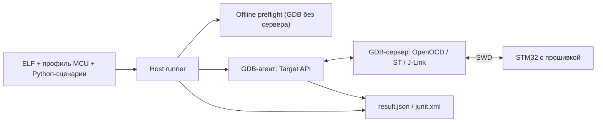

# ТЕХНИЧЕСКОЕ ЗАДАНИЕ

## Инфраструктура автоматизированной проверки прошивки STM32 на оборудовании через GDB-Python и SWD-отладчик stm32-gdbtest (Windows, ARM GCC/GDB)

| Реквизит | Значение |
| :--- | :--- |
| **Документ** | TECHNICAL_SPECIFICATION.md |
| **Ревизия** | 0.2 (черновик для согласования) |
| **Дата формирования** | 28.09.2026 |
| **Метод формирования** | Обратная разработка по исходному коду `main` @ `a371d80` (ядро совпадает с `b76d909` от 25.09.2026, закреплённым в стендовом проекте), host-тестам `Tests/host`, примеру `examples/minimal-consumer` и документации `docs/`. Назначение и практика применения — по проекту stm32-hwtest-blackpill (`main` @ `060d8e4`) |
| **Целевая версия** | 0.1.0-rc.1 (текущая версия разработки `0.1.0.dev0`, `API_VERSION = 1`) |
| **Целевая платформа** | Хост Windows; Python ≥ 3.11; ARM GCC с GDB-Python (проверены xPack 13.3.1-1.1, GDB 14.2.90, встроенный Python 3.11.4); CMake ≥ 3.25, Ninja; GDB-серверы OpenOCD 0.12.0, ST-LINK GDB Server 7.14.0 (CubeCLT 1.22.0), SEGGER J-Link GDB Server 8.32; MCU STM32 Cortex-M0/M3/M4 по профилю потребителя |
| **Связанные документы** | README.md; AGENTS.md; docs/ru/maintenance.md, docs/en/maintenance.md; docs/API.md, BACKENDS.md, CONTRACTS.md, DEBUGGER_OWNERSHIP.md, GETTING_STARTED.md, HAL_MACRO_GUIDE.md, IMAGES.md, MANIFESTS.md, STATUS.md, TARGET_IDENTITY.md, TEST_AUTHORING.md, VERSIONING.md; TODO.md; CHANGELOG.md; SOURCE.md; stm32-hwtest-blackpill: docs/HWTEST_ARCHITECTURE_V2.md, STATUS.md, PERIPHERAL_PLAN.md, F429_SERVER_STABILITY.md; stm32-cmake-yml: README.md (профили сборки) |
| **Связанные файлы кода** | `stm32_gdbtest/*.py` (19 модулей), `stm32_gdbtest/cmake/STM32GDBTest.cmake`, `Tests/host/*.py`, `examples/minimal-consumer/*` |

### История ревизий

| Ревизия | Дата | Описание |
| :---: | :---: | :--- |
| 0.1 | 28.09.2026 | Первая редакция. Требования восстановлены по коду `main` @ `a371d80`, host-тестам (65) и документации модуля; назначение и границы уточнены по стендовому проекту stm32-hwtest-blackpill. Тест-кейсы привязаны к существующим host-тестам и аппаратным проверкам. Зафиксированы расхождения документации и кода, открытые вопросы по CI и сопроводительной документации. |
| 0.2 | 28.09.2026 | Учтены решения владельца о порядке сопровождения: ветки `<агент>/<задача>` для нескольких агентов, слияние обычным `git merge` без PR, подписанные коммиты Conventional Commits без ссылок на сессии, документация на русском и английском (`docs/ru`, `docs/en`), ТЗ только на русском. Порядок работы вынесен в docs/ru/maintenance.md и docs/en/maintenance.md. Закрыт вопрос 11.2.12; по 11.2.2 решена часть о языках и расположении документов. |

### Изменения ревизии 0.2

Обозначения: **нов.** — новое требование, **изм.** — изменённый текст при сохранении номера, **искл.** — исключённое требование. Изменённые и новые пункты в тексте помечены `(р.0.2)`.

| Пункты | Тип | Суть |
| :--- | :---: | :--- |
| Реквизиты | изм. | Ревизия 0.2; связанные документы: maintenance RU/EN |
| 7.7.1 | изм. | CHANGELOG ведётся в двух локализациях |
| 7.7.6–7.7.11 | нов. | Ветки, слияние без PR, коммиты, подпись, двуязычная документация, ТЗ на русском, maintenance.md |
| 10.3 | изм. | Строки 7.7.1, 7.7.6–7.7.11 |
| 11.2.2, 11.2.12 | изм. | 11.2.12 закрыт; 11.2.2 — решена часть о языках и расположении |

---

## Содержание

1. Введение
2. Общее описание
3. Модель данных и форматы файлов
4. Проверка образа Flash
5. Функциональные требования: жизненный цикл и API
6. Требования к интерфейсам
7. Нефункциональные требования
8. Совместимость и эволюция
9. Верификация
10. Матрица прослеживаемости
11. Допущения и открытые вопросы
- Приложение A. Сводка констант
- Приложение B. Проверенные конфигурации (информативно)
- Приложение C. Каталог запуска и артефакты (информативно)
- Приложение D. Соглашение о ссылках на ТЗ из кода
- Приложение E. Источники восстановления требований (информативно)
- Приложение F. Расхождения документации и кода
- Приложение G. Доработка модуля по новому профилю сборки (информативно)

---

## 1. Введение

### 1.1. Назначение документа

1.1.1. Документ определяет требования к stm32-gdbtest — инфраструктуре, которая выполняет Python-сценарии в GDB на компьютере и через GDB-сервер и SWD-отладчик проверяет работающую прошивку на реальном MCU STM32.

1.1.2. Документ является основой для доработки, верификации и выпуска модуля: каждое требование имеет постоянный номер, на который ссылаются комментарии в коде, тесты и матрица прослеживаемости (раздел 10).

### 1.2. Область применения

1.2.1. Требования применимы к пакету `stm32_gdbtest/` (host runner, CLI, GDB-агент, Target API, backend GDB-серверов, контракты, проверка образа, build manifest, отчёты), CMake-интеграции `stm32_gdbtest/cmake/STM32GDBTest.cmake`, host-тестам `Tests/host` и примеру `examples/minimal-consumer`.

1.2.2. Документ не описывает прошивки, MCU-профили, сценарии и требования конкретных приложений: они принадлежат проектам-потребителям (прежде всего stm32-hwtest-blackpill). Требования к взаимодействию с потребителем приведены в п. 6.8.1–6.8.5.

1.2.3. Документ не описывает конвейер CI и структуру сопроводительной документации: в ревизии 0.1 CI отсутствует, их реструктуризация — предмет следующих ревизий (вопросы 11.2.1, 11.2.2).

### 1.3. Метод формирования

1.3.1. Требования восстановлены по исходному коду `main` @ `a371d80`. Между `b76d909` (закреплён gitlink в stm32-hwtest-blackpill) и `a371d80` изменён только `.github/FUNDING.yml`; поведение модуля одинаково.

1.3.2. Дополнительные источники: host-тесты `Tests/host` (65 тестов), пример потребителя, документация `docs/`, README.md, TODO.md, CHANGELOG.md, AGENTS.md; протоколы и описание архитектуры стендового проекта. Перечень — приложение E.

1.3.3. Целевой реализацией считается код `main` @ `a371d80`. В случае расхождения между этим документом и кодом расхождение считается дефектом одного из них и разрешается пересмотром ревизии документа. Известные расхождения документации и кода перечислены в приложении F.

1.3.4. Аппаратные результаты взяты из документации модуля и стендового проекта; при формировании ревизии 0.1 оборудование не использовалось. Host-тесты запущены в среде формирования (Linux, Python 3.11.15): 57 PASS, 3 FAIL из-за Windows-зависимого кода, 5 пропущено (Windows mutex); на Windows по документации — 65/65.

### 1.4. Термины и сокращения

| Термин | Определение |
| :--- | :--- |
| Модуль | stm32-gdbtest: пакет `stm32_gdbtest/` с CMake-интеграцией. |
| Потребитель | Проект прошивки, подключающий модуль Git-подмодулем и содержащий профиль, сценарии и требования. |
| Профиль | Каталог `PROFILE_DIR` потребителя: `target.toml` и `Tests/`. |
| Профиль сборки | Вариант конфигурации прошивки в системе сборки потребителя (например, `profiles:` в `stm32_config.yml` stm32-cmake-yml): MCU, IOC, исходники, скрипт компоновщика. Обычно соответствует одному профилю модуля. |
| Стенд | Локальный TOML с таблицей `[probe]`: backend, serial и путь к GDB-серверу. Не публикуется. |
| Сценарий | Функция верхнего уровня с декоратором `@case`, выполняемая GDB-агентом. |
| Runner | Host-оркестратор `runner.py`: снимок, блокировка, preflight, сервер, GDB, отчёты. |
| Агент | Скрипт `agent.py`, выполняемый во встроенном Python GDB. |
| Target API | Публичные операции объекта `Target`, переданного сценарию (п. 5.10.12). |
| Backend | Диалект GDB-сервера: команда запуска, маркер готовности, setup/reset/finish. |
| Контракт | Декларативное ожидание к ELF (функции, типы, enum, макросы, хэши исходников), проверяемое без подключения к MCU. |
| Preflight | Проверка запрошенных контрактов отдельным GDB до запуска сервера. |
| Build manifest | Снимок происхождения сборки после линковки (п. 3.7.1). |
| Load section | Секция ELF с флагами CONTENTS, ALLOC, LOAD и ненулевым размером; адрес — LMA. |
| Полный образ | BIN заданного диапазона Flash с явным заполнением промежутков и хвоста (п. 4.2.1). |
| Identity | Значение регистра идентификатора MCU (DEV_ID) по маске профиля. |
| PASS / FAIL / ERROR | Исход сценария: успех / несовпадение проверки `check` / отказ инфраструктуры, отладчика или неожиданное исключение. |
| HW / host | Проверка с оборудованием / без оборудования. |

### 1.5. Связанные документы и нормативные ссылки

1.5.1. Документация модуля `docs/*.md` — пользовательские описания механизмов; при расхождении с ТЗ действует п. 1.3.3.

1.5.2. GDB Python API и команды целевой системы: [Debugging with GDB](https://sourceware.org/gdb/current/onlinedocs/gdb.html).

1.5.3. Windows `CreateMutexW` и пространства имён объектов ядра — документация Microsoft Learn (ссылки в docs/DEBUGGER_OWNERSHIP.md).

1.5.4. CRC-32/ISO-HDLC — каталог CRC RevEng; параметры заданы в п. 4.3.1.

1.5.5. Semantic Versioning 2.0.0; формат журнала — Keep a Changelog (docs/VERSIONING.md, CHANGELOG.md).

1.5.6. Стендовый проект [stm32-hwtest-blackpill](https://github.com/ViacheslavMezentsev/stm32-hwtest-blackpill) — архитектура взаимодействия, аппаратные протоколы, план периферии.

1.5.7. [stm32-cmake-yml](https://github.com/ViacheslavMezentsev/stm32-cmake-yml) — система сборки с профилями; не является зависимостью API модуля (п. 2.4.3).

### 1.6. Соглашения документа

1.6.1. Модальность: **ДОЛЖЕН / ДОЛЖНА / ДОЛЖНО / ДОЛЖНЫ** — обязательное требование; **НЕ ДОЛЖЕН** — запрет; **СЛЕДУЕТ** — рекомендуемое; **МОЖЕТ** — допустимое.

1.6.2. Нумерация: каждый пункт имеет номер вида `X.Y.Z` (в разделе 8 — `X.Y`). Номер требования не переиспользуется и не сдвигается; исключённое требование остаётся в тексте с пометкой «(исключено)». Тест-кейсы нумеруются `TC-NN`, вопросы — в пространстве подраздела 11.2, приложения — латинскими буквами.

1.6.3. Маркеры происхождения в конце требований:

| Маркер | Значение |
| :---: | :--- |
| **[R]** | Восстановлено из существующего кода или документации модуля; поведение сохраняется. |
| **[N]** | Новое требование. |
| **[U]** | Уточнение или исправление относительно существующего кода или документации. |

1.6.4. Разделы 1–2 и приложения — информативные; разделы 3–9 — нормативные.

1.6.5. Ссылки на пункты ТЗ из кода оформляются по приложению D.

1.6.6. Правила ведения документа:

- ревизия имеет номер `M.m` и статус («черновик для согласования», «на согласовании», «утверждено»); ревизии `0.x` — черновики до первого релиза модуля; минорная часть растёт с каждым циклом согласования; `1.0` — первая утверждённая редакция;
- каждая ревизия добавляет строку в историю ревизий и, начиная с 0.2, блок «Изменения ревизии X.Y» (новейший сверху) с таблицей изменённых пунктов;
- новые и изменённые пункты ревизии, начиная с 0.2, помечаются в конце `(р.X.Y)`;
- ревизия обновляет всё, на что влияет: вопросы (раздел 11), тест-кейсы (раздел 9), матрицу (раздел 10), приложения;
- решённые вопросы не удаляются: меняются статус, решение и ссылки на пункты, где решение записано нормативно;
- проверенное и непроверенное различаются явно; результат, не полученный при формировании ревизии, указывается со ссылкой на источник.

---

## 2. Общее описание

### 2.1. Контекст

2.1.1. Разработчик прошивки STM32 вручную проверяет в отладчике настройку периферии, обработку прерываний и реакцию на ошибки HAL. Модуль позволяет описать такие действия Python-сценарием, повторять их после изменений и получать отчёт JSON/JUnit.

2.1.2. Сценарии выполняются в GDB на компьютере, а не внутри прошивки: тестовая логика в ELF не добавляется, используются символы, типы и макросы отладочной информации собранного ELF.

2.1.3. Модуль выделен из стендового проекта stm32-hwtest-blackpill (базовый коммит `285152020ee4cef516fb74d96d81193c01fccfab`, SOURCE.md) и подключается к потребителям Git-подмодулем. Стендовый проект остаётся основным потребителем и площадкой аппаратной проверки модуля.

2.1.4. Развитие модуля ведётся по профилям сборки потребителя: каждый новый профиль (новый MCU, плата, отладчик или сервер) выявляет пробелы модуля, которые закрываются доработкой и аппаратной проверкой на этом профиле (п. 8.7, приложение G). Так появились проверка ELF load sections (опыт К1921ВГ015), полный образ с CRC, J-Link mapping и профиль Cortex-M0 (F030R8).



### 2.2. Функции модуля

2.2.1. Сбор метаданных сценариев без импорта их кода и проверка соответствия идентификаторам требований.

2.2.2. Генерация CTest-тестов, session.json и post-link build manifest через CMake.

2.2.3. Запуск сценария: выбор стенда, блокировка отладчика, снимок ELF, проверка manifest и контрактов, подготовка образа, запуск GDB-сервера и GDB-агента, ограничение времени, восстановление, отчёты.

2.2.4. Проверка identity MCU и заводского размера Flash перед обращением к образу.

2.2.5. Сравнение Flash с образом (секции ELF или полный образ с CRC) и запись при несовпадении по политике стенда.

2.2.6. Target API сценария: достижение функции, чтение значений и полей, проверки, контролируемые инъекции (`set_value`, `force_return`).

2.2.7. Сбор диагностики при отказе и возврат MCU в работу через диалект backend.

2.2.8. Межпроектная координация доступа к одному отладчику в пределах Windows-сессии.

2.2.9. Метаданные совместимости среды выполнения без копирования личных данных.

### 2.3. Роли и потребители

| Роль | Взаимодействие |
| :--- | :--- |
| Автор сценариев (человек или ИИ-агент) | Пишет `Tests/board/test_*.py`, `requirements.md`, `contracts.json`; пользуется Target API и CLI `collect`/`trace`/`run` |
| Проект-потребитель | Подключает модуль подмодулем, вызывает `stm32_gdbtest_attach`, хранит профиль и стенд |
| Владелец стенда | Выбирает плату, отладчик, соединения; подтверждает аппаратные запуски и смену стенда |
| CTest / `check-hw` | Запускает `hw.<ID>`, `host.traceability`, `host.hwtest` |
| Разработчик модуля | Развивает ядро, host-тесты и документацию механизма; выпускает версии |
| stm32-hwtest-blackpill | Основной потребитель: профили F030/F103/F401/F411/F429, аппаратная регрессия модуля |
| stm32-cmake-yml | Необязательная система сборки потребителя с профилями; модуль учитывает `stm32_config.yml` в manifest |

### 2.4. Границы

2.4.1. Вне области: симуляция MCU, модульные тесты внутри прошивки, измерение тока, точного времени и физических сигналов, автоматический расчёт покрытия, доказательство всей семантики HAL.

2.4.2. Вне области ревизии 0.1 (отложено): управление питанием, реле и приборами через host-контроллер; power-cycle с reconnect; SWV/RTT; multicore; внешние loaders; RISC-V; Python-упаковка и console entry point (TODO.md).

2.4.3. stm32-cmake-yml не является зависимостью публичного API; модуль работает с любым CMake-проектом при соблюдении п. 5.13.1–5.13.3.

2.4.4. HAL/CMSIS, пакеты STM32Cube, GDB-серверы и программаторы в модуль не входят.

### 2.5. Ограничения платформы

2.5.1. Хост — Windows (named mutex, `msvcrt`, `taskkill`, `CommandLineToArgvW`, `.exe` binutils). Другие ОС runner отклоняет (п. 5.3.4).

2.5.2. Host Python ≥ 3.11 (`tomllib`); GDB-Python — отдельный интерпретатор ≥ 3.11, не окружение Python компьютера.

2.5.3. Toolchain GNU Arm (`arm-none-eabi-gdb`, `-objdump`, `-objcopy`), ELF `elf32-littlearm`.

2.5.4. Система сборки потребителя — CMake ≥ 3.25 с генератором Ninja; один firmware target на вызов `stm32_gdbtest_attach`.

2.5.5. Один MCU и один отладчик на запуск; SWD; сервер на localhost.

---

## 3. Модель данных и форматы файлов

### 3.1. Сценарий и метаданные `@case`

3.1.1. Сценарий ДОЛЖЕН быть функцией верхнего уровня в файле `test_*.py` каталога `Tests/board` профиля с декоратором-вызовом `case(...)`; декоратор с другим именем или псевдонимом не распознаётся. `[R]`

3.1.2. Декоратор ДОЛЖЕН иметь ровно один позиционный аргумент — строковый литерал идентификатора вида `HW_[A-Z0-9_]+`; иначе сбор завершается ошибкой. `[R]`

3.1.3. Допустимы только именованные аргументы `timeout_s`, `labels`, `contracts`; иной аргумент ДОЛЖЕН приводить к ошибке сбора. `[R]`

3.1.4. `timeout_s` ДОЛЖЕН быть целым числом (не `bool`) в диапазоне `1…300` с; значение по умолчанию — `DEFAULT_CASE_TIMEOUT_S = 20` с. `[R]`

3.1.5. `labels` ДОЛЖЕН быть кортежем или списком строк вида `[a-z0-9_-]+`; по умолчанию пуст. `[R]`

3.1.6. `contracts` ДОЛЖЕН быть кортежем или списком строк вида `[a-z][a-z0-9_]+` без повторов; по умолчанию пуст. `[R]`

3.1.7. Значения метаданных ДОЛЖНЫ быть литералами, вычислимыми `ast.literal_eval`; вызовы функций и имена переменных ДОЛЖНЫ приводить к ошибке сбора. `[R]`

3.1.8. Идентификатор сценария ДОЛЖЕН быть уникален среди всех файлов каталога; повтор ДОЛЖЕН приводить к ошибке. `[R]`

3.1.9. Каталог без сценариев ДОЛЖЕН приводить к ошибке «No hardware cases found». `[R]`

3.1.10. Функция сценария принимает один параметр — объект Target (п. 5.10.12). Число параметров при сборе не проверяется. `[R]`

3.1.11. `stm32_gdbtest.case` ДОЛЖЕН импортироваться обычным Python без модуля `gdb` и возвращать декорируемую функцию без изменений. `[R]`

### 3.2. Требования потребителя (`Tests/requirements.md`)

3.2.1. Идентификатор требования ДОЛЖЕН задаваться заголовком второго уровня в начале строки: `## HW_[A-Z0-9_]+`. `[R]`

3.2.2. Повтор идентификатора требования ДОЛЖЕН приводить к ошибке. `[R]`

3.2.3. Множества идентификаторов требований и сценариев ДОЛЖНЫ совпадать; при расхождении ошибка ДОЛЖНА перечислять недостающие тесты и недостающие требования. `[R]`

### 3.3. Профиль MCU `target.toml` (schema 1)

3.3.1. Профиль ДОЛЖЕН содержать ключи `schema`, `name`, `mcu`, `openocd_target`, `flash_start`, `flash_size`, `breakpoint_limit`, `fault_handlers`, `core_registers`, `reset_halt`, `reset_run`, `identity`, `diagnostic_registers` и МОЖЕТ содержать `flash_size_address`; иные ключи и `schema`, отличная от целого `1`, ДОЛЖНЫ отклоняться. `[R]`

3.3.2. `name` и `mcu` ДОЛЖНЫ соответствовать `[A-Za-z0-9]+`. `[R]`

3.3.3. `openocd_target` ДОЛЖЕН соответствовать `target/[A-Za-z0-9_-]+\.cfg`. `[R]`

3.3.4. `flash_start`, `flash_size`, `breakpoint_limit` ДОЛЖНЫ быть целыми `1…0xFFFFFFFF`; `flash_start + flash_size` НЕ ДОЛЖНО превышать `0x100000000`. `[R]`

3.3.5. `fault_handlers` и `core_registers` ДОЛЖНЫ быть списками уникальных C-идентификаторов. `[R]`

3.3.6. `breakpoint_limit` ДОЛЖЕН быть больше числа `fault_handlers`, чтобы для сценария оставалась хотя бы одна аппаратная точка останова. `[R]`

3.3.7. `reset_halt` ДОЛЖЕН равняться `monitor reset halt`, `reset_run` — `monitor reset run`. Поля используются только backend OpenOCD; ST и J-Link берут команды из своего диалекта (п. 6.4.2, 6.5.3). См. вопрос 11.2.4. `[R]`

3.3.8. `identity` ДОЛЖЕН содержать ровно `address`, `mask`, `value` — целые `0…0xFFFFFFFF`; `mask` не равна нулю; `value & ~mask` равно нулю. `[R]`

3.3.9. `diagnostic_registers` ДОЛЖЕН сопоставлять C-идентификатору адрес, кратный 4, в диапазоне `0…0xFFFFFFFC`. `[R]`

3.3.10. `flash_size_address`, если задан, ДОЛЖЕН быть чётным целым `1…0xFFFFFFFE`. Профиль без него читается, но аппаратный запуск отклоняется до записи (п. 5.9.7). `[R]`

3.3.11. Модуль НЕ ДОЛЖЕН подменять выбранный профиль, HAL, скрипт компоновщика или ожидания по результатам наблюдений (identity, имя MCU в сервере). `[R]`

3.3.12. Рабочие профили хранятся у потребителя; `Tests/fixtures` модуля — синтетические данные host-тестов, НЕ ДОЛЖНЫ использоваться для аппаратных запусков. `[R]`

### 3.4. Стенд (`[probe]` в локальном TOML)

3.4.1. Стенд ДОЛЖЕН содержать таблицу `[probe]` с `backend` из набора `openocd`, `stlink`, `jlink`; иное значение ДОЛЖНО отклоняться. `[R]`

3.4.2. Допустимые ключи: `backend`, `serial`, `executable`, `speed_khz`, `flash`; для `stlink` дополнительно `programmer_dir`. Неизвестный ключ ДОЛЖЕН отклоняться («Unknown probe setting»). `[R]`

3.4.3. `serial` ДОЛЖЕН быть задан явно и соответствовать `[A-Za-z0-9]+`. `[R]`

3.4.4. Для `jlink` `serial` ДОЛЖЕН быть десятичным USB-номером `[1-9][0-9]{3,}`; индекс или псевдоним отклоняются. `[R]`

3.4.5. `speed_khz` ДОЛЖЕН быть целым `1…4000`; по умолчанию `DEFAULT_SPEED_KHZ = 1000`. Значение — верхний предел; фактическая частота интерфейса может быть ниже. `[R]`

3.4.6. `flash` ДОЛЖЕН принимать значение `if-different` (по умолчанию) или `verify-only` (п. 4.4.1–4.4.2). `[R]`

3.4.7. Исполняемый файл сервера ДОЛЖЕН находиться через `PATH` (`shutil.which`) по `executable` или по умолчанию: `openocd`, `ST-LINK_gdbserver.exe`, `JLinkGDBServerCL.exe`; отсутствие ДОЛЖНО приводить к ошибке. `[R]`

3.4.8. Для `stlink` `programmer_dir` ДОЛЖЕН быть абсолютным путём к каталогу с `STM32_Programmer_CLI.exe`. `[R]`

3.4.9. Файл стенда локален (`*.local.toml`) и НЕ ДОЛЖЕН публиковаться в Git; шаблон — `examples/stands/stlink.example.toml`. `[R]`

### 3.5. Реестр контрактов `Tests/contracts.json` (schema 1)

3.5.1. Корень реестра ДОЛЖЕН содержать `schema` — целое `1` — и объект `contracts` «имя → описание». `[R]`

3.5.2. Ключи описания ДОЛЖНЫ входить в набор `functions`, `fields`, `enums`, `source_reviews`, `type_context`, `macros`; описание ДОЛЖНО содержать непустой `functions` или `macros`. `[R]`

3.5.3. При наличии `functions` `type_context` ДОЛЖЕН быть именем одной из функций. `[R]`

3.5.4. Без `functions` ключи `fields`, `enums`, `type_context` ДОЛЖНЫ отклоняться. `[R]`

3.5.5. Элемент `functions` ДОЛЖЕН иметь ровно `returns` и упорядоченный список `arguments` элементов `{name, type}` с уникальными именами. `[R]`

3.5.6. `fields` задаёт «тип → {поле: тип}», `enums` — «тип → {константа: значение}»; лишние поля и константы в ELF допустимы. `[R]`

3.5.7. Поддерживаются имена типов вида `Type`, `const Type`, `Type *`; массивы, шаблоны и указатели на функции не поддерживаются. `[R]`

3.5.8. `macros` ДОЛЖЕН содержать ровно `context` (C-идентификатор функции) и непустой список `expressions`; каждое выражение — идентификатор с необязательными скобками, содержащими только `[A-Za-z0-9_&, *]`. Переводы строк, `;` и произвольные команды GDB ДОЛЖНЫ отклоняться. `[R]`

3.5.9. Элемент `source_reviews` ДОЛЖЕН иметь ровно `file`, `sha256` (64 строчные шестнадцатеричные цифры) и `reason`. `[R]`

3.5.10. Запрос неизвестного имени контракта ДОЛЖЕН приводить к ошибке. `[R]`

3.5.11. Реестр ДОЛЖЕН читаться, только если сценарий запрашивает хотя бы один контракт. `[R]`

### 3.6. Политика полного образа (`[image]`, schema 1)

3.6.1. Файл политики ДОЛЖЕН содержать только таблицу `[image]` с ключами ровно `schema`, `mode`, `start`, `end`, `fill`, `crc`. `[R]`

3.6.2. `schema` ДОЛЖЕН быть целым `1`, `mode` — `full`. `[R]`

3.6.3. `start`, `end`, `fill` ДОЛЖНЫ быть целыми (не `bool`); `start` ДОЛЖЕН равняться `flash_start` профиля; `start < end ≤ flash_start + flash_size`; `end` — исключительная граница. `[R]`

3.6.4. `fill` ДОЛЖЕН быть в диапазоне `0…255`, `crc` — равен `crc32-iso-hdlc`. `[R]`

3.6.5. Политика выбирается: CLI `--image-policy` → переменная `STM32_GDBTEST_IMAGE_POLICY` → отсутствует (режим секций ELF, п. 4.1.1). Установленная переменная без CLI-флага оставляет полный режим включённым. `[R]`

3.6.6. Политика хранится у потребителя независимо от стенда; для MCU с другой базой Flash нужна своя политика. `[R]`

### 3.7. Build manifest (schema 1)

3.7.1. Manifest ДОЛЖЕН содержать `schema = 1`, `evidence`, `elf_sha256`, `profile_sha256`, `compilers`, `units`, `inputs`, `cube_packages`, `library_versions`, `limitations`. `[R]`

3.7.2. Элемент `units` ДОЛЖЕН содержать метку исходника, `object_sha256`, имя компилятора, выбранные флаги (`-D`, `-U`, `-O`, `-g`, `-m`, `-f`, `-std=`, `--specs=` без путей) и `command_sha256` полной команды. `[R]`

3.7.3. `inputs` ДОЛЖЕН содержать метку и SHA-256 каждого файла зависимостей объектов, `target.toml`, `MANIFEST_INPUTS`, `stm32_config.yml` в корне проекта (если есть), `*.ioc` и `*_FLASH.ld` каталога профиля. `[R]`

3.7.4. Метка пути ДОЛЖНА быть относительной к корню проекта; для внешних файлов — начиная с компонента `STM32Cube_FW_*` или `xpack-arm-none-eabi-*`; иначе `external/<имя файла>`. Абсолютные личные пути НЕ ДОЛЖНЫ записываться. `[R]`

3.7.5. `library_versions` ДОЛЖЕН содержать литералы `__STM32*_VERSION_*` и `__CM*_VERSION_*` из входных файлов, прочитанные без препроцессора; `cube_packages` — имена каталогов `STM32Cube_FW_*`. `[R]`

3.7.6. `compilers` ДОЛЖЕН содержать имя, SHA-256 и версию (`-dumpfullversion`) каждого компилятора. `[R]`

3.7.7. При загрузке manifest ДОЛЖЕН отклоняться, если `schema` не равна `1`, `elf_sha256` не совпадает со снимком ELF, `profile_sha256` не совпадает с текущим `target.toml` или любой из списков `compilers`, `units`, `inputs`, `library_versions`, `cube_packages` пуст. `[R]`

### 3.8. Внутренние артефакты

3.8.1. `session.json` генерирует CMake (п. 5.13.7) с ключами `elf`, `gdb`, `tests`, `root`, `out`, `stand`, `profile`, `build_manifest`; файл не редактируется вручную и не имеет обещанной стабильной схемы. `[R]`

3.8.2. `run.json` и `contract-request.json` — внутренние артефакты передачи данных от runner агенту и preflight; стабильная схема не обещается. `[R]`

### 3.9. Результат запуска

3.9.1. Исход запуска ДОЛЖЕН быть одним из `PASS`, `FAIL`, `ERROR` с кодами возврата `0`, `1`, `2` соответственно. `[R]`

3.9.2. `result.json` ДОЛЖЕН содержать как минимум `id`, `status`, `checks`, `started_utc`, `duration_s`, `compatibility`, а также накопленные к моменту завершения блоки: `identity_policy`, `backend`, `profile`, `elf_sha256`, `bin_sha256`, `build_manifest`, `contracts`, `image_verification`, `identity`, `flash_capacity`, `warnings`, `flashed`, `image_verified`, `mutations`, `stops`, `diagnostics`, `backtrace`, `teardown` и поля ошибок `error`, `teardown_error`, `cleanup_error`. `[R]`

3.9.3. `junit.xml` ДОЛЖЕН содержать `testsuite` (`name="hwtest"`, `tests="1"`, `failures`, `errors`, `time`) с одним `testcase` (`name` = ID); для FAIL — элемент `failure`, для ERROR — `error` с текстом ошибки; `system-out` — полный JSON отчёта. Атрибут `classname` — см. приложение F, вопрос 11.2.9. `[R]`

3.9.4. Блок `compatibility` ДОЛЖЕН иметь `schema = 1`, `scope = runtime-only` и разделы `host` (`python`, `system`), `gdb` (`version`, `python`, `required_api_presence`, `evidence`), `backend` (`name`, `version`, `evidence`), `debugger` (`firmware`, `api`, `evidence`), `build` (`elf_sha256`, `image_sha256`, `provenance`). `[R]`

3.9.5. Недоступное значение метаданных ДОЛЖНО записываться как `null` с `evidence`, начинающимся с `unavailable:`; предполагаемые версии НЕ ДОЛЖНЫ подставляться. `[R]`

3.9.6. Из `server.log` ДОЛЖНЫ извлекаться только токены версии сервера, прошивки и API отладчика по шаблонам диалекта; строки журнала, пути и серийные номера в `compatibility` НЕ ДОЛЖНЫ копироваться. `[R]`

3.9.7. Блок `contracts` ДОЛЖЕН содержать `schema`, `requested`, `status` (`NOT_REQUESTED`, `ERROR`, `PASS`) и при запросе — `selected`, `registry_sha256`, `checks`, `errors`, `macros`, `elf_sha256`, `gdb_version`, `connection_attempted = false`. `NOT_REQUESTED` не является доказательством совместимости и не равен SKIP. `[R]`

3.9.8. Блок `compatibility` ДОЛЖЕН формироваться для всех исходов, включая отказ до запуска сервера. `[R]`

---

## 4. Проверка образа Flash

### 4.1. Режим загружаемых секций ELF (по умолчанию)

4.1.1. Список секций ДОЛЖЕН формироваться до запуска сервера командой `arm-none-eabi-objdump -h` из каталога GDB над снимком ELF; вывод сохраняется в `elf-sections.txt`. `[R]`

4.1.2. В образ ДОЛЖНЫ входить только секции с флагами `CONTENTS`, `ALLOC`, `LOAD` и ненулевым размером; адрес секции — LMA, а не VMA. `[R]`

4.1.3. Нераспознанная строка заголовка или флагов секции ДОЛЖНА приводить к ошибке. `[R]`

4.1.4. Набор секций ДОЛЖЕН удовлетворять условиям, иначе ERROR до `objcopy`, GDB и сервера: (а) непуст; (б) каждая секция лежит в `[flash_start, flash_start + flash_size)` профиля; (в) секции упорядочены по адресу и не перекрываются; (г) смещение в BIN равно `address − flash_start`; (д) первая секция начинается с `flash_start`. `[R]`

4.1.5. BIN ДОЛЖЕН создаваться `objcopy -O binary --gap-fill=0xFF` (`BIN_GAP_FILL = 0xFF`); длина BIN ДОЛЖНА совпадать с протяжённостью секций, иначе ERROR. `[R]`

4.1.6. Сравнение ДОЛЖНО читать только байты секций, блоками не более `READ_CHUNK_BYTES = 4096`; промежутки между секциями НЕ ДОЛЖНЫ читаться и сравниваться. Короткое чтение или ошибка чтения ДОЛЖНЫ приводить к ERROR. `[R]`

4.1.7. Отчёт ДОЛЖЕН содержать `image_verification` с `scope = elf-load-sections`, `bin_gap_fill = 255`, `gaps_verified = false`, `full_region_crc_verified = false` и списком `regions` (`name`, `address`, `size`, `offset`, `matches`). `[R]`

4.1.8. `image_verified = true` означает совпадение всех загружаемых секций, а не всей Flash и не CRC полного образа. `[R]`

4.1.9. Смещённое приложение (первая секция не с `flash_start`) и несколько банков Flash не поддерживаются. `[R]`

### 4.2. Режим полного образа (явная политика)

4.2.1. При заданной политике `image.bin` ДОЛЖЕН иметь размер `end − start`, быть заполнен `fill`, с байтами секций ELF на своих смещениях; протяжённость секций больше диапазона политики ДОЛЖНА приводить к ошибке. Поле CRC в образ НЕ ДОЛЖНО вставляться. `[R]`

4.2.2. Из полного BIN ДОЛЖЕН создаваться транспортный `program.elf` (`objcopy -I binary -O elf32-littlearm -B arm`) с единственной секцией `.firmware` (`alloc,load,readonly,data,contents`) по адресу `start`. `[R]`

4.2.3. Контейнер ДОЛЖЕН содержать ровно одну загружаемую секцию размером BIN, а его обратное преобразование в BIN ДОЛЖНО побайтно совпадать с `image.bin`; иначе ERROR до сервера. `[R]`

4.2.4. ДОЛЖНЫ фиксироваться SHA-256 полного BIN (`bin_sha256`), контейнера (`program_elf_sha256`) и исходного файла политики (`image_policy.source_sha256`); нормализованная политика сохраняется в `image-policy.json`. `[R]`

4.2.5. Агент ДОЛЖЕН до подключения проверить длину BIN, восстановить заполнение по секциям и политике и сравнить с BIN, проверить SHA-256 контейнера. `[R]`

4.2.6. После reset/halt агент ДОЛЖЕН прочитать весь диапазон блоками не более `READ_CHUNK_BYTES`, сравнить каждый байт и вычислить CRC ожидаемого и прочитанного образа; `first_mismatch` — адрес первого отличающегося байта или `null`. `[R]`

4.2.7. `full_region_crc_verified` ДОЛЖНО быть истинно, только если совпали все байты и CRC; совпадение CRC без побайтного совпадения НЕ ДОЛЖНО считаться успехом. `[R]`

4.2.8. Запись полного образа ДОЛЖНА выполняться командами `load <program.elf>` и затем `symbol-file <firmware.elf>`, чтобы сценарий работал с символами исходного ELF. `[R]`

4.2.9. `image_verification` полного режима ДОЛЖЕН содержать `scope = full-image`, `start`, `end`, `fill`, `bytes_compared`, `bytes_match`, `first_mismatch`, `gaps_verified`, `full_region_crc_verified` и блок `crc` с параметрами, `expected`, `observed`. `[R]`

4.2.10. Mass erase НЕ ДОЛЖЕН выполняться. Сохранность данных вне диапазона политики не гарантируется: сектора стирает backend при программировании. `[R]`

4.2.11. `image.bin` и `program.elf` одного каталога запуска имеют одинаковый payload и МОГУТ использоваться для внешнего программатора (по `start`) и загрузки под отладкой соответственно. `[R]`

### 4.3. CRC-32/ISO-HDLC

4.3.1. CRC ДОЛЖЕН вычисляться по CRC-32/ISO-HDLC: полином `0x04C11DB7`, init `0xFFFFFFFF`, refin/refout — да, xorout `0xFFFFFFFF`; контрольный вектор: ASCII `123456789` → `0xCBF43926`. `[R]`

4.3.2. Байты ДОЛЖНЫ подаваться по возрастанию адресов Flash, побайтно, без дополнения до слова; поле CRC отсутствует, в расчёт входят все байты диапазона. `[R]`

4.3.3. CRC вычисляется на ПК (`binascii.crc32`) по данным, прочитанным через отладчик; это не проверка CRC-периферии MCU и не криптографическая проверка. `[R]`

### 4.4. Политика записи Flash

4.4.1. При `flash = if-different` и несовпадении образа агент ДОЛЖЕН сохранить `image_before_programming`, выполнить запись (`load` исходного ELF или п. 4.2.8), установить `flashed = true` и повторить проверку тем же способом; при совпадении запись НЕ ДОЛЖНА выполняться. `[R]`

4.4.2. При `flash = verify-only` несовпадение ДОЛЖНО приводить к ERROR без записи. `[R]`

4.4.3. Ошибка чтения Flash ДОЛЖНА приводить к ERROR и НЕ ДОЛЖНА трактоваться как необходимость записи. `[R]`

4.4.4. Несовпадение после записи ДОЛЖНО приводить к ERROR «Flash does not match the selected ELF image». `[R]`

---

## 5. Функциональные требования: жизненный цикл и API

### 5.1. Сбор сценариев (`collect`)

5.1.1. `collect` ДОЛЖЕН читать метаданные через AST без импорта кода сценариев и без модуля `gdb`. `[R]`

5.1.2. Результат ДОЛЖЕН быть списком записей `id`, `path` (абсолютный), `function`, `timeout_s`, `labels`, `contracts` в порядке сортировки имён файлов. `[R]`

5.1.3. `collect --cmake <файл>` ДОЛЖЕН записывать по строке `stm32_gdbtest_register(<ID> <timeout> "<labels;…>")` на сценарий; каталог файла ДОЛЖЕН лежать внутри `--workspace`. `[R]`

5.1.4. Без `--cmake` результат ДОЛЖЕН выводиться в stdout в формате JSON. `[R]`

### 5.2. Трассировка требований (`trace`)

5.2.1. `trace --tests <каталог> --requirements <файл>` ДОЛЖЕН проверять п. 3.2.1–3.2.3 и при успехе печатать «Requirement IDs and tests match» с кодом `0`. `[R]`

### 5.3. Запуск сценария (`run`): параметры и каталог

5.3.1. `run` ДОЛЖЕН принимать обязательные `--session`, `--test` и необязательные `--stand`, `--timeout`, `--identity-policy {warn,strict}`, `--image-policy`. `[R]`

5.3.2. Непустые переменные `HWTEST_STAND` или `HWTEST_IDENTITY_POLICY` ДОЛЖНЫ приводить к ERROR до чтения стенда. `[R]`

5.3.3. Политика identity ДОЛЖНА выбираться: CLI → `STM32_GDBTEST_IDENTITY_POLICY` → `warn`; иное значение — ERROR. `[R]`

5.3.4. На ОС, отличной от Windows, запуск ДОЛЖЕН завершаться ERROR с отчётом. См. вопрос 11.2.3. `[R]`

5.3.5. Внешний предел времени GDB — `--timeout` либо `timeout_s` сценария; значение ДОЛЖНО быть конечным, `0 < t ≤ MAX_TIMEOUT_S` (`MAX_TIMEOUT_S = 300` с). `[R]`

5.3.6. Стенд ДОЛЖЕН выбираться: `--stand` → `STM32_GDBTEST_STAND` → `session.stand`; отсутствие — ERROR с указанием, как выбрать стенд. `[R]`

5.3.7. Каталог запуска `<out>/<UTC-метка>-<ID>-<PID>` ДОЛЖЕН создаваться внутри корня проекта `session.root`; путь вне корня ДОЛЖЕН отклоняться без создания каталога. `[R]`

5.3.8. После создания каталога запуска `result.json` и `junit.xml` ДОЛЖНЫ записываться при любом исходе. Отказ до создания каталога (ошибка аргументов, чтения session) отчёты не гарантирует. `[R]`

5.3.9. Код возврата `run` ДОЛЖЕН равняться коду статуса (п. 3.9.1); `ValueError`, `KeyError`, `OSError` на верхнем уровне CLI ДОЛЖНЫ выводиться как `ERROR: …` с кодом `2`. `[R]`

5.3.10. В stdout ДОЛЖНЫ выводиться предупреждения `WARNING: …`, итоговая строка `<STATUS> <ID>: <путь result.json>` и при не-PASS — текст ошибки. `[R]`

### 5.4. Владение отладчиком

5.4.1. Блокировка ДОЛЖНА захватываться после чтения стенда и профиля, до снимка ELF, preflight, `objcopy` и сервера, и удерживаться на всём выполнении, включая recovery и остановку процессов сервера. `[R]`

5.4.2. Имя объекта ДОЛЖНО иметь вид `Local\stm32-gdbtest.probe.v1.<SHA-256 от "<семейство>:<SERIAL>">`, где семейство — `jlink` для backend `jlink` и `stlink` для `openocd` и `stlink`, serial — в верхнем регистре. Корень проекта, MCU и порт в ключ не входят. `[R]`

5.4.3. Захват ДОЛЖЕН выполняться без ожидания; занятый объект ДОЛЖЕН приводить к ERROR («another runner») с отчётами и без аппаратного подключения. `[R]`

5.4.4. Состояние `WAIT_ABANDONED` ДОЛЖНО приводить к освобождению объекта и ERROR с предложением проверить оставшиеся процессы GDB/сервера; чужие процессы НЕ ДОЛЖНЫ завершаться, MCU НЕ ДОЛЖЕН сбрасываться. `[R]`

5.4.5. Повторный захват того же имени в том же процессе ДОЛЖЕН отклоняться (Windows mutex рекурсивен для потока-владельца). `[R]`

5.4.6. Дополнительно ДОЛЖНА удерживаться совместимая файловая блокировка `build/probe-locks/<SHA-256 serial>.lock` (`msvcrt.locking`) для прежнего runner того же checkout; занятость — ERROR. `[R]`

5.4.7. Блокировки ДОЛЖНЫ освобождаться в `finally` при любом исходе; ошибка API или прав доступа НЕ ДОЛЖНА приводить к обходу блокировки. `[R]`

### 5.5. Снимок ELF и проверка build manifest

5.5.1. ELF ДОЛЖЕН копироваться в каталог запуска (`firmware.elf`); preflight, `objdump`, `objcopy` и агент ДОЛЖНЫ работать только со снимком. `[R]`

5.5.2. Если `session.build_manifest` задан, manifest ДОЛЖЕН проверяться по п. 3.7.7 до `objcopy`, GDB и сервера и копироваться в каталог запуска и отчёт. Session без этого ключа допускается с `provenance = unavailable` (п. 3.9.5). `[R]`

5.5.3. Исходники и установленный STM32Cube во время запуска НЕ ДОЛЖНЫ перечитываться: отчёт описывает сохранённую сборку. `[R]`

### 5.6. Offline preflight контрактов

5.6.1. Если сценарий не запрашивает контракты, `contracts.status` ДОЛЖЕН быть `NOT_REQUESTED`, реестр не читается, preflight не запускается. `[R]`

5.6.2. Для каждого `source_reviews` в `inputs` проверенного manifest ДОЛЖНА найтись ровно одна запись с тем же файлом и SHA-256; иначе ERROR до сервера. Хэш НЕ СЛЕДУЕТ обновлять без повторного анализа исходника. `[R]`

5.6.3. Выбранные декларации, `registry_sha256` и `contract-request.json` ДОЛЖНЫ сохраняться в каталоге запуска. `[R]`

5.6.4. Preflight ДОЛЖЕН выполняться отдельным GDB (`-nx -batch -q -iex "set auto-load off"`) со снимком ELF, без GDB-сервера и без подключения к цели, с пределом `PREFLIGHT_TIMEOUT_S = 15` с; вывод — в `contract-preflight.log`. `[R]`

5.6.5. Preflight ДОЛЖЕН использовать только поиск символов, типов и блоков, `list`, `info macro`, `macro expand`; `parse_and_eval`, вызовы функций цели и запись памяти НЕ ДОЛЖНЫ использоваться. `[R]`

5.6.6. Для функции ДОЛЖНЫ проверяться: наличие глобальной функции; тип возврата; число аргументов; типы аргументов по порядку; имена и типы аргументов в блоке функции. Типы ДОЛЖНЫ сравниваться равенством `gdb.Type` после `strip_typedefs`, разрешённых в блоке самой функции, а не строками и не глобальным поиском. `[R]`

5.6.7. `fields` и `enums` ДОЛЖНЫ разрешаться в блоке функции `type_context`. `[R]`

5.6.8. Для `macros` preflight ДОЛЖЕН выбрать исходную позицию функции `context` (`list *<адрес>`), для каждого выражения убедиться, что `info macro` содержит `#define <идентификатор>`, а `macro expand` возвращает раскрытие, отличное от исходного выражения; `context`, выражение и раскрытие ДОЛЖНЫ сохраняться в отчёте. Выражения не вычисляются. `[R]`

5.6.9. Результат preflight ДОЛЖЕН приниматься только при коде выхода `0`, `status = PASS` и совпадении `elf_sha256` со снимком; иначе ERROR до запуска сервера. `[R]`

5.6.10. Результаты preflight ДОЛЖНЫ включаться в `result.json` и JUnit. `[R]`

### 5.7. Подготовка образа

5.7.1. Runner ДОЛЖЕН выполнить `objdump -h` (с `LC_ALL=C`) и `objcopy` с пределом `TOOL_TIMEOUT_S = 15` с каждый и проверить запуск GDB-Python (`python import gdb; print(gdb.VERSION)`) с пределом `GDB_PROBE_TIMEOUT_S = 10` с; вывод — в `prepare.log`. `[R]`

5.7.2. Проверки секций (п. 4.1.4, 4.1.5) и при полной политике п. 4.2.1–4.2.4 ДОЛЖНЫ завершаться до запуска сервера. `[R]`

### 5.8. Запуск GDB-сервера

5.8.1. Порт ДОЛЖЕН выбираться ОС как свободный TCP-порт на `127.0.0.1`. `[R]`

5.8.2. Сервер ДОЛЖЕН запускаться командой диалекта backend (п. 6.3.1, 6.4.1, 6.5.2) с рабочим каталогом — каталогом запуска и выводом в `server.log`. `[R]`

5.8.3. Готовность ДОЛЖНА определяться появлением маркера диалекта в `server.log` за `SERVER_READY_TIMEOUT_S = 10` с; завершение сервера раньше маркера или истечение предела — ERROR. `[R]`

5.8.4. Команды `reset_halt`, `finish`, `setup` выбранного диалекта ДОЛЖНЫ сохраняться в `backend_commands` отчёта. `[R]`

### 5.9. GDB-агент: подключение, identity, Flash

5.9.1. Агент ДОЛЖЕН запускаться явно (`-x agent.py`) при выключенном auto-load; скрипты из ELF НЕ ДОЛЖНЫ выполняться. `[R]`

5.9.2. Агент ДОЛЖЕН установить `pagination off`, `confirm off`, `breakpoint pending off`, `remotetimeout 5` (`GDB_REMOTE_TIMEOUT_S = 5` с), `python print-stack full`. `[R]`

5.9.3. До подключения агент ДОЛЖЕН проверить регионы или полную политику (п. 4.2.5), совпадение SHA-256 BIN с ожидаемым от runner и наличие обязательного GDB API (п. 6.1.2). `[R]`

5.9.4. `connection_attempted` ДОЛЖЕН становиться `true` непосредственно перед `target extended-remote`. `[R]`

5.9.5. После подключения агент ДОЛЖЕН выполнять шаги строго в порядке: (а) команды `setup` диалекта; (б) `reset_halt`; (в) identity и размер Flash (п. 5.9.6–5.9.8); (г) проверка образа (раздел 4); (д) запись и повторная проверка по п. 4.4.1; (е) `Target.boot` (п. 5.10.1); (ж) сценарий. `[R]`

5.9.6. Identity: агент ДОЛЖЕН прочитать 32-битное значение по `identity.address`, применить `mask` и записать `identity` (`policy`, `raw`, `expected`, `observed`, `mask`, `matches`, `selected_mcu`, `selected_profile`) и `device_id`. Несовпадение ДОЛЖНО давать предупреждение «DEV_ID mismatch»; при `strict` — ERROR до чтения размера Flash и до сравнения и записи образа. `[R]`

5.9.7. Размер Flash: агент ДОЛЖЕН прочитать 16-битное значение (KiB) по `flash_size_address` и записать `flash_capacity`. ERROR независимо от политики identity ДОЛЖЕН выдаваться при: отсутствии `flash_size_address`; значении `0` или `0xFFFF`; нарушении `0 < размер образа ≤ min(flash_size профиля, прочитанный размер)`. Отличие прочитанного размера от профиля при помещающемся образе ДОЛЖНО давать предупреждение. Больший кристалл НЕ ДОЛЖЕН расширять границы профиля. `[R]`

5.9.8. Ошибка чтения регистров identity или размера Flash ДОЛЖНА приводить к ERROR при любой политике. `[R]`

5.9.9. Предупреждения ДОЛЖНЫ печататься и сохраняться в `warnings`; PASS сценария не означает совпадения identity. `[R]`

### 5.10. Выполнение сценария и Target API

5.10.1. `Target.boot` ДОЛЖЕН удалить принадлежащие Target точки останова, выполнить `reset_halt`, установить аппаратные точки на все `fault_handlers` профиля и достичь `main` (п. 5.10.7). `[R]`

5.10.2. Модуль сценария ДОЛЖЕН импортироваться по пути из результатов сбора с корнем проекта в `sys.path`; функция вызывается с объектом Target. `[R]`

5.10.3. `check(name, actual, expected)` ДОЛЖЕН записывать `{name, actual, expected, passed}` в `checks`, печатать `PASS`/`FAIL` и при несовпадении возбуждать `CheckFailed`, дающее FAIL. `[R]`

5.10.4. `value(expression)` ДОЛЖЕН вычислять выражение `gdb.parse_and_eval`, отклонять optimized-out значения ошибкой, загружать ленивое значение и возвращать `int`. Неизвестный символ или макрос — ошибка (ERROR), а не ноль. `[R]`

5.10.5. `fields(expression, expected)` ДОЛЖЕН для каждого поля вычислять `(<expression>).<поле>` и вызывать `check`; строковое ожидание вычисляется как C-выражение. `[R]`

5.10.6. `breakpoint(function, temporary=False, when=None)` ДОЛЖЕН создавать только аппаратную точку останова; при числе действующих точек Target, равном `breakpoint_limit`, — ошибка до создания; pending-точка ДОЛЖНА удаляться с ошибкой «absent from ELF»; `when` задаёт условие. `[R]`

5.10.7. `reach(function, when=None)` ДОЛЖЕН установить временную точку, выполнить `continue` и проверить через `check`: номер этой точки в последней остановке, имя текущего кадра равно `function`, а при `when` — истинность условия после остановки. Точка ДОЛЖНА удаляться при любом исходе. `[R]`

5.10.8. `set_value(expression, value)` ДОЛЖЕН прочитать значение до записи, выполнить `set variable`, прочитать значение после и добавить запись в `mutations`. Допустимость записи в MMIO проверяет автор сценария. `[R]`

5.10.9. `force_return(expression)` ДОЛЖЕН выполнить `return <expression>` из текущего кадра и добавить в `mutations` операцию с именем функции. Тело функции при этом не выполняется. `[R]`

5.10.10. `clear()` ДОЛЖЕН удалять действующие точки останова Target, включая точки на fault handlers. `[R]`

5.10.11. Каждая остановка ДОЛЖНА фиксироваться в момент события примитивными значениями (`type`, `breakpoints`, `signal`), поскольку объекты временных точек после остановки недействительны. `[R]`

5.10.12. Публичный API сценария — `check`, `value`, `fields`, `reach`, `breakpoint`, `set_value`, `force_return`, `clear`. `boot`, `close`, `on_stop`, `report`, `owned`, `stops` и создание Target — внутренний жизненный цикл агента. `[R]`

5.10.13. Любое исключение сценария, кроме `CheckFailed`, ДОЛЖНО давать ERROR с трассировкой. `[R]`

### 5.11. Диагностика и завершение в агенте

5.11.1. При исходе не PASS и выполненном подключении агент ДОЛЖЕН прочитать `core_registers` текущего кадра, 32-битные `diagnostic_registers` (little-endian) и backtrace; ошибки чтения ДОЛЖНЫ сохраняться в `diagnostic_errors` без изменения исхода. `[R]`

5.11.2. Агент ДОЛЖЕН закрыть Target и выполнить команды `finish` диалекта; при успехе `teardown = reset_run`; ошибка завершения ДОЛЖНА давать ERROR с `teardown_error`. `[R]`

5.11.3. Агент ДОЛЖЕН записать `agent-result.json`, напечатать JSON и завершить GDB кодом статуса. `[R]`

### 5.12. Предел времени и восстановление на хосте

5.12.1. Runner ДОЛЖЕН ограничивать ожидание GDB пределом п. 5.3.5; при истечении или ошибке дерево процессов GDB ДОЛЖНО завершаться. `[R]`

5.12.2. Если сервер был готов, подключение предпринималось (или состояние неизвестно) и агент не выполнил штатное завершение, runner ДОЛЖЕН подключить отдельный GDB-клиент и выполнить команды `finish` с пределом `RECOVERY_TIMEOUT_S = 10` с; вывод — в `recovery.log`; `teardown = reset_run (host recovery)`. `[R]`

5.12.3. Ошибка recovery ДОЛЖНА давать ERROR с `teardown_error`; сервер ДОЛЖЕН останавливаться и в этом случае; ошибка остановки сервера — ERROR с `cleanup_error`. `[R]`

5.12.4. Дерево процессов ДОЛЖНО завершаться `taskkill /PID <pid> /T /F` (предел 10 с), при неудаче — `kill`, с ожиданием завершения до 5 с. Штатное завершение сервера без принудительного — см. вопрос 11.2.7. `[R]`

5.12.5. Отсутствие отчёта агента ДОЛЖНО давать ERROR; отчёт ДОЛЖЕН приниматься только при совпадении `id`, `elf_sha256`, `bin_sha256` со снимком, допустимом `status` и коде выхода GDB, равном коду статуса. `[R]`

5.12.6. Recovery — попытка восстановления, а не гарантия: при физическом отключении связи или питания восстановление не гарантируется. `[R]`

### 5.13. CMake-интеграция

5.13.1. Потребитель ДОЛЖЕН включить `STM32GDBTest.cmake` и вызвать `stm32_gdbtest_attach(<target> PROFILE_DIR <каталог> [MANIFEST_INPUTS <файлы>…] [SELF_TESTS])` после создания firmware target и включения CTest; неизвестные аргументы — `FATAL_ERROR`. `[R]`

5.13.2. `PROFILE_DIR` ДОЛЖЕН быть задан и содержать `target.toml`; пути `PROFILE_DIR` и `MANIFEST_INPUTS` задаются абсолютными. `[R]`

5.13.3. Функция ДОЛЖНА требовать Python ≥ 3.11 и генератор Ninja (`FATAL_ERROR` иначе). `[R]`

5.13.4. Для target ДОЛЖЕН включаться `EXPORT_COMPILE_COMMANDS`, а после линковки (`POST_BUILD`) — генерация `build/<preset>/hwtest/build-manifest.json` (объявлен `BYPRODUCTS`). `[R]`

5.13.5. `LINK_DEPENDS` target ДОЛЖЕН включать скрипт manifest, `target.toml`, `MANIFEST_INPUTS`, `stm32_config.yml` (если есть) и `*.ioc` профиля: их изменение вызывает перелинковку. `[R]`

5.13.6. ДОЛЖНЫ создаваться cache-переменные `STM32_GDBTEST_STAND` (FILEPATH, по умолчанию пусто) и `STM32_GDBTEST_GDB` (`arm-none-eabi-gdb-py3` или `arm-none-eabi-gdb` рядом с компилятором C, обязателен). `[R]`

5.13.7. `session.json` ДОЛЖЕН генерироваться в `build/<preset>/hwtest/` с ключами п. 3.8.1 и путями с прямыми слэшами. `[R]`

5.13.8. При configure ДОЛЖЕН выполняться `collect` с записью `tests.cmake`; ошибка — `FATAL_ERROR`; файлы `test_*.py` и `collect.py` — зависимости повторного configure. `[R]`

5.13.9. Каждый сценарий ДОЛЖЕН регистрироваться CTest-тестом `hw.<ID>` с `TIMEOUT = timeout_s + CTEST_TIMEOUT_MARGIN_S` (`90` с), `LABELS "hw;<labels>"` и `RESOURCE_LOCK stm32_swd`. `[R]`

5.13.10. ДОЛЖЕН создаваться тест `host.traceability` (`trace`, `LABELS host`, `TIMEOUT 30`). `[R]`

5.13.11. При `SELF_TESTS` ДОЛЖЕН создаваться тест `host.hwtest` (`unittest discover Tests/host`); потребителю эта опция не требуется. `[R]`

5.13.12. ДОЛЖНА создаваться цель `check-hw`: `ctest --output-on-failure --output-junit hwtest/ctest-junit.xml`, зависящая от firmware target. `[R]`

5.13.13. `stm32_gdbtest_register` и прочие переменные `STM32_GDBTEST_*`, кроме п. 6.9.2, — внутренние. `[R]`

### 5.14. Генерация build manifest

5.14.1. Каталог сборки ДОЛЖЕН лежать внутри корня проекта, файл manifest — внутри каталога сборки; иначе ошибка. `[R]`

5.14.2. В manifest ДОЛЖНЫ входить только объекты `CMakeFiles/<target>.dir` из `compile_commands.json`; отсутствие объектов — ошибка. `[R]`

5.14.3. Зависимости ДОЛЖНЫ браться из `ninja -t deps`; отсутствующие или `STALE` зависимости, а также зависимость, изменённая позже объекта, ДОЛЖНЫ приводить к ошибке с указанием пересобрать прошивку. `[R]`

5.14.4. Для `.s` без зависимостей учитывается сам файл; наличие `.include`, `.incbin` или `#include` ДОЛЖНО приводить к ошибке. `[R]`

5.14.5. Прежний manifest ДОЛЖЕН удаляться до снимка, новый — записываться через временный файл с атомарной заменой. `[R]`

### 5.15. Версия и способы вызова

5.15.1. `--version` ДОЛЖЕН выводить `stm32-gdbtest <__version__>`. `[R]`

5.15.2. CLI ДОЛЖЕН вызываться как `python -B -m stm32_gdbtest` из корня модуля и по абсолютному пути `stm32_gdbtest/cli.py` из любого каталога. `[R]`

5.15.3. Источник версии — `stm32_gdbtest/__init__.py`: `__version__ = "0.1.0.dev0"`, `API_VERSION = 1`. `[R]`

---

## 6. Требования к интерфейсам

### 6.1. GDB и GDB-Python

6.1.1. GDB ДОЛЖЕН содержать встроенный Python ≥ 3.11: агент импортирует модули, использующие `tomllib`. `[R]`

6.1.2. До подключения агент ДОЛЖЕН проверить наличие API: `execute`, `parse_and_eval`, `selected_inferior`, `newest_frame`, `Breakpoint` (`pending`, `condition`, `is_valid`, `delete`), `BP_HARDWARE_BREAKPOINT`, `Value.is_optimized_out`, `Value.fetch_lazy`, `Frame.name`, `Frame.read_register`, `Inferior.read_memory`, `events.stop.connect`, `events.stop.disconnect`. Отсутствие любого — ERROR. Номер версии GDB НЕ ДОЛЖЕН использоваться как доказательство наличия API. `[R]`

6.1.3. Вызовы GDB API ДОЛЖНЫ выполняться только в основном потоке GDB; фоновые потоки НЕ ДОЛЖНЫ обращаться к GDB. `[R]`

6.1.4. Процессы GDB ДОЛЖНЫ запускаться с `-nx -batch -q -iex "set auto-load off"`, без `PYTHONHOME` и `PYTHONPATH`, с `TEMP`/`TMP` в `build/hwtest-tmp` проекта и `PYTHONDONTWRITEBYTECODE=1`. `[R]`

### 6.2. GNU Binutils

6.2.1. `arm-none-eabi-objdump.exe` и `arm-none-eabi-objcopy.exe` ДОЛЖНЫ находиться в каталоге выбранного GDB. `[R]`

### 6.3. Backend OpenOCD

6.3.1. Команда: `<openocd> -f interface/stlink.cfg -f <openocd_target> -c "adapter serial <serial>" -c "adapter speed <speed_khz>" -c "bindto 127.0.0.1" -c "gdb_port <port>" -c "tcl_port disabled" -c "telnet_port disabled"`. `[R]`

6.3.2. Маркер готовности — `Listening on port <port> for gdb connections`; `reset_halt` — из профиля; `finish` — `[reset_run профиля, disconnect]`. `[R]`

### 6.4. Backend ST-LINK GDB Server

6.4.1. Команда: `<server> -d -e -g -p <port> -i <serial> --frequency <speed_khz> -cp <programmer_dir> --temp-path <каталог запуска> -f <каталог запуска>/stlink.log -l 31 -s`. Shared mode (`-t`) и полное стирание НЕ ДОЛЖНЫ использоваться. `[R]`

6.4.2. Маркер готовности — `Waiting for debugger connection`; `reset_halt` — `monitor reset`; `finish` — `[monitor reset, detach]`. `[R]`

6.4.3. Сервер ST сам обращается к SWD до подключения GDB; проверка GDB API до подключения не означает отсутствия аппаратного доступа. Дополнительный порт SWV (наблюдался порт GDB + 1) в тестах не используется. `[R]`

### 6.5. Backend J-Link GDB Server

6.5.1. MCU профиля ДОЛЖЕН отображаться в имя устройства J-Link по таблице: `STM32F103C8T6` → `STM32F103C8`, `STM32F030R8T6` → `STM32F030R8`. Иной MCU ДОЛЖЕН отклоняться до запуска сервера («mapping not validated»). `[R]`

6.5.2. Команда: `<server> -device <устройство> -if SWD -speed <speed_khz> -USB <serial> -port <port> -swoport 0 -telnetport 0 -RTTTelnetPort 0 -localhostonly 1 -nogui -strict -timeout 5000 -noir -noreset -nohalt -nosinglerun -vd -log <каталог запуска>/jlink.log`. `[R]`

6.5.3. `setup` — `monitor flash breakpoints = 0`; маркер готовности — `Waiting for GDB connection`; `reset_halt` — `monitor reset`; `finish` — `[monitor reset, monitor go, disconnect]`. `[R]`

### 6.6. Общие требования к backend

6.6.1. Сценарии НЕ ДОЛЖНЫ содержать monitor-команд производителей: они сосредоточены в диалектах backend. `[R]`

6.6.2. GDB-серверы ДОЛЖНЫ слушать только localhost; порты Telnet, TCL, SWO, RTT отключаются, где сервер это позволяет. `[R]`

6.6.3. Mass erase, option bytes, обновление прошивки отладчика, shared mode и Flash breakpoints НЕ ДОЛЖНЫ включаться автоматически. `[R]`

6.6.4. Команды monitor/detach НЕ ДОЛЖНЫ переноситься между серверами по аналогии; новый backend или mapping ДОЛЖЕН проверяться на оборудовании: запись Flash, verify-only, timeout/recovery и конечное состояние MCU. `[R]`

6.6.5. Журналы и временные файлы сервера ДОЛЖНЫ направляться в каталог запуска потребителя (cwd, `--temp-path`, `-f`, `-log`, `TEMP`/`TMP`). `[R]`

### 6.7. Операционная система Windows

6.7.1. Модуль использует `kernel32` (`CreateMutexW`, `WaitForSingleObject`, `ReleaseMutex`, `CloseHandle`), `msvcrt.locking`, `shell32.CommandLineToArgvW`, `taskkill` и флаг `CREATE_NO_WINDOW` для дочерних процессов. `[R]`

6.7.2. Область координации блокировки — одна Windows-сессия (`Local\`); другие сессии, RDP и службы не охватываются. `[R]`

### 6.8. Проект-потребитель

6.8.1. Модуль ДОЛЖЕН подключаться Git-подмодулем с закреплённым коммитом или тегом; обновление зависимости НЕ ДОЛЖНО выполняться автоматически при configure. `[R]`

6.8.2. `PROFILE_DIR` потребителя содержит `target.toml`, `Tests/board/test_*.py`, `Tests/requirements.md` и при использовании контрактов `Tests/contracts.json`. `[R]`

6.8.3. Сценарии и вспомогательный код ДОЛЖНЫ находиться в проекте потребителя; модуль НЕ ДОЛЖЕН изменяться ради добавления проектного сценария. `[R]`

6.8.4. Прошивка ДОЛЖНА собираться с отладочной информацией (для макросов — `-g3`); тестовые hooks в прошивку НЕ ДОЛЖНЫ добавляться. `-g3` не сохраняет неиспользуемые функции. `[R]`

6.8.5. Выходные файлы (build, runs, temp, блокировки) ДОЛЖНЫ создаваться в проекте потребителя, а не в подмодуле. `[R]`

### 6.9. Переменные окружения и cache

6.9.1. Публичные переменные окружения: `STM32_GDBTEST_STAND`, `STM32_GDBTEST_IDENTITY_POLICY`, `STM32_GDBTEST_IMAGE_POLICY` (абсолютный путь). Внутренние `STM32_GDBTEST_RUN` и `STM32_GDBTEST_CONTRACT_REQUEST` формирует host; пользователь их не задаёт. `[R]`

6.9.2. Публичные cache-переменные CMake: `STM32_GDBTEST_SOURCE_DIR` (задаёт потребитель), `STM32_GDBTEST_GDB`, `STM32_GDBTEST_STAND`. `[R]`

---

## 7. Нефункциональные требования

### 7.1. Безопасность воздействия на оборудование

7.1.1. Модуль ДОЛЖЕН отказывать при неопределённости (неизвестная схема или ключ, ошибка чтения, несовпадение хэша, нераспознанный вывод инструмента) с ERROR до следующего шага и без записи Flash. `[R]`

7.1.2. Все проверки, не требующие оборудования (стенд, профиль, блокировка, manifest, контракты, секции, политика образа, GDB-Python), ДОЛЖНЫ выполняться до запуска GDB-сервера. `[R]`

7.1.3. Ожидаемый отказ НЕ ДОЛЖЕН превращаться в PASS; причины ERROR и FAIL ДОЛЖНЫ сохраняться в отчёте; исключения НЕ ДОЛЖНЫ подавляться; автоматический повтор при сбое НЕ ДОЛЖЕН скрывать исходную ошибку. `[R]`

7.1.4. После запуска MCU ДОЛЖЕН оставаться в состоянии reset/run по диалекту backend — штатно агентом или через recovery (п. 5.12.2). `[R]`

### 7.2. Изоляция рабочей области и данные

7.2.1. Все выходные и временные файлы ДОЛЖНЫ создаваться внутри корня проекта потребителя. `[R]`

7.2.2. Manifest и `compatibility` НЕ ДОЛЖНЫ содержать абсолютных личных путей и серийных номеров. Прочие журналы (`server.log`, `gdb.log`) могут их содержать и не публикуются. `[R]`

7.2.3. Имя объекта блокировки не раскрывает серийный номер (хэш), но не является средством защиты секретов. `[R]`

7.2.4. Локальные TOML, серийные номера, абсолютные персональные пути, ELF, build и кэши НЕ ДОЛЖНЫ коммититься. `[R]`

### 7.3. Время

7.3.1. Пределы времени всех внешних процессов ДОЛЖНЫ соответствовать приложению A; ни один дочерний процесс не запускается без предела. `[R]`

7.3.2. Внешний предел времени GDB ДОЛЖЕН задаваться всегда и не отключается. `[R]`

### 7.4. Переносимость

7.4.1. Поддерживаемый хост — Windows (п. 2.5.1). Поддержка Linux — вопрос 11.2.3. `[R]`

7.4.2. Поддерживаемая архитектура цели — ARM Cortex-M (`elf32-littlearm`); RISC-V не поддерживается, несмотря на успешный эксперимент К1921ВГ015. `[R]`

### 7.5. Параллелизм

7.5.1. Один запуск работает с одним MCU и одним отладчиком; параллельные HW-тесты CTest одного проекта ДОЛЖНЫ исключаться `RESOURCE_LOCK stm32_swd`. `[R]`

7.5.2. Межпроектная координация охватывает только участвующие runner в одной Windows-сессии; vendor tools, VS Code и сторонние серверы не блокируются. `[R]`

7.5.3. Поддерживается один импорт пакета в Python-процессе. `[R]`

### 7.6. Диагностируемость

7.6.1. Каталог запуска ДОЛЖЕН содержать журналы всех запущенных процессов: `prepare.log`, `contract-preflight.log`, `server.log`, `gdb.log`, `recovery.log`, журналы серверов ST и J-Link (приложение C). `[R]`

7.6.2. Отчёт ДОЛЖЕН явно указывать область доказательства (`scope`, `gaps_verified`, `full_region_crc_verified`, `evidence`, `provenance`), а не только итог. `[R]`

### 7.7. Сопровождаемость

7.7.1. Изменение интерфейса ДОЛЖНО сопровождаться обновлением docs/API.md, CHANGELOG.md и CHANGELOG.en.md, TODO.md и описанием миграции. `[U]` (р.0.2)

7.7.2. Документация механизма ведётся в этом репозитории; результаты стендовых проверок — в проекте потребителя со ссылками, без копирования журнала опытов. `[R]`

7.7.3. Отказные ветви СЛЕДУЕТ покрывать host-тестами до аппаратной проверки. `[R]`

7.7.4. Каждое нормативное требование ДОЛЖНО прослеживаться до реализации и проверки (раздел 10). `[N]`

7.7.5. Базовая проверка модуля `python -B -m unittest discover -s Tests/host -v` ДОЛЖНА проходить полностью на Windows перед публикацией изменения. `[R]`

7.7.6. Изменения ДОЛЖНЫ выполняться в ветке `<агент>/<задача>` от актуального main, где `<агент>` — короткое имя инструмента или участника, создавшего ветку (`claude/`, `codex/`, `gemini/`; человек — своё имя или `dev/`), а `<задача>` — описание в kebab-case на английском. Новый агент выбирает собственный префикс. Причина: над репозиторием работают разные агенты, и префикс показывает автора ветки. `[N]` (р.0.2)

7.7.7. Проверенная ветка ДОЛЖНА сливаться в main обычным `git merge` без PR; force push и переписывание опубликованной истории НЕ ДОЛЖНЫ применяться. Push, теги и релизы выполняет владелец. `[N]` (р.0.2)

7.7.8. Сообщения коммитов ДОЛЖНЫ соответствовать Conventional Commits на английском языке и НЕ ДОЛЖНЫ содержать ссылок на сессии чатов и агентов; то же относится к именам веток. `[N]` (р.0.2)

7.7.9. Коммиты публикуемых веток ДОЛЖНЫ быть подписаны (SSH или GPG) ключом, добавленным в GitHub как Signing Key, с подтверждённым email автора, чтобы GitHub показывал их как Verified. `[N]` (р.0.2)

7.7.10. Пользовательская документация ДОЛЖНА вестись на русском и английском языках парами файлов с одинаковыми именами (`README.md`/`README.en.md`, `CHANGELOG.md`/`CHANGELOG.en.md`, `docs/ru/<страница>.md`/`docs/en/<страница>.md`); русская версия исходная, английская обновляется в том же коммите. ТЗ (`docs/TECHNICAL_SPECIFICATION.md`) ведётся только на русском и не переводится. `[N]` (р.0.2)

7.7.11. Порядок сопровождения (ознакомление, рабочий цикл, выпуск, ведение ТЗ, ветки, коммиты, проверки) ДОЛЖЕН описываться в docs/ru/maintenance.md и docs/en/maintenance.md; AGENTS.md — краткая точка входа со ссылкой на них. `[N]` (р.0.2)

---

## 8. Совместимость и эволюция

8.1. Версии модуля ДОЛЖНЫ следовать SemVer 2.0.0; теги имеют префикс `v`; первый кандидат — `v0.1.0-rc.1`, первый релиз — `v0.1.0`. `[R]`

8.2. До 1.0 совместимые исправления ДОЛЖНЫ увеличивать PATCH, новые функции и изменения API — MINOR с явной миграцией. `[R]`

8.3. `API_VERSION` и номера схем независимы от версии релиза и ДОЛЖНЫ меняться только при изменении соответствующего контракта. `[R]`

8.4. Стабильные схемы ревизии 0.1: target schema 1, контракты schema 1, build manifest schema 1, compatibility schema 1, политика образа schema 1. `session.json`, `run.json` и прочие артефакты каталога запуска стабильной схемы не имеют. `[R]`

8.5. Миграция с `hwtest`: псевдонимы старых импортов, CLI и CMake не предоставляются; устаревшие переменные окружения дают ERROR (п. 5.3.2). Сохранены имена presets, `check-hw`, `host.hwtest`, каталоги отчётов `hwtest`, ID `HW_*`, форматы TOML/JSON и пространство имён блокировки. `[R]`

8.6. Опубликованный тег НЕ ДОЛЖЕН перемещаться; исправление получает новую версию. Gitlink потребителя фиксирует SHA. `[R]`

8.7. Доработка функционала модуля ДОЛЖНА инициироваться и подтверждаться профилем сборки потребителя: новый MCU, плата, отладчик или сервер сначала описывается профилем в stm32-hwtest-blackpill, выявленные пробелы модуля оформляются требованиями новой ревизии ТЗ, реализуются в модуле с host-тестами и подтверждаются аппаратным прогоном этого профиля. Порядок — приложение G. `[N]`

8.8. Новый MCU, backend или mapping НЕ ДОЛЖЕН объявляться поддержанным без аппаратной проверки; STATUS ДОЛЖЕН указывать точную комбинацию MCU, HAL, GDB, backend и версии инструментов. `[R]`

8.9. Перед релизом ДОЛЖНЫ быть выполнены: host и offline проверки, подключение потребителя настоящим подмодулем, согласованные HW- и recovery-проверки, обновление документации и миграции, проверка LICENSE и отсутствия локальных артефактов, обновление `__version__` и датированного раздела CHANGELOG. Публикацию тега выполняет владелец. `[R]`

8.10. Автоматический CI в ревизии 0.1 отсутствует; проверка изменений выполняется локально по п. 7.7.5 и в стендовом проекте. Требования к CI — вопрос 11.2.1. `[R]`

---

## 9. Верификация

### 9.1. Методы

| Обозначение | Метод |
| :---: | :--- |
| A | Анализ: проверка на этапе configure/сборки, разбор кода |
| T | Тестирование без оборудования: host-тесты `Tests/host` (unittest с подменой процессов и памяти), offline-проверка примера |
| I | Инспекция кода и документации |
| D | Демонстрация на оборудовании: сценарии потребителя на стенде |

### 9.2. Тест-кейсы

TC-01…TC-65 соответствуют host-тестам `Tests/host` (имя теста указано в сценарии), TC-66…TC-73 — offline- и аппаратным проверкам. Результаты D взяты из документации модуля и стендового проекта (п. 1.3.4).

| TC | Сценарий | Ожидаемый результат |
| :---: | :--- | :--- |
| TC-01 | `test_mismatched_artifacts_and_incomplete_schema_are_rejected`: manifest с чужим ELF, неверной схемой, пустыми списками; отсутствующий файл | `ValueError` на каждый вариант; `FileNotFoundError` |
| TC-02 | `test_runtime_uses_snapshot_without_rereading_build_sources`: изменение исходника после сборки; изменение `target.toml` | Manifest принят без чтения исходников; изменённый профиль отклонён («target profile») |
| TC-03 | `test_invalid_manifest_stops_runner_before_any_process_start` | ERROR «does not match ELF»; `subprocess.run`/`Popen` не вызваны; нет `server.log` |
| TC-04 | `test_dependency_parser_preserves_spaces_and_stale_state`: вывод `ninja -t deps` с пробелами в путях и `STALE` | Пути с пробелами сохранены; `STALE` → `None` (Windows-пути) |
| TC-05 | `test_versions_are_literal_declarations_not_macro_evaluation`: CRLF-заголовок с макросами версий | Извлечены только литералы `__STM32F1xx_HAL_VERSION_MAIN = 1`, `__CM_CMSIS_VERSION_SUB = 1` |
| TC-06 | `test_display_metadata_does_not_copy_installation_paths` | Флаги `-Og -g3 -mcpu=cortex-m3` без путей; метки `STM32Cube_FW_F1_V1.8.7/header.h`, `external/header.h` |
| TC-07 | `test_literal_selection_does_not_import_tests`: файл с `raise` на верхнем уровне; повтор, вызов функции, строка вместо кортежа в `contracts` | Контракты собраны без импорта; три варианта отклонены |
| TC-08 | `test_missing_and_unreviewed_source_fail_closed`: manifest отсутствует, без записи, с другим хэшем; неизвестное имя | «Reviewed source mismatch» ×3; при совпадении выбран контракт; `KeyError` |
| TC-09 | `test_unrequested_contracts_do_not_require_registry` | Пустой выбор при отсутствующем файле реестра |
| TC-10 | `test_macro_contract_rejects_commands_and_invalid_schema`: перевод строки в context/выражении, пустой список, строка, `;quit` | «macro contract» на каждый вариант; корректный контракт принят |
| TC-11 | `test_bad_preflight_stops_before_debug_server`: preflight возвращает ERROR | Один вызов `subprocess.run`; `Popen` не вызван; `status` и `contracts.status` = ERROR; нет `server.log` |
| TC-12 | `test_canonical_padding_changes_gaps_and_tail_not_payload` | Промежутки и хвост = `fill`, байты секций сохранены |
| TC-13 | `test_unknown_keys_and_unsupported_schema_crc_are_rejected` | `schema = true`, `schema = 2`, иной `mode`, иной `crc`, лишний ключ, пустая политика — `ValueError` |
| TC-14 | `test_invalid_bounds_or_fill_rejected`: start ≠ flash_start, end ≤ start, end за профилем, `fill` > 255, `bool` | `ValueError` на каждый вариант |
| TC-15 | `test_payload_beyond_policy_rejected` | «exceeds full image range» |
| TC-16 | `test_crc_known_vector_and_odd_length` | `123456789` → `0xCBF43926`; нечётная длина без дополнения |
| TC-17 | `test_gap_tail_and_payload_corruption_detected` | Отличие в промежутке, хвосте и секции обнаружено; `first_mismatch` указывает адрес |
| TC-18 | `test_byte_comparison_remains_required_even_with_equal_crc`: подменённый CRC при разных данных | `full_region_crc_verified = false` |
| TC-19 | `test_length_and_padding_checked_before_target_read` | Ошибка длины/заполнения до первого чтения памяти |
| TC-20 | `test_chunking_and_streaming_crc` | Чтения по ≤ 4096 байт; потоковый CRC равен CRC образа |
| TC-21 | `test_short_or_failed_read_is_error` | Короткое чтение → `RuntimeError`; исключение чтения передаётся |
| TC-22 | `test_bad_policy_stops_before_any_subprocess` | ERROR до любого `subprocess` |
| TC-23 | `test_policy_loader_rejects_other_tables_and_records_hash` | Лишняя таблица отклонена; SHA-256 исходного файла возвращён |
| TC-24 | `test_consumer_session_scopes_reports_and_rejects_escape`: пустой стенд; выход каталога за корень | ERROR «Select a local stand» с одним `result.json`; `execute` не вызван; каталог вне корня не создан (Windows) |
| TC-25 | `test_legacy_stand_environment_is_not_silently_ignored`: `HWTEST_STAND` задан | Код 2; стенд не читается; «Rename legacy environment» |
| TC-26 | `test_collection_does_not_execute_code` | Файл с `raise` на верхнем уровне собран, ID найден |
| TC-27 | `test_gdb_api_checks_do_not_infer_support_from_version`: `VERSION = 999.0`, удалён `Breakpoint.pending` | Полный набор принят; без `pending` — ошибка с его именем |
| TC-28 | `test_manifest_extracts_versions_without_copying_private_log_data`: журнал OpenOCD с serial и путём | Версия `0.12.0+dev`, firmware `V2J43M28`, API 2; `PRIVATE` отсутствует |
| TC-29 | `test_missing_runtime_evidence_is_explicit_not_success` | Значения `null`, `evidence` начинается с `unavailable:`; `schema = 1` |
| TC-30 | `test_stlink_manifest_does_not_invent_openocd_api_version` | Версия 7.14.0, firmware `V2J43M28`, `api = null`; без `PRIVATE` |
| TC-31 | `test_stlink_requires_programmer_and_rejects_unknown_settings` | Без `programmer_dir` — ошибка; лишний ключ — «Unknown probe setting»; корректный стенд с `flash = if-different` |
| TC-32 | `test_backend_dialects_keep_vendor_commands_separate` | ST: `finish = [monitor reset, detach]`, `-e`, `-g`, без `-t` и erase-all; OpenOCD: `[monitor reset run, disconnect]`, target cfg в команде |
| TC-33 | `test_jlink_requires_serial_and_known_device_mapping`: serial `0`, `1`, `nickname`, `001234`; MCU F103, F030, H503 | Serial отклонены; F103 → `STM32F103C8`, F030 → `STM32F030R8`, `-nosinglerun`, `setup`, `finish`; H503 — «mapping not validated» |
| TC-34 | `test_jlink_runtime_version_and_firmware_are_separate` | Версия 8.32, firmware из строки `Firmware:`, `api = null`, без `PRIVATE` |
| TC-35 | `test_profiles_select_distinct_mcus_and_flash_limits` | F411: 512 KiB, F103: 64 KiB; разные identity; F103 — `stm32f1x.cfg` |
| TC-36 | `test_profile_rejects_typo_and_missing_settings`: опечатка ключа, schema 2, `breakpoint_limit` = числу handlers, отрицательный размер, нечётный адрес | `ValueError` на каждый вариант |
| TC-37 | `test_duplicate_and_dynamic_metadata_rejected` | Динамический ID и повтор ID отклонены |
| TC-38 | `test_trace_rejects_missing_and_duplicate_requirements` | Недостающее и повторное требование — `ValueError` |
| TC-39 | `test_stand_rejects_misspelled_flash_policy` | «Unknown probe setting» |
| TC-40 | `test_reports_distinguish_assertion_and_infrastructure` | PASS без элементов; FAIL — `failure`; ERROR — `error`; `system-out` содержит `compatibility` и `warnings`; спецсимволы экранированы |
| TC-41 | `test_missing_stand_is_error_with_reports` | Код 2, ERROR, `compatibility.schema = 1`, версия backend `null`, `junit.xml` создан |
| TC-42 | `test_probe_lock_rejects_concurrent_owner_and_releases` (Windows) | Вложенный захват отклонён; после выхода захват успешен |
| TC-43 | `test_warn_preserves_selected_target_and_records_mismatch` | `matches = false`, `observed = 0x431`, профиль не изменён, одно предупреждение |
| TC-44 | `test_strict_rejects_before_flash_capacity_read` | ERROR «strict»; `identity` записан; `flash_capacity` отсутствует; размер не читался |
| TC-45 | `test_match_has_no_warning` | `matches = true`, предупреждений нет |
| TC-46 | `test_actual_capacity_limits_image_even_when_identity_warns` | Образ 65537 байт при 64 KiB → «exceeds» |
| TC-47 | `test_larger_chip_does_not_expand_profile_limit` | Образ больше профиля при 512 KiB кристалле → «exceeds» |
| TC-48 | `test_capacity_difference_with_fitting_image_warns` | Два предупреждения (identity и размер) |
| TC-49 | `test_unreadable_or_invalid_capacity_never_allows_flash`: `0`, `0xFFFF`, ошибка чтения, нет `flash_size_address` | «Invalid Flash» ×2; исключение чтения передаётся; «lacks» |
| TC-50 | `test_invalid_policy_is_not_silent_warn` | `ValueError` для `ignore` |
| TC-51 | `test_lma_not_ram_vma_and_skip_bss_debug` | `.data` по LMA; `.bss` и debug пропущены |
| TC-52 | `test_unprogrammed_gap_never_read_even_when_different` | Адреса промежутка не читаются; секции совпадают |
| TC-53 | `test_payload_difference_is_detected` | `matches = false` у изменённой секции |
| TC-54 | `test_invalid_extents_rejected_without_memory_access` | Пустой список, выход за Flash, нулевой или `bool` размер, неверное смещение, первая секция не с начала, обратный порядок, повтор — ошибка без чтения памяти |
| TC-55 | `test_ram_lma_and_out_of_bounds_are_rejected` | LMA в RAM и за пределами Flash отклонены |
| TC-56 | `test_no_load_sections_or_malformed_output_rejected` | Пустой список и нераспознанный вывод — ошибка |
| TC-57 | `test_bin_extent_mismatch_rejected` | «BIN extent differs» |
| TC-58 | `test_chunked_reads_and_short_read_errors` | Чтения ≤ 4096 байт; короткое чтение — ошибка |
| TC-59 | `test_invalid_elf_layout_stops_before_objcopy_gdb_or_server` | ERROR после `objdump`, до `objcopy`, GDB и сервера |
| TC-60 | `test_cross_project_cross_backend_and_independent_devices` (Windows, реальные процессы) | Второй владелец из другого проекта и backend отклонён; `run` → ERROR без `execute`; другой serial и семейство `jlink` независимы; после смерти владельца захват успешен |
| TC-61 | `test_exception_and_nested_use_release` (Windows) | Вложенный захват — «this process»; после исключения блокировка освобождена |
| TC-62 | `test_abandoned_mutex_fails_closed` (Windows) | «Abandoned»; каталог проекта не создан; повторный захват успешен |
| TC-63 | `test_identity_mapping_and_validation` (Windows) | Регистр serial и backend OpenOCD/ST дают одно имя, J-Link — другое; неверный serial/backend отклонены |
| TC-64 | `test_host_import_does_not_require_gdb` | `gdb` не импортирован; `API_VERSION = 1`; `case` возвращает функцию |
| TC-65 | `test_module_cli_version_and_collection` | `stm32-gdbtest 0.1.0.dev0`; `collect` примера → `HW_CONSUMER_GPIO` |
| TC-66 | `host.consumer_offline` (`verify_offline.py`) после сборки примера | Manifest с `src/main.c`, `src/startup.c` и скриптом компоновщика; импорт сценария; отказ выхода за корень; положительный preflight PASS, отрицательный (`MISSING_CONSUMER_MACRO`) код 2; `connection_attempted = false` |
| TC-67 | `host.traceability` примера | «Requirement IDs and tests match» |
| TC-68 | D: `HW_CONSUMER_GPIO` на BlackPill F411CE / ST-Link / OpenOCD | PASS; `image_verified = true`; MCU в reset/run |
| TC-69 | D: `flash = verify-only` при отличающемся образе | ERROR без записи Flash |
| TC-70 | D: сценарий, превышающий `--timeout` | ERROR; `teardown = reset_run (host recovery)`; процессы остановлены; следующий запуск PASS |
| TC-71 | D: полный образ 16 KiB на F411/OpenOCD и F103/J-Link: хвост A5, повтор, verify-only с политикой FF, восстановление FF | Запись и совпадение; повтор без записи; ожидаемый ERROR; восстановление PASS; HAL-макросы после `load program.elf` |
| TC-72 | D: регрессия стендового проекта: F411CE/OpenOCD, F103C8/J-Link, F030R8/J-Link STLink, F429ZI/OpenOCD и ST | 22/22, 22/22, 17/17, 22/22 HW PASS; MCU оставлены running |
| TC-73 | T/D: offline preflight на реальных ELF F103C8/F401CC/F411CE: положительный и 11 отрицательных вариантов | Положительный PASS; каждый отрицательный — ERROR до сервера |

---

## 10. Матрица прослеживаемости

Условные обозначения файлов (каталог `stm32_gdbtest/`): **IN** — `__init__.py`; **MA** — `__main__.py`; **CL** — `cli.py`; **CO** — `collect.py`; **PR** — `profile.py`; **BE** — `backends.py`; **OC** — `openocd.py`; **PS** — `processes.py`; **RU** — `runner.py`; **AG** — `agent.py`; **TG** — `target.py`; **ID** — `identity.py`; **IM** — `image.py`; **FI** — `full_image.py`; **CT** — `contracts.py`; **CP** — `contract_preflight.py`; **CM** — `compatibility.py`; **RP** — `reports.py`; **BM** — `build_manifest.py`; **CK** — `cmake/STM32GDBTest.cmake`; **EX** — `examples/`; **DOC** — `docs/`, README.md, AGENTS.md.

Пометка **⚠** — документация или реализация отличается, необходима доработка (приложение F).

### 10.1. Модель данных (раздел 3)

| Требования | Реализация | Проверка |
| :--- | :--- | :--- |
| 3.1.1–3.1.9 | CO: `collect` | TC-07, TC-26, TC-37, TC-65 |
| 3.1.10 | AG: вызов `getattr(module, function)(target)` | I, TC-68 |
| 3.1.11 | IN: `case` | TC-64 |
| 3.2.1–3.2.3 | CO: `trace` | TC-38, TC-67 |
| 3.3.1–3.3.6, 3.3.8–3.3.10 | PR: `load_profile` | TC-35, TC-36 |
| 3.3.7 ⚠ | PR: проверка `reset_halt`/`reset_run` | TC-36, вопрос 11.2.4 |
| 3.3.11 | ID: `check_target`; BE: `server_spec` | TC-43, TC-47 |
| 3.3.12 | `Tests/fixtures/README.md` | I |
| 3.4.1–3.4.8 | BE: `load_stand`; OC: `load_stand` | TC-31, TC-33, TC-39 |
| 3.4.9 | `.gitignore` (`*.local.toml`); EX: `stands/stlink.example.toml` | I |
| 3.5.1–3.5.11 | CT: `select_contracts` | TC-07–TC-10 |
| 3.6.1–3.6.4 | FI: `validate_policy`, `load_policy` | TC-13, TC-14, TC-23 |
| 3.6.5 | RU: `run` (`image_policy_path`) | I |
| 3.6.6 | DOC: IMAGES.md | I |
| 3.7.1–3.7.6 | BM: `snapshot`, `label`, `version_macros`, `selected_flags` | TC-04–TC-06, TC-66 |
| 3.7.7 | BM: `load_verified` | TC-01–TC-03 |
| 3.8.1 | CK: `file(GENERATE)` session | A, TC-66 |
| 3.8.2 | RU: `execute` (`run.json`, `contract-request.json`) | I |
| 3.9.1 | RP: `CODES`; AG: `quit` | TC-40, TC-41 |
| 3.9.2 | RU: `run`, `execute`; AG: `main` | TC-24, TC-41, D |
| 3.9.3 ⚠ | RP: `write_reports` (`classname="blackpill"`) | TC-40 |
| 3.9.4–3.9.6 | CM: `runtime_manifest` | TC-28–TC-30, TC-34 |
| 3.9.7 | RU: `execute`; CT: `inspect_contracts` | TC-09, TC-11, TC-66 |
| 3.9.8 | RU: `run` | TC-41 |

### 10.2. Образ и жизненный цикл (разделы 4–5)

| Требования | Реализация | Проверка |
| :--- | :--- | :--- |
| 4.1.1–4.1.4 | RU: `execute`; IM: `parse_sections`, `validate_regions` | TC-51, TC-54–TC-56, TC-59 |
| 4.1.5 | RU: `objcopy --gap-fill=0xFF`; IM: `validate_regions` | TC-57 |
| 4.1.6 | IM: `compare_regions` | TC-52, TC-53, TC-58 |
| 4.1.7, 4.1.8 | AG: `verify_image` | TC-68, TC-72 |
| 4.1.9 | IM: `validate_regions` (первая секция) | TC-54 |
| 4.2.1 | FI: `canonical_image` | TC-12, TC-15 |
| 4.2.2–4.2.4 | RU: `execute` (контейнер, round-trip, SHA) | TC-71, I |
| 4.2.5 | FI: `validate_image`; AG: `main` | TC-19 |
| 4.2.6, 4.2.7, 4.2.9 | FI: `compare_full` | TC-17, TC-18, TC-20, TC-21 |
| 4.2.8 | AG: `load` / `symbol-file` | TC-71 |
| 4.2.10, 4.2.11 | DOC: IMAGES.md; BE: без erase-all | TC-32, I |
| 4.3.1–4.3.3 | FI: `binascii.crc32` | TC-16, TC-20 |
| 4.4.1–4.4.4 | AG: `main` | TC-69, TC-71 |
| 5.1.1–5.1.4 | CO: `collect`; CL: `main` | TC-26, TC-65, A |
| 5.2.1 | CL: `trace`; CO: `trace` | TC-38, TC-67 |
| 5.3.1 | CL: `argparse` | I |
| 5.3.2 | RU: `run` (legacy) | TC-25 |
| 5.3.3 | RU: `run`; ID: `check_target` | TC-50 |
| 5.3.4 ⚠ | RU: `os.name != "nt"` | TC-24, вопрос 11.2.3 |
| 5.3.5 | RU: `run` (`limit`) | I |
| 5.3.6 | RU: `run` (`path`) | TC-24, TC-41 |
| 5.3.7 | RU: `local_directory` | TC-24, TC-66 |
| 5.3.8 | RU: `run`; RP: `write_reports` | TC-24, TC-41 |
| 5.3.9, 5.3.10 | CL; MA; RU: `run` | TC-25, I |
| 5.4.1 | RU: `run` (`with probe_lock`) | TC-60 |
| 5.4.2 | PS: `probe_mutex_name` | TC-63 |
| 5.4.3 | PS: `probe_lock` | TC-42, TC-60 |
| 5.4.4 | PS: `probe_lock` (`0x80`) | TC-62 |
| 5.4.5 | PS: `_active` | TC-61 |
| 5.4.6 | PS: `msvcrt.locking` | I |
| 5.4.7 | PS: `finally` | TC-61 |
| 5.5.1–5.5.3 | RU: `execute`; BM: `load_verified` | TC-02, TC-03 |
| 5.6.1 | RU: `execute`; CT: `select_contracts` | TC-09 |
| 5.6.2 | CT: `select_contracts` | TC-08 |
| 5.6.3, 5.6.4 | RU: `execute` | TC-11, TC-66 |
| 5.6.5–5.6.8 | CT: `inspect_contracts`; CP | TC-66, TC-73 |
| 5.6.9, 5.6.10 | RU: `execute` | TC-11, TC-66 |
| 5.7.1, 5.7.2 | RU: `execute` | TC-22, TC-59 |
| 5.8.1–5.8.4 | RU: `execute`; BE: `server_spec` | TC-32, TC-68 |
| 5.9.1, 5.9.2 | RU: `gdb_base`; AG: `main` | I |
| 5.9.3 | AG: `main`; CM: `require_gdb_api` | TC-27 |
| 5.9.4, 5.9.5 | AG: `main` | I, TC-68 |
| 5.9.6 | ID: `check_target` | TC-43–TC-45 |
| 5.9.7 | ID: `check_target` | TC-46–TC-49 |
| 5.9.8 | ID: `check_target` | TC-49 |
| 5.9.9 | AG; RU: печать `warnings` | TC-40, TC-48 |
| 5.10.1–5.10.13 | TG: `Target`; AG: `main` | TC-68, TC-72, I |
| 5.11.1–5.11.3 | AG: `finally` | TC-70, TC-72, I |
| 5.12.1–5.12.6 | RU: `execute` (`finally`); PS: `stop_tree` | TC-70 |
| 5.13.1–5.13.13 | CK: `stm32_gdbtest_attach`, `stm32_gdbtest_register` | A, TC-66, TC-67, TC-72 |
| 5.14.1–5.14.5 | BM: `main`, `snapshot`, `dependency_map` | TC-04, TC-66, A |
| 5.15.1–5.15.3 | IN; CL; MA | TC-64, TC-65 |

### 10.3. Интерфейсы, нефункциональные требования, эволюция (разделы 6–8)

| Требования | Реализация | Проверка |
| :--- | :--- | :--- |
| 6.1.1 | AG: импорт `full_image` (`tomllib`) | A, TC-68 |
| 6.1.2 | CM: `REQUIRED_GDB_API`, `inspect_gdb_api`, `require_gdb_api` | TC-27 |
| 6.1.3 | TG; AG (без потоков) | I |
| 6.1.4 | RU: `execute` (`env`, `gdb_base`) | I |
| 6.2.1 | RU: `gdb.parent / "arm-none-eabi-*.exe"` | TC-72 |
| 6.3.1, 6.3.2 | OC: `server_command`; BE: `server_spec` | TC-32, TC-35 |
| 6.4.1–6.4.3 | BE: `server_spec` (stlink) | TC-32, TC-72 |
| 6.5.1–6.5.3 | BE: `server_spec` (jlink) | TC-33, TC-72 |
| 6.6.1–6.6.5 | BE; OC | TC-32, TC-33, I |
| 6.7.1, 6.7.2 | PS; BM: `command_args` | TC-60, I |
| 6.8.1–6.8.5 | DOC: GETTING_STARTED.md; EX: minimal-consumer | TC-66, I |
| 6.9.1, 6.9.2 | RU; CK | I |
| 7.1.1–7.1.3 | RU; AG; все загрузчики схем | TC-03, TC-11, TC-22, TC-59 |
| 7.1.4 | AG: `finish`; RU: recovery | TC-68, TC-70 |
| 7.2.1 | RU: `local_directory`, `hwtest-tmp` | TC-24 |
| 7.2.2 | BM: `label`; CM: `runtime_manifest` | TC-06, TC-28 |
| 7.2.3 | PS: `probe_mutex_name` | TC-63 |
| 7.2.4 | `.gitignore`; AGENTS.md | I |
| 7.3.1, 7.3.2 | RU; CK; приложение A | I |
| 7.4.1 ⚠ | RU: `os.name` | вопрос 11.2.3 |
| 7.4.2 | RU: `elf32-littlearm` | I |
| 7.5.1 | CK: `RESOURCE_LOCK stm32_swd` | A |
| 7.5.2, 7.5.3 | PS | TC-60, TC-61 |
| 7.6.1, 7.6.2 | RU; AG; IM; FI | TC-68, I |
| 7.7.1–7.7.3 | AGENTS.md; DOC | I |
| 7.7.4 | Раздел 10 | I |
| 7.7.5 | `Tests/host` | T |
| 7.7.6–7.7.9 | AGENTS.md; docs/ru/maintenance.md, docs/en/maintenance.md; история Git (`git log --show-signature`) | I |
| 7.7.10, 7.7.11 | AGENTS.md; docs/ru/maintenance.md, docs/en/maintenance.md | I |
| 8.1–8.3, 8.6, 8.9 | DOC: VERSIONING.md; IN | I |
| 8.4 | PR; CT; BM; CM; FI | TC-13, TC-29, TC-36 |
| 8.5 | RU: legacy env; DOC: API.md | TC-25 |
| 8.7 | Приложение G | I |
| 8.8 | DOC: STATUS.md | I |
| 8.10 | — (CI отсутствует) | вопрос 11.2.1 |

---

## 11. Допущения и открытые вопросы

### 11.1. Допущения

11.1.1. Поведение модуля в `main` @ `a371d80` совпадает с `b76d909`, на котором получены аппаратные результаты стендового проекта (п. 1.3.1); от этого зависят TC-68…TC-73.

11.1.2. Аппаратные результаты (TC-68…TC-73, приложение B) приняты по документации модуля и стендового проекта без повторного прогона (п. 1.3.4).

11.1.3. Host-тесты проходят 65/65 на Windows с Python 3.11+, как указано в CHANGELOG.md и docs/STATUS.md; в среде формирования проверено только 57/65 (п. 1.3.4).

11.1.4. Потребитель строит прошивку CMake + Ninja + GNU Arm на Windows; иные системы сборки не рассматриваются (п. 2.5.4).

### 11.2. Вопросы и решения

| № | Вопрос | Статус | Решение / комментарий | Пункты |
| :---: | :--- | :---: | :--- | :--- |
| 11.2.1 | CI модуля: платформа (GitHub Actions?), состав уровней (host unittest на `windows-latest`, offline-сборка примера, проверка документации и ссылок, `check_spec.py` для ТЗ), нужен ли self-hosted runner со стендом для D-проверок | Открыт | Обсуждается в следующей ревизии | 8.10, 7.7.5 |
| 11.2.2 | Структура сопроводительной документации: роль ТЗ относительно README, docs/API.md, docs/STATUS.md, CHANGELOG.md, TODO.md; место ТЗ (`docs/` как в stm32-cmake-yml или корень); какие документы становятся производными от ТЗ | Открыт | Решено (р.0.2): документация на русском и английском в `docs/ru` и `docs/en`, ТЗ в `docs/` только на русском, порядок сопровождения — maintenance.md. Остаются роль ТЗ относительно README, STATUS, CHANGELOG, TODO и план переноса страниц `docs/*.md` | 1.2.3, 7.7.1, 7.7.2, 7.7.10, 7.7.11 |
| 11.2.3 | Поддержка хоста Linux: сейчас `run` отказывает, 3 host-теста падают, 5 пропускаются. Нужна ли переносимость (хотя бы host-тестов для CI на Linux)? | Открыт | — | 2.5.1, 5.3.4, 7.4.1 |
| 11.2.4 | Target schema 2 без обязательных OpenOCD-полей (`openocd_target`, `reset_halt`, `reset_run`) для ST/J-Link-профилей (TODO.md) | Открыт | — | 3.3.1, 3.3.3, 3.3.7 |
| 11.2.5 | Надзор за дочерними процессами при аварии host (Job Object): включать ли требование в 0.1.0-rc.1 | Открыт | TODO.md; сейчас освобождение mutex не доказывает завершения серверов | 5.4.4, 5.12.4 |
| 11.2.6 | Профиль F429ZI проверен в стендовом проекте (OpenOCD и ST, 22/22), но не отражён в docs/STATUS.md модуля. Внести? Нужны ли J-Link mapping для F401/F411/F429 | Открыт | — | 6.5.1, 8.8, приложение B |
| 11.2.7 | Сбой USB (`LIBUSB_ERROR_NOT_FOUND`) после серии запусков на F429: нужна ли доработка штатного завершения сервера вместо `taskkill /F` с контролируемым A/B-опытом | Открыт | Причина не установлена (F429_SERVER_STABILITY.md) | 5.12.4 |
| 11.2.8 | Статусы SKIP / NOT_APPLICABLE и выбор сценариев по возможностям профиля и стенда (PERIPHERAL_PLAN.md) | Открыт | Сейчас только PASS/FAIL/ERROR | 3.9.1 |
| 11.2.9 | JUnit `classname="blackpill"` унаследован от стенда; заменить на имя профиля или `stm32-gdbtest`? | Открыт | — | 3.9.3 |
| 11.2.10 | Исправить устаревшие утверждения docs/STATUS.md (приложение F, строки F.1, F.2) при реструктуризации документации? | Открыт | — | 8.8 |
| 11.2.11 | Нормализация концов строк: нет `.gitattributes`, в рабочей копии Windows все 66 файлов показываются изменёнными из-за CRLF | Открыт | Кандидат для реструктуризации CI | 7.2.4 |
| 11.2.12 | Правило веток AGENTS.md (`codex/...`) и подпись коммитов: новое правило для веток и Verified-коммитов | Закрыт | Ветки `<агент>/<задача>` для любых агентов, слияние без PR, Conventional Commits, подпись ключом Signing Key (р.0.2) | 7.7.6–7.7.9 |
| 11.2.13 | Управление питанием, реле и приборами через host-контроллер, power-cycle с reconnect | Отложен | Вне 0.1.0; вернуться после релиза 0.1.0 (TODO.md) | 2.4.2 |
| 11.2.14 | Python-упаковка и console entry point `stm32-gdbtest` | Отложен | Дополнительный способ поставки после 0.1.0; до PyPI проверить имя | 5.15.2 |
| 11.2.15 | Соответствие ревизий ТЗ версиям модуля (например, ТЗ 1.0 ↔ v0.1.0) | Открыт | — | 1.6.6 |

### 11.3. Примечания на будущее (информативно)

11.3.1. CRC-поле и исключения, другие алгоритмы CRC, сверка с CRC-периферией MCU, отдельная offline-команда подготовки образа, проверка полного режима через ST GDB Server (TODO.md).

11.3.2. Разделение адаптеров toolchain, памяти и identity MCU и архитектурной диагностики как основа возможной поддержки RISC-V (опыт К1921ВГ015).

11.3.3. Матрица «коммит модуля + коммит потребителя + ELF + стенд + результат» для release candidate без serial и личных путей (TODO стендового проекта).

11.3.4. Наблюдение работающего MCU без halt (опыт live Sleep F411) не входит в доказанный общий API.

---

## Приложение A. Сводка констант

| Константа | Значение | Пункт |
| :--- | :--- | :---: |
| `DEFAULT_CASE_TIMEOUT_S` | 20 с | 3.1.4 |
| `MAX_TIMEOUT_S` | 300 с (`timeout_s` 1…300) | 3.1.4, 5.3.5 |
| `DEFAULT_SPEED_KHZ` | 1000 кГц (допустимо 1…4000) | 3.4.5 |
| `BIN_GAP_FILL` | `0xFF` | 4.1.5 |
| `READ_CHUNK_BYTES` | 4096 байт | 4.1.6, 4.2.6 |
| CRC-32/ISO-HDLC | poly `0x04C11DB7`, init/xorout `0xFFFFFFFF`, refin/refout; `123456789` → `0xCBF43926` | 4.3.1 |
| `PREFLIGHT_TIMEOUT_S` | 15 с | 5.6.4 |
| `TOOL_TIMEOUT_S` | 15 с (`objdump`, `objcopy`) | 5.7.1 |
| `GDB_PROBE_TIMEOUT_S` | 10 с | 5.7.1 |
| `SERVER_READY_TIMEOUT_S` | 10 с (опрос 0,1 с) | 5.8.3 |
| `GDB_REMOTE_TIMEOUT_S` | 5 с (`set remotetimeout`) | 5.9.2 |
| `RECOVERY_TIMEOUT_S` | 10 с | 5.12.2 |
| `taskkill` / ожидание процесса | 10 с / 5 с | 5.12.4 |
| `CTEST_TIMEOUT_MARGIN_S` | 90 с | 5.13.9 |
| `host.traceability`, `host.hwtest` TIMEOUT | 30 с | 5.13.10, 5.13.11 |
| Предел команд build manifest | 20 с | 5.14.3 |
| J-Link `-timeout` | 5000 мс | 6.5.2 |
| ST `-l` | 31 | 6.4.1 |
| Имя блокировки | `Local\stm32-gdbtest.probe.v1.<sha256>` | 5.4.2 |
| Файловая блокировка | `build/probe-locks/<sha256(serial)>.lock` | 5.4.6 |
| Каталог временных файлов | `build/hwtest-tmp` | 6.1.4 |
| `__version__` / `API_VERSION` | `0.1.0.dev0` / `1` | 5.15.3 |
| ID сценария | `HW_[A-Z0-9_]+` | 3.1.2 |

---

## Приложение B. Проверенные конфигурации (информативно)

Источник — docs/STATUS.md модуля и docs/STATUS.md стендового проекта на 25.09.2026. Инструменты: xPack ARM GCC 13.3.1-1.1, GDB 14.2.90 (Python 3.11.4), OpenOCD 0.12.0, ST-LINK GDB Server 7.14.0 (CubeCLT 1.22.0), J-Link 8.32; CubeF4 1.28.3, CubeF1 1.8.7, CubeF0 1.11.6.

| MCU / плата | Отладчик / backend | Результат | Замечания |
| :--- | :--- | :--- | :--- |
| STM32F411CEU6 / BlackPill V3.1 | ST-Link / OpenOCD | 22/22 HW; полный образ 16 KiB | Также независимый consumer: build/offline, verify-only, timeout/recovery |
| STM32F103C8T6 / BluePill | J-Link / J-Link GDB Server | 22/22 HW; полный образ 16 KiB | Mapping `STM32F103C8` |
| STM32F030R8T6 / NUCLEO-F030R8 | J-Link STLink / J-Link GDB Server | 17/17 HW | Cortex-M0, без CFSR/HFSR; mapping `STM32F030R8` |
| STM32F429ZIT6 / STM32F429I-DISCO | ST-Link/V2 / OpenOCD и ST | 22/22 HW на каждом | Не отражено в STATUS модуля (вопрос 11.2.6); единичные сбои USB (вопрос 11.2.7) |
| STM32F401CCU6 / BlackPill v3.0 | ST-Link / OpenOCD, ST | Ранние проверки | Новые macro-сценарии после отделения модуля не повторялись |
| STM32H503CBT6 | — | Не поддержан | Профиль приостановлен владельцем |
| К1921ВГ015 (RISC-V) | J-Link / JTAG | Эксперимент | Не штатный профиль; мотивировал проверку load sections |

---

## Приложение C. Каталог запуска и артефакты (информативно)

Каталог `<build>/hwtest/runs/<UTC>-<ID>-<PID>/`:

| Файл | Назначение | Когда создаётся |
| :--- | :--- | :--- |
| `result.json`, `junit.xml` | Итоговые отчёты (п. 3.9.2, 3.9.3) | Всегда после создания каталога |
| `firmware.elf` | Снимок ELF (п. 5.5.1) | После захвата блокировки |
| `build-manifest.json` | Копия проверенного manifest | При `build_manifest` в session |
| `image-policy.json` | Нормализованная политика | Полный режим |
| `contract-request.json`, `contract-result.json`, `contract-preflight.log` | Preflight | При запросе контрактов |
| `prepare.log`, `elf-sections.txt`, `image.bin` | Подготовка образа | Всегда до сервера |
| `program.elf`, `program-sections.txt`, `program-roundtrip.bin` | Транспортный контейнер | Полный режим |
| `run.json` | Данные агента | Перед сервером |
| `server.log`, `stlink.log`, `jlink.log` | Журналы сервера | При запуске сервера |
| `gdb.log`, `agent-result.json` | Журнал и отчёт агента | При запуске GDB |
| `recovery.log` | Восстановление | При recovery |

Прочие каталоги потребителя: `build/<preset>/hwtest/session.json`, `tests.cmake`, `build-manifest.json`, `ctest-junit.xml`; `build/hwtest-tmp`; `build/probe-locks`.

---

## Приложение D. Соглашение о ссылках на ТЗ из кода

D.1. Ссылка на требование оформляется однострочным комментарием рядом с реализацией: `# ТЗ 5.9.7` в Python, `# ТЗ 5.13.9` в CMake. Для нескольких требований — перечисление через запятую: `# ТЗ 4.1.4, 4.1.5`.

D.2. Для тестов используется идентификатор тест-кейса и номера проверяемых требований в docstring или комментарии: `# TC-44: ТЗ 5.9.6`.

D.3. Пример:

```python
# ТЗ 5.9.6: strict отказывает до чтения размера Flash и до записи образа.
if not matched and policy == "strict":
    raise RuntimeError("DEV_ID mismatch rejected by strict identity policy")
```

D.4. При исключении требования его номер сохраняется с пометкой «(исключено)» (п. 1.6.2); комментарий в коде удаляется вместе с реализацией.

D.5. В ревизии 0.1 ссылки в коде отсутствуют; их добавление — отдельное изменение без изменения поведения.

---

## Приложение E. Источники восстановления требований (информативно)

| Источник | Вывод | Пункты |
| :--- | :--- | :--- |
| `collect.py`, `__init__.py` | Формат `@case`, AST-сбор, трассировка | 3.1, 3.2, 5.1, 5.2 |
| `profile.py`, `Tests/fixtures/*/target.toml` | Target schema 1 | 3.3 |
| `backends.py`, `openocd.py`, `examples/stands/stlink.example.toml` | Стенд и диалекты серверов | 3.4, 6.3–6.6 |
| `contracts.py`, `contract_preflight.py`, docs/CONTRACTS.md, HAL_MACRO_GUIDE.md | Контракты и preflight | 3.5, 5.6 |
| `full_image.py`, `image.py`, docs/IMAGES.md | Секции, полный образ, CRC | 3.6, раздел 4 |
| `build_manifest.py`, docs/MANIFESTS.md | Build manifest | 3.7, 5.14 |
| `runner.py`, `processes.py`, docs/DEBUGGER_OWNERSHIP.md | Жизненный цикл, блокировка, recovery | 5.3–5.8, 5.12 |
| `agent.py`, `target.py`, `identity.py`, `compatibility.py`, docs/TARGET_IDENTITY.md | Агент, Target API, identity, GDB API | 5.9–5.11, 6.1 |
| `reports.py`, `compatibility.py` | Отчёты | 3.9 |
| `cmake/STM32GDBTest.cmake`, `examples/minimal-consumer` | CMake-интеграция | 5.13, 6.8 |
| docs/API.md, VERSIONING.md, CHANGELOG.md | API, миграция, версии | 5.15, 6.9, раздел 8 |
| AGENTS.md, README.md, TODO.md | Правила работы, границы, планы | 2.4, 6.6.3, 7.1, 7.2, 7.7 |
| `Tests/host/*.py` (65) | Тест-кейсы | TC-01…TC-65 |
| stm32-hwtest-blackpill: HWTEST_ARCHITECTURE_V2.md, STATUS.md, PERIPHERAL_PLAN.md, F429_SERVER_STABILITY.md, профили | Назначение, аппаратные результаты, открытые вопросы | 2.1, 8.7, TC-68…TC-73, 11.2.6–11.2.8 |
| stm32-cmake-yml: README.md | Понятие профиля сборки | 1.4, 8.7 |

---

## Приложение F. Расхождения документации и кода

| № | Пункты ТЗ | Документация / ожидание | Состояние кода | Доработка |
| :---: | :--- | :--- | :--- | :--- |
| F.1 | 7.7.5, 11.1.3 | docs/STATUS.md, таблица «Проверки»: «44 unittest без MCU» | 65 host-тестов (так же указано ниже в STATUS.md и в CHANGELOG.md) | Исправить STATUS.md (вопрос 11.2.10) |
| F.2 | 6.5.1 | docs/STATUS.md, «Ограничения»: «J-Link device mapping проверен только для STM32F103C8T6» | Mapping также `STM32F030R8T6` (TC-33), проверен 17/17 | Исправить STATUS.md (вопрос 11.2.10) |
| F.3 | 3.9.3 | Модуль не привязан к стенду BlackPill | `junit.xml`: `classname="blackpill"`, `testsuite name="hwtest"` | Решение по вопросу 11.2.9 |
| F.4 | 3.3.7 | Профиль общий для всех backend (docs/BACKENDS.md) | Обязательные OpenOCD-поля в schema 1 | Schema 2 (вопрос 11.2.4) |
| F.5 | 5.3.4, 7.4.1 | — | `run` отклоняет не-Windows; 3 host-теста падают на Linux | Решение по вопросу 11.2.3 |
| F.6 | 8.10 | TODO/CHANGELOG описывают проверки как ручные | Нет CI (`.github` содержит только FUNDING.yml) | Вопрос 11.2.1 |
| F.7 | 7.2.4 | — | Нет `.gitattributes`; при `core.autocrlf` Windows рабочая копия расходится с индексом по концам строк | Вопрос 11.2.11 |
| F.8 | — | docs/API.md, VERSIONING.md: пропущенные пробелы («целое1..300s», «PASS0 / FAIL1 / ERROR2», «SemVer2.0.0») | — | Редакторская правка при реструктуризации документации |

---

## Приложение G. Доработка модуля по новому профилю сборки (информативно)

G.1. Профиль сборки потребителя (например, запись `profiles:` в `stm32_config.yml` stm32-cmake-yml и каталог `profiles/<mcu>` стендового проекта) задаёт MCU, IOC, исходники платформы и скрипт компоновщика. Модулю соответствует `PROFILE_DIR` с `target.toml` и `Tests/`.

G.2. Порядок работы с новым профилем:

1. Подготовить профиль в стендовом проекте: сборка, `target.toml` по документации MCU (identity, адрес размера Flash, fault handlers, диагностические регистры, бюджет точек останова), сценарии и контракты; offline-проверки (traceability, preflight).
2. Сравнить потребности профиля с ТЗ: backend и mapping (п. 6.5.1), поля схемы (п. 3.3.1), архитектурные различия (например, Cortex-M0 без CFSR/HFSR), особенности сервера.
3. Каждый выявленный пробел оформить вопросом раздела 11 и после решения — требованием новой ревизии ТЗ с маркером `[N]` или `[U]`.
4. Реализовать доработку в модуле с host-тестами отказных ветвей; обновить docs, CHANGELOG, TODO.
5. Обновить gitlink модуля в стендовом проекте и выполнить аппаратный прогон профиля с согласованным стендом; результат записать в STATUS обоих проектов и в матрицу ТЗ.

G.3. Примеры из истории модуля:

| Профиль / опыт | Выявленный пробел | Доработка модуля |
| :--- | :--- | :--- |
| К1921ВГ015 (RISC-V, sparse ELF) | Сплошное сравнение BIN давало ложные отличия в промежутках | Проверка по ELF load sections (п. 4.1.1–4.1.9) |
| F411/F103, полный образ | Промежутки и хвост вне доказательства | Политика полного образа и CRC (п. 4.2, 4.3) |
| F030R8 (Cortex-M0, J-Link STLink) | Нет mapping J-Link для F030 | Mapping `STM32F030R8` (п. 6.5.1) |
| F429ZI (ST-Link/V2) | Сбой USB в сериях запусков | Открытый вопрос 11.2.7 |
