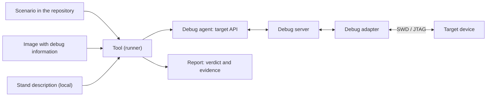

# DDTT: debugger-driven on-target testing

[Documentation](index.md) → DDTT specification · [Русский](../ru/DDTT.md)

**Debugger-Driven On-Target Testing (DDTT), specification 0.1 — draft.**

## Abstract

DDTT is a method of verifying embedded software in which test scenarios run on a host
computer and, through a debug interface, control the running firmware on a separate
target device. No test code is added to the firmware: a scenario reaches program
points with breakpoints, reads and compares state using the debug information of the
built image and, when needed, performs explicit injections. This specification
defines terms, principles, a role model and requirements for scenarios, stand
descriptions and tools, so that checks are repeatable, live in the project repository
and run the same way manually, in CI and on a stand in a loop — including when an AI
agent writes the scenarios.

## Status of this document

Draft 0.1 of 2026-09-28. The specification is maintained in the
[stm32-gdbtest](https://github.com/ViacheslavMezentsev/stm32-gdbtest) repository, which
is its first (reference) implementation; the specification itself does not depend on
it. Versions follow SemVer: before 1.0 incompatible changes are possible, and each one
is recorded in the [change log](#appendix-b-change-log). The Russian version is the
source; this English version is updated together with it. Feedback goes to the
repository issues.

## 1. Introduction

### 1.1. The problem

In embedded systems code does not run on the machine where it is written and built.
Unit tests on a PC check logic but not peripheral setup, interrupts, clocks, reactions
to driver errors or the behaviour of a specific MCU. Test images with a framework
inside the firmware change the very code under test, its size and memory layout.
Manual checks in a debugger are precise but not repeatable and leave no trace in the
repository. The same applies to checks an AI agent performs in a chat through a
debugger: the result stays in the conversation, not in the project.

### 1.2. The idea

A debugger already does everything needed to observe running firmware: stop it at the
right point, read variables, structures and registers using debug information, change
a value and resume. DDTT turns these actions into a scenario — a file in the
repository with an identifier, a time limit and expectations — that a tool runs on a
stand and that yields an unambiguous verdict and a machine-readable report.

### 1.3. Scope

DDTT applies when **the target device is separate from the host** and reachable through
a debug interface: microcontrollers and SoCs with SWD, JTAG, cJTAG or a similar port,
connected through a debug adapter and a debug server (for example GDB RSP). Typical
targets are Cortex-M, RISC-V and DSP MCUs, bare metal or with an RTOS.

Out of scope:

- debugging and testing processes on the same machine and OS as the tool (ordinary PC
  program debugging, including GDB on a Linux process);
- simulation and emulation of the target (they complement DDTT but are not DDTT);
- test frameworks running inside the firmware;
- control of the device environment (power, stimuli, instruments) — that is HIL; DDTT
  can be a part of it, see section 9.

## 2. Conformance

The key words **MUST**, **MUST NOT**, **SHOULD**, **SHOULD NOT** and **MAY** are to be
interpreted as described in [RFC 2119](https://www.rfc-editor.org/rfc/rfc2119) and
[RFC 8174](https://www.rfc-editor.org/rfc/rfc8174) when, and only when, they appear in
bold. Sections 1, 9, 10 and the appendices are informative; sections 2–8 are normative.

Conformance classes:

| Class | What conforms | Requirements |
| --- | --- | --- |
| DDTT scenario | A test scenario file of a project | 6.1 |
| DDTT stand description | A local description of the connection | 6.3 |
| DDTT tool | A runner that executes scenarios | 6.2, 6.4–6.8 |
| DDTT agent | An AI agent that writes and runs scenarios | 7 |

A tool conforms to **DDTT Core** if it meets all **MUST** requirements of sections 6.2,
6.4, 6.5, 6.6 and 6.8 except those marked as optional capabilities. Optional
capabilities are declared separately:

| Capability | Requirements |
| --- | --- |
| DDTT-Image — image verification and programming, full image | DDTT-6.4-4…DDTT-6.4-6 |
| DDTT-Preflight — checks without hardware | 6.7 |
| DDTT-Remote — debug server on a stand host | DDTT-6.3-4…DDTT-6.3-6 |

Requirements have permanent identifiers `DDTT-<section>-<number>` (for example
DDTT-6.1-1); numbers are never reused.

## 3. Terms

| Term | Definition |
| --- | --- |
| Host | The computer where the tool runs and the scenario executes. |
| Target device (target) | A separate device with the firmware under test (MCU, SoC), reachable through a debug interface. |
| Debug adapter | A device connecting a computer to the target's debug port (ST-Link, J-Link, CMSIS-DAP and similar). |
| Debug server | A program giving a debugger access to the target through the adapter (OpenOCD, J-Link GDB Server and similar). |
| Debug agent | The part of the tool that executes the scenario inside the debugger or through its API. |
| Image | The built firmware artifact with debug information (for example ELF with DWARF) and binary data derived from it. |
| Scenario | A unit of verification: an identifier, metadata and actions on the target through the target API. |
| Target API | Operations available to a scenario: reaching a program point, reading and comparing state, explicit injections. |
| Stand | A specific combination of target, adapter, server and their connection, described locally. |
| Stand host | The computer the adapter is connected to, when it differs from the host. |
| Stand layout | The distribution of the tool, debugger, server and adapter across computers. |
| Run | One execution of one scenario on one stand. |
| Verdict | The outcome of a run: PASS, FAIL or ERROR. |
| Preflight | Checks of the image, contracts and stand without accessing the target. |
| Injection | An explicit change of target state by a scenario (writing a value, forcing a function return). |
| Debugger influence | A change of target behaviour caused by halts, resets and injections. |

## 4. Principles

1. **Firmware without test code.** The image under test is the one that will run in the
   product, or built closely to it; no test hooks are added.
2. **Artifact identity.** The tool proves that the target runs exactly the image whose
   debug information the scenario was written against.
3. **Repeatability.** A scenario is a file in the project's version control, not an
   action in an interactive session.
4. **Stand independence.** One scenario runs with any stand layout; the stand is
   described separately and locally.
5. **Honest verdict.** An expectation mismatch (FAIL) differs from an infrastructure
   failure (ERROR); ERROR never becomes PASS.
6. **Explicit influence.** Halts, resets and injections are declared and recorded in the
   report; DDTT does not pretend to be a non-intrusive measurement.
7. **Bounded execution.** Every run is time-limited and ends with an attempt to return
   the target to operation.
8. **Hardware safety.** Irreversible actions (mass erase, option bytes, adapter firmware
   updates) are never performed implicitly.

## 5. Model



The tool reads the scenario, the image and the stand description, performs preflight
checks, obtains exclusive access to the adapter, starts the server and the agent,
verifies that the target and image match, executes the scenario, recovers the target
and writes the report. The server and adapter may be on a stand host; the connection
to it is then an authenticated channel (section 6.3).

## 6. Requirements

### 6.1. Scenario

- **DDTT-6.1-1.** A scenario **MUST** have a stable identifier unique within the project
  and **MUST** be stored in the project's version control.
- **DDTT-6.1-2.** Scenario metadata (identifier, time limit, labels, required contracts)
  **MUST** be available to the tool without executing scenario code.
- **DDTT-6.1-3.** A scenario **MUST** access the target only through the target API and
  **MUST NOT** contain commands of a specific debug server or adapter.
- **DDTT-6.1-4.** A scenario **MUST NOT** contain stand-specific data (serial numbers,
  addresses, paths, credentials).
- **DDTT-6.1-5.** A scenario **SHOULD** reference the project requirement it verifies;
  the tool **SHOULD** check that references and requirements match.
- **DDTT-6.1-6.** A scenario **MUST** express expectations as checks with a name, an
  actual and an expected value.

### 6.2. Target API

- **DDTT-6.2-1.** The API **MUST** allow reaching a given program point (a function or an
  address) and verify the stop reason and location.
- **DDTT-6.2-2.** The API **MUST** allow reading values, structure fields and registers
  using the image's debug information and **MUST** refuse when a value is unavailable
  (for example optimized out) instead of returning an arbitrary result.
- **DDTT-6.2-3.** Breakpoints **SHOULD** be hardware breakpoints; the tool **MUST** respect
  the number available on the target.
- **DDTT-6.2-4.** Injections **MUST** be explicit API operations and **MUST** be recorded in
  the report with values before and after.
- **DDTT-6.2-5.** Before a scenario runs, the target **MUST** be brought into a defined
  state (for example reset and halted at the application entry point).

### 6.3. Stand description

- **DDTT-6.3-1.** A stand description **MUST** be separate from scenarios and **MUST NOT** be
  published with the project when it contains data about specific hardware.
- **DDTT-6.3-2.** The adapter **MUST** be selected explicitly (for example by serial
  number), not by connection order.
- **DDTT-6.3-3.** Changing the stand **MUST NOT** require changing scenarios.
- **DDTT-6.3-4.** (DDTT-Remote) When the server runs on a stand host, the connection
  **MUST** be authenticated and encrypted with host authenticity verification; the server
  **SHOULD** listen only on the stand host's local interface.
- **DDTT-6.3-5.** (DDTT-Remote) A stand description **MUST NOT** contain passwords; a run
  **MUST NOT** wait for interactive input.
- **DDTT-6.3-6.** (DDTT-Remote) Losing the connection to the stand host **MUST** stop the
  server and release the adapter on the stand host.

### 6.4. Run lifecycle

- **DDTT-6.4-1.** The tool **MUST** perform a run in this order: input validation →
  exclusive adapter access → preflight → server start → connection → target check →
  image preparation → scenario → teardown → report.
- **DDTT-6.4-2.** The tool **MUST** work with an immutable copy of the image for the
  duration of the run.
- **DDTT-6.4-3.** Before accessing image memory the tool **MUST** check that the target
  matches its profile (for example by the device identifier register and memory size)
  and, according to the project policy, warn or refuse on mismatch.
- **DDTT-6.4-4.** (DDTT-Image) The tool **MUST** compare target memory with the image's
  load sections and state explicitly in the report what was verified (sections, the
  full range, a checksum).
- **DDTT-6.4-5.** (DDTT-Image) Memory programming **MUST** follow the stand policy; a
  verify-only mode **MUST NOT** write memory.
- **DDTT-6.4-6.** (DDTT-Image) Irreversible operations (mass erase, option bytes, read
  protection) **MUST NOT** be performed without explicit instruction.
- **DDTT-6.4-7.** Scenario execution **MUST** be limited by an external time limit
  enforced by the host, not by the scenario.
- **DDTT-6.4-8.** On any outcome the tool **MUST** attempt to return the target to
  operation (reset and run) and stop all started processes including children; the
  recovery result **MUST** be in the report.

### 6.5. Verdict and report

- **DDTT-6.5-1.** The verdict **MUST** be one of: PASS — all checks passed; FAIL — a
  scenario check did not match; ERROR — an input, infrastructure or target failure or an
  unexpected exception.
- **DDTT-6.5-2.** The tool **MUST** produce a machine-readable report (for example JSON and
  JUnit XML) on any outcome once the run has started and return an exit code matching
  the verdict.
- **DDTT-6.5-3.** The report **MUST** contain the scenario identifier, the image hash, the
  checks, the evidence scope of image verification, the injections performed and the
  teardown method.
- **DDTT-6.5-4.** The report **SHOULD** contain the debugger, server and adapter versions
  observed during the run and **MUST NOT** contain credentials or personal paths.
- **DDTT-6.5-5.** Logs of all started processes **MUST** be kept next to the report.

### 6.6. Exclusive access

- **DDTT-6.6-1.** The tool **MUST** obtain exclusive access to the adapter before first
  accessing it and hold it until the server has stopped.
- **DDTT-6.6-2.** A busy adapter **MUST** give ERROR without waiting and without accessing
  the target.
- **DDTT-6.6-3.** Signs that a previous owner crashed **SHOULD** be detected and reported
  without killing foreign processes or resetting the target.

### 6.7. Preflight (DDTT-Preflight)

- **DDTT-6.7-1.** All steps that do not need the target (image, build provenance,
  contracts, stand description, binary data preparation) **MUST** be available as a
  separate mode that does not access the adapter.
- **DDTT-6.7-2.** Contracts — declarative expectations about the image (functions, types,
  fields, enumeration values, macro expansions) — **MUST** be checked before the server
  starts; an unmet contract **MUST** give ERROR.
- **DDTT-6.7-3.** The preflight mode **SHOULD** be used in CI without hardware.

### 6.8. Automation

- **DDTT-6.8-1.** The tool **MUST** run non-interactively from the command line and
  **SHOULD** integrate with the project's build and test system.
- **DDTT-6.8-2.** The same scenario **MUST** run unchanged manually, in a CI runner and in a
  repeated loop on a stand.
- **DDTT-6.8-3.** The tool **SHOULD** provide stand environment diagnostics without
  accessing the target.

## 7. Scenarios created by agents

- **DDTT-7-1.** A check performed by an AI agent **MUST** be written as a scenario per
  section 6.1 and stored in the repository; a result in a conversation is not a check.
- **DDTT-7-2.** An agent **MUST** run preflight before running on hardware and **MUST** hand
  the run report to a person, not its own retelling.
- **DDTT-7-3.** An agent **MUST NOT** change the stand, the adapter firmware or irreversible
  target settings without the stand owner's confirmation.
- **DDTT-7-4.** An agent **MUST NOT** rerun to obtain a PASS or hide an ERROR.

## 8. Security considerations

- Debug access gives full control over the target; network-reachable stands **MUST** be
  protected like administrative access: keys instead of passwords, host authenticity
  verification, the server on the local interface only.
- Stand descriptions contain serial numbers, addresses and paths and are not published.
- Injections may cause dangerous behaviour of connected equipment (motors, power
  circuits); the scenario author is responsible for the safety of an injection, the
  stand owner for whether experiments are acceptable on it.
- Debugger influence changes timing; DDTT does not replace measurements of time,
  current and signals.

## 9. Relation to other approaches (informative)

| Approach | Difference from DDTT |
| --- | --- |
| Unit tests on a PC (SIL) | Check logic off-target; DDTT checks the running firmware on the target |
| Tests inside the firmware (Unity, Ceedling on target, Zephyr Twister) | Add test code to the image; DDTT leaves the image unchanged |
| Processor-in-the-Loop (PIL) | Runs generated code on the target processor and compares with a model; DDTT checks the project firmware through the debugger |
| Hardware-in-the-Loop (HIL) | Controls the device environment (stimuli, load, power); DDTT observes and acts from inside through the debug port. DDTT combined with environment control gives full HIL |
| Board farm control (labgrid and similar) | Power, console and flashing of stands; DDTT can use such a farm as a stand |
| Manual debugging, debugger scripts | The same actions without repeatability, a verdict or a report |

The abbreviation DDTT should not be confused with DDT — data-driven testing, the Python
`ddt` library and the Linaro DDT debugger.

## 10. Reference implementation (informative)

[stm32-gdbtest](../../README.en.md) implements DDTT Core and the DDTT-Image,
DDTT-Preflight and DDTT-Remote capabilities for STM32 Cortex-M0/M3/M4 through
GDB-Python and the OpenOCD, ST-LINK GDB Server and J-Link GDB Server servers on Windows
and Linux. Implementation requirements are in the
[specification](../TECHNICAL_SPECIFICATION.md) (Russian), verified configurations in the
[status](STATUS.md).

| DDTT requirements | stm32-gdbtest |
| --- | --- |
| 6.1 | The `@case` decorator, metadata collection without import, `Tests/requirements.md` and traceability |
| 6.2 | Target API: `reach`, `value`, `fields`, `check`, `set_value`, `force_return`, hardware breakpoints within the profile budget |
| 6.3 | Local TOML `[probe]` and `[remote]`, `*.local.toml` not committed, SSH with keys only |
| 6.4 | ELF snapshot, DEV_ID identity and Flash size, section or full-image verification with CRC-32, `if-different`/`verify-only` policy, host recovery |
| 6.5 | `result.json`, `junit.xml`, compatibility manifest, logs in the run directory |
| 6.6 | Windows mutex, Linux `flock`, stand host lock |
| 6.7 | `run --prepare-only`, ELF/HAL contracts, build manifest |
| 6.8 | CLI, CTest, `run_hw.py`, `doctor`, CI workflows |

## Appendix A. Example scenario (informative)

```python
from stm32_gdbtest import case

@case("HW_GPIO", timeout_s=20, labels=("gpio",), contracts=("gpio_macros",))
def gpio(t):
    t.reach("loop")                                           # DDTT-6.2-1
    t.check("GPIOC clock", t.value("__HAL_RCC_GPIOC_IS_CLK_ENABLED()"), 1)   # 6.2-2, 6.1-6
```

## Appendix B. Change log

| Version | Date | Changes |
| --- | --- | --- |
| 0.1 | 2026-09-28 | First draft: scope, terms, principles, model, requirements for scenarios, the target API, stands, the run lifecycle, reports, access, preflight, automation and agent scenarios; the stm32-gdbtest reference implementation |
