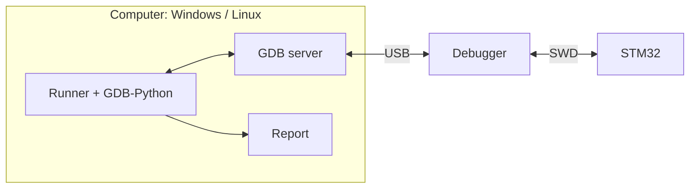
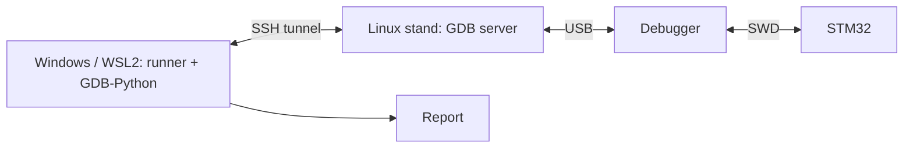
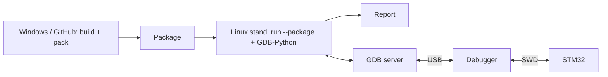
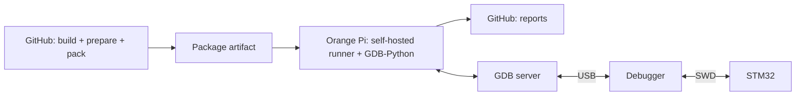
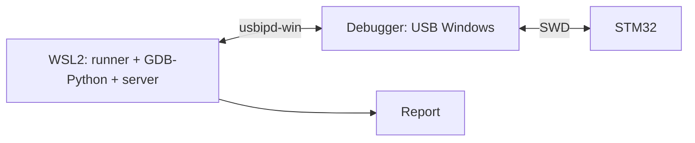

# Run layouts

[Documentation](index.md) → Run layouts · [Русский](../ru/RUN_LAYOUTS.md)

The scenario and the report are the same in every layout; only the local stand file
(`*.local.toml`, `remote.toml`) changes, and it stays with the user.

| Layout | Runner and GDB | GDB server and debugger | New 0.4.0 scenario verification |
| --- | --- | --- | --- |
| Local on Windows | Windows | same computer, st-util 1.9.0 / J-Link | 6 boards, separate runs: 24 PASS + 6 SKIP |
| Local on a Linux stand | Orange Pi 5, Ubuntu 20.04 aarch64 | same computer, st-util 1.9.0 / J-Link | 6 boards, separate runs: 24 PASS + 6 SKIP, triggered through GitHub |
| Remote server from Windows | Windows | Orange Pi 5 over SSH, st-util 1.9.0 | 5 boards: 20 PASS + 5 SKIP |
| Remote server from WSL2 | WSL2, Ubuntu 20.04 x86_64 | Orange Pi 5 over SSH, st-util 1.9.0 | 5 boards: 20 PASS + 5 SKIP |
| Prepared run package | package built separately, runner at execution site | Windows or Orange Pi 5 | checked in the local and SSH layouts above |
| Hardware CI | prepare on GitHub, runner/GDB on Orange Pi 5 | same Orange Pi, no SSH between runner and server | Hardware #13 + #14: 6 boards, 24 PASS + 6 SKIP |
| Local on Linux x86_64 | Linux PC | same computer | not hardware-verified |
| WSL2 USB forwarding | WSL2 | USB through usbipd-win | not hardware-verified |

The local-Linux and hardware-CI rows share evidence from #13/#14; do not add them together.
Six-board totals combine separate STM32 and AT32 runs at different SHAs, not one campaign.
Each board ran four new scenarios and a separate expected-SKIP variant.
This is a selected suite, not full API reacceptance. Versions, SHAs, original errors and limits:
[0.4.0 evidence](API040_SCENARIOS.md). Full 0.3.0 campaigns (218 profile/scenario combinations),
the 0.4.0 SSH campaign (233), and the ten-stage lifecycle remain in the [acceptance matrix](API_ACCEPTANCE.md).

### Local run: Windows or Linux

Runner, GDB-Python and server share one computer. This covers Windows
and Orange Pi; local Linux x86_64 has not yet been verified on hardware.

### Remote server: Windows or WSL2 → Linux stand

Runner and scenario stay on the workstation. SSH starts the server on the stand
and tunnels the GDB connection. The debugger is physically attached to the stand.

### Package: build separately from execution

A package containing ELF, profile and scenarios is transferred to the stand.
`run --package` runs both GDB-Python and the server there; reports stay there too.

### Hardware CI: GitHub and a self-hosted runner

A GitHub-hosted job builds and prepares the package without a board. A self-hosted
job on Orange Pi downloads it, runs hardware checks and uploads reports.

### WSL2 USB forwarding: not hardware-verified

All test processes run in WSL2; Windows forwards the USB device into Linux
through usbipd-win. This distinct layout has not yet been verified on boards.

Remote mode uses SSH keys only; the debugger lock is held on the stand host and the
link is watched by a heartbeat. ST-LINK GDB Server is not available on Linux aarch64
(ST does not ship it for arm64), so OpenOCD, J-Link and st-util are used on Orange Pi.
Details: [Linux stand](LINUX_STAND.md), [GDB servers](BACKENDS.md).

**Reading the counters.** The Hardware badge describes the recorded full 0.4.0 SSH campaign:
five STM32 boards, 233 profile/scenario combinations, dated 2026-10-10. It does not add selected-suite
reruns or certify the final SHA or every backend. Badges are static, not coverage percentages.
Scope and previous snapshots: [metric definitions](HARDWARE_METRICS.md).

