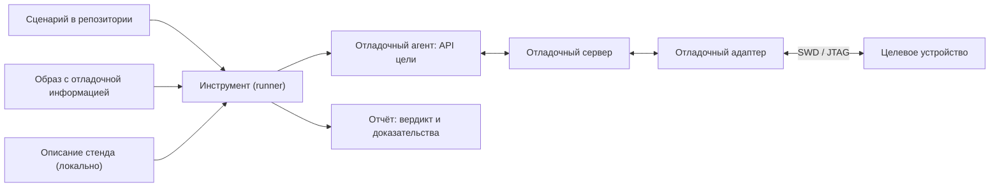

# DDTT: тестирование через отладчик на целевом устройстве

[Документация](index.md) → Спецификация DDTT · [English](../en/DDTT.md)

**Debugger-Driven Testing on Target (DDTT), спецификация 0.2 — черновик.**

## Аннотация

DDTT — метод проверки встраиваемого ПО, при котором тестовые сценарии выполняются
на хост-компьютере и через отладочный интерфейс управляют работающей прошивкой на
отдельном целевом устройстве. В прошивку не добавляется тестовый код: сценарий
достигает точек программы с помощью точек останова, читает и сравнивает состояние по
отладочной информации собранного образа и при необходимости выполняет явные
инъекции. Спецификация задаёт термины, принципы, модель ролей и требования к
сценариям, описаниям стендов и инструментам, чтобы проверки были повторяемыми,
хранились в репозитории проекта и выполнялись одинаково вручную, в CI и на стенде в
цикле — в том числе когда сценарии пишет ИИ-агент.

## Статус документа

Черновик 0.2 от 28.09.2026. Спецификация ведётся в репозитории
[stm32-gdbtest](https://github.com/ViacheslavMezentsev/stm32-gdbtest), который
является её первой (эталонной) реализацией; сама спецификация от реализации не
зависит. Версии нумеруются по SemVer: до 1.0 возможны несовместимые изменения,
каждое отражается в [журнале изменений](#приложение-b-журнал-изменений). Русская
версия исходная, [английская](../en/DDTT.md) обновляется вместе с ней. Замечания —
через issues репозитория.

## 1. Введение

### 1.1. Проблема

Во встраиваемых системах код работает не на той машине, где его пишут и собирают.
Unit-тесты на ПК проверяют логику, но не настройку периферии, прерывания, тактирование,
реакцию на ошибки драйверов и поведение конкретного MCU. Тестовые образы с каркасом
внутри прошивки меняют сам проверяемый код, размер и распределение памяти. Ручная
проверка в отладчике точна, но не повторяется и не оставляет следов в репозитории.
То же относится к проверкам, которые ИИ-агент выполняет в диалоге через отладчик:
результат остаётся в переписке, а не в проекте.

### 1.2. Идея

Отладчик уже умеет всё, что нужно для наблюдения за работающей прошивкой: остановить
её в нужной точке, прочитать переменные, структуры и регистры по отладочной
информации, изменить значение, вернуть управление. DDTT превращает эти действия в
сценарий — файл в репозитории с идентификатором, пределом времени и ожиданиями, —
который инструмент выполняет на стенде и который даёт однозначный вердикт и
машиночитаемый отчёт.

### 1.3. Область применения

DDTT применяется, когда **целевое устройство отделено от хоста** и доступно через
отладочный интерфейс: микроконтроллеры и SoC с SWD, JTAG, cJTAG или аналогичным
портом, подключённые через отладочный адаптер и отладочный сервер (например, GDB
RSP). Типичные цели — MCU Cortex-M, RISC-V и DSP без ОС или с RTOS.

Название отражает это разделение. **Тестирование через отладчик** (debugger-driven
testing) — общее понятие: сценарий управляет проверяемым кодом через отладчик. Оно
применимо и к программам на ПК, где отладчик и код работают на одной машине и ОС.
**DDTT** (debugger-driven testing **on target**) — его вариант для отдельного целевого
устройства, которому посвящена эта спецификация. Общее понятие пишется полностью, без
сокращения: DDT уже занято (раздел 9).

Вне области:

- отладка и тестирование процессов на той же машине и ОС, где работает инструмент
  (обычная отладка программ ПК, в том числе GDB на Linux-процессе);
- симуляция и эмуляция цели (они дополняют DDTT, но не являются им);
- тестовые каркасы, выполняющиеся внутри прошивки;
- управление окружением устройства (питание, стимулы, приборы) — это HIL; DDTT может
  быть его частью, см. раздел 9.

## 2. Соответствие

Ключевые слова **ДОЛЖЕН** (MUST), **НЕ ДОЛЖЕН** (MUST NOT), **СЛЕДУЕТ** (SHOULD),
**НЕ СЛЕДУЕТ** (SHOULD NOT) и **МОЖЕТ** (MAY) понимаются по
[RFC 2119](https://www.rfc-editor.org/rfc/rfc2119) и
[RFC 8174](https://www.rfc-editor.org/rfc/rfc8174), когда написаны полужирным.
Разделы 1, 9, 10 и приложения информативны; разделы 2–8 нормативны.

Классы соответствия:

| Класс | Кто соответствует | Требования |
| --- | --- | --- |
| Сценарий DDTT | Файл тестового сценария проекта | 6.1 |
| Описание стенда DDTT | Локальное описание подключения | 6.3 |
| Инструмент DDTT | Runner, выполняющий сценарии | 6.2, 6.4–6.8 |
| Агент DDTT | ИИ-агент, который пишет и запускает сценарии | 7 |

Инструмент соответствует **DDTT Core**, если выполняет все требования **ДОЛЖЕН**
разделов 6.2, 6.4, 6.5, 6.6 и 6.8, кроме помеченных как дополнительные возможности.
Дополнительные возможности объявляются отдельно:

| Возможность | Требования |
| --- | --- |
| DDTT-Image — проверка и запись образа, полный образ | DDTT-6.4-4…DDTT-6.4-6 |
| DDTT-Preflight — проверки без оборудования | 6.7 |
| DDTT-Remote — отладочный сервер на хосте стенда | DDTT-6.3-4…DDTT-6.3-6 |

Требования имеют постоянные идентификаторы `DDTT-<раздел>-<номер>` (например,
DDTT-6.1-1); номер не переиспользуется.

## 3. Термины

| Термин | Определение |
| --- | --- |
| Тестирование через отладчик | Общее понятие: сценарий управляет проверяемым кодом через отладчик — на ПК или на отдельном устройстве. Сокращение не используется. |
| DDTT | Тестирование через отладчик на отдельном целевом устройстве (debugger-driven testing on target) — предмет этой спецификации. |
| Хост | Компьютер, на котором работает инструмент и выполняется сценарий. |
| Целевое устройство (цель) | Отдельное устройство с проверяемой прошивкой (MCU, SoC), доступное через отладочный интерфейс. |
| Отладочный адаптер | Устройство, соединяющее компьютер с отладочным портом цели (ST-Link, J-Link, CMSIS-DAP и т. п.). |
| Отладочный сервер | Программа, предоставляющая отладчику доступ к цели через адаптер (OpenOCD, J-Link GDB Server и т. п.). |
| Отладочный агент | Часть инструмента, которая выполняет сценарий внутри отладчика или через его API. |
| Образ | Собранный артефакт прошивки с отладочной информацией (например, ELF с DWARF) и производные от него двоичные данные. |
| Сценарий | Единица проверки: идентификатор, метаданные и действия над целью через API цели. |
| API цели | Операции, доступные сценарию: достижение точки программы, чтение и сравнение состояния, явные инъекции. |
| Стенд | Конкретное сочетание цели, адаптера, сервера и их подключения, описанное локально. |
| Хост стенда | Компьютер, к которому подключён адаптер, если он отличается от хоста. |
| Схема размещения стенда | Распределение инструмента, отладчика, сервера и адаптера по компьютерам. |
| Запуск | Однократное выполнение одного сценария на одном стенде. |
| Вердикт | Итог запуска: PASS, FAIL или ERROR. |
| Предварительная проверка | Проверка образа, контрактов и стенда без обращения к цели. |
| Инъекция | Явное изменение состояния цели сценарием (запись значения, принудительный возврат из функции). |
| Влияние отладчика | Изменение поведения цели из-за остановок, сброса и инъекций. |

## 4. Принципы

1. **Прошивка без тестового кода.** Проверяется тот образ, который будет работать в
   изделии или близкий к нему по сборке; тестовые хуки в него не добавляются.
2. **Идентичность артефактов.** Инструмент доказывает, что на цели работает именно
   тот образ, по отладочной информации которого написан сценарий.
3. **Повторяемость.** Сценарий — файл в системе контроля версий проекта, а не
   действие в интерактивном сеансе.
4. **Независимость от стенда.** Один сценарий выполняется при любой схеме размещения;
   стенд описывается отдельно и локально.
5. **Честный вердикт.** Несовпадение ожидания (FAIL) отличается от отказа
   инфраструктуры (ERROR); ERROR никогда не превращается в PASS.
6. **Явное влияние.** Остановки, сброс и инъекции объявляются и записываются в отчёт;
   DDTT не выдаёт себя за невмешивающееся измерение.
7. **Ограниченное выполнение.** Каждый запуск ограничен по времени и завершается
   попыткой вернуть цель в работу.
8. **Безопасность оборудования.** Необратимые действия (массовое стирание, байты
   конфигурации, обновление прошивки адаптера) не выполняются неявно.

## 5. Модель



Инструмент читает сценарий, образ и описание стенда, выполняет предварительные
проверки, получает исключительный доступ к адаптеру, запускает сервер и агента,
проверяет идентичность цели и образа, выполняет сценарий, восстанавливает цель и
формирует отчёт. Сервер и адаптер могут находиться на хосте стенда; тогда связь с
ним — аутентифицированный канал (раздел 6.3).

## 6. Требования

### 6.1. Сценарий

- **DDTT-6.1-1.** Сценарий **ДОЛЖЕН** иметь стабильный уникальный идентификатор в
  пределах проекта и **ДОЛЖЕН** храниться в системе контроля версий проекта.
- **DDTT-6.1-2.** Метаданные сценария (идентификатор, предел времени, метки, требуемые
  контракты) **ДОЛЖНЫ** быть доступны инструменту без выполнения кода сценария.
- **DDTT-6.1-3.** Сценарий **ДОЛЖЕН** обращаться к цели только через API цели и **НЕ
  ДОЛЖЕН** содержать команды конкретного отладочного сервера или адаптера.
- **DDTT-6.1-4.** Сценарий **НЕ ДОЛЖЕН** содержать сведения о конкретном стенде
  (серийные номера, адреса, пути, учётные данные).
- **DDTT-6.1-5.** Сценарию **СЛЕДУЕТ** ссылаться на проверяемое требование проекта;
  инструменту **СЛЕДУЕТ** проверять соответствие ссылок и требований.
- **DDTT-6.1-6.** Сценарий **ДОЛЖЕН** выражать ожидания проверками с именем,
  фактическим и ожидаемым значением.

### 6.2. API цели

- **DDTT-6.2-1.** API **ДОЛЖЕН** позволять достичь указанной точки программы
  (функции или адреса) с проверкой причины и места остановки.
- **DDTT-6.2-2.** API **ДОЛЖЕН** позволять читать значения, поля структур и регистры по
  отладочной информации образа и **ДОЛЖЕН** отказывать, если значение недоступно
  (например, оптимизировано), вместо возврата произвольного результата.
- **DDTT-6.2-3.** Точки останова **СЛЕДУЕТ** ставить аппаратными; инструмент **ДОЛЖЕН**
  учитывать их число, доступное на цели.
- **DDTT-6.2-4.** Инъекции **ДОЛЖНЫ** быть явными операциями API и **ДОЛЖНЫ**
  записываться в отчёт со значениями до и после.
- **DDTT-6.2-5.** Перед выполнением сценария цель **ДОЛЖНА** быть приведена в
  определённое состояние (например, сброс и остановка в точке входа приложения).

### 6.3. Описание стенда

- **DDTT-6.3-1.** Описание стенда **ДОЛЖНО** быть отделено от сценариев и **НЕ ДОЛЖНО**
  публиковаться вместе с проектом, если содержит сведения о конкретном оборудовании.
- **DDTT-6.3-2.** Адаптер **ДОЛЖЕН** выбираться явно (например, по серийному номеру), а
  не по порядку подключения.
- **DDTT-6.3-3.** Смена стенда **НЕ ДОЛЖНА** требовать изменения сценариев.
- **DDTT-6.3-4.** (DDTT-Remote) Если сервер работает на хосте стенда, связь **ДОЛЖНА**
  идти по аутентифицированному и шифрованному каналу с проверкой подлинности хоста;
  сервер **СЛЕДУЕТ** слушать только локальный интерфейс хоста стенда.
- **DDTT-6.3-5.** (DDTT-Remote) Описание стенда **НЕ ДОЛЖНО** содержать пароли; запуск
  **НЕ ДОЛЖЕН** ожидать интерактивного ввода.
- **DDTT-6.3-6.** (DDTT-Remote) Потеря связи с хостом стенда **ДОЛЖНА** приводить к
  остановке сервера и освобождению адаптера на хосте стенда.

### 6.4. Жизненный цикл запуска

- **DDTT-6.4-1.** Инструмент **ДОЛЖЕН** выполнять запуск в порядке: проверка входных
  данных → исключительный доступ к адаптеру → предварительные проверки → запуск
  сервера → подключение → проверка цели → подготовка образа → сценарий → завершение
  → отчёт.
- **DDTT-6.4-2.** Инструмент **ДОЛЖЕН** работать с неизменяемой копией образа на время
  запуска.
- **DDTT-6.4-3.** Перед обращением к памяти образа инструмент **ДОЛЖЕН** проверить,
  что цель соответствует профилю (например, по регистру идентификатора устройства и
  размеру памяти), и по политике проекта предупреждать или отказывать при
  несовпадении.
- **DDTT-6.4-4.** (DDTT-Image) Инструмент **ДОЛЖЕН** сравнить содержимое памяти цели с
  загружаемыми секциями образа и явно указать в отчёте, что проверено (секции, полный
  диапазон, контрольная сумма).
- **DDTT-6.4-5.** (DDTT-Image) Запись памяти **ДОЛЖНА** выполняться только по политике
  стенда; режим «только проверка» **НЕ ДОЛЖЕН** записывать память.
- **DDTT-6.4-6.** (DDTT-Image) Необратимые операции (массовое стирание, байты
  конфигурации, защита чтения) **НЕ ДОЛЖНЫ** выполняться без явного указания.
- **DDTT-6.4-7.** Выполнение сценария **ДОЛЖНО** ограничиваться внешним пределом
  времени, который контролирует хост, а не сценарий.
- **DDTT-6.4-8.** При любом исходе инструмент **ДОЛЖЕН** попытаться вернуть цель в
  работу (сброс и запуск) и остановить все запущенные процессы, включая дочерние;
  результат восстановления **ДОЛЖЕН** быть в отчёте.

### 6.5. Вердикт и отчёт

- **DDTT-6.5-1.** Вердикт **ДОЛЖЕН** быть одним из: PASS — все проверки прошли; FAIL —
  проверка сценария не совпала; ERROR — отказ входных данных, инфраструктуры, цели
  или неожиданное исключение.
- **DDTT-6.5-2.** Инструмент **ДОЛЖЕН** формировать машиночитаемый отчёт (например,
  JSON и JUnit XML) при любом исходе после начала запуска и возвращать код
  завершения, соответствующий вердикту.
- **DDTT-6.5-3.** Отчёт **ДОЛЖЕН** содержать идентификатор сценария, хэш образа,
  проверки, область доказательства проверки образа, выполненные инъекции и способ
  завершения.
- **DDTT-6.5-4.** Отчёту **СЛЕДУЕТ** содержать версии отладчика, сервера и адаптера,
  полученные во время запуска, и **НЕ ДОЛЖЕН** содержать учётные данные и личные пути.
- **DDTT-6.5-5.** Журналы всех запущенных процессов **ДОЛЖНЫ** сохраняться рядом с
  отчётом.

### 6.6. Исключительный доступ

- **DDTT-6.6-1.** Инструмент **ДОЛЖЕН** получать исключительный доступ к адаптеру до
  первого обращения к нему и удерживать его до остановки сервера.
- **DDTT-6.6-2.** Занятый адаптер **ДОЛЖЕН** давать ERROR без ожидания и без обращения
  к цели.
- **DDTT-6.6-3.** Признаки аварийного завершения прежнего владельца **СЛЕДУЕТ**
  обнаруживать и сообщать, не завершая чужие процессы и не сбрасывая цель.

### 6.7. Предварительные проверки (DDTT-Preflight)

- **DDTT-6.7-1.** Все шаги, не требующие цели (проверка образа, происхождения сборки,
  контрактов, описания стенда, подготовка двоичных данных), **ДОЛЖНЫ** выполняться
  отдельным режимом без обращения к адаптеру.
- **DDTT-6.7-2.** Контракты — декларативные ожидания к образу (наличие функций, типы,
  поля, значения перечислений, раскрытие макросов) — **ДОЛЖНЫ** проверяться до
  запуска сервера; невыполненный контракт **ДОЛЖЕН** давать ERROR.
- **DDTT-6.7-3.** Режим предварительных проверок **СЛЕДУЕТ** использовать в CI без
  оборудования.

### 6.8. Автоматизация

- **DDTT-6.8-1.** Инструмент **ДОЛЖЕН** запускаться неинтерактивно из командной строки
  и **СЛЕДУЕТ** интегрироваться с системой сборки и тестов проекта.
- **DDTT-6.8-2.** Один и тот же сценарий **ДОЛЖЕН** запускаться без изменений вручную,
  в раннере CI и в повторяющемся цикле на стенде.
- **DDTT-6.8-3.** Инструменту **СЛЕДУЕТ** предоставлять диагностику окружения стенда
  без обращения к цели.

## 7. Сценарии, созданные агентами

- **DDTT-7-1.** Проверка, выполненная ИИ-агентом, **ДОЛЖНА** оформляться сценарием по
  разделу 6.1 и сохраняться в репозитории; результат в переписке не считается
  проверкой.
- **DDTT-7-2.** Агент **ДОЛЖЕН** выполнять предварительные проверки до запуска на
  оборудовании и **ДОЛЖЕН** передавать человеку отчёт запуска, а не собственный пересказ.
- **DDTT-7-3.** Агент **НЕ ДОЛЖЕН** менять стенд, прошивку адаптера и необратимые
  настройки цели без подтверждения владельца стенда.
- **DDTT-7-4.** Агент **НЕ ДОЛЖЕН** повторять запуск ради PASS и скрывать ERROR.

## 8. Безопасность

- Отладочный доступ даёт полный контроль над целью; стенды с доступом по сети
  **ДОЛЖНЫ** защищаться как административный доступ: ключи вместо паролей, проверка
  подлинности хоста, сервер только на локальном интерфейсе.
- Описания стендов содержат серийные номера, адреса и пути и не публикуются.
- Инъекции могут вызвать опасное поведение подключённого оборудования (двигатели,
  силовые цепи); автор сценария отвечает за безопасность инъекции, а владелец стенда —
  за допустимость опытов на нём.
- Влияние отладчика меняет временные характеристики; DDTT не заменяет измерения
  времени, тока и сигналов.

## 9. Связь с другими подходами (информативно)

| Подход | Отличие от DDTT |
| --- | --- |
| Unit-тесты на ПК (SIL) | Проверяют логику вне цели; DDTT — работающую прошивку на цели |
| Тесты внутри прошивки (Unity, Ceedling на цели, Zephyr Twister) | Добавляют тестовый код в образ; DDTT образ не меняет |
| Processor-in-the-Loop (PIL) | Запускает сгенерированный код на целевом процессоре и сверяет с моделью; DDTT проверяет прошивку проекта через отладчик |
| Hardware-in-the-Loop (HIL) | Управляет окружением устройства (стимулы, нагрузка, питание); DDTT наблюдает и управляет изнутри через отладочный порт. Сочетание DDTT и управления окружением даёт полноценный HIL |
| Управление фермами плат (labgrid и т. п.) | Питание, консоль, прошивка стендов; DDTT может использовать такую ферму как стенд |
| Ручная отладка, скрипты отладчика | Те же действия без повторяемости, вердикта и отчёта |

Сокращение DDTT не следует путать с DDT — data-driven testing, Python-библиотекой
`ddt` и отладчиком Linaro DDT.

## 10. Эталонная реализация (информативно)

[stm32-gdbtest](../../README.md) реализует DDTT Core и возможности DDTT-Image,
DDTT-Preflight и DDTT-Remote для STM32 Cortex-M0/M3/M4 через GDB-Python и серверы
OpenOCD, ST-LINK GDB Server и J-Link GDB Server на Windows и Linux. Требования
реализации — в [ТЗ](../TECHNICAL_SPECIFICATION.md), проверенные конфигурации — в
[текущем состоянии](STATUS.md).

| Требования DDTT | stm32-gdbtest |
| --- | --- |
| 6.1 | Декоратор `@case`, сбор метаданных без импорта, `Tests/requirements.md` и traceability |
| 6.2 | Target API: `reach`, `value`, `fields`, `check`, `set_value`, `force_return`, аппаратные точки останова с бюджетом профиля |
| 6.3 | Локальный TOML `[probe]` и `[remote]`, `*.local.toml` не коммитятся, SSH только по ключу |
| 6.4 | Снимок ELF, identity DEV_ID и размер Flash, проверка секций или полного образа с CRC-32, политика `if-different`/`verify-only`, recovery на хосте |
| 6.5 | `result.json`, `junit.xml`, compatibility manifest, журналы в каталоге запуска |
| 6.6 | Windows mutex, Linux `flock`, блокировка хоста стенда |
| 6.7 | `run --prepare-only`, ELF/HAL-контракты, build manifest |
| 6.8 | CLI, CTest, `run_hw.py`, `doctor`, workflow CI |

## Приложение A. Пример сценария (информативно)

```python
from stm32_gdbtest import case

@case("HW_GPIO", timeout_s=20, labels=("gpio",), contracts=("gpio_macros",))
def gpio(t):
    t.reach("loop")                                           # DDTT-6.2-1
    t.check("GPIOC clock", t.value("__HAL_RCC_GPIOC_IS_CLK_ENABLED()"), 1)   # 6.2-2, 6.1-6
```

## Приложение B. Журнал изменений

| Версия | Дата | Изменения |
| --- | --- | --- |
| 0.2 | 28.09.2026 | Название уточнено: Debugger-Driven Testing on Target вместо Debugger-Driven On-Target Testing; введено общее понятие «тестирование через отладчик», DDTT — его вариант для отдельного целевого устройства (1.3, 3). Требования не изменились |
| 0.1 | 28.09.2026 | Первый черновик: область, термины, принципы, модель, требования к сценариям, API цели, стендам, жизненному циклу, отчётам, доступу, предварительным проверкам, автоматизации и сценариям агентов; эталонная реализация stm32-gdbtest |
