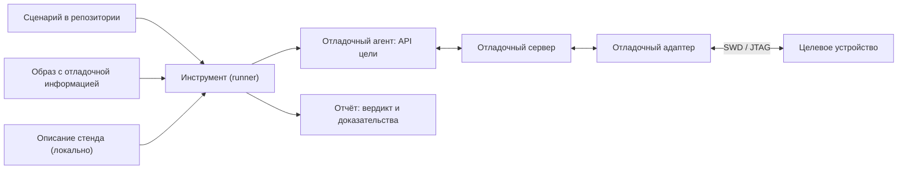

# DDTT: тестирование через отладчик на целевом устройстве

[Документация](index.md) → Спецификация DDTT · [English](../en/DDTT.md)

**Debugger-Driven Testing on Target (DDTT), спецификация 0.3.0 — черновик.**

## Аннотация

DDTT — метод проверки встраиваемого ПО, при котором тестовые сценарии выполняются
на хост-компьютере и через отладочный интерфейс управляют работающей прошивкой на
отдельном целевом устройстве. В прошивку не добавляется тестовый код: сценарий
достигает точек программы с помощью точек останова, читает и сравнивает состояние по
отладочной информации собранного образа и при необходимости выполняет явные
инъекции. Спецификация задаёт термины, принципы, модель ролей и требования к
сценариям, описаниям стендов и инструментам, чтобы проверки были повторяемыми,
хранились в репозитории проекта и выполнялись одинаково вручную, в CI и на стенде в
цикле — в том числе когда сценарии пишет ИИ-агент.

## Статус документа

Черновик 0.3.0 от 10.10.2026. Спецификация ведётся в репозитории
[stm32-gdbtest](https://github.com/ViacheslavMezentsev/stm32-gdbtest), который
является её первой (эталонной) реализацией; сама спецификация от реализации не
зависит. Версии нумеруются по SemVer: до 1.0 возможны несовместимые изменения,
каждое отражается в [журнале изменений](#приложение-b-журнал-изменений). Русская
версия исходная, [английская](../en/DDTT.md) обновляется вместе с ней. Замечания —
через issues репозитория.

Уточнения нормативного текста 0.3.0 предлагаются для согласования. Они не меняют
контракты выпущенного модуля; их источники — [ТЗ API](../TECHNICAL_SPECIFICATION_API.md)
и [общее ТЗ](../TECHNICAL_SPECIFICATION.md).

## 1. Введение

### 1.1. Проблема

Во встраиваемых системах код работает не на той машине, где его пишут и собирают.
Unit-тесты на ПК проверяют логику, но не настройку периферии, прерывания, тактирование,
реакцию на ошибки драйверов и поведение конкретного MCU. Тестовые образы с каркасом
внутри прошивки меняют сам проверяемый код, размер и распределение памяти. Ручная
проверка в отладчике точна, но не повторяется и не оставляет следов в репозитории.
То же относится к проверкам, которые ИИ-агент выполняет в диалоге через отладчик:
результат остаётся в переписке, а не в проекте.

### 1.2. Идея

Отладчик уже умеет всё, что нужно для наблюдения за работающей прошивкой: остановить
её в нужной точке, прочитать переменные, структуры и регистры по отладочной
информации, изменить значение, вернуть управление. DDTT превращает эти действия в
сценарий — файл в репозитории с идентификатором, пределом времени и ожиданиями, —
который инструмент выполняет на стенде и который даёт однозначный вердикт и
машиночитаемый отчёт.

### 1.3. Область применения

DDTT применяется, когда **целевое устройство отделено от хоста** и доступно через
отладочный интерфейс: микроконтроллеры и SoC с SWD, JTAG, cJTAG или аналогичным
портом, подключённые через отладочный адаптер и отладочный сервер (например, GDB
RSP). Типичные цели — MCU Cortex-M, RISC-V и DSP без ОС или с RTOS.

Название отражает это разделение. **Тестирование через отладчик** (debugger-driven
testing) — общее понятие: сценарий управляет проверяемым кодом через отладчик. Оно
применимо и к программам на ПК, где отладчик и код работают на одной машине и ОС.
**DDTT** (debugger-driven testing **on target**) — его вариант для отдельного целевого
устройства, которому посвящена эта спецификация. Общее понятие пишется полностью, без
сокращения: DDT уже занято (раздел 9).

Вне области:

- отладка и тестирование процессов на той же машине и ОС, где работает инструмент
  (обычная отладка программ ПК, в том числе GDB на Linux-процессе);
- симуляция и эмуляция цели (они дополняют DDTT, но не являются им);
- тестовые каркасы, выполняющиеся внутри прошивки;
- управление окружением устройства (питание, стимулы, приборы) — это HIL; DDTT может
  быть его частью, см. раздел 9.

## 2. Соответствие

Ключевые слова **ДОЛЖЕН** (MUST), **НЕ ДОЛЖЕН** (MUST NOT), **СЛЕДУЕТ** (SHOULD),
**НЕ СЛЕДУЕТ** (SHOULD NOT) и **МОЖЕТ** (MAY) понимаются по
[RFC 2119](https://www.rfc-editor.org/rfc/rfc2119) и
[RFC 8174](https://www.rfc-editor.org/rfc/rfc8174), когда написаны полужирным.
Разделы 1, 9–11 и приложения информативны; разделы 2–8 нормативны.

Классы соответствия:

| Класс | Кто соответствует | Требования |
| --- | --- | --- |
| Сценарий DDTT | Файл тестового сценария проекта | 6.1 |
| Описание стенда DDTT | Локальное описание подключения | 6.3 |
| Инструмент DDTT | Runner, выполняющий сценарии | 6.2, 6.4–6.8 |
| Агент DDTT | ИИ-агент, который пишет и запускает сценарии | 7 |

Инструмент соответствует **DDTT Core**, если выполняет все требования **ДОЛЖЕН**
разделов 6.2, 6.4, 6.5, 6.6 и 6.8, кроме помеченных как дополнительные возможности.
Дополнительные возможности объявляются отдельно:

| Возможность | Требования |
| --- | --- |
| DDTT-Image — проверка и запись образа, полный образ | DDTT-6.4-4…DDTT-6.4-6 |
| DDTT-Preflight — проверки без оборудования | 6.7 |
| DDTT-Remote — отладочный сервер на хосте стенда | DDTT-6.3-4…DDTT-6.3-6 |
| DDTT-Skip — явная неприменимость сценария | DDTT-6.5-6 |

Требования имеют постоянные идентификаторы `DDTT-<раздел>-<номер>` (например,
DDTT-6.1-1); номер не переиспользуется.

## 3. Термины

| Термин | Определение |
| --- | --- |
| Тестирование через отладчик | Общее понятие: сценарий управляет проверяемым кодом через отладчик — на ПК или на отдельном устройстве. Сокращение не используется. |
| DDTT | Тестирование через отладчик на отдельном целевом устройстве (debugger-driven testing on target) — предмет этой спецификации. |
| Хост | Компьютер, на котором работает инструмент и выполняется сценарий. |
| Целевое устройство (цель) | Отдельное устройство с проверяемой прошивкой (MCU, SoC), доступное через отладочный интерфейс. |
| Отладочный адаптер | Устройство, соединяющее компьютер с отладочным портом цели (ST-Link, J-Link, CMSIS-DAP и т. п.). |
| Отладочный сервер | Программа, предоставляющая отладчику доступ к цели через адаптер (OpenOCD, J-Link GDB Server и т. п.). |
| Отладочный агент | Часть инструмента, которая выполняет сценарий внутри отладчика или через его API. |
| Образ | Собранный артефакт прошивки с отладочной информацией (например, ELF с DWARF) и производные от него двоичные данные. |
| Сценарий | Единица проверки: идентификатор, метаданные и действия над целью через API цели. |
| API цели | Операции, доступные сценарию: достижение точки программы, чтение и сравнение состояния, явные инъекции. |
| Стенд | Конкретное сочетание цели, адаптера, сервера и их подключения, описанное локально. |
| Хост стенда | Компьютер, к которому подключён адаптер, если он отличается от хоста. |
| Схема размещения стенда | Распределение инструмента, отладчика, сервера и адаптера по компьютерам. |
| Запуск | Однократное выполнение одного сценария на одном стенде. |
| Вердикт | Итог сценария: PASS, FAIL, ERROR; при DDTT-Skip также SKIP. Код команды дополнительно отражает ошибки обязательных артефактов. |
| Предварительная проверка | Проверка образа, контрактов и стенда без обращения к цели. |
| Инъекция | Явное изменение состояния цели сценарием (запись значения, принудительный возврат из функции). |
| Влияние отладчика | Изменение поведения цели из-за остановок, сброса и инъекций. |

## 4. Принципы

1. **Прошивка без тестового кода.** Проверяется тот образ, который будет работать в
   изделии или близкий к нему по сборке; тестовые хуки в него не добавляются.
2. **Идентичность артефактов.** Инструмент доказывает, что на цели работает именно
   тот образ, по отладочной информации которого написан сценарий.
3. **Повторяемость.** Сценарий — файл в системе контроля версий проекта, а не
   действие в интерактивном сеансе.
4. **Независимость от стенда.** Один сценарий выполняется при любой схеме размещения;
   стенд описывается отдельно и локально.
5. **Честный вердикт.** Несовпадение ожидания (FAIL) отличается от отказа
   инфраструктуры (ERROR); ERROR никогда не превращается в PASS.
6. **Явное влияние.** Остановки, сброс и инъекции объявляются и записываются в отчёт;
   DDTT не выдаёт себя за невмешивающееся измерение.
7. **Ограниченное выполнение.** Каждый запуск ограничен по времени и завершается
   попыткой вернуть цель в работу.
8. **Безопасность оборудования.** Необратимые действия (массовое стирание, байты
   конфигурации, обновление прошивки адаптера) не выполняются неявно.

## 5. Модель



Инструмент читает сценарий, образ и описание стенда, выполняет предварительные
проверки, получает исключительный доступ к адаптеру, запускает сервер и агента,
проверяет идентичность цели и образа, выполняет сценарий, восстанавливает цель и
формирует отчёт. Сервер и адаптер могут находиться на хосте стенда; тогда связь с
ним — аутентифицированный канал (раздел 6.3).

## 6. Требования

### 6.1. Сценарий

- **DDTT-6.1-1.** Сценарий **ДОЛЖЕН** иметь стабильный уникальный идентификатор в
  пределах проекта и **ДОЛЖЕН** храниться в системе контроля версий проекта.
- **DDTT-6.1-2.** Метаданные сценария (идентификатор, предел времени, метки, требуемые
  контракты) **ДОЛЖНЫ** быть доступны инструменту без выполнения кода сценария.
- **DDTT-6.1-3.** Сценарий **ДОЛЖЕН** обращаться к цели только через API цели и **НЕ
  ДОЛЖЕН** содержать команды конкретного отладочного сервера или адаптера.
- **DDTT-6.1-4.** Сценарий **НЕ ДОЛЖЕН** содержать сведения о конкретном стенде
  (серийные номера, адреса, пути, учётные данные).
- **DDTT-6.1-5.** Сценарию **СЛЕДУЕТ** ссылаться на проверяемое требование проекта;
  инструменту **СЛЕДУЕТ** проверять соответствие ссылок и требований.
- **DDTT-6.1-6.** Сценарий **ДОЛЖЕН** выражать ожидания проверками с именем,
  фактическим и ожидаемым значением.

### 6.2. API цели

- **DDTT-6.2-1.** API **ДОЛЖЕН** позволять достичь указанной точки программы
  (функции или адреса) с проверкой причины и места остановки.
- **DDTT-6.2-2.** API **ДОЛЖЕН** позволять читать значения, поля структур и регистры по
  отладочной информации образа и **ДОЛЖЕН** отказывать, если значение недоступно
  (например, оптимизировано), вместо возврата произвольного результата.
- **DDTT-6.2-3.** Точки останова **СЛЕДУЕТ** ставить аппаратными; инструмент **ДОЛЖЕН**
  учитывать их число, доступное на цели.
- **DDTT-6.2-4.** Инъекции **ДОЛЖНЫ** быть явными операциями API и **ДОЛЖНЫ**
  записываться в отчёт со значениями до и после.
- **DDTT-6.2-5.** Перед выполнением сценария цель **ДОЛЖНА** быть приведена в
  определённое состояние (например, сброс и остановка в точке входа приложения).

### 6.3. Описание стенда

- **DDTT-6.3-1.** Описание стенда **ДОЛЖНО** быть отделено от сценариев и **НЕ ДОЛЖНО**
  публиковаться вместе с проектом, если содержит сведения о конкретном оборудовании.
- **DDTT-6.3-2.** Адаптер **ДОЛЖЕН** выбираться явно (например, по серийному номеру), а
  не по порядку подключения.
- **DDTT-6.3-3.** Смена стенда **НЕ ДОЛЖНА** требовать изменения сценариев.
- **DDTT-6.3-4.** (DDTT-Remote) Если сервер работает на хосте стенда, связь **ДОЛЖНА**
  идти по аутентифицированному и шифрованному каналу с проверкой подлинности хоста;
  сервер **СЛЕДУЕТ** слушать только локальный интерфейс хоста стенда.
- **DDTT-6.3-5.** (DDTT-Remote) Описание стенда **НЕ ДОЛЖНО** содержать пароли; запуск
  **НЕ ДОЛЖЕН** ожидать интерактивного ввода.
- **DDTT-6.3-6.** (DDTT-Remote) Потеря связи с хостом стенда **ДОЛЖНА** приводить к
  остановке сервера и освобождению адаптера на хосте стенда.

### 6.4. Жизненный цикл запуска

- **DDTT-6.4-1.** Инструмент **ДОЛЖЕН** выполнять запуск в порядке: проверка входных
  данных → исключительный доступ к адаптеру → предварительные проверки → запуск
  сервера → подключение → проверка цели → подготовка образа → сценарий → завершение
  → отчёт.
- **DDTT-6.4-2.** Инструмент **ДОЛЖЕН** работать с неизменяемой копией образа на время
  запуска.
- **DDTT-6.4-3.** Перед обращением к памяти образа инструмент **ДОЛЖЕН** проверить,
  что цель соответствует профилю (например, по регистру идентификатора устройства и
  размеру памяти), и по политике проекта предупреждать или отказывать при
  несовпадении.
- **DDTT-6.4-4.** (DDTT-Image) Инструмент **ДОЛЖЕН** сравнить содержимое памяти цели с
  загружаемыми секциями образа и явно указать в отчёте, что проверено (секции, полный
  диапазон, контрольная сумма).
- **DDTT-6.4-5.** (DDTT-Image) Программирование образа **ДОЛЖНО** выполняться только по политике
  стенда; режим «только проверка» **НЕ ДОЛЖЕН** записывать образ или стирать его диапазон.
  Это ограничение этапа подготовки образа, а не запрет объявленных инъекций сценария
  или служебных операций отладчика.
- **DDTT-6.4-6.** (DDTT-Image) Необратимые операции (массовое стирание, байты
  конфигурации, защита чтения) **НЕ ДОЛЖНЫ** выполняться без явного указания.
- **DDTT-6.4-7.** Выполнение сценария **ДОЛЖНО** ограничиваться внешним пределом
  времени, который контролирует хост, а не сценарий.
- **DDTT-6.4-8.** При любом исходе инструмент **ДОЛЖЕН** попытаться вернуть цель в
  работу (сброс и запуск) и остановить все запущенные процессы, включая дочерние;
  результат восстановления **ДОЛЖЕН** быть в отчёте.

### 6.5. Вердикт и отчёт

- **DDTT-6.5-1.** Вердикт **ДОЛЖЕН** быть одним из: PASS — все проверки прошли; FAIL —
  проверка сценария не совпала; ERROR — отказ входных данных, инфраструктуры, цели
  или неожиданное исключение. При объявленной возможности DDTT-Skip допустим также SKIP —
  явная неприменимость сценария с причиной; он не является PASS.
- **DDTT-6.5-2.** Инструмент **ДОЛЖЕН** формировать машиночитаемый отчёт (например,
  JSON и JUnit XML) при любом исходе после начала запуска и возвращать код
  завершения, соответствующий вердикту и ошибкам обязательной обработки артефактов
  (DDTT-6.5-7).
- **DDTT-6.5-3.** Отчёт **ДОЛЖЕН** содержать идентификатор сценария, хэш образа,
  проверки, область доказательства проверки образа, выполненные инъекции и способ
  завершения.
- **DDTT-6.5-4.** Отчёту **СЛЕДУЕТ** содержать версии отладчика, сервера и адаптера,
  полученные во время запуска, и **НЕ ДОЛЖЕН** содержать учётные данные и личные пути.
- **DDTT-6.5-5.** Журналы всех запущенных процессов **ДОЛЖНЫ** сохраняться рядом с
  отчётом.

- **DDTT-6.5-6.** (DDTT-Skip) Пропуск **ДОЛЖЕН** завершать сценарий с непустой причиной,
  сохранять доступные свидетельства и выполнять обычный teardown. SKIP **НЕ ДОЛЖЕН**
  заменять уже установленный FAIL/ERROR и **НЕ ДОЛЖЕН** считаться выполненной проверкой.
- **DDTT-6.5-7.** Если обработка обязательных артефактов имеет отдельный исход, инструмент
  **ДОЛЖЕН** сохранять исход сценария и ошибку артефакта раздельно; код команды **ДОЛЖЕН**
  сообщать ошибку такой обработки даже при PASS сценария.

### 6.6. Исключительный доступ

- **DDTT-6.6-1.** Инструмент **ДОЛЖЕН** получать исключительный доступ к адаптеру до
  первого обращения к нему и удерживать его до остановки сервера.
- **DDTT-6.6-2.** Занятый адаптер **ДОЛЖЕН** давать ERROR без ожидания и без обращения
  к цели.
- **DDTT-6.6-3.** Признаки аварийного завершения прежнего владельца **СЛЕДУЕТ**
  обнаруживать и сообщать, не завершая чужие процессы и не сбрасывая цель.

### 6.7. Предварительные проверки (DDTT-Preflight)

- **DDTT-6.7-1.** Все шаги, не требующие цели (проверка образа, происхождения сборки,
  контрактов, описания стенда, подготовка двоичных данных), **ДОЛЖНЫ** выполняться
  отдельным режимом без обращения к адаптеру.
- **DDTT-6.7-2.** Контракты — декларативные ожидания к образу (наличие функций, типы,
  поля, значения перечислений, раскрытие макросов) — **ДОЛЖНЫ** проверяться до
  запуска сервера; невыполненный контракт **ДОЛЖЕН** давать ERROR.
- **DDTT-6.7-3.** Режим предварительных проверок **СЛЕДУЕТ** использовать в CI без
  оборудования.

### 6.8. Автоматизация

- **DDTT-6.8-1.** Инструмент **ДОЛЖЕН** запускаться неинтерактивно из командной строки
  и **СЛЕДУЕТ** интегрироваться с системой сборки и тестов проекта.
- **DDTT-6.8-2.** Один и тот же сценарий **ДОЛЖЕН** запускаться без изменений вручную,
  в раннере CI и в повторяющемся цикле на стенде.
- **DDTT-6.8-3.** Инструменту **СЛЕДУЕТ** предоставлять диагностику окружения стенда
  без обращения к цели.

## 7. Сценарии, созданные агентами

- **DDTT-7-1.** Проверка, выполненная ИИ-агентом, **ДОЛЖНА** оформляться сценарием по
  разделу 6.1 и сохраняться в репозитории; результат в переписке не считается
  проверкой.
- **DDTT-7-2.** Агент **ДОЛЖЕН** выполнять предварительные проверки до запуска на
  оборудовании и **ДОЛЖЕН** передавать человеку отчёт запуска, а не собственный пересказ.
- **DDTT-7-3.** Агент **НЕ ДОЛЖЕН** менять стенд, прошивку адаптера и необратимые
  настройки цели без подтверждения владельца стенда.
- **DDTT-7-4.** Агент **НЕ ДОЛЖЕН** повторять запуск ради PASS и скрывать ERROR.

## 8. Безопасность

- Отладочный доступ даёт полный контроль над целью; стенды с доступом по сети
  **ДОЛЖНЫ** защищаться как административный доступ: ключи вместо паролей, проверка
  подлинности хоста, сервер только на локальном интерфейсе.
- Описания стендов содержат серийные номера, адреса и пути и не публикуются.
- Инъекции могут вызвать опасное поведение подключённого оборудования (двигатели,
  силовые цепи); автор сценария отвечает за безопасность инъекции, а владелец стенда —
  за допустимость опытов на нём.
- Влияние отладчика меняет временные характеристики; DDTT не заменяет измерения
  времени, тока и сигналов.

## 9. Связь с другими подходами (информативно)

| Подход | Отличие от DDTT |
| --- | --- |
| Unit-тесты на ПК (SIL) | Проверяют логику вне цели; DDTT — работающую прошивку на цели |
| Тесты внутри прошивки (Unity, Ceedling на цели, Zephyr Twister) | Добавляют тестовый код в образ; DDTT образ не меняет |
| Processor-in-the-Loop (PIL) | Запускает сгенерированный код на целевом процессоре и сверяет с моделью; DDTT проверяет прошивку проекта через отладчик |
| Hardware-in-the-Loop (HIL) | Управляет окружением устройства (стимулы, нагрузка, питание); DDTT наблюдает и управляет изнутри через отладочный порт. Сочетание DDTT и управления окружением даёт полноценный HIL |
| Управление фермами плат (labgrid и т. п.) | Питание, консоль, прошивка стендов; DDTT может использовать такую ферму как стенд |
| Ручная отладка, скрипты отладчика | Те же действия без повторяемости, вердикта и отчёта |

Сокращение DDTT не следует путать с DDT — data-driven testing, Python-библиотекой
`ddt` и отладчиком Linaro DDT.

## 10. Реализация в stm32-gdbtest 0.4.1 (информативно)

Срез: опубликованный пакет **0.4.1**, `API_VERSION=2`, схема `target.toml` — 2;
общее ТЗ — 0.95, ТЗ API — 0.3.16. Версия **этой спецификации DDTT 0.3.0** независима
от перечисленных номеров. Основа — исходники v0.4.1 и принятые отчёты, не новые аппаратные опыты.

Модуль предоставляет механизмы Core, Image, Preflight, Remote и Skip. Это карта реализации,
**не заявление о полном соответствии каждому MUST**: расхождения перечислены в 10.6.
Требования метода не ослабляются ради совпадения с текущим кодом.

### 10.1. Роли и входные файлы

| Роль | Артефакт реализации | Ответственный |
| --- | --- | --- |
| Требование и сценарий | Python с `@case`, стабильным ID и записью в requirements.md; метаданные собираются без импорта | Проект прошивки |
| Конфигурация сессии | `session.toml`: `config.target`, `config.api`, необязательная политика `config.image`, захват результатов | Проект прошивки |
| MCU | `target.toml`: память, identity, точки, fault guards, диалекты reset backend; это не серийник стенда | Проект прошивки |
| Параметры | `api.toml`: настройки API и данные проекта; доступны через `t.profile`, в том числе `t.profile.user` | Автор сценария |
| Образ и происхождение | ELF/DWARF, build manifest; генерируемый `session.json` связывает сборку и runner | Сборка/CMake |
| Подключение | Локальный TOML; `*.local.toml`, `<profile>-<backend>.remote.toml`; секреты не публикуются | Владелец стенда |
| Исполнитель | Host Python → GDB-Python → OpenOCD, ST-LINK GDB Server, st-util или J-Link | Модуль и окружение |
| Переносимый вход | `pack` создаёт комплект для `run --package`; локальный стенд выбирается отдельно | Сборочный хост / оператор |

`session.toml` — исходная конфигурация, `session.json` — производный артефакт сборки,
`result.json` — результат попытки. Они не взаимозаменяемы. Комплект позволяет исполнять
сценарии без проекта на OrangePi; для изменения прошивки нужны исходники и компилятор.
[Конфигурация/CLI](API.md), [manifest](MANIFESTS.md), [схемы размещения](RUN_LAYOUTS.md).

### 10.2. Карта требований и инструментов

| Требования | Механизмы 0.4.1 | Что проверять |
| --- | --- | --- |
| 6.1 | `@case`, collect, traceability, contracts | ID в требованиях; выбранные сценарий и ELF |
| 6.2 | Target и GDB-Python; [справочник](api/index.md) | Причина/место остановки, значения, текущий кадр и ресурсы MCU |
| 6.3 | [Backend](BACKENDS.md), [SSH](LINUX_STAND.md) | Соответствие платы, профиля и probe; doctor сам по себе MCU не проверяет |
| 6.4 | [runner.py](../../stm32_gdbtest/runner.py), [agent.py](../../stm32_gdbtest/agent.py) | Снимок ELF, identity, image verification, фаза ошибки, teardown/recovery |
| 6.5 | [reports.py](../../stm32_gdbtest/reports.py), [result_capture.py](../../stm32_gdbtest/result_capture.py) | Вердикт, код команды, capture и целостность отдельно |
| 6.6 | [Владение отладчиком](DEBUGGER_OWNERSHIP.md) | Один владелец; lock на удалённом хосте; чужие процессы не завершаются |
| 6.7 | `run --prepare-only`, [контракты](CONTRACTS.md) | Сервер не запускается; NOT_REQUESTED не является PASS контракта |
| 6.8 | CLI, CTest, doctor, [stand_loop.py](../../tools/stand_loop.py) | Тот же комплект; отдельная попытка на каждом запуске; явная политика SKIP |
| 7 | [Навык develop](../../skills/stm32-gdbtest-develop/SKILL.md) | План, исходный FAIL по требованию, исправление, регрессия и восстановление |

| Задача сценария | Средства | Граница |
| --- | --- | --- |
| Навигация | `reach`, `resume`, `step`, `until`, `finish`, `reset` | `finish` исполняет остаток функции; `ret` принудительно завершает её; проверяйте результат остановки и `inferred_stop` |
| Точки | `breakpoint`, `watch`, объекты Point | Аппаратный бюджет, пролог функции, оптимизация и задержка watchpoint |
| Состояние | `read`, `evaluate`, `memory`, `registers`, `frames`, `locals`, `symbol` | `frames` — текущий стек, не историческое дерево вызовов; MMIO-чтение может иметь эффект |
| Проверки | `check`, `check(rows)`, сопоставители, `refused` | Ожидания из требования; ожидаемое исключение не доказывает отсутствия частичного воздействия |
| Инъекции | `write`, `write(rows)`, запись memory, `ret`, `call` | Нет общей транзакции/rollback; вызовы и выражения могут исполнять код прошивки |
| Свидетельства | `profile`, `record`, `records`, `skip` | Журнал произвольный; skip завершает сценарий, не блок или другие тесты |
| Низкоуровневый доступ | `execute`, прямой GDB-Python | Поддерживается модулем, но зависимости и неучтённые эффекты ограничивают переносимость |

Прямой GDB-Python не становится автоматически переносимым сценарием класса 6.1: автор
отдельно оценивает DDTT-6.1-3 и сохраняет наблюдения. `execute` фиксирует сведения о команде,
но не все её побочные эффекты. GDB API вызывается из основного потока GDB. [Техники](TESTING_TECHNIQUES.md)
отделяют композицию Python/GDB от методов Target: `gdb.Value`, disassembly и вычисления
рядов не требуют нового метода Target для каждого приёма.

Практические образцы в модуле: [события и интервалы](../../tests/firmware/common/tests/board/test_event_intervals.py),
[инъекция события](../../tests/firmware/common/tests/board/test_event_injection.py),
[watchpoint](../../tests/firmware/common/tests/board/test_watch.py),
[условный SKIP](../../tests/firmware/common/tests/board/test_release040_skip.py).
Их ожидания привязаны к CI-прошивке; перенос в приложение требует собственных требований.

### 10.3. Один прогон

1. Собрать ELF, manifest и сессию; объявить ожидаемые исходы и восстановительную прошивку.
2. Выполнить doctor и prepare: это проверки окружения и входов, ещё не HW PASS.
3. Runner создаёт уникальный каталог попытки, снимает копию ELF/конфигурации, проверяет
   входы/контракты; аппаратный путь использует исключительное владение probe.
4. Запустить backend/GDB, проверить identity и образ в объявленном объёме, выполнить
   reset/halt и сценарий. Identity `warn` слабее `strict`.
5. При включённом capture агент пытается сохранить records до закрытия Target, затем
   выполняет teardown. При аварии/таймауте host отдельно пытается recovery.
6. Host формирует итоговые JSON/JUnit, проверяет capture и возвращает код команды.
   Restore оговорённого ELF проверяется отдельно: reset_run не означает восстановление прошивки.

Это порядок ответственности; точные ветви отказа определены runner/agent. Prepare обходит
аппаратный lock и сервер. При ранней ошибке часть полей/логов отсутствует. Потеря питания,
USB или принудительное завершение могут оставить состояние цели неизвестным.
Команды, паспорт прогона и восстановление — [локальный CI, L6](local-ci.md).

### 10.4. Исходы и артефакты

| Исход сценария | Смысл | Обычный код команды |
| --- | --- | --- |
| PASS | Сценарий завершён, проверки прошли | 0 |
| FAIL | Не выполнено утверждение | 1 |
| ERROR | Ошибка входов, выполнения, инфраструктуры или teardown | 2 |
| SKIP | Явная неприменимость с причиной | 77 |

При ошибке обязательного capture `command_code=2` даже при `status=PASS` или `SKIP`;
исход сценария сохраняется, JUnit добавляет инфраструктурную ошибку. Нельзя определять
успех только по status, stdout или максимальному числу кода. Ошибка teardown может сделать
исход ERROR независимо от прежних успешных checks.

| Артефакт | Назначение и границы |
| --- | --- |
| `result.json`, `junit.xml` | Итог host: mode, ID/run_id, checks, image evidence, диагностика и завершение по достигнутой фазе |
| `agent-result.json` | Внутренний результат GDB; не замена host-отчёта после cleanup и проверки capture |
| `firmware.elf`, manifest, `config.json`, логи | Входы/происхождение; наличие зависит от фазы и режима; часть данных локальная |
| `records.json` | При `[results] capture = true` в session.toml; schema, run_id, case_id, records; проверяются хеш и принадлежность |
| `index.json`, `export.json`, CSV | Внешний экспорт явно выбранных попыток; записи/проекции, не новый вердикт MCU |
| JSON/HTML сводка | Представление данных; отсутствие/изменение файла отличается от FAIL прошивки |
| `review.json` стендового цикла | Вход для агента; политика цикла не заменяет исходы отдельных запусков |

`record(name, data)` хранит снимок произвольных данных. Имя задаёт автор, sequence — порядок,
не время. Для измерений явно задаются единицы, момент выборки и преобразования; среднее/СКО
вычисляет сценарий. Сохраняйте наблюдения до потенциально завершающего check. При жёстком
прерывании capture не гарантирован; unavailable/error не означает пустой успешный журнал.
[Экспорт](RESULTS.md), [навык интерпретации](../../skills/stm32-gdbtest-results/SKILL.md).

### 10.5. Повторение и внешнее окружение

`stand_loop.py` исполняет конечный TOML-план из принятых пакетов, сохраняет попытки,
учитывает STOP и ожидаемые SKIP. Это эксплуатация неизменяемого комплекта, не агент,
который сам правит прошивку. Все SKIP не подтверждают проверку устройства. Динамического
дерева зависимостей и отключения других ветвей по records в 0.4.1 нет; сценарии не получают
автоматически разделяемый журнал.

ЛБП, нагрузки, телеметрия и приборы управляются внешними утилитами по согласованному плану.
Модуль предоставляет диагностику и результаты, не универсальный протокол управления
оборудованием. Служба systemd и автономная связка pi/Qwen не подтверждены испытаниями
самого stand_loop. [Стендовый цикл](STAND_LOOP.md).

### 10.6. Открытые границы соответствия

| Требование | Факт 0.4.1 и дальнейшая проверка |
| --- | --- |
| 6.2-4, 6.5-3: все инъекции до/после | write/memory и mutations дают часть данных; ret, call, побочные эффекты evaluate и raw GDB не дают универсального снимка. Нужен аудит полноты; пока сценарий явно сохраняет нужные значения |
| 6.5-4: нет личных путей | Локальные traceback, конфигурация и логи могут содержать пути/адреса. Полная очистка не гарантируется; перед публикацией нужна проверка. Это расхождение с черновиком, не повод удалять исходные свидетельства |
| 6.3-6, 6.4-8: cleanup/recovery | SSH helper, watchdog и finally реализуют попытку; потеря питания/USB/связи не гарантирует успешное восстановление. Нужны проверки отказных конфигураций; неизвестный результат не успех |
| 6.5-2: отчёт при любом отказе | Обработка предусмотрена после создания каталога; отказ записи на диск/аварийное завершение могут не дать полный комплект. Отсутствующий отчёт — ошибка или неизвестный результат |
| 6.2-1: причина остановки | На части GDB причина выводится косвенно с предупреждением. Дополнительно проверяются место/данные; inference не равно явному событию сервера |
| Полнота аппаратной приёмки | Приняты конкретные сочетания; длительные F411/F030/ST-LINK GDB Server серии ограничены USB ERROR |

Это задачи аудита, не новые обещания API и не доказательство выполнения всех остальных MUST.
[Приёмка](API_ACCEPTANCE.md), [сценарии 0.4.0](API040_SCENARIOS.md), [метрики](HARDWARE_METRICS.md)
сохраняют версии, конфигурации и ограничения.

## 11. Разработка с обратной связью от платы (информативно)

План задаёт требование, наблюдаемое утверждение, разрешённые изменения, стенд, инъекции,
бюджет итераций и восстановительную прошивку.

1. Сохранить ревизии, конфигурацию, ELF/manifest и сценарий. Ожидание вывести из требования.
2. Получить целевой FAIL. ERROR подключения/контракта не подтверждает дефект. Если исходного
   образа нет, отметить отсутствие baseline; не портить код ради красного теста.
3. Исправить приложение, собрать новый ELF и повторить ту же проверку. Прежний FAIL сохранить;
   изменение критерия отдельно объяснить, не ослаблять его ради PASS.
4. Проверить соседние сценарии и согласованные варианты плат. Потеря IRQ моделирует
   уведомление, но не доказывает физический отказ DMA или сроки свободного исполнения.
5. Подтвердить restore, разобрать артефакты и завершить в пределах бюджета. При USB ERROR,
   неверной identity или неудачном restore сначала устранить проблему стенда.

Практика в [STATUS](STATUS.md): BluePill F103CB — освобождение ADC после раннего отказа POST;
BlackPill F411/F401 — сохранение диагностического кода timeout. Использовались исходные FAIL,
исправления и регрессия без тестовых hooks. Это отдельные проверенные циклы, не доказательство
универсальной автономности агента.

[Навык develop](../../skills/stm32-gdbtest-develop/SKILL.md) задаёт процедуру;
[scenarios](../../skills/stm32-gdbtest-scenarios/SKILL.md), [run](../../skills/stm32-gdbtest-run/SKILL.md)
и [results](../../skills/stm32-gdbtest-results/SKILL.md) уточняют шаги. После принятия изменения
создаётся новый пакет и отдельно согласуется план повторений.


## Приложение A. Пример сценария (информативно)

Пример использует общую CI-прошивку и контракт `ci_app_api`: `app_loop`, `app_step`,
`app_state`. Два finish соответствуют производителю и вызывающей обёртке, это свойство
этой прошивки. Основа — [проверенный сценарий records](../../tests/firmware/common/tests/board/test_release040_records.py).
Для ID HW_APP_STEP добавьте требование проекта; для другого ELF замените символы и контракт.

```python
"""
RU: Проверка шага приложения и сохранение состояния.
EN: Check an application step and retain its state.
"""
from stm32_gdbtest import case, one_of


# Observe one application step and retain evidence for the report.
@case("HW_APP_STEP", contracts=("ci_app_api",))
def app_step(t):
    enabled = t.profile.user.get("sample_step", True)
    t.check("sample_step is boolean", type(enabled) is bool)
    if not enabled:
        t.skip("sample_step disabled in api.toml")

    # Read named fields, then stop after the producer and its wrapper return.
    t.reach("app_loop")
    before = t.read("app_state", fields={"ticks": None, "led": None})
    t.reach("app_step")
    t.finish()
    t.finish()
    after = t.read("app_state", fields={"ticks": None, "led": None})
    t.record("app.step", {"before": before, "after": after})

    # Check the increment with unsigned wraparound and the allowed LED states.
    t.check([
        ("one step published", (after["ticks"] - before["ticks"]) & 0xFFFFFFFF, 1),
        ("LED state", after["led"], one_of(0, 1))
    ])
```

Для записи журнала на диск в session.toml:

```toml
[results]
capture = true
```

После запуска проверяйте result.json и capture; запись не заменяет утверждение. При
sample_step=false ожидается SKIP, а не свидетельство работы MCU. Новый аппаратный прогон
для этой редакции DDTT не заявляется.

## Приложение B. Журнал изменений

| Версия | Дата | Изменения |
| --- | --- | --- |
| 0.3.0 | 10.10.2026 | Синхронизация с пакетом 0.4.1: DDTT-Skip (6.5-6), исход обработки артефактов (6.5-7; уточнены 6.4-5 и 6.5-1/2), карта реализации и пробелов, цикл разработки и пример. Прежние ID сохранены; API модуля не менялся |
| 0.2 | 28.09.2026 | Название уточнено: Debugger-Driven Testing on Target вместо Debugger-Driven On-Target Testing; введено общее понятие «тестирование через отладчик», DDTT — его вариант для отдельного целевого устройства (1.3, 3). Требования не изменились |
| 0.1 | 28.09.2026 | Первый черновик: область, термины, принципы, модель, требования к сценариям, API цели, стендам, жизненному циклу, отчётам, доступу, предварительным проверкам, автоматизации и сценариям агентов; эталонная реализация stm32-gdbtest |
