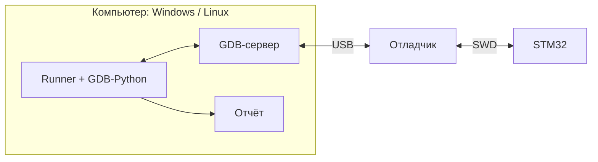
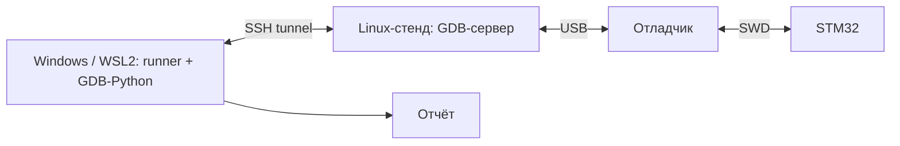
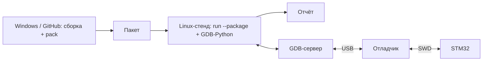
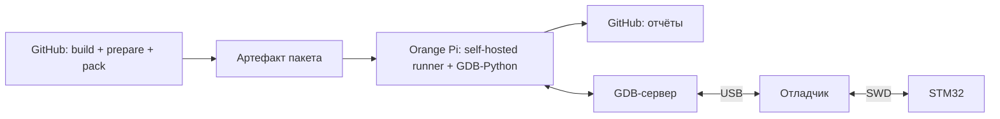
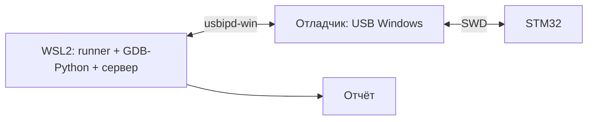

# Схемы запуска

[Документация](index.md) → Схемы запуска · [English](../en/RUN_LAYOUTS.md)

Сценарий и отчёт одинаковы во всех схемах; меняется только файл локального стенда
(`*.local.toml`, `remote.toml`), который остаётся у пользователя.

| Схема | Runner и GDB | GDB-сервер и отладчик | Проверка новых сценариев 0.4.0 |
| --- | --- | --- | --- |
| Локально на Windows | Windows | тот же компьютер, st-util 1.9.0 / J-Link | 6 плат, отдельные прогоны: 24 PASS + 6 SKIP |
| Локально на Linux-стенде | Orange Pi 5, Ubuntu 20.04 aarch64 | тот же компьютер, st-util 1.9.0 / J-Link | 6 плат, отдельные прогоны: 24 PASS + 6 SKIP, запуск через GitHub |
| Удалённый сервер с Windows | Windows | Orange Pi 5 по SSH, st-util 1.9.0 | 5 плат: 20 PASS + 5 SKIP |
| Удалённый сервер из WSL2 | WSL2, Ubuntu 20.04 x86_64 | Orange Pi 5 по SSH, st-util 1.9.0 | 5 плат: 20 PASS + 5 SKIP |
| Пакет подготовленного запуска | пакет собран отдельно, runner на месте запуска | Windows или Orange Pi 5 | проверен в локальных и SSH-схемах выше |
| Аппаратный CI | prepare на GitHub, runner/GDB на Orange Pi 5 | тот же Orange Pi, без SSH между runner и сервером | Hardware №13 + №14: 6 плат, 24 PASS + 6 SKIP |
| Локально на Linux x86_64 | Linux-ПК | тот же компьютер | на оборудовании не проверялось |
| WSL2 с USB-пробросом | WSL2 | USB через usbipd-win | на оборудовании не проверялось |

Строки «локально на Linux» и «аппаратный CI» используют общие свидетельства №13/№14; их не суммируют.
Итоги шести плат объединяют отдельные STM32- и AT32-прогоны на разных SHA, а не единый запуск.
На каждой плате выполнены четыре новых сценария и отдельный вариант ожидаемого SKIP.
Это выборочный набор, не повтор всей приёмки API. Версии, SHA, исходные ошибки и ограничения —
[протоколы 0.4.0](API040_SCENARIOS.md). Полные кампании 0.3.0 (218 сочетаний профиль/сценарий)
и 0.4.0 SSH (233), а также десятиэтапный lifecycle сохранены в [матрице приёмки](API_ACCEPTANCE.md).

### Локальный запуск: Windows или Linux

Runner, GDB-Python и сервер работают на одном компьютере. Это схема Windows
и Orange Pi; локальный Linux x86_64 пока не проверен на оборудовании.

### Удалённый сервер: Windows или WSL2 → Linux-стенд

Runner и сценарий работают на рабочем ПК; SSH запускает сервер на стенде
и передаёт соединение GDB через туннель. Отладчик физически подключён к стенду.

### Пакет: сборка отдельно от запуска

На компьютер стенда передаётся пакет с ELF, профилем и сценариями.
`run --package` запускает там и GDB-Python, и сервер; отчёты сохраняются там же.

### Аппаратный CI: GitHub и self-hosted раннер

GitHub-hosted job собирает и проверяет пакет без платы. Self-hosted job
на Orange Pi скачивает пакет, запускает аппаратную проверку и загружает отчёты.

### WSL2 с USB-пробросом: аппаратно не проверено

Все процессы тестирования работают в WSL2; Windows передаёт USB-устройство
в Linux через usbipd-win. Это отдельный, пока не проверенный на платах вариант.

Удалённый режим работает только по ключам SSH; блокировка отладчика действует на
хосте стенда, связь контролируется сигналом присутствия. ST-LINK GDB Server на
Linux aarch64 недоступен (ST не выпускает его для arm64), поэтому на Orange Pi
используются OpenOCD, J-Link и st-util. Подробности: [Linux-стенд](LINUX_STAND.md),
[GDB-серверы](BACKENDS.md).

**Как читать счётчики.** Бейдж Hardware описывает сохранённый полный SSH-прогон 0.4.0:
пять STM32, 233 сочетания «профиль + сценарий», дата 10.10.2026. Он не суммирует новые выборочные
прогоны и не подтверждает финальный SHA или все backend. Бейджи статические, не процент покрытия.
Границы и прежние срезы — в [описании метрик](HARDWARE_METRICS.md).

